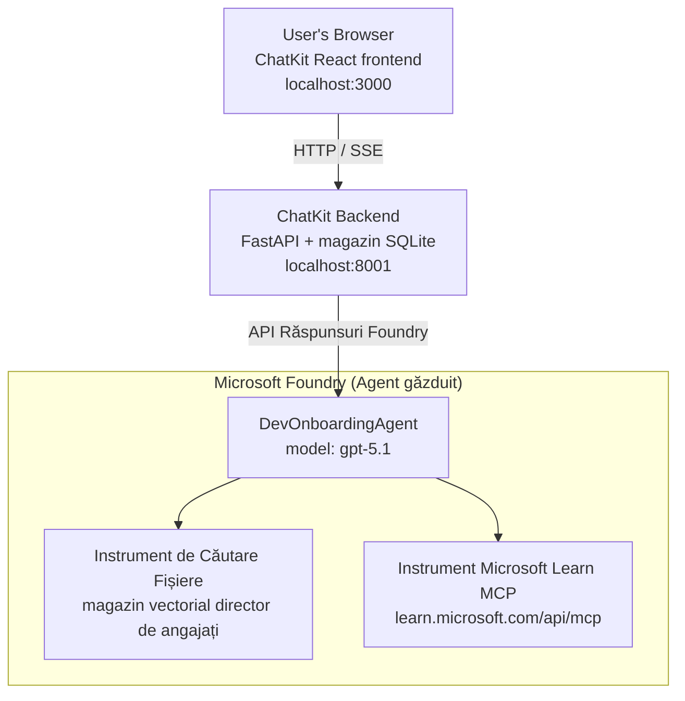

# Lecția 4: Implementarea agenților cu agenți găzduiți Microsoft Foundry + ChatKit

Această lecție demonstrează cum să implementezi un agent care utilizează unelte în Microsoft Foundry ca agent găzduit și să creezi un frontend bazat pe ChatKit pentru a interacționa cu acesta.

## Arhitectură

Agentul găzduit este un **singur `DevOnboardingAgent`** (rulând pe `gpt-5.1`) care răspunde la întrebări legate de onboarding-ul dezvoltatorilor folosind două unelte găzduite: o unealtă **File Search** peste vector store-ul angajaților și unealta **Microsoft Learn MCP**. Un frontend React ChatKit comunică cu un backend FastAPI, care apelează agentul prin API-ul Foundry **Responses**.



## Cerințe preliminare

1. **Proiect Microsoft Foundry** în regiunea North Central US
2. **Azure CLI** autentificat (`az login`)
3. **Azure Developer CLI** (`azd`) instalat
4. **Python 3.12+** și **Node.js 18+**
5. **Vector Store** creat cu datele angajaților

## Pornire rapidă

### 1. Configurarea variabilelor de mediu

```bash
cd lesson-4-agentdeployment
cp .env.example .env
# Editează fișierul .env cu detaliile proiectului tău Microsoft Foundry
```

### 2. Implementarea agentului găzduit

**Opțiunea A: Folosind Azure Developer CLI (Recomandat)**

```bash
cd hosted-agent
azd auth login
azd agent deploy
```

**Opțiunea B: Folosind Docker + Azure Container Registry**

```bash
cd hosted-agent

# Construiește containerul
docker build -t developer-onboarding-agent:latest .

# Etichetă pentru ACR
docker tag developer-onboarding-agent:latest <your-acr>.azurecr.io/developer-onboarding-agent:latest

# Împinge către ACR
az acr login --name <your-acr>
docker push <your-acr>.azurecr.io/developer-onboarding-agent:latest

# Se implementează prin portalul Microsoft Foundry sau SDK
```

### 3. Pornește backend-ul ChatKit

```bash
cd chatkit-server
python -m venv .venv
source .venv/bin/activate  # Pe Windows: .venv\Scripts\activate
pip install -r requirements.txt
python app.py
```

Serverul va porni pe `http://localhost:8001`

### 4. Pornește frontend-ul ChatKit

```bash
cd chatkit-server/frontend
npm install
npm run dev
```

Frontend-ul va porni pe `http://localhost:3000`

### 5. Testează aplicația

Deschide `http://localhost:3000` în browser și încearcă aceste interogări:

**Căutare angajați:**
- "Sunt nou aici! A lucrat cineva la Microsoft?"
- "Cine are experiență cu Azure Functions?"

**Resurse de învățare:**
- "Creează un traseu de învățare pentru Kubernetes"
- "Ce certificări ar trebui să urmez pentru arhitectura cloud?"

**Ajutor la codare:**
- "Ajută-mă să scriu cod Python pentru conectarea la CosmosDB"
- "Arată-mi cum să creez o Azure Function"

**Interogări multi-agent:**
- "Încep ca inginer cloud. Cu cine ar trebui să mă conectez și ce ar trebui să învăț?"

## Structura proiectului

```
lesson-4-agentdeployment/
├── .env.example                 # Environment variables template
├── implementation-plan.md       # Detailed implementation guide
├── README.md                    # This file
├── hosted-agent/               # Microsoft Foundry hosted agent
│   ├── main.py                 # Multi-agent workflow implementation
│   ├── requirements.txt        # Python dependencies
│   ├── Dockerfile              # Container definition
│   └── agent.yaml              # Agent deployment configuration
└── chatkit-server/             # ChatKit server application
    ├── app.py                  # FastAPI backend
    ├── store.py                # SQLite persistence layer
    ├── requirements.txt        # Python dependencies
    └── frontend/               # React frontend
        ├── package.json
        ├── vite.config.ts
        ├── tsconfig.json
        ├── index.html
        └── src/
            ├── main.tsx
            ├── App.tsx
            ├── App.css
            └── index.css
```

## Agentul și uneltele sale

Agentul găzduit este un **agent unic** (`DevOnboardingAgent`, definit în `hosted-agent/main.py`) care gestionează trei domenii de onboarding. În loc să orchestreze sub-agenti separați, oferă fiecare capacitate ca o unealtă (sau se bazează direct pe model):

| Capacitate | Cum este gestionată | Unealtă |
|-----------|--------------------|---------|
| **Căutare angajați & conexiuni** | File Search găzduit Foundry peste vector store-ul angajaților | `client.get_file_search_tool(vector_store_ids=[...])` |
| **Învățare & training** | Serverul Microsoft Learn MCP (unealtă MCP găzduită) | `client.get_mcp_tool(url="https://learn.microsoft.com/api/mcp")` |
| **Asistență la codare** | Gestionat direct de modelul `gpt-5.1` — fără unealtă externă | — |

Agentul este creat cu `client.as_agent(name="DevOnboardingAgent", instructions=..., tools=[file_search_tool, learn_mcp_tool])` și servit cu `from_agent_framework(agent).run()`.

> **Notă de design.** Versiuni anterioare ale acestei lecții foloseau un workflow multi-agent `HandoffBuilder` (Triaj → specialiști). Agentul livrat este un agent unic care folosește unelte, fiind mai simplu de implementat și de înțeles pentru Q&A de tip onboarding. Pentru un exemplu de orchestrare multi-agent și handoff-uri, vezi Lecția 2 și Lecția 3.

## Testare de bază a agentului găzduit (Poarta CI)

Implementarea cu succes a unui agent găzduit dovedește doar că planul de control a acceptat
definiția — nu dovedește că agentul oferă răspunsuri. O dependență lipsă,
rutarea greșită a modelului sau o conexiune expirată pot lăsa un agent verde, dar mut.

Această lecție oferă un **test de fum** ușor, care acționează ca o poartă post-implementare rapidă și ieftină.
Folosește GitHub Action-ul [AI Smoke Test](https://github.com/marketplace/actions/ai-smoke-test)
pentru a trimite POST prompt-uri către endpoint-ul Foundry **Responses** al agentului
(`POST {project_endpoint}/agents/{agent_name}/endpoint/protocols/openai/responses`)
și pentru a verifica textul returnat. Prinde implementări stricte, regresii de autentificare,
schimbări în promptul sistemului și probleme de threading în câteva secunde.

> Testele de fum **nu** înlocuiesc evaluările complete din
> [Lecția 3](../lesson-3-agent-evals/README.md) — ele sunt complementare. Testele de fum
> răspund la întrebarea *"este agentul accesibil, răspunde și urmează așteptările de prompt de bază?"*;
> evaluările răspund la *"cât de bun este răspunsul?"*. Rulează poarta ieftină la fiecare implementare.

### Ce este testat

Catalogul se găsește la [`hosted-agent/tests/smoke-tests.json`](../../../lesson-4-agentdeployment/hosted-agent/tests/smoke-tests.json)
și testează cele trei domenii ale agentului, precum și respectarea promptului și threading multi-turn:

| Test | Ce verifică |
|------|-------------|
| `reachability` | Agentul răspunde cu un text non-gol, relevant |
| `employee-search` | Domeniul file-search returnează un răspuns sănătos `200` (răspuns dependent de date) |
| `learning-path` | Domeniul învățare confirmă subiectul și produce un răspuns de tip traseu |
| `coding-assistance` | Domeniul codare returnează un răspuns Python în formă de cod |
| `prompt-adherence-offtopic` | Cererea off-topic este redirecționată, nu detaliată |
| `threading-turn-1/2` | Starea conversației este păstrată între schimburi prin `previous_response_id` |

### Rulează în CI

Workflow-ul de la [`.github/workflows/smoke-test-hosted-agent.yml`](../../../.github/workflows/smoke-test-hosted-agent.yml)
conține două joburi:

- **`static`** — o poartă rapidă, fără Azure, care rulează la fiecare pull request și push:
  compilează toate sursele Python (`py_compile`) și verifică link-urile Markdown. Fără secrete
  necesare, funcționează pe pull request-uri din forcuri.
- **`smoke`** — testul de fum conectat la Azure de mai jos. Rulează la cerere
  (Actions → **Agent CI (static + smoke)** → Run workflow) și poate fi pus după workflow-ul tău
  de implementare.

Configurează aceste **variabile** și **secrete** de repository pentru job-ul smoke:

| Tip | Nume | Valoare |
|------|------|---------|
| Variabilă | `FOUNDRY_PROJECT_ENDPOINT` | `https://<cont>.services.ai.azure.com/api/projects/<proiect>` |
| Variabilă | `HOSTED_AGENT_NAME` | Numele agentului implementat (ex. `dev-onboarding` — trebuie să coincidă cu implementarea ta) |
| Secret | `AZURE_CLIENT_ID` / `AZURE_TENANT_ID` / `AZURE_SUBSCRIPTION_ID` | Identitate federată OIDC pentru `azure/login` |

Identitatea runner-ului are nevoie de rolul **`Azure AI User`** la **scopul proiectului Foundry** pentru a
apela endpoint-urile de plan de date Responses (și conversații). Acordă-l cu:

```bash
az role assignment create \
  --assignee <object-id-or-appId-of-runner-identity> \
  --role "Azure AI User" \
  --scope "/subscriptions/<sub>/resourceGroups/<rg>/providers/Microsoft.CognitiveServices/accounts/<account>/projects/<project>"
```

### Rulează local

Poți rula același catalog înainte de push. Obține un token de plan de date cu scopul
`https://ai.azure.com/` și direcționează runner-ul către implementarea ta:

```bash
# Publicul TREBUIE să fie https://ai.azure.com/ (tokenurile de la cognitiveservices.azure.com sunt respinse)
export FOUNDRY_TOKEN=$(az account get-access-token --resource https://ai.azure.com/ --query accessToken -o tsv)

git clone https://github.com/JFolberth/ai-smoketest && cd ai-smoketest
python runner.py \
  --project-endpoint "https://<account>.services.ai.azure.com/api/projects/<project>" \
  --agent-name dev-onboarding \
  --tests-file ../lesson-4-agentdeployment/hosted-agent/tests/smoke-tests.json
```

Coduri de ieșire: `0` toate trecute, `1` o aserțiune a eșuat, `2` eroare runner (catalog/tokens greșite).

## Depanare

### Agentul nu răspunde
- Verifică că agentul găzduit este implementat și rulează în Microsoft Foundry
- Verifică că `HOSTED_AGENT_NAME` și `HOSTED_AGENT_VERSION` corespund implementării tale

### Erori vector store
- Asigură-te că `VECTOR_STORE_ID` este setat corect
- Verifică că vector store conține datele angajaților

### Erori de autentificare
- Rulează `az login` pentru a reîmprospăta credențialele
- Asigură-te că ai acces la proiectul Microsoft Foundry

## Resurse

- [Documentația Microsoft Foundry Hosted Agents](https://learn.microsoft.com/en-us/azure/ai-foundry/agents/concepts/hosted-agents)
- [Microsoft Agent Framework](https://github.com/microsoft/agent-framework)
- [Exemplu integrare ChatKit](https://github.com/microsoft/agent-framework/tree/main/python/samples/demos/chatkit-integration)
- [Azure Developer CLI](https://learn.microsoft.com/en-us/azure/developer/azure-developer-cli/overview)
- [AI Smoke Test GitHub Action](https://github.com/marketplace/actions/ai-smoke-test)
- [Testarea Microsoft Foundry Agents cu GitHub Actions (blog)](https://techcommunity.microsoft.com/blog/azuredevcommunityblog/smoke-test-microsoft-foundry-agents-with-github-actions/4531912)

---

## Pașii următori

Agentul tău rulează pe infrastructură gestionată de Microsoft. Pentru a-l duce în producție enterprise —
controlând unde locuiesc datele sale (suveranitatea datelor, rețea privată, Azure adus de tine
Cosmos DB / Storage / AI Search) și guvernând uneltele sale — continuă la
**[Lecția 5: Agenți găzduiți în producție](../lesson-5-hosted-agents-production/README.md)**, care
explică diferența crucială dintre **Hosted Agents** și **Capability Hosts**.

---

<!-- CO-OP TRANSLATOR DISCLAIMER START -->
**Declinare a responsabilității**:
Acest document a fost tradus folosind serviciul de traducere AI [Co-op Translator](https://github.com/Azure/co-op-translator). În timp ce ne străduim pentru acuratețe, vă rugăm să rețineți că traducerile automate pot conține erori sau inexactități. Documentul original în limba sa nativă trebuie considerat sursa autorizată. Pentru informații critice, se recomandă traducerea profesională realizată de un om. Nu ne asumăm responsabilitatea pentru eventualele neînțelegeri sau interpretări greșite care decurg din utilizarea acestei traduceri.
<!-- CO-OP TRANSLATOR DISCLAIMER END -->