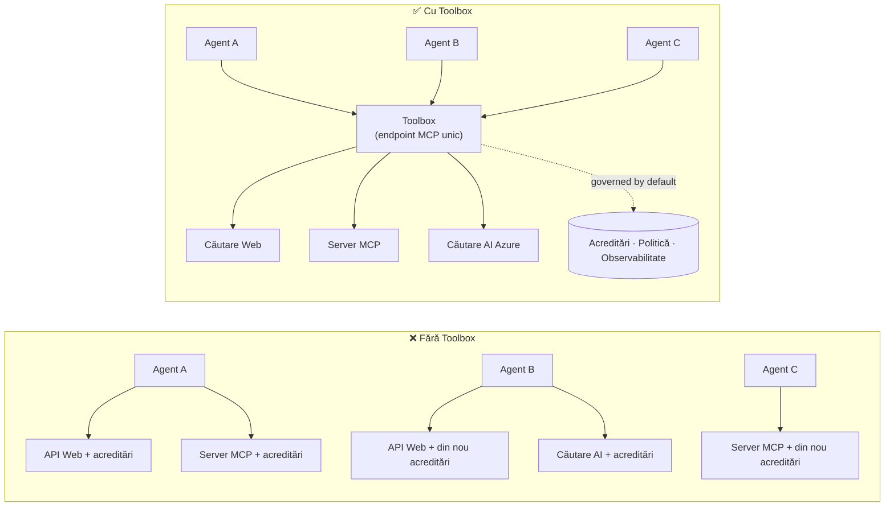

# Lecția 6: Microsoft Toolbox — Unelte guvernate pentru agenți

După [Lecția 5](../lesson-5-hosted-agents-production/README.md) agentul găzduit rulează în
producție cu stocarea și poziția de guvernanță de care organizația ta are nevoie. Dar uită-te înapoi la agentul din
Lecția 4: fiecare unealtă era **codificată direct** în `main.py` — URL-ul MCP Microsoft Learn,
magazinul vectorial pentru căutare în fișiere și așa mai departe. Aceasta funcționează pentru un singur agent. Nu
se scalează la o organizație cu zeci de agenți și echipe.

Această lecție introduce **Microsoft Toolbox**: felul în care Foundry îți permite să definești un set curat de
unelte **o singură dată**, să le gestionezi **centralizat** și să le expui oricărui agent printr-un **singur,
endpoint guvernat**.

## Obiectivele de învățare

La finalul acestei lecții vei putea:

- Explica problema dispersiei uneltelor pe care Toolbox o rezolvă.
- Descrie pilonii **Build** și **Consume** și tipurile de unelte pe care le poate conține un toolbox.
- **Construi** o versiune de toolbox cu Foundry SDK.
- **Consum** un toolbox de la un agent găzduit Microsoft Agent Framework printr-un singur endpoint MCP.
- Folosi **versionarea** pentru a livra schimbări ale uneltelor fără modificări de cod sau redeploy-uri ale agentului.
- Aplica **guvernanță**: RBAC, injectarea de credențiale și politici de tip guardrail (RAI).

---

## Precondiții

1. Terminarea [Lecției 4](../lesson-4-agentdeployment/README.md) și ideal
   [Lecția 5](../lesson-5-hosted-agents-production/README.md).
2. Un proiect **Microsoft Foundry** cu permisiuni pentru a crea și gestiona resurse toolbox.
3. **Azure CLI** autentificat: `az login`. API-urile Foundry toolbox necesită
   scope-ul tokenului `https://ai.azure.com/.default` (afișat în codul de mai jos).
4. **Python 3.12+** cu dependențele cursului instalate (`pip install -r ../requirements.txt`).
5. O implementare curentă, ne-retrasă de model (de exemplu `gpt-5.1`). Evită GPT-4o / GPT-4.1 retras.

---

## 1. Problema: dispersia uneltelor

Un singur agent poate depinde de multe unelte — API-uri REST, servere MCP, conectori și fluxuri — fiecare
cu propriul model de autentificare și echipă responsabilă. Pe măsură ce se scalează într-o organizație:

- Echipele **reimplementează aceleași unelte** în mod independent.
- **Credențialele sunt duplicate** între agenți și depozite.
- **Guvernanța devine inconsistentă** — fiecare agent aplică (sau uită) politicile pe cont propriu.
- Există **puțină vizibilitate** asupra uneltelor existente sau cine le folosește.

Dezvoltatorii trenează — nu pentru că modelele nu ar fi capabile, ci pentru că **integrarea uneltelor devine
blocajul**.



Întreprinderile au deja infrastructura — gateway-uri, sigurante pentru credențiale, politici, observabilitate.
Ce lipsea era o experiență de dezvoltator care să ambaleze asta într-un ceva **refolosibil,
descoperibil și guvernat implicit**. Aceasta este Toolbox.

---

## 2. Ce este un Toolbox

Un **Toolbox** este o **resursă gestionată Foundry**. Definiți o colecție de unelte curată o singură dată, le
gestionați centralizat în Foundry și le expuneți prin **un singur endpoint compatibil MCP** pe care orice
agent îl poate consuma. La rulare, platforma gestionează **injectarea credențialelor, reîmprospătarea tokenului și
aplicarea politicilor întreprinderii**.

Deoarece un toolbox este o resursă gestionată, poți adăuga, elimina sau reconfigura unelte **fără
a schimba codul agentului** — agentul se conectează mereu la același endpoint.

Toolbox acoperă ciclul de viață al uneltei prin patru piloni; **Build** și **Consume** sunt disponibili
astăzi:

| Pilon | Status | Ce permite |
|--------|--------|-----------------|
| **Build** | Disponibil astăzi | Selectează unelte, configurează autentificarea central și publică un toolbox reutilizabil pe care orice echipă îl poate consuma. |
| **Consume** | Disponibil astăzi | Conectează orice agent la un endpoint compatibil MCP pentru a descoperi dinamic și apela toate uneltele din toolbox. |

Suprafața de consum este **deschisă**: orice runtime sau client compatibil MCP poate utiliza un toolbox —
Microsoft Agent Framework, LangGraph, GitHub Copilot, Claude Code, Microsoft Copilot Studio sau
cod personalizat.

### Tipuri de unelte pe care un toolbox le poate conține

Web Search · MCP · Azure AI Search · Code Interpreter · File Search · OpenAPI · **Agent-to-Agent
(A2A)** · Fabric IQ · Tool Search · Work IQ · Browser Automation · Referințe de Skill-uri, plus o
**politică Guardrail (RAI)** aplicată la nivelul toolbox-ului.

> **Sfat:** Adaugă un `description` la **fiecare** unealtă pentru ca modelul să poată alege cea potrivită. Un toolbox
> permite cel mult **o unealtă fără nume pe tip** — oferă fiecărei instanțe suplimentare a aceluiași tip un
> `name` unic, altfel vei primi o eroare `invalid_payload`.

---

## 3. Construiește un toolbox

Toolboxurile sunt gestionate cu SDK-urile Foundry (Python/.NET/JavaScript), API-ul REST, `azd` și
**Microsoft Foundry Toolkit pentru VS Code**. Iată un exemplu în Python (`azure-ai-projects`):

```python
from azure.identity import DefaultAzureCredential
from azure.ai.projects import AIProjectClient
from azure.ai.projects.models import MCPTool, ToolboxSearchPreviewTool, WebSearchTool

endpoint = "https://<your-foundry-account>.services.ai.azure.com/api/projects/<your-project>"
project = AIProjectClient(endpoint=endpoint, credential=DefaultAzureCredential())

toolbox_version = project.toolboxes.create_toolbox_version(
    name="agent-tools",
    description="Web search + an MCP server + tool search",
    tools=[
        WebSearchTool(),
        MCPTool(
            server_label="myserver",
            server_url="https://your-mcp-server.example.com",
            require_approval="never",
            project_connection_id="my-key-auth-connection",  # acreditările trăiesc în Foundry
        ),
        ToolboxSearchPreviewTool(),
    ],
)
print(f"Created toolbox: {toolbox_version.name}, version: {toolbox_version.version}")
```

Observă ce **nu** faci: nu stochezi secrete în agent. Credințialele sunt deținute de o conexiune Foundry
(`project_connection_id`) și injectate de platformă la momentul apelului.

> **Notă de previzualizare.** Managementul Toolbox-ului (crearea/actualizarea versiunilor) este o funcționalitate în previzualizare.
> Operațiile `project.toolboxes.*` prezentate mai sus sunt livrate în SDK-urile preview, API-ul REST, `azd`,
> și **Foundry Toolkit pentru VS Code** — nu sunt incluse în `azure-ai-projects` fixat folosit
> în restul acestui curs. Consideră fragmentul de cod de mai sus ca forma pasului Build; pentru
> un traseu cu click, creează toolbox-ul în **portalul Foundry** sau **Foundry Toolkit**. Pasul
> **Consume** de mai jos funcționează cu SDK-ul fixat al cursului astăzi.

---

## 4. Consumă un toolbox din agentul tău

Un toolbox expune un **endpoint MCP**. Există două modele:

| Rol | Endpoint | Când să folosești |
|------|----------|-------------|
| **Consumator Toolbox** | `{project_endpoint}/toolboxes/{name}/mcp?api-version=v1` | Conectează agenți. Servește întotdeauna **versiunea implicită**. |
| **Dezvoltator Toolbox** | `{project_endpoint}/toolboxes/{name}/versions/{version}/mcp?api-version=v1` | Testează o versiune specifică înainte de a o promova. |

> **Conectează agenții la endpointul *consumer*.** Pentru că servește întotdeauna versiunea implicită, tu

> poate promova versiuni noi **fără a modifica codul agentului sau a realoca**.

### Integrarea cu un agent găzduit Microsoft Agent Framework

Reamintiți-vă că agentul din Lecția 4 a adăugat un singur instrument MCP hardcodificat cu `client.get_mcp_tool(...)`. Cu
Toolbox, în schimb, direcționați **un singur** `MCPStreamableHTTPTool` către endpoint-ul toolbox — iar agentul
primește **fiecare** instrument din toolbox, guvernat central:

```python
import httpx
from azure.identity import DefaultAzureCredential, get_bearer_token_provider
from agent_framework import MCPStreamableHTTPTool

# Auth: Cutia de unelte Foundry necesită domeniul https://ai.azure.com/.default
credential = DefaultAzureCredential()
token_provider = get_bearer_token_provider(credential, "https://ai.azure.com/.default")
http_client = httpx.AsyncClient(auth=_ToolboxAuth(token_provider), timeout=120.0)

TOOLBOX_ENDPOINT = os.environ["TOOLBOX_ENDPOINT"]  # injectat de platformă la rulare

mcp_tool = MCPStreamableHTTPTool(
    name="toolbox",
    url=TOOLBOX_ENDPOINT,
    http_client=http_client,
    load_prompts=False,
)

agent = chat_client.as_agent(
    name="my-toolbox-agent",
    instructions="You are a helpful assistant with access to Foundry toolbox tools.",
    tools=[mcp_tool],
)
```

`.env` corespunzător (notă: folosiți un model **actual** precum `gpt-5.1`, **nu** modelul retras
`gpt-4o`):

```env
FOUNDRY_PROJECT_ENDPOINT=https://<account>.services.ai.azure.com/api/projects/<project>
TOOLBOX_ENDPOINT=https://<account>.services.ai.azure.com/api/projects/<project>/toolboxes/agent-tools/mcp?api-version=v1
AZURE_AI_MODEL_DEPLOYMENT_NAME=gpt-5.1
```

> **Verificați mai întâi.** Înainte de a conecta complet agentul, conectați un MCP client SDK (`pip install mcp`) la
> endpoint-ul **specific versiunii** și listați instrumentele pentru a confirma încărcarea așa cum vă așteptați.

### Rulați exemplul consume

Această lecție trimite un exemplu consumabil rulabil, [`toolbox_agent.py`](../../../lesson-6-toolbox/toolbox_agent.py). Folosește
același tipar `FoundryChatClient.get_mcp_tool(...)` pe care l-ați învățat în Lecția 2, dar indică un singur
instrument MCP către endpoint-ul dumneavoastră **toolbox** — astfel agentul primește toate instrumentele guvernate din toolbox:

```bash
# În fișierul tău .env, setează TOOLBOX_ENDPOINT la endpoint-ul consumatorului tău de toolbox, apoi:
python lesson-6-toolbox/toolbox_agent.py
```

Deschideți URL-ul afișat `http://localhost:8096` și puneți o întrebare care să folosească unul dintre
instrumentele din toolbox. Adăugați sau actualizați un instrument în toolbox și întrebați din nou — **fără a modifica acest
cod** — pentru a vedea guvernarea centrală și versionarea în acțiune.

---

## 5. Versionare: livrarea în siguranță a schimbărilor la instrumente

Versionarea toolbox-ului vă oferă control explicit asupra momentului în care schimbările își fac efectul:

1. **Creați** o nouă versiune de toolbox cu setul actualizat de instrumente.
2. **Testați** versiunea la endpoint-ul specific versiunii (dezvoltator).
3. **Promovați** versiunea la `default_version` când sunteți gata.

Fiecare agent indicat către endpoint-ul **consumer** preia automat versiunea promovată — **fără
modificări de cod, fără realocare**. (Prima versiune creată este promovată automat la valoarea implicită.)

Aceasta este echivalentul guvernării instrumentelor cu un deploy blue/green: validați o schimbare izolat,
apoi schimbați valoarea implicită pentru toți consumatorii simultan.

---

## 6. Guvernare: cum Toolbox îmbunătățește controlul

Toolbox este **guvernat implicit**. Pârghiile de guvernare pe care trebuie să le cunoașteți:

- **RBAC.** Acordați rolul **Foundry User** pe proiect fiecărei identități: **dezvoltatorului** care
  gestionează versiunile toolbox, **identitatea gestionată a agentului** (pentru agenții găzduiți care apelează instrumente la
  runtime) și, pentru fluxurile OAuth, **utilizatorul final** a cărei identitate este proxy-uită.
- **Credențiale centralizate.** Credențialele instrumentelor trăiesc în conexiunile Foundry, nu în codul agentului
  sau fișierele `.env`. Platforma le injectează și reînnoiește token-urile la runtime.
- **Reguli de siguranță (politica RAI).** Atașați o politică AI responsabilă numită unei versiuni de toolbox prin
  `policies.rai_config.rai_policy_name`. Aceasta rulează la **nivelul toolbox-ului**, independent de orice
  filtru de conținut la nivel de model, filtrând intrările și ieșirile instrumentelor.
- **Aprobare MCP.** Controlul `require_approval` pentru fiecare instrument MCP determină dacă apelul necesită aprobare —
  același concept de flux de lucru de aprobare pe care l-ați văzut în [Lecția 5 §7](../lesson-5-hosted-agents-production/README.md#7-hosted-mcp-tools--approval-workflows).
- **Rețea privată.** Toolbox suportă configurații de rețea virtuală pentru întreprinderi care
  păstrează traficul în interiorul rețelei lor.
- **Vizibilitate.** Deoarece instrumentele sunt catalogate central, aveți în sfârșit un inventar al ceea ce
  există și cine îl utilizează.

---

## Exerciții practice

1. **Refactorizați Lecția 4.** Agentul din Lecția 4 încorporează hardcodificat instrumentul Microsoft Learn MCP. Conturați cum ați
   muta acel instrument într-un toolbox `agent-tools` și ați redirecționa `main.py` către endpoint-ul de consum al toolbox-ului.
   Ce modificări apar în `main.py`? Ce nu mai trăiește acolo?
2. **Proiectați un bump de versiune.** Trebuie să adăugați un instrument Web Search într-un toolbox live folosit de cinci
   agenți. Descrieți secvența creării → testării → promovării și explicați de ce niciunul dintre cei cinci agenți
   nu trebuie realocat.
3. **Alegeți identitățile de autentificare.** Pentru un agent găzduit care apelează un instrument MCP bazat pe OAuth printr-un
   toolbox, listați ce identități au nevoie de rolul **Foundry User** și de ce.
4. **Plasarea regulii de siguranță.** Explicați diferența dintre un filtru de conținut la nivel de model și o
   regulă de toolbox și dați un scenariu în care aveți nevoie special de regula toolbox.

---

## Resurse

- [Creați, testați și implementați un toolbox în Foundry](https://learn.microsoft.com/azure/foundry/agents/how-to/tools/toolbox)
- [Catalog de instrumente — Foundry Agent Service](https://learn.microsoft.com/azure/foundry/agents/concepts/tool-catalog)
- [Microsoft Agent Framework — furnizor Microsoft Foundry (instrumente)](https://learn.microsoft.com/agent-framework/agents/providers/microsoft-foundry)
- [Prezentare generală a regulilor de siguranță](https://learn.microsoft.com/azure/foundry/guardrails/guardrails-overview)
- [Începeți cu Foundry în VS Code (Foundry Toolkit)](https://learn.microsoft.com/azure/ai-foundry/how-to/develop/get-started-projects-vs-code)
- [Model Context Protocol](https://modelcontextprotocol.io/)

---

**Anterior:** [Lecția 5 — Agenți găzduiți în producție](../lesson-5-hosted-agents-production/README.md)
&nbsp;·&nbsp; **Următor:** [Lecția 7 — Multi-Agent & A2A](../lesson-7-multi-agent-a2a/README.md)

---

<!-- CO-OP TRANSLATOR DISCLAIMER START -->
**Declinare a responsabilității**:
Acest document a fost tradus folosind serviciul de traducere AI [Co-op Translator](https://github.com/Azure/co-op-translator). În timp ce ne străduim pentru acuratețe, vă rugăm să rețineți că traducerile automate pot conține erori sau inexactități. Documentul original în limba sa nativă trebuie considerat sursa autorizată. Pentru informații critice, se recomandă traducerea profesională realizată de un om. Nu ne asumăm responsabilitatea pentru eventualele neînțelegeri sau interpretări greșite care decurg din utilizarea acestei traduceri.
<!-- CO-OP TRANSLATOR DISCLAIMER END -->