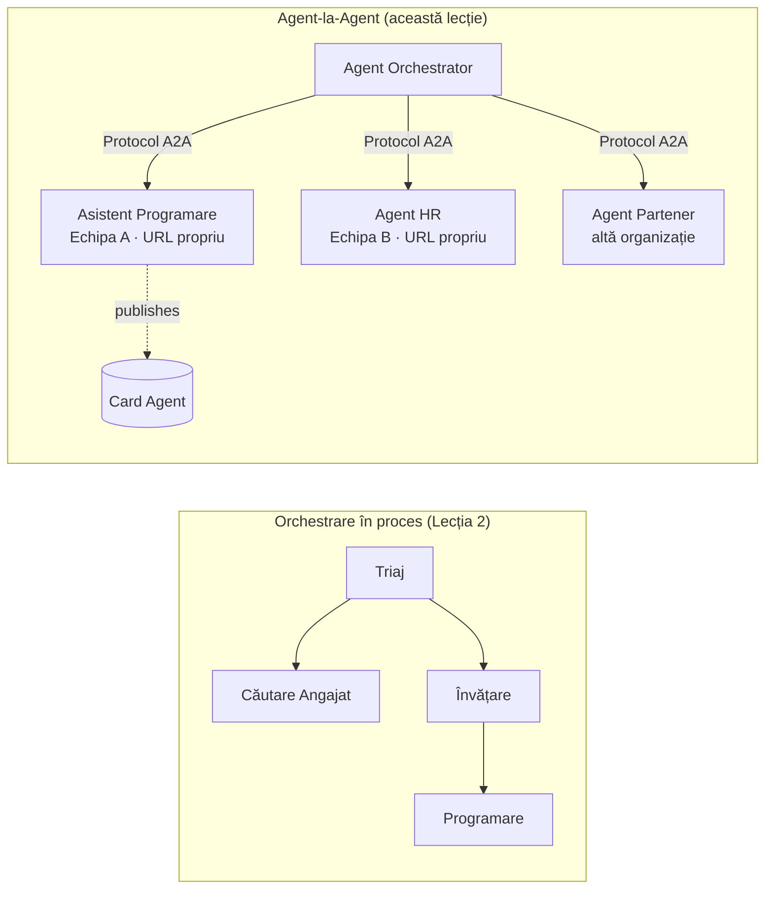

# Lecția 7: Orchestrarea Multi-Agent & Agent-la-Agent (A2A)

În [Lecția 6](../lesson-6-toolbox/README.md) poți construi unelte guvernate și agenți găzduiți.
Dar sistemele reale folosesc rar **un singur** agent. Pe măsură ce scalezi, compui **mulți** agenți — unii
pe care îi deții tu, alții deținuti de alte echipe, unii rulând în alte organizații complet. Această lecție este despre
cum agenții lucrează **împreună**.

Ai întâlnit deja o formă de design multi-agent în
[„`agent-orchestration.py` din Lecția 2](../lesson-2-agent-development/README.md): modelul **handoff**
, unde un agent de triere direcționează către specialiști **în interiorul unui singur proces**. Această lecție urcă
un nivel mai sus — la **Agent-la-Agent (A2A)**, protocolul deschis pentru agenții care rulează ca
**servicii în rețea** independente și care se apelează unii pe alții peste limite de proces, echipă și organizație.

## Obiective de învățare

Până la sfârșitul acestei lecții vei putea să:

- Explici diferența între **orchestrarea intraproces** (handoff/workflows) și
  comunicația **Agent-la-Agent (A2A)**, și să alegi pe cea potrivită.
- Descrii elementele de bază A2A: **Agent Card**, **abilități**, **sarcini** și **descoperirea**.
- **Expose** un agent Microsoft Agent Framework ca serviciu A2A cu `A2AExecutor`.
- **Consumă** un agent de la distanță ca peer în rețea cu `A2AAgent`.
- Aplici preocupările de nivel enterprise pentru A2A: **securitate, identitate, guvernanță, observabilitate și cost**.

---

## Precondiții

1. Finalizarea [Lecției 2](../lesson-2-agent-development/README.md) (dezvoltare agent & orchestrare).
2. Un proiect **Microsoft Foundry** cu un model actual implementat (de exemplu `gpt-5.1`, și
   `gpt-5-codex` pentru exemplul de cod). Evită modelele retrase GPT-4o / GPT-4.1.
3. **Azure CLI** autentificat: `az login`.
4. **Python 3.12+** cu dependențele cursului instalate (`pip install -r ../requirements.txt`).
   Lecția 7 adaugă pachetele preview `agent-framework-a2a`, `a2a-sdk` și `uvicorn`.
5. `FOUNDRY_PROJECT_ENDPOINT` și `FOUNDRY_MODEL` setate în `.env` (vezi README-ul cursului).

---

## 1. Două moduri în care agenții colaborează

Nu există un singur model „multi-agent”. Alege-l pe cel care se potrivește **frontierei** tale:

| Model | Unde rulează agenții | Cum se conectează | Folosește când |
|---------|------------------|------------------|----------|
| **Handoff / Workflow** (Lecția 2) | Un singur proces, un singur cod | Grafic în memorie (`HandoffBuilder`, `WorkflowBuilder`) | Deții toți agenții și îi implementezi împreună. |
| **Agent-la-Agent (A2A)** (această lecție) | Servicii separate, cicluri de viață separate | Protocol **A2A** deschis peste HTTP, descoperit prin **Agent Cards** | Agenții sunt deținuti de echipe/organizații diferite, scalează independent sau sunt scriși în framework-uri diferite. |

Handoff înseamnă **rutare în interiorul unei aplicații**. A2A înseamnă **compozitia agenților ca
servicii independente** — echivalentul pentru agenți al trecerii de la apeluri de funcții la microservicii.



> **Ei se compun.** Un orchestrator construit cu `HandoffBuilder` poate avea **agenți A2A la distanță**
> ca participanți — rutare în proces către servicii care pot rula oriunde.

---

## 2. Elementele de bază A2A

A2A este un **protocol deschis** (nu specific Microsoft), deci un agent A2A poate fi consumat de Microsoft
Agent Framework, LangGraph, cod custom, sau alt stack de la o altă companie. Patru concepte contează:

- **Agent Card** — un mic document JSON, publicat la
  `/.well-known/agent-card.json`, care promovează **numele, descrierea, URL-ul, versiunea,
  abilitățile și capabilitățile** agentului. Așa un client **descoperă** ce poate face un agent la distanță.
- **Abilități** — lucrurile declarate pe care agentul le poate face (`id`, `name`, `description`, `tags`,
  `examples`). Clienții (și modelele) le folosesc ca să decidă dacă apelează agentul.
- **Sarcini** — un apel către un agent A2A este o **sarcină** cu un ciclu de viață (trimis → lucrat →
  terminat/ratat). Serverul urmărește sarcinile într-o **stocare a sarcinilor**; actualizările în flux sunt suportate.
- **Descoperirea** — un client cu doar un URL preia Agent Card și știe cum să apeleze agentul.

---

## 3. Expune un agent ca serviciu A2A — `a2a_server.py`

Partea de **Construire/servire** înfășoară orice agent Microsoft Agent Framework cu `A2AExecutor` și îl montează
pe o aplicație HTTP A2A. Vezi [`a2a_server.py`](../../../lesson-7-multi-agent-a2a/a2a_server.py). Pentru conexiunea esențială:

```python
from agent_framework.a2a import A2AExecutor
from a2a.server.apps import A2AStarletteApplication
from a2a.server.request_handlers import DefaultRequestHandler
from a2a.server.tasks import InMemoryTaskStore
from a2a.types import AgentCapabilities, AgentCard, AgentSkill

agent = client.as_agent(name="coding-assistant", instructions="...")

agent_card = AgentCard(
    name="Coding Assistant",
    description="Generates runnable code samples...",
    url="http://localhost:9000/",
    version="1.0.0",
    capabilities=AgentCapabilities(streaming=True),
    default_input_modes=["text"],
    default_output_modes=["text"],
    skills=[AgentSkill(id="generate-code", name="Generate code",
                       description="Write a runnable code snippet.", tags=["code"])],
)

request_handler = DefaultRequestHandler(
    agent_executor=A2AExecutor(agent),
    task_store=InMemoryTaskStore(),
)
app = A2AStarletteApplication(agent_card=agent_card, http_handler=request_handler).build()
# servit cu uvicorn pe portul 9000
```

Observă că codul agentului rămâne **neschimbat** — `A2AExecutor` adaptează agentul tău existent la protocol.
Agent Card este ceea ce îl face **descoperibil** pentru orice client A2A.

---

## 4. Consumă un agent de la distanță — `a2a_client.py`

Partea de **Consum** se conectează la un agent de la distanță **prin URL**, preia Agent Card și îl apelează
exact ca pe un agent local. Vezi [`a2a_client.py`](../../../lesson-7-multi-agent-a2a/a2a_client.py):

```python
from agent_framework.a2a import A2AAgent

remote_agent = A2AAgent(name="remote-coding-assistant", url="http://localhost:9000")
result = await remote_agent.run("Write a Python function that reverses a string.")
print(result.text)
```

Acesta este întregul scop al A2A: de partea apelantului, un agent la distanță se comportă ca orice alt
agent `agent_framework`, deci îl poți integra într-un workflow sau îi poți face handoff — deși rulează
într-un proces diferit, pe o mașină diferită, deținută de o echipă diferită.

### Rulează-l cap-coadă

```bash
# Terminal 1 — pornește serviciul A2A
python a2a_server.py

# Terminal 2 — apelează-l
python a2a_client.py "Write a Python function that reverses a string."
```

Vei vedea răspunsul asistentului de codare sosind prin protocolul A2A. Deschide
`http://localhost:9000/.well-known/agent-card.json` în browser pentru a vedea Agent Card publicat.

---

## 5. Preocupări la nivel enterprise

Transformarea agenților în servicii în rețea introduce aceleași preocupări ca orice sistem distribuit —
plus câteva specifice AI:

- **Identitate & autentificare.** Nu expune niciodată un agent A2A fără autentificare. Agent Card poartă
  `security` / `security_schemes`, iar `A2AAgent` acceptă un `auth_interceptor` astfel încât apelanții să atașeze
  credențiale (token-uri bearer OAuth, chei API). Folosește Entra ID / identități gestionate pentru
  autentificarea serviciu-la-serviciu în producție; plasează serviciul în spatele unui gateway.
- **Guvernanță.** Combină A2A cu [Trusa de Unelte din Lecția 6](../lesson-6-toolbox/README.md): un agent la distanță
  poate fi publicat ca **unealtă A2A** într-o trusă guvernată astfel încât RBAC, injectarea de credențiale,
  și politicile de limitare se aplică centralizat.
- **Observabilitate.** O cerere traversează acum granițe de proces, deci propagate tracingul prin apel.
  Activează [Foundry Observability / OpenTelemetry](../lesson-3-agent-evals/README.md) pe **ambele**
  părți, orchestratorul și fiecare agent la distanță, pentru trasabilitate end-to-end.
- **Versionare.** Agent Card are `version`. Trateaz-o ca pe un API: schimbările aditive sunt sigure;
  ruperea contractului unei abilități necesită versiune nouă și fereastră de migrare pentru consumatori.
- **Fiabilitate.** Agenții la distanță pot cădea independent. Setează timeout-uri (`A2AAgent(timeout=...)`), gestionează
  eșecul parțial și evită ca un peer lent să blocheze întreaga orchestrare.
- **Cost.** Orice apel la un agent la distanță e o invocare proprie de model. Multiplicarea paralelă crește consumul de tokeni —
  bugetează pentru asta și preferă rutarea către **un singur** agent cel mai bun în loc de difuzarea la mulți.

---

## Exerciții practice

1. **Adaugă un al doilea serviciu.** Copiază `a2a_server.py` pentru a expune agentul **employee-search** pe portul
   9001 cu propriul Agent Card și abilități. Rulează ambele și lasă clientul să le apeleze pe fiecare.
2. **Orchestrează peers la distanță.** Construiește un mic `HandoffBuilder` (sau un router simplu) cu participanți
   incluzând doi `A2AAgent` îndreptați către cele două servicii. Direcționează o cerere către cel potrivit.
3. **Securizează-l.** Adaugă un `auth_interceptor` clientului și solicită token bearer pe server.
   Ce se strică dacă lipsește token-ul? Unde ai stoca token-ul în producție?
4. **Handoff vs A2A.** Scrie două paragrafe scurte: când ai păstra handoff-ul in-process din Lecția 2,
   și când se justifică complexitatea suplimentară a A2A? Dă un exemplu concret pentru fiecare.

---

## Resurse

- [Agent-la-Agent (A2A) — Microsoft Agent Framework](https://learn.microsoft.com/agent-framework/user-guide/agent-orchestration/a2a)
- [Orchestrarea multi-agent — Microsoft Agent Framework](https://learn.microsoft.com/agent-framework/user-guide/agent-orchestration/)
- [Specificarea protocolului A2A](https://a2a-protocol.org/)
- [SDK Python A2A (`a2a-sdk`)](https://github.com/a2aproject/a2a-python)
- [Foundry Agent Service — modele multi-agent](https://learn.microsoft.com/azure/ai-foundry/agents/concepts/connected-agents)

---

**Anterioară:** [Lecția 6 — Microsoft Toolbox](../lesson-6-toolbox/README.md)

---

<!-- CO-OP TRANSLATOR DISCLAIMER START -->
**Declinare a responsabilității**:
Acest document a fost tradus folosind serviciul de traducere AI [Co-op Translator](https://github.com/Azure/co-op-translator). În timp ce ne străduim pentru acuratețe, vă rugăm să rețineți că traducerile automate pot conține erori sau inexactități. Documentul original în limba sa nativă trebuie considerat sursa autorizată. Pentru informații critice, se recomandă traducerea profesională realizată de un om. Nu ne asumăm responsabilitatea pentru eventualele neînțelegeri sau interpretări greșite care decurg din utilizarea acestei traduceri.
<!-- CO-OP TRANSLATOR DISCLAIMER END -->