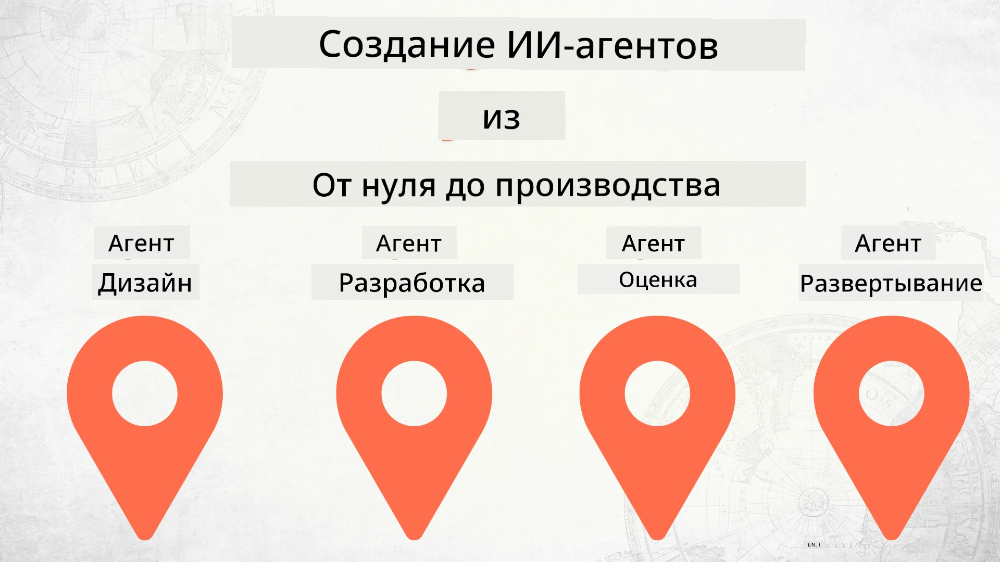

# Создание ИИ-Агентов от Начала до Производства



### 🌐 Многоязычная Поддержка

#### Поддерживается через GitHub Action (автоматически и всегда актуально)

<!-- CO-OP TRANSLATOR LANGUAGES TABLE START -->
[Arabic](../ar/README.md) | [Bengali](../bn/README.md) | [Bulgarian](../bg/README.md) | [Burmese (Myanmar)](../my/README.md) | [Chinese (Simplified)](../zh-CN/README.md) | [Chinese (Traditional, Hong Kong)](../zh-HK/README.md) | [Chinese (Traditional, Macau)](../zh-MO/README.md) | [Chinese (Traditional, Taiwan)](../zh-TW/README.md) | [Croatian](../hr/README.md) | [Czech](../cs/README.md) | [Danish](../da/README.md) | [Dutch](../nl/README.md) | [Estonian](../et/README.md) | [Finnish](../fi/README.md) | [French](../fr/README.md) | [German](../de/README.md) | [Greek](../el/README.md) | [Hebrew](../he/README.md) | [Hindi](../hi/README.md) | [Hungarian](../hu/README.md) | [Indonesian](../id/README.md) | [Italian](../it/README.md) | [Japanese](../ja/README.md) | [Kannada](../kn/README.md) | [Korean](../ko/README.md) | [Lithuanian](../lt/README.md) | [Malay](../ms/README.md) | [Malayalam](../ml/README.md) | [Marathi](../mr/README.md) | [Nepali](../ne/README.md) | [Nigerian Pidgin](../pcm/README.md) | [Norwegian](../no/README.md) | [Persian (Farsi)](../fa/README.md) | [Polish](../pl/README.md) | [Portuguese (Brazil)](../pt-BR/README.md) | [Portuguese (Portugal)](../pt-PT/README.md) | [Punjabi (Gurmukhi)](../pa/README.md) | [Romanian](../ro/README.md) | [Russian](./README.md) | [Serbian (Cyrillic)](../sr/README.md) | [Slovak](../sk/README.md) | [Slovenian](../sl/README.md) | [Spanish](../es/README.md) | [Swahili](../sw/README.md) | [Swedish](../sv/README.md) | [Tagalog (Filipino)](../tl/README.md) | [Tamil](../ta/README.md) | [Telugu](../te/README.md) | [Thai](../th/README.md) | [Turkish](../tr/README.md) | [Ukrainian](../uk/README.md) | [Urdu](../ur/README.md) | [Vietnamese](../vi/README.md)

> **Предпочитаете клонировать локально?**

> В этом репозитории есть переводы на более чем 50 языков, что значительно увеличивает размер загрузки. Чтобы клонировать без переводов, используйте sparse checkout:
> ```bash
> git clone --filter=blob:none --sparse https://github.com/microsoft/Building-AI-Agents-From-Zero-To-Production.git
> cd Building-AI-Agents-From-Zero-To-Production
> git sparse-checkout set --no-cone '/*' '!translations' '!translated_images'
> ```
> Это даст вам всё необходимое для прохождения курса с гораздо более быстрой загрузкой.
<!-- CO-OP TRANSLATOR LANGUAGES TABLE END -->

## Курс, обучающий основам жизненного цикла разработки ИИ-Агентов

[](https://github.com/microsoft/Building-AI-Agents-From-Zero-To-Production/blob/master/LICENSE?WT.mc_id=academic-105485-koreyst)
[](https://GitHub.com/microsoft/Building-AI-Agents-From-Zero-To-Production/graphs/contributors/?WT.mc_id=academic-105485-koreyst)
[](https://GitHub.com/microsoft/Building-AI-Agents-From-Zero-To-Production/issues/?WT.mc_id=academic-105485-koreyst)
[](https://GitHub.com/microsoft/Building-AI-Agents-From-Zero-To-Production/pulls/?WT.mc_id=academic-105485-koreyst)
[](http://makeapullrequest.com?WT.mc_id=academic-105485-koreyst)

[](https://discord.gg/Kuaw3ktsu6)

## 🌱 Начало работы

В этом курсе есть уроки, охватывающие основы создания и развертывания ИИ-Агентов.

Каждый урок основывается на предыдущем, поэтому мы рекомендуем начинать с самого начала и идти шаг за шагом до конца.

Если вы хотите узнать больше о темах, связанных с ИИ-Агентами, вы можете ознакомиться с курсом [AI Agents For Beginners](https://aka.ms/ai-agents-beginners).

### Познакомьтесь с другими учениками, получите ответы на свои вопросы

Если вы застряли или у вас есть вопросы о создании ИИ-Агентов, присоединяйтесь к нашему специализированному Discord-каналу в [Microsoft Foundry Discord](https://discord.gg/Kuaw3ktsu6).

### Что вам понадобится

У каждого урока есть свой собственный пример кода, который можно запустить локально. Вы можете [форкнуть этот репозиторий](https://github.com/microsoft/Building-AI-Agents-From-Zero-To-Production/fork), чтобы создать свою копию.

В этом курсе в настоящее время используются следующие ресурсы:

- [Microsoft Agent Framework (MAF)](https://aka.ms/ai-agents-beginners/agent-framework)
- [Microsoft Foundry](https://azure.microsoft.com/products/ai-foundry)
- [Azure OpenAI Service](https://azure.microsoft.com/products/ai-foundry/models/openai)
- [Azure CLI](https://learn.microsoft.com/cli/azure/authenticate-azure-cli?view=azure-cli-latest)

Пожалуйста, убедитесь, что у вас есть доступ к этим сервисам перед началом работы.

Вскоре появятся дополнительные варианты размещения моделей и сервисов.

## 🗃️ Уроки

| **Урок**              | **Описание**                                                                                 |
|-----------------------|----------------------------------------------------------------------------------------------|
| [Проектирование агента](./lesson-1-agent-design/README.md)          | Введение в кейс использования агента "Наставничество разработчика" и как проектировать эффективных агентов  |
| [Разработка агента](./lesson-2-agent-development/README.md)        | Используя Microsoft Agent Framework (MAF), создайте 3 агента, которые помогут новым разработчикам приступать к работе.       |
| [Оценка агента](./lesson-3-agent-evals/README.md)                  | Используя Microsoft Foundry, узнайте, насколько хорошо работают наши ИИ-Агенты и как их улучшить. |
| [Развертывание агента](./lesson-4-agent-deployment/README.md)      | Используя размещённых агентов и OpenAI Chatkit, узнайте, как развернуть ИИ-Агента в продакшн.       |


## 🎒 Другие курсы

Наша команда создает и другие курсы! Ознакомьтесь с ними:

<!-- CO-OP TRANSLATOR OTHER COURSES START -->
### LangChain
[](https://aka.ms/langchain4j-for-beginners)
[](https://aka.ms/langchainjs-for-beginners?WT.mc_id=m365-94501-dwahlin)
[](https://github.com/microsoft/langchain-for-beginners?WT.mc_id=m365-94501-dwahlin)
---

### Azure / Edge / MCP / Agents
[](https://github.com/microsoft/AZD-for-beginners?WT.mc_id=academic-105485-koreyst)
[](https://github.com/microsoft/edgeai-for-beginners?WT.mc_id=academic-105485-koreyst)
[](https://github.com/microsoft/mcp-for-beginners?WT.mc_id=academic-105485-koreyst)
[](https://github.com/microsoft/ai-agents-for-beginners?WT.mc_id=academic-105485-koreyst)

---
 
### Серия по генеративному ИИ
[](https://github.com/microsoft/generative-ai-for-beginners?WT.mc_id=academic-105485-koreyst)
[-9333EA?style=for-the-badge&labelColor=E5E7EB&color=9333EA)](https://github.com/microsoft/Generative-AI-for-beginners-dotnet?WT.mc_id=academic-105485-koreyst)
[-C084FC?style=for-the-badge&labelColor=E5E7EB&color=C084FC)](https://github.com/microsoft/generative-ai-for-beginners-java?WT.mc_id=academic-105485-koreyst)
[-E879F9?style=for-the-badge&labelColor=E5E7EB&color=E879F9)](https://github.com/microsoft/generative-ai-with-javascript?WT.mc_id=academic-105485-koreyst)

---
 
### Основы обучения
[](https://aka.ms/ml-beginners?WT.mc_id=academic-105485-koreyst)
[](https://aka.ms/datascience-beginners?WT.mc_id=academic-105485-koreyst)
[](https://aka.ms/ai-beginners?WT.mc_id=academic-105485-koreyst)
[](https://github.com/microsoft/Security-101?WT.mc_id=academic-96948-sayoung)
[](https://aka.ms/webdev-beginners?WT.mc_id=academic-105485-koreyst)
[](https://aka.ms/iot-beginners?WT.mc_id=academic-105485-koreyst)
[](https://github.com/microsoft/xr-development-for-beginners?WT.mc_id=academic-105485-koreyst)

---
 
### Серия Copilot
[](https://aka.ms/GitHubCopilotAI?WT.mc_id=academic-105485-koreyst)
[](https://github.com/microsoft/mastering-github-copilot-for-dotnet-csharp-developers?WT.mc_id=academic-105485-koreyst)
[](https://github.com/microsoft/CopilotAdventures?WT.mc_id=academic-105485-koreyst)
<!-- CO-OP TRANSLATOR OTHER COURSES END -->

## Вклад в проект

Этот проект приветствует вклады и предложения. Большинство вкладов требует вашего согласия с
Лицензионным соглашением участника (CLA), в котором вы заявляете, что имеете право и действительно 
предоставляете нам права на использование вашего вклада. Для подробностей посетите <https://cla.opensource.microsoft.com>.

Когда вы отправляете pull request, бот CLA автоматически определит, нужно ли вам предоставить
CLA, и оформит PR соответствующим образом (например, проверка статуса, комментарий). Просто следуйте указаниям
бота. Это потребуется сделать лишь один раз для всех репозиториев, использующих нашу CLA.

Этот проект принял [Кодекс поведения Microsoft с открытым исходным кодом](https://opensource.microsoft.com/codeofconduct/).
Для дополнительной информации смотрите [FAQ по кодексу поведения](https://opensource.microsoft.com/codeofconduct/faq/) или
свяжитесь с [opencode@microsoft.com](mailto:opencode@microsoft.com) для дополнительных вопросов или комментариев.

## Торговые марки

В этом проекте могут использоваться торговые марки или логотипы проектов, продуктов или услуг. Авторизованное использование торговых марок или логотипов Microsoft подчиняется и должно соответствовать
[Руководству по торговым маркам и брендам Microsoft](https://www.microsoft.com/legal/intellectualproperty/trademarks/usage/general).
Использование торговых марок или логотипов Microsoft в изменённых версиях этого проекта не должно вызывать путаницы или подразумевать спонсорство Microsoft.
Любое использование торговых марок или логотипов третьих сторон подчиняется политикам этих третьих сторон.

## Получение помощи

Если у вас возникли проблемы или вопросы по созданию AI приложений, присоединяйтесь:

[](https://discord.gg/Kuaw3ktsu6)

Если у вас есть отзывы о продукте или ошибки во время разработки, посетите:

[](https://aka.ms/foundry/forum)

---

<!-- CO-OP TRANSLATOR DISCLAIMER START -->
**Отказ от ответственности**:  
Этот документ был переведен с помощью сервиса автоматического перевода [Co-op Translator](https://github.com/Azure/co-op-translator). Хотя мы стремимся к точности, пожалуйста, имейте в виду, что автоматические переводы могут содержать ошибки или неточности. Оригинальный документ на его исходном языке следует считать авторитетным источником. Для критически важной информации рекомендуется обратиться к профессиональному переводчику. Мы не несем ответственности за любые недоразумения или неправильные толкования, возникшие в результате использования данного перевода.
<!-- CO-OP TRANSLATOR DISCLAIMER END -->