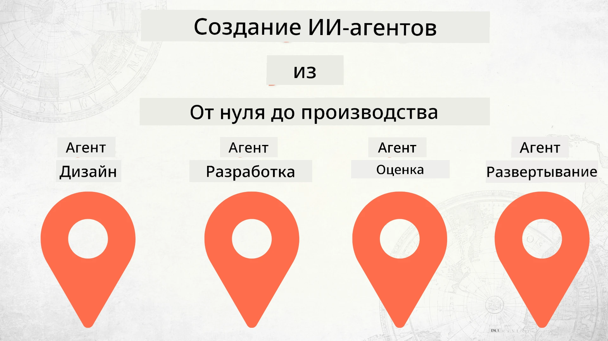

# Создание AI-агентов от нуля до продакшена



### 🌐 Поддержка нескольких языков

#### Поддерживается через GitHub Action (автоматически и всегда актуально)

<!-- CO-OP TRANSLATOR LANGUAGES TABLE START -->
[Arabic](../ar/README.md) | [Bengali](../bn/README.md) | [Bulgarian](../bg/README.md) | [Burmese (Myanmar)](../my/README.md) | [Chinese (Simplified)](../zh-CN/README.md) | [Chinese (Traditional, Hong Kong)](../zh-HK/README.md) | [Chinese (Traditional, Macau)](../zh-MO/README.md) | [Chinese (Traditional, Taiwan)](../zh-TW/README.md) | [Croatian](../hr/README.md) | [Czech](../cs/README.md) | [Danish](../da/README.md) | [Dutch](../nl/README.md) | [Estonian](../et/README.md) | [Finnish](../fi/README.md) | [French](../fr/README.md) | [German](../de/README.md) | [Greek](../el/README.md) | [Hebrew](../he/README.md) | [Hindi](../hi/README.md) | [Hungarian](../hu/README.md) | [Indonesian](../id/README.md) | [Italian](../it/README.md) | [Japanese](../ja/README.md) | [Kannada](../kn/README.md) | [Khmer](../km/README.md) | [Korean](../ko/README.md) | [Lithuanian](../lt/README.md) | [Malay](../ms/README.md) | [Malayalam](../ml/README.md) | [Marathi](../mr/README.md) | [Nepali](../ne/README.md) | [Nigerian Pidgin](../pcm/README.md) | [Norwegian](../no/README.md) | [Persian (Farsi)](../fa/README.md) | [Polish](../pl/README.md) | [Portuguese (Brazil)](../pt-BR/README.md) | [Portuguese (Portugal)](../pt-PT/README.md) | [Punjabi (Gurmukhi)](../pa/README.md) | [Romanian](../ro/README.md) | [Russian](./README.md) | [Serbian (Cyrillic)](../sr/README.md) | [Slovak](../sk/README.md) | [Slovenian](../sl/README.md) | [Spanish](../es/README.md) | [Swahili](../sw/README.md) | [Swedish](../sv/README.md) | [Tagalog (Filipino)](../tl/README.md) | [Tamil](../ta/README.md) | [Telugu](../te/README.md) | [Thai](../th/README.md) | [Turkish](../tr/README.md) | [Ukrainian](../uk/README.md) | [Urdu](../ur/README.md) | [Vietnamese](../vi/README.md)

> **Предпочитаете клонировать локально?**
>
> В этом репозитории содержится более 50 переводов на разные языки, что значительно увеличивает размер загрузки. Чтобы клонировать без переводов, используйте sparse checkout:
>
> **Bash / macOS / Linux:**
> ```bash
> git clone --filter=blob:none --sparse https://github.com/microsoft/Building-AI-Agents-From-Zero-To-Production.git
> cd Building-AI-Agents-From-Zero-To-Production
> git sparse-checkout set --no-cone '/*' '!translations' '!translated_images'
> ```
>
> **CMD (Windows):**
> ```cmd
> git clone --filter=blob:none --sparse https://github.com/microsoft/Building-AI-Agents-From-Zero-To-Production.git
> cd Building-AI-Agents-From-Zero-To-Production
> git sparse-checkout set --no-cone "/*" "!translations" "!translated_images"
> ```
>
> Это даст вам все необходимое для прохождения курса с гораздо более быстрой загрузкой.
<!-- CO-OP TRANSLATOR LANGUAGES TABLE END -->

## Курс, обучающий фундаментальным принципам жизненного цикла разработки AI-агентов

[](https://github.com/microsoft/Building-AI-Agents-From-Zero-To-Production/blob/master/LICENSE?WT.mc_id=academic-105485-koreyst)
[](https://GitHub.com/microsoft/Building-AI-Agents-From-Zero-To-Production/graphs/contributors/?WT.mc_id=academic-105485-koreyst)
[](https://GitHub.com/microsoft/Building-AI-Agents-From-Zero-To-Production/issues/?WT.mc_id=academic-105485-koreyst)
[](https://GitHub.com/microsoft/Building-AI-Agents-From-Zero-To-Production/pulls/?WT.mc_id=academic-105485-koreyst)
[](http://makeapullrequest.com?WT.mc_id=academic-105485-koreyst)

[](https://discord.gg/Kuaw3ktsu6)

## 🌱 Начало работы

В этом курсе есть уроки, раскрывающие основы создания и развертывания AI-агентов.

Каждый урок строится на предыдущем, поэтому мы рекомендуем начинать с начала и проходить курс до конца.

Если хотите узнать больше о темах AI-агентов, можете посмотреть [Курс по AI-агентам для начинающих](https://aka.ms/ai-agents-beginners).

### Познакомьтесь с другими учениками, получите ответы на вопросы

Если вы застряли или у вас есть вопросы по созданию AI-агентов, присоединяйтесь к нашему специализированному Discord-каналу в [Microsoft Foundry Discord](https://discord.gg/Kuaw3ktsu6).

### Что вам потребуется


В каждом уроке есть собственный пример кода, который вы можете запустить локально. Вы можете [форкнуть этот репозиторий](https://github.com/microsoft/Building-AI-Agents-From-Zero-To-Production/fork), чтобы создать свою копию.

Этот курс в настоящее время использует следующее:

- [Microsoft Agent Framework (MAF)](https://aka.ms/ai-agents-beginners/agent-framework)
- [Microsoft Foundry](https://azure.microsoft.com/products/ai-foundry) — проект с развернутой моделью **серии GPT-5** (например, `gpt-5.1`). Не используйте устаревшие модели GPT-4o / GPT-4.1.
- [Azure OpenAI Service](https://azure.microsoft.com/products/ai-foundry/models/openai)
- [Azure CLI](https://learn.microsoft.com/cli/azure/authenticate-azure-cli?view=azure-cli-latest) — войдите с помощью `az login` перед запуском любого примера
- **Python 3.12 или новее**

Пожалуйста, убедитесь, что у вас есть доступ к этим сервисам перед началом.

> **💰 Стоимость и очистка.** Практические уроки создают реальные ресурсы Azure — проект Microsoft Foundry,
> развертывание модели, векторное хранилище и (в уроках 4–6) размещенные агенты и наборы инструментов.
> Они могут создавать затраты, пока существуют. Когда вы закончите урок или весь курс — удаляйте
> ненужные ресурсы. Самый простой подход — собрать всё в отдельную группу ресурсов и удалить всю группу после завершения:
>
>
> ```bash
> az group delete --name <your-resource-group> --yes --no-wait
> ```
>
> Также можно удалять отдельных агентов, векторные хранилища и наборы инструментов через портал Foundry.

> **Примечание по моделям.** Этот курс обслуживает все модели через **Microsoft Foundry**. Он **не**
> использует *GitHub Models*, которые будут завершены **30 июля 2026 года** — Microsoft Foundry является
> официальным путем миграции. Если у вас есть старый код, который вызывает GitHub Models, укажите в нем развертывание модели Foundry.


## 🗃️ Уроки

| **Урок**         | **Описание**                                                                                  |
|--------------------|--------------------------------------------------------------------------------------------------|
| [Agent Design](./lesson-1-agent-design/README.md)       | Введение в наш кейс использования агента «Внедрение разработчика» и как проектировать эффективных агентов  |
| [Agent Development](./lesson-2-agent-development/README.md)  | Используя Microsoft Agent Framework (MAF), создайте набор специализированных агентов для помощи новым разработчикам в адаптации.       |
| [Agent Evaluations](./lesson-3-agent-evals/README.md)  | Используя Microsoft Foundry, узнайте, насколько хорошо работают наши AI агенты и как их улучшить. |
| [Agent Deployment](./lesson-4-agentdeployment/README.md)   | С использованием размещенных агентов Microsoft Foundry и OpenAI ChatKit, посмотрите, как развернуть AI агента в продакшен.       |
| [Production Hosted Agents](./lesson-5-hosted-agents-production/README.md)   | Переведите размещенного агента в корпоративную эксплуатацию: размещённые агенты против Capability Hosts, bring-your-own storage, память и управление.       |
| [Microsoft Toolbox](./lesson-6-toolbox/README.md)   | Определите инструменты один раз и управляйте ими централизованно: создайте набор инструментов, используйте его из агента через один MCP endpoint и безопасно версионируйте инструменты.       |
| [Multi-Agent & A2A](./lesson-7-multi-agent-a2a/README.md)   | Составляйте агентов как сетевые сервисы: открыто предоставляйте агента через открытый протокол Agent-to-Agent (A2A) и потребляйте удаленного агента как пира.       |


## 🎒 Другие курсы

Наша команда выпускает другие курсы! Ознакомьтесь:

<!-- CO-OP TRANSLATOR OTHER COURSES START -->
### LangChain
[](https://aka.ms/langchain4j-for-beginners)
[](https://aka.ms/langchainjs-for-beginners?WT.mc_id=m365-94501-dwahlin)
[](https://github.com/microsoft/langchain-for-beginners?WT.mc_id=m365-94501-dwahlin)
---

### Azure / Edge / MCP / Agents
[](https://github.com/microsoft/AZD-for-beginners?WT.mc_id=academic-105485-koreyst)
[](https://github.com/microsoft/edgeai-for-beginners?WT.mc_id=academic-105485-koreyst)
[](https://github.com/microsoft/mcp-for-beginners?WT.mc_id=academic-105485-koreyst)
[](https://github.com/microsoft/ai-agents-for-beginners?WT.mc_id=academic-105485-koreyst)

---
 
### Серия по Генеративному ИИ

[](https://github.com/microsoft/generative-ai-for-beginners?WT.mc_id=academic-105485-koreyst)
[-9333EA?style=for-the-badge&labelColor=E5E7EB&color=9333EA)](https://github.com/microsoft/Generative-AI-for-beginners-dotnet?WT.mc_id=academic-105485-koreyst)
[-C084FC?style=for-the-badge&labelColor=E5E7EB&color=C084FC)](https://github.com/microsoft/generative-ai-for-beginners-java?WT.mc_id=academic-105485-koreyst)
[-E879F9?style=for-the-badge&labelColor=E5E7EB&color=E879F9)](https://github.com/microsoft/generative-ai-with-javascript?WT.mc_id=academic-105485-koreyst)

---
 
### Основное обучение
[](https://aka.ms/ml-beginners?WT.mc_id=academic-105485-koreyst)
[](https://aka.ms/datascience-beginners?WT.mc_id=academic-105485-koreyst)
[](https://aka.ms/ai-beginners?WT.mc_id=academic-105485-koreyst)
[](https://github.com/microsoft/Security-101?WT.mc_id=academic-96948-sayoung)
[](https://aka.ms/webdev-beginners?WT.mc_id=academic-105485-koreyst)
[](https://aka.ms/iot-beginners?WT.mc_id=academic-105485-koreyst)
[](https://github.com/microsoft/xr-development-for-beginners?WT.mc_id=academic-105485-koreyst)

---
 
### Серия Copilot
[](https://aka.ms/GitHubCopilotAI?WT.mc_id=academic-105485-koreyst)
[](https://github.com/microsoft/mastering-github-copilot-for-dotnet-csharp-developers?WT.mc_id=academic-105485-koreyst)
[](https://github.com/microsoft/CopilotAdventures?WT.mc_id=academic-105485-koreyst)
<!-- CO-OP TRANSLATOR OTHER COURSES END -->

## Участие в проекте

Этот проект приветствует ваши вклады и предложения. Большинство вкладов требует вашего согласия с
Соглашением об участии (CLA), подтверждающим, что вы имеете право и действительно предоставляете нам
права на использование вашего вклада. Подробности доступны по адресу <https://cla.opensource.microsoft.com>.

При отправке запроса на включение изменений бот CLA автоматически определит, нужно ли вам предоставить
CLA, и оформит PR соответствующим образом (например, проверка статуса, комментарий). Просто следуйте
инструкциям бота. Это нужно делать только один раз для всех репозиториев, использующих наше CLA.

Этот проект принял [Кодекс поведения Microsoft Open Source](https://opensource.microsoft.com/codeofconduct/).
Для получения дополнительной информации смотрите [Часто задаваемые вопросы по Кодексу поведения](https://opensource.microsoft.com/codeofconduct/faq/) или
свяжитесь с [opencode@microsoft.com](mailto:opencode@microsoft.com) для любых дополнительных вопросов или комментариев.

## Торговые марки

Этот проект может содержать торговые марки или логотипы проектов, продуктов или услуг. Разрешённое использование торговых
марок или логотипов Microsoft подчиняется и должно соответствовать
[Руководству по использованию торговых марок и брендов Microsoft](https://www.microsoft.com/legal/intellectualproperty/trademarks/usage/general).
Использование торговых марок или логотипов Microsoft в модифицированных версиях этого проекта не должно вызывать путаницу и не может подразумевать спонсорство Microsoft.
Любое использование торговых марок или логотипов третьих сторон подчиняется политике этих третьих сторон.

## Получение помощи

Если вы застряли или у вас есть вопросы по созданию приложений ИИ, присоединяйтесь:

[](https://discord.gg/Kuaw3ktsu6)

Если у вас есть отзывы о продукте или ошибки при разработке, посетите:

[](https://aka.ms/foundry/forum)

---

<!-- CO-OP TRANSLATOR DISCLAIMER START -->
**Отказ от ответственности**:
Этот документ был переведен с использованием сервиса машинного перевода [Co-op Translator](https://github.com/Azure/co-op-translator). Несмотря на наши усилия по обеспечению точности, имейте в виду, что автоматический перевод может содержать ошибки или неточности. Оригинальный документ на его исходном языке следует считать авторитетным источником. Для получения критически важной информации рекомендуется обратиться к профессиональному человеческому переводу. Мы не несем ответственности за любые недоразумения или неправильные толкования, возникшие в результате использования этого перевода.
<!-- CO-OP TRANSLATOR DISCLAIMER END -->