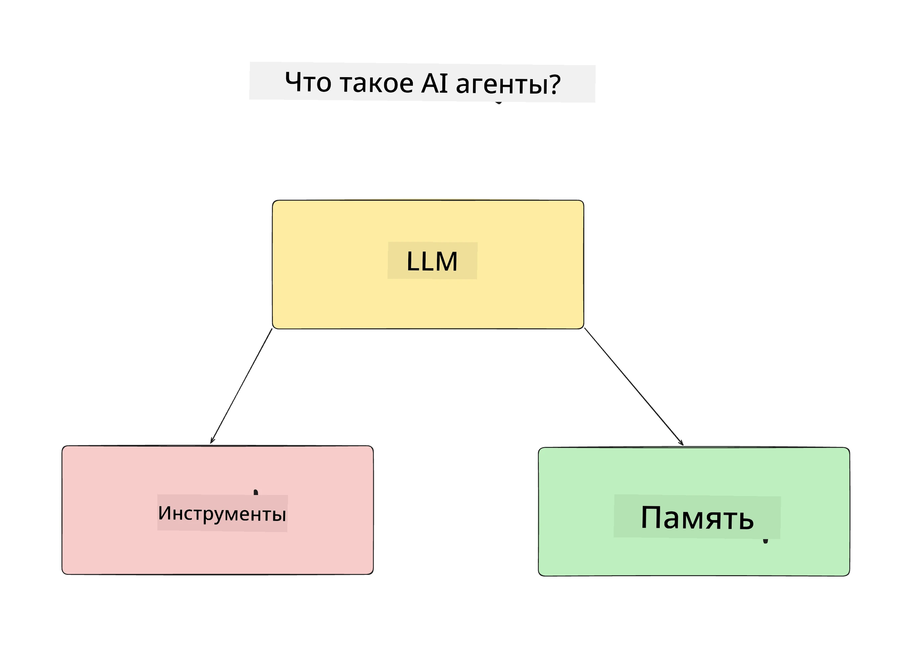
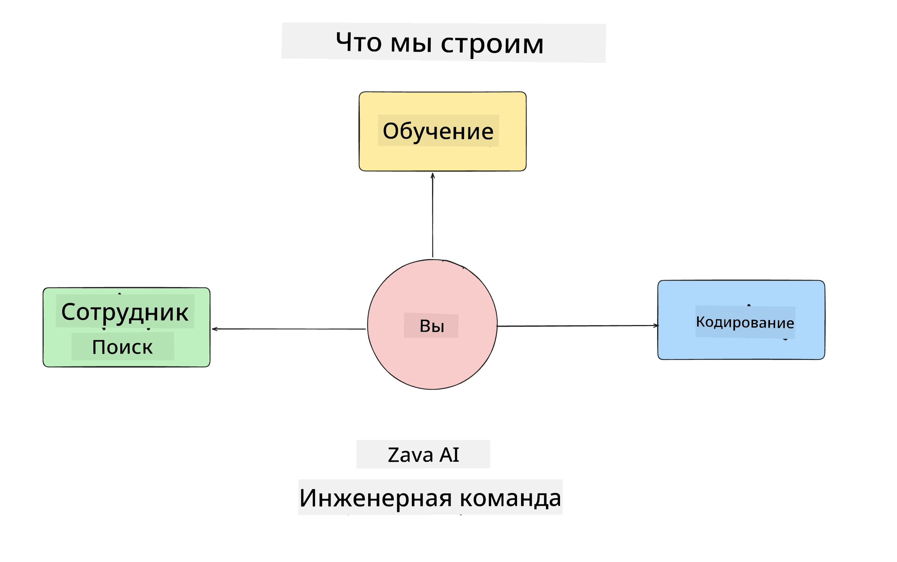
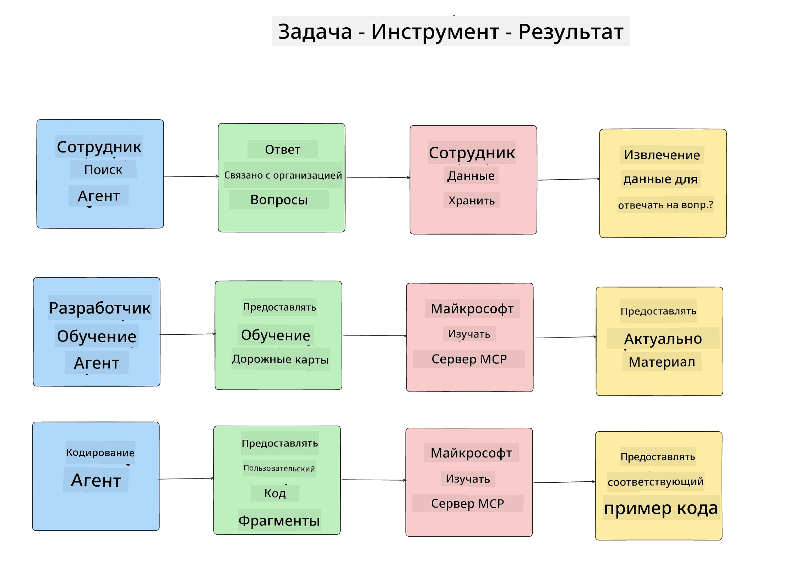
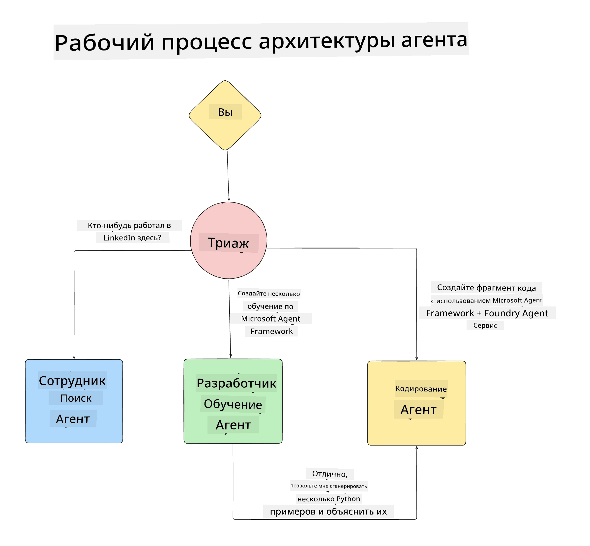

# Урок 1: Дизайн AI Агентов

Добро пожаловать в первый урок курса "Создание AI Агента с нуля до производства"!

В этом уроке мы рассмотрим:

- Определение, что такое AI Агенты
  
- Обсуждение приложения AI Агента, которое мы создаем  

- Определение необходимых инструментов и сервисов для каждого агента
  
- Архитектуру нашего приложения агента
  
Давайте начнем с определения, что такое агент и почему мы хотим использовать их внутри приложения.

> **Перед началом курса.** Этот первый урок концептуальный — кода запускать не нужно.
> Начиная с [Урока 2](../lesson-2-agent-development/README.md) вам потребуется: **подписка Azure** с доступом к **Microsoft Foundry**, развернутая модель серии **GPT-5** (например, `gpt-5.1` — избегайте устаревших GPT-4o / GPT-4.1), **Python 3.12+** и **Azure CLI** (`az login`). Полный список и ссылки смотрите в разделе [Что нужно](../README.md#what-you-need) в описании курса.

## Что такое AI Агенты?

Если вы впервые изучаете, как создать AI Агента, у вас может возникнуть вопрос, как именно определить, что такое AI Агент.

Простой способ определить AI Агента – это перечислить компоненты, из которых он состоит:

**Большая языковая модель** - LLM обеспечит возможность обработки естественного языка от пользователя для понимания задачи, которую он хочет выполнить, а также для интерпретации описаний инструментов, доступных для выполнения этих задач.

**Инструменты** - Это функции, API, хранилища данных и другие сервисы, которые LLM может использовать для выполнения задач, запрошенных пользователем.

**Память** - Это способ хранения как краткосрочных, так и долгосрочных взаимодействий между AI Агентом и пользователем. Сохранение и извлечение этой информации важно для улучшений и сохранения пользовательских предпочтений со временем.

## Наш кейс использования AI Агента

Для этого курса мы создаем приложение AI Агента, которое помогает новым разработчикам присоединиться к нашей команде по разработке AI Агентов!

Прежде чем приступить к разработке, первый шаг в создании успешного приложения AI Агента — определить четкие сценарии того, как мы ожидаем, что наши пользователи будут работать с нашими AI Агентами.

Для этого приложения мы будем работать со следующими сценариями:

**Сценарий 1**: Новый сотрудник присоединяется к нашей организации и хочет узнать больше о команде, к которой он присоединился, и как с ней связаться.

**Сценарий 2:** Новый сотрудник хочет узнать, какая первая задача будет для него лучшей для начала работы.

**Сценарий 3:** Новый сотрудник хочет собрать учебные материалы и примеры кода, чтобы помочь ему начать выполнение этой задачи.

## Определение инструментов и сервисов

Теперь, когда у нас есть эти сценарии, следующий шаг — сопоставить их с инструментами и сервисами, которые наши AI агенты будут использовать для выполнения этих задач.

Этот процесс относится к категории Контекстного Инжиниринга, так как мы сосредоточимся на том, чтобы наши AI Агенты имели правильный контекст в нужное время для выполнения задач.

Давайте рассмотрим каждый сценарий по очереди и выполним качественный агентский дизайн, перечислив задачи агента, инструменты и желаемые результаты.

### Сценарий 1 - Агент поиска сотрудников

**Задача** - Отвечать на вопросы о сотрудниках организации, такие как дата присоединения, текущая команда, местоположение и последняя должность.

**Инструменты** - Хранилище данных с текущим списком сотрудников и организационной схемой

**Результаты** - Способность извлекать информацию из хранилища данных для ответов на общие вопросы по организации и конкретные вопросы о сотрудниках.

### Сценарий 2 - Агент рекомендаций задач

**Задача** - Основываясь на опыте разработки нового сотрудника, предложить 1-3 задачи, над которыми новый сотрудник может работать.

**Инструменты** - MCP сервер GitHub для получения открытых задач и создания профиля разработчика

**Результаты** - Способность читать последние 5 коммитов GitHub профиля и открытые задачи на GitHub проекте и делать рекомендации на основе совпадения

### Сценарий 3 - Агент помощник по коду

**Задача** - Основываясь на открытых задачах, рекомендованных агентом "Рекомендации задач", исследовать и предоставить ресурсы, а также сгенерировать фрагменты кода, чтобы помочь сотруднику.

**Инструменты** - Microsoft Learn MCP для поиска ресурсов и Code Interpreter для генерации кастомных фрагментов кода.

**Результаты** - Если пользователь запросит дополнительную помощь, рабочий процесс должен использовать Learn MCP сервер для предоставления ссылок и фрагментов ресурсов, а затем передавать управление агенту Code Interpreter для генерации небольших фрагментов кода с объяснениями.

## Архитектура нашего приложения агента

Теперь, когда мы определили каждого нашего агента, давайте создадим диаграмму архитектуры, которая поможет нам понять, как каждый агент будет работать вместе и отдельно в зависимости от задачи:

## Следующие шаги

Теперь, когда мы спроектировали каждого агента и нашу агентскую систему, давайте перейдем к следующему уроку, где мы будем разрабатывать каждого из этих агентов!

---

<!-- CO-OP TRANSLATOR DISCLAIMER START -->
**Отказ от ответственности**:
Этот документ был переведен с использованием сервиса машинного перевода [Co-op Translator](https://github.com/Azure/co-op-translator). Несмотря на наши усилия по обеспечению точности, имейте в виду, что автоматический перевод может содержать ошибки или неточности. Оригинальный документ на его исходном языке следует считать авторитетным источником. Для получения критически важной информации рекомендуется обратиться к профессиональному человеческому переводу. Мы не несем ответственности за любые недоразумения или неправильные толкования, возникшие в результате использования этого перевода.
<!-- CO-OP TRANSLATOR DISCLAIMER END -->