# Урок 3: Оценка агентов с Microsoft Foundry

Добро пожаловать в третий урок курса **"Создание AI-агентов с нуля до производства"**!

В [Уроке 2](../lesson-2-agent-development/README.md) вы создавали агентов. В этом уроке вы
узнаете, как ответить на более сложный вопрос: **насколько они хороши?** Отправить агента,
который работает, — это просто; знать, правильно ли он маршрутизирует, остаётся ли он
связанным с вашими данными и корректно ли использует свои инструменты — вот что отличает


- Почему важна оценка агентов и чем она отличается от традиционного тестирования
- Различия между **наблюдаемостью**, **smoke-тестами** и **оценками**
- Многоагентский рабочий процесс, который мы будем измерять
- Встроенные **оценщики Microsoft Foundry** (релевантность, обоснованность, точность вызова инструментов, использование вывода инструмента)
- Пошаговое прохождение конвейера оценки в [`agent-evals.py`](../../../lesson-3-agent-evals/agent-evals.py)


Традиционный юнит-тест утверждает, что `add(2, 2) == 4`. Агенты работают иначе — один и тот же
запрос может выдавать разный текст при каждом запуске, вызовы инструментов могут выполняться в

утверждать точные строки.


(также называемых «LLM в роли судьи») и детерминированных проверок использования инструментов. Это позволяет
узнавать, например:

- Ответ действительно соответствует вопросу? (**релевантность**)

- Вызвал ли агент правильный инструмент с правильными аргументами? (**точность вызова инструмента**)


Это не конкурирующие методы — производственный агент использует все три:

| Уровень | Вопрос, на который отвечает | Стоимость | Когда запускается | Рассматривается в |
|---------|----------------------------|----------|------------------|------------------|

| **Smoke-тесты** | *Доступен ли агент и следует ли он базовому запросу?* | Дёшево, секунды | При каждом деплое | [Урок 4](../lesson-4-agentdeployment/README.md#smoke-testing-the-hosted-agent-ci-gate) |


## Необходимые условия

1. Завершён [Урок 2](../lesson-2-agent-development/README.md) (агенты + векторное хранилище).

3. Аутентификация через **Azure CLI**: `az login`.
4. Установлен **Python 3.12+** и зависимости курса:

   ```bash
   pip install -r ../requirements.txt
   ```

5. Переменные окружения (создайте файл `.env` в этой папке или экспортируйте их):

   | Переменная | Назначение |
   |------------|------------|
   | `FOUNDRY_PROJECT_ENDPOINT` | Ваш конечный адрес проекта Foundry (`https://<account>.services.ai.azure.com/api/projects/<project>`). Используется клиентом `FoundryChatClient` агентов **и** помощником оценки. |

   | `VECTOR_STORE_ID` | Векторное хранилище справочника сотрудников, созданное в уроке 2 |
   | `AZURE_AI_MODEL_DEPLOYMENT_NAME` | Модель, используемая **оценщиками** (по умолчанию `FOUNDRY_MODEL`, затем `gpt-5.1`) |

> Агенты используют `FoundryChatClient`, который читает конфигурацию из переменных с префиксом `FOUNDRY_`
> (`FOUNDRY_PROJECT_ENDPOINT`, `FOUNDRY_MODEL`). Облачный помощник оценки использует SDK `azure-ai-projects`
> и при отсутствии переменной `AZURE_AI_PROJECT_ENDPOINT` вернётся к `FOUNDRY_PROJECT_ENDPOINT` —
> поэтому двух переменных `FOUNDRY_` достаточно для запуска всего урока.
>
> Оценщики сами работают на модели, поэтому `AZURE_AI_MODEL_DEPLOYMENT_NAME` управляет тем,


Чтобы что-то оценить, сначала нужно это запустить. В этом уроке повторно используется многоагентский

```mermaid
flowchart TD
    User([Новый разработчик]) --> Triage[Координатор<br/>агента триаж]
    Triage -->|вопросы по организации / людям| Employee[Агент поиска сотрудников<br/>инструмент поиска файлов]
    Triage -->|обучение / развитие| Learning[Агент обучения<br/>Microsoft Learn MCP]
    Triage -->|помощь с кодированием| Learning
    Learning -->|передача с контекстом| Coding[Агент кодирования<br/>генерация кода]
    Employee -. captured responses .-> Evals[(Foundry<br/>Оценки)]
    Learning -. captured responses .-> Evals
    Coding -. captured responses .-> Evals
    Triage -. captured responses .-> Evals
```




Рабочий процесс построен на оркестрации **handoff** из Microsoft Agent Framework. Ключевая
идея оценки в том, что **каждый ход агента сохраняется на сервере** и идентифицируется с помощью


[`agent-evals.py`](../../../lesson-3-agent-evals/agent-evals.py) реализует шестишаговый конвейер. Вот что делает каждый шаг


Рабочий процесс выполняется через `run_stream(...)`, и по мере поступления событий код записывает
`response_id` и `conversation_id`, созданные каждым агентом. Сохранённые ответы — это исходный
материал для оценки — вы оцениваете *настоящие* ответы, сформированные в продакшене, а не


Краткий отчёт выводит, сколько ответов дал каждый агент, чтобы вы могли убедиться, что


Для каждого агента последний `response_id` извлекается через OpenAI-совместимый клиент проекта
(`project_client.get_openai_client().responses.retrieve(...)`), чтобы вы могли предварительно


| Оценщик | `evaluator_name` | Что измеряет |
|---------|------------------|-------------|
| Релевантность | `builtin.relevance` | Отвечает ли ответ на запрос пользователя? |
| Обоснованность | `builtin.groundedness` | Поддерживается ли ответ извлечёнными/инструментальными данными (не галлюцинация)? |
| Точность вызова инструмента | `builtin.tool_call_accuracy` | Были ли вызваны правильные инструменты с правильными аргументами? |


> **Почему именно эти четыре?** Релевантность и обоснованность измеряют *качество ответа*;
> два оценщика инструментов измеряют *агентское поведение* — аспект, который традиционные NLP-метрики

> часто выявляют реальные регрессии.

### Шаг 5 — Запустите оценку


проигрывает каждый сохранённый ответ через всех оценщиков.

### Шаг 6 — Отслеживайте и читайте результаты

Код опрашивает задачу до её состояния `completed` или `failed`, затем выводит количество результатов и

количества прошедших/не прошедших и отдельные оценённые ответы.

---

## Запустите это

```bash
cd lesson-3-agent-evals
python agent-evals.py
```

По умолчанию оценивается первый пример запроса
(`"Я здесь новенький! Кто-нибудь здесь работал в Microsoft?"`). В функции `run_evaluation_workflow()` есть ещё два

задействующие больше агентов за один запуск.

Ожидаемый вывод в консоль:


---

## Наблюдаемость и трассировка

Оценки показывают, *насколько хороши* ответы; **наблюдаемость** рассказывает, *что произошло*,
чтобы их получить — каждый переход агента, вызов инструмента, количество токенов и задержки.

а Agent Framework может экспортировать их в Azure Monitor / Application Insights одним вызовом:

```python
from agent_framework.foundry import FoundryChatClient

client = FoundryChatClient()
client.configure_azure_monitor()   # экспортировать трассировки + метрики в Application Insights
```

Используйте трассировку, чтобы **отлаживать** плохие оценки: когда падает обоснованность, трасса покажет,

(именно это и оценивает использование вывода инструмента).

---

## От "запусков" к "хорошему": как использовать на практике

- **Предрелизный фильтр.** Запускайте оценки по фиксированному набору репрезентативных запросов перед
  обновлением промпта или модели. Сравнивайте оценки с предыдущей версией — падение считайте
  регрессией.
- **Ночной сигнал качества.** Планируйте оценку, чтобы отслеживать смещение из-за изменений данных или зависимостей.
- **В паре со smoke-тестами.** [Smoke-тест из урока 4](../lesson-4-agentdeployment/README.md#smoke-testing-the-hosted-agent-ci-gate)
  — ваш быстрый фильтр при каждом деплое; оценки — более медленный, глубокий фильтр качества.


Этот пример мигрирует на актуальный API Microsoft Agent Framework Foundry
(`agent_framework.foundry`). Если вы обновляете код, смотрите корневой репозиторий
[`MIGRATION-GUIDE.md`](../MIGRATION-GUIDE.md) для проверенных до/после сопоставлений импортов и клиентов (например, `AzureAIClient` -> `FoundryChatClient`,
создание host-инструментов через `client.get_file_search_tool(...)` / `client.get_mcp_tool(...)`). Понятия оценки и
шестишаговый конвейер выше не меняются при этой миграции.

---

## Ресурсы

- [Оценка генеративных моделей и приложений AI (Microsoft Learn)](https://learn.microsoft.com/en-us/azure/ai-foundry/concepts/evaluation-approach-gen-ai)
- [Встроенные оценщики для генеративного AI](https://learn.microsoft.com/en-us/azure/ai-foundry/concepts/evaluation-evaluators/agent-evaluators)
- [Наблюдаемость в Microsoft Foundry](https://learn.microsoft.com/en-us/azure/ai-foundry/concepts/observability)
- [Microsoft Agent Framework](https://github.com/microsoft/agent-framework)
- [Оркестрация передачи агента](https://learn.microsoft.com/en-us/agent-framework/workflows/orchestrations/handoff)

---

<!-- CO-OP TRANSLATOR DISCLAIMER START -->
**Отказ от ответственности**:
Этот документ был переведен с использованием сервиса машинного перевода [Co-op Translator](https://github.com/Azure/co-op-translator). Несмотря на наши усилия по обеспечению точности, имейте в виду, что автоматический перевод может содержать ошибки или неточности. Оригинальный документ на его исходном языке следует считать авторитетным источником. Для получения критически важной информации рекомендуется обратиться к профессиональному человеческому переводу. Мы не несем ответственности за любые недоразумения или неправильные толкования, возникшие в результате использования этого перевода.
<!-- CO-OP TRANSLATOR DISCLAIMER END -->