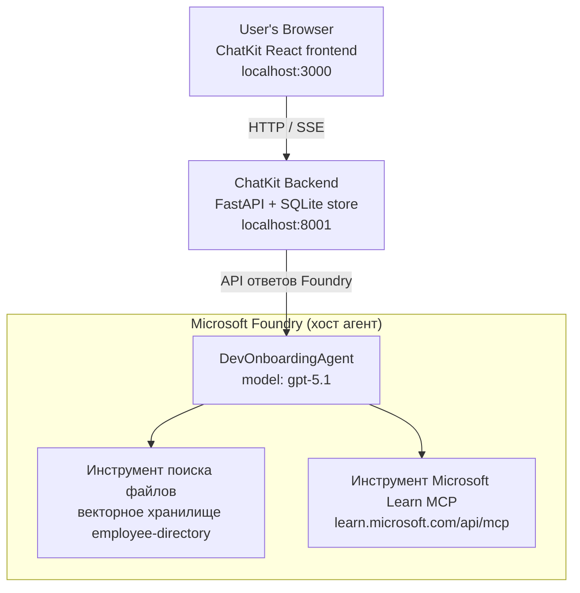

# Урок 4: Развертывание агента с Microsoft Foundry Hosted Agents + ChatKit

В этом уроке демонстрируется, как развернуть агента, использующего инструменты, в Microsoft Foundry как хостинг-агента и создать фронтенд на базе ChatKit для взаимодействия с ним.

## Архитектура

Хостинг-агент — это **один `DevOnboardingAgent`** (запускается на `gpt-5.1`), который отвечает на вопросы по адаптации сотрудников с использованием двух хостинг-инструментов: инструмента **Поиска файлов** по векторному хранилищу сотруднического справочника и инструмента **Microsoft Learn MCP**. React-фронтенд ChatKit общается с FastAPI-бэкендом, который вызывает агента через Foundry **Responses API**.



## Предварительные требования

1. **Проект Microsoft Foundry** в регионе Северная центральная часть США
2. Аутентифицированный **Azure CLI** (`az login`)
3. Установленный **Azure Developer CLI** (`azd`)
4. **Python 3.12+** и **Node.js 18+**
5. Созданное **векторное хранилище** с данными сотрудников

## Быстрый старт

### 1. Настройка переменных окружения

```bash
cd lesson-4-agentdeployment
cp .env.example .env
# Отредактируйте .env, указав данные вашего проекта Microsoft Foundry
```

### 2. Развертывание хостинг-агента

**Вариант A: Использование Azure Developer CLI (рекомендуется)**

```bash
cd hosted-agent
azd auth login
azd agent deploy
```

**Вариант B: Использование Docker + Azure Container Registry**

```bash
cd hosted-agent

# Соберите контейнер
docker build -t developer-onboarding-agent:latest .

# Тег для ACR
docker tag developer-onboarding-agent:latest <your-acr>.azurecr.io/developer-onboarding-agent:latest

# Отправить в ACR
az acr login --name <your-acr>
docker push <your-acr>.azurecr.io/developer-onboarding-agent:latest

# Развернуть через портал Microsoft Foundry или SDK
```

### 3. Запуск бэкенда ChatKit

```bash
cd chatkit-server
python -m venv .venv
source .venv/bin/activate  # В Windows: .venv\Scripts\activate
pip install -r requirements.txt
python app.py
```

Сервер запустится по адресу `http://localhost:8001`

### 4. Запуск фронтенда ChatKit

```bash
cd chatkit-server/frontend
npm install
npm run dev
```

Фронтенд запустится по адресу `http://localhost:3000`

### 5. Тестирование приложения

Откройте `http://localhost:3000` в браузере и попробуйте следующие запросы:

**Поиск сотрудников:**
- "Я тут новенький! Кто-нибудь работал в Microsoft?"
- "Кто имеет опыт работы с Azure Functions?"

**Учебные материалы:**
- "Создай учебный маршрут по Kubernetes"
- "Какие сертификаты стоит получить для облачной архитектуры?"

**Помощь с кодированием:**
- "Помоги написать Python-код для подключения к CosmosDB"
- "Покажи, как создать Azure Function"

**Многоагентные запросы:**
- "Я начинаю как облачный инженер. С кем мне связаться и что учить?"

## Структура проекта

```
lesson-4-agentdeployment/
├── .env.example                 # Environment variables template
├── implementation-plan.md       # Detailed implementation guide
├── README.md                    # This file
├── hosted-agent/               # Microsoft Foundry hosted agent
│   ├── main.py                 # Multi-agent workflow implementation
│   ├── requirements.txt        # Python dependencies
│   ├── Dockerfile              # Container definition
│   └── agent.yaml              # Agent deployment configuration
└── chatkit-server/             # ChatKit server application
    ├── app.py                  # FastAPI backend
    ├── store.py                # SQLite persistence layer
    ├── requirements.txt        # Python dependencies
    └── frontend/               # React frontend
        ├── package.json
        ├── vite.config.ts
        ├── tsconfig.json
        ├── index.html
        └── src/
            ├── main.tsx
            ├── App.tsx
            ├── App.css
            └── index.css
```

## Агент и его инструменты

Хостинг-агент — это **единственный агент** (`DevOnboardingAgent`, определён в `hosted-agent/main.py`), который обрабатывает три области адаптации. Вместо оркестрации отдельных суб-агентов, он предоставляет каждую возможность как инструмент (или использует модель напрямую):

| Возможность | Как обрабатывается | Инструмент |
|-----------|------------------|------|
| **Поиск сотрудников и связи** | Foundry hosted File Search по векторному хранилищу сотруднического справочника | `client.get_file_search_tool(vector_store_ids=[...])` |
| **Обучение и подготовка** | Сервер Microsoft Learn MCP (хостинг MCP инструмента) | `client.get_mcp_tool(url="https://learn.microsoft.com/api/mcp")` |
| **Помощь с кодированием** | Обрабатывается моделью `gpt-5.1` напрямую — внешний инструмент не используется | — |

Агент создаётся с помощью `client.as_agent(name="DevOnboardingAgent", instructions=..., tools=[file_search_tool, learn_mcp_tool])` и запускается через `from_agent_framework(agent).run()`.

> **Примечание по дизайну.** Ранние версии этого урока использовали многоагентный рабочий процесс `HandoffBuilder` (Триаж → специалисты). Выпущенный агент — это единый агент, использующий инструменты, что упрощает развертывание и анализ для вопросов и ответов в стиле адаптации. Пример оркестрации многоагентной системы и передачи см. в Уроке 2 и Уроке 3.

## Smoke-тестирование хостинг-агента (CI Gate)

Успешное развертывание хостинг-агента доказывает только то, что управляющая плоскость приняла
определение — оно **не** доказывает, что агент действительно отвечает. Отсутствие зависимости,
неправильная маршрутизация модели или истёкшее соединение могут оставить агента в зелёном, но молчаливом состоянии.

В этом уроке поставляется лёгкий **smoke-тест**, работающий как быстрый и недорогой пост-развёртывательный
шлюз. Он использует GitHub Action [AI Smoke Test](https://github.com/marketplace/actions/ai-smoke-test)
для отправки POST-запросов к Foundry **Responses** endpoint агента
(`POST {project_endpoint}/agents/{agent_name}/endpoint/protocols/openai/responses`)
и проверки возвращённого текста. Он выявляет ошибочные развертывания, регрессии аутентификации,
дрейф системных подсказок и сбои в поточном управлении в течение нескольких секунд.

> Smoke-тесты **не являются** заменой полноценных оценок в
> [Уроке 3](../lesson-3-agent-evals/README.md) — они дополняют их. Smoke-тесты
> отвечают на вопрос *«доступен ли агент, отвечает ли он и соблюдает ли базовые ожидания подсказок?»*;
> оценки отвечают на вопрос *«насколько хорош ответ?»*. Запускайте этот лёгкий шлюз при каждом развертывании.

### Что тестируется

Каталог находится в [`hosted-agent/tests/smoke-tests.json`](../../../lesson-4-agentdeployment/hosted-agent/tests/smoke-tests.json)
и проверяет три области агента, соблюдение подсказок и мульти-turn общение:

| Тест | Что проверяет |
|------|------------------|
| `reachability` | Агент отвечает непустым текстом, относящимся к теме |
| `employee-search` | Область поиска файлов возвращает корректный код `200` (ответ зависит от данных) |
| `learning-path` | Область обучения повторяет тему и выдаёт ответ в стиле плана обучения |
| `coding-assistance` | Область кодирования возвращает ответ в виде кода Python |
| `prompt-adherence-offtopic` | Офф-топик запрос перенаправляется, без детального ответа |
| `threading-turn-1/2` | Состояние разговора сохраняется между ходами через `previous_response_id` |

### Запуск в CI

Рабочий процесс в [`.github/workflows/smoke-test-hosted-agent.yml`](../../../.github/workflows/smoke-test-hosted-agent.yml)
содержит две задачи:

- **`static`** — быстрый, не связанный с Azure тест, запускаемый при каждом pull request и push:
  он компилирует все исходники Python (`py_compile`) и проверяет ссылки Markdown. Секреты не требуются,
  поэтому тест работает на форках.
- **`smoke`** — приведённый ниже smoke-тест с подключением к Azure. Запускается по требованию
  (Actions → **Agent CI (static + smoke)** → Run workflow) и может быть связан после вашего
  рабочего процесса развертывания.

Настройте эти **переменные** и **секреты** репозитория для задачи smoke:

| Тип | Имя | Значение |
|------|------|-------|

| Переменная | `FOUNDRY_PROJECT_ENDPOINT` | `https://<account>.services.ai.azure.com/api/projects/<project>` |
| Переменная | `HOSTED_AGENT_NAME` | Имя развернутого агента (например, `dev-onboarding` — должно совпадать с вашим развертыванием) |
| Секрет | `AZURE_CLIENT_ID` / `AZURE_TENANT_ID` / `AZURE_SUBSCRIPTION_ID` | OIDC объедененная идентичность для `azure/login` |

Идентичность раннера должна иметь роль **`Azure AI User`** на уровне **Foundry project scope**, чтобы он мог
вызывать конечные точки плоскости данных Responses (и conversations). Предоставьте эту роль с помощью:

```bash
az role assignment create \
  --assignee <object-id-or-appId-of-runner-identity> \
  --role "Azure AI User" \
  --scope "/subscriptions/<sub>/resourceGroups/<rg>/providers/Microsoft.CognitiveServices/accounts/<account>/projects/<project>"
```

### Запуск локально

Вы можете запустить тот же каталог перед отправкой. Получите токен плоскости данных с областью действия
`https://ai.azure.com/` и направьте раннер на ваше развертывание:

```bash
# Аудитория ДОЛЖНА быть https://ai.azure.com/ (токены cognitiveservices.azure.com отклоняются)
export FOUNDRY_TOKEN=$(az account get-access-token --resource https://ai.azure.com/ --query accessToken -o tsv)

git clone https://github.com/JFolberth/ai-smoketest && cd ai-smoketest
python runner.py \
  --project-endpoint "https://<account>.services.ai.azure.com/api/projects/<project>" \
  --agent-name dev-onboarding \
  --tests-file ../lesson-4-agentdeployment/hosted-agent/tests/smoke-tests.json
```

Коды выхода: `0` — все прошло успешно, `1` — проверка не прошла, `2` — ошибка раннера (плохой каталог / токен).

## Устранение неполадок

### Агент не отвечает
- Проверьте, что размещенный агент развернут и запущен в Microsoft Foundry
- Убедитесь, что `HOSTED_AGENT_NAME` и `HOSTED_AGENT_VERSION` совпадают с вашим развертыванием

### Ошибки в хранилище векторов
- Убедитесь, что `VECTOR_STORE_ID` установлен правильно
- Проверьте, что хранилище векторов содержит данные сотрудников

### Ошибки аутентификации
- Выполните `az login` для обновления учетных данных
- Убедитесь, что у вас есть доступ к проекту Microsoft Foundry

## Ресурсы

- [Документация по размещенным агентам Microsoft Foundry](https://learn.microsoft.com/en-us/azure/ai-foundry/agents/concepts/hosted-agents)
- [Microsoft Agent Framework](https://github.com/microsoft/agent-framework)
- [Пример интеграции ChatKit](https://github.com/microsoft/agent-framework/tree/main/python/samples/demos/chatkit-integration)
- [Azure Developer CLI](https://learn.microsoft.com/en-us/azure/developer/azure-developer-cli/overview)
- [GitHub Action для AI Smoke Test](https://github.com/marketplace/actions/ai-smoke-test)
- [Smoke Test Microsoft Foundry Agents с GitHub Actions (блог)](https://techcommunity.microsoft.com/blog/azuredevcommunityblog/smoke-test-microsoft-foundry-agents-with-github-actions/4531912)

---

## Следующие шаги

Ваш агент работает на инфраструктуре, управляемой Microsoft. Чтобы вывести его в промышленную среду —
контролируя, где хранятся его данные (суверенитет данных, частные сети, использование собственного Azure
Cosmos DB / Storage / AI Search) и управляйте его инструментами — продолжайте с
**[Урок 5: Размещение агентов в промышленной среде](../lesson-5-hosted-agents-production/README.md)**, который
объясняет ключевое различие между **Hosted Agents** и **Capability Hosts**.

---

<!-- CO-OP TRANSLATOR DISCLAIMER START -->
**Отказ от ответственности**:
Этот документ был переведен с использованием сервиса машинного перевода [Co-op Translator](https://github.com/Azure/co-op-translator). Несмотря на наши усилия по обеспечению точности, имейте в виду, что автоматический перевод может содержать ошибки или неточности. Оригинальный документ на его исходном языке следует считать авторитетным источником. Для получения критически важной информации рекомендуется обратиться к профессиональному человеческому переводу. Мы не несем ответственности за любые недоразумения или неправильные толкования, возникшие в результате использования этого перевода.
<!-- CO-OP TRANSLATOR DISCLAIMER END -->