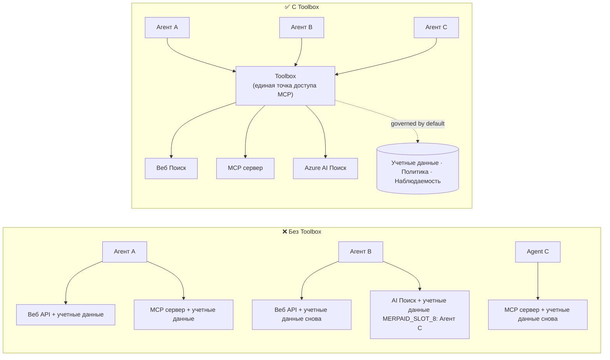

# Урок 6: Microsoft Toolbox — Управляемые инструменты для агентов

По результатам [Урока 5](../lesson-5-hosted-agents-production/README.md) ваш размещённый агент работает в
продакшене с нужными вашей организации настройками хранения и управления. Но вспомните агента из
Урока 4: каждый инструмент был **жёстко закодирован** в `main.py` — URL Microsoft Learn MCP,
векторное хранилище для поиска файлов и так далее. Это работает для одного агента, но это НЕ
масштабируется на организацию с десятками агентов и команд.

В этом уроке представлена **Microsoft Toolbox** — способ Foundry определить кураторский набор
инструментов **один раз**, управлять ими **централизованно** и предоставлять их любому агенту через
**единый управляемый конечный точку**.

## Цели обучения

К концу этого урока вы сможете:

- Объяснить проблему раздутия инструментов, которую решает Toolbox.
- Описать столпы **Build** и **Consume** и типы инструментов, которые может содержать toolbox.
- **Построить** версию toolbox с помощью Foundry SDK.
- **Использовать** toolbox из размещённого агента Microsoft Agent Framework через единую конечную точку MCP.
- Применять **версионирование** для выпуска изменений инструментов без изменений кода агента и повторного развертывания.
- Использовать **управление**: RBAC, внедрение учётных данных и политики guardrail (RAI).

---

## Необходимые условия

1. Пройденные [Урок 4](../lesson-4-agentdeployment/README.md) и желательно
   [Урок 5](../lesson-5-hosted-agents-production/README.md).
2. Проект **Microsoft Foundry** с правами на создание и управление ресурсами toolbox.
3. Аутентификация в **Azure CLI**: `az login`. API toolbox Foundry требуют
   области действия токена `https://ai.azure.com/.default` (показано в коде ниже).
4. **Python 3.12+** с установленными зависимостями курса (`pip install -r ../requirements.txt`).
5. Актуальное, невыведенное из эксплуатации развертывание модели (например `gpt-5.1`). Избегайте устаревших GPT-4o / GPT-4.1.

---

## 1. Проблема: раздутие инструментов

Один агент может зависеть от многих инструментов — REST API, MCP серверов, коннекторов и рабочих процессов, каждый
со своей моделью аутентификации и командой поддержки. По мере масштабирования в организации:

- Команды **повторно реализуют одни и те же инструменты** независимо друг от друга.
- **Учётные данные дублируются** между агентами и репозиториями.
- **Управление становится непоследовательным** — каждый агент сам применяет (или забывает) политику.
- Отсутствует **прозрачность**: что существует и кто использует инструменты.

Разработчики тормозят — не из-за возможностей моделей, а потому что **интеграция инструментов становится узким местом**.




Корпорации уже имеют инфраструктуру — шлюзы, хранилища учётных данных, политики, наблюдаемость.
Недоставало опыта для разработчиков, который бы упаковывал это в нечто **переиспользуемое,
обнаруживаемое и управляемое по умолчанию**. Вот что такое Toolbox.

---

## 2. Что такое Toolbox

**Toolbox** — это **управляемый ресурс Foundry**. Вы определяете кураторский набор инструментов один раз,
управляете ими централизованно в Foundry и предоставляете через **единую конечную точку, совместимую с MCP,**
которую любой агент может использовать. Во время работы платформа обеспечивает **внедрение учётных данных,
обновление токенов и применение корпоративных политик**.

Поскольку toolbox — управляемый ресурс, вы можете добавлять, удалять или перенастраивать инструменты **без
изменения кода агента** — агент всегда использует одну и ту же конечную точку.

Toolbox покрывает жизненный цикл инструмента через четыре столпа; **Build** и **Consume** доступны
сегодня:

| Столп | Статус | Что он позволяет делать |
|--------|--------|-----------------|
| **Build** | Доступен сегодня | Выбирать инструменты, централизованно настраивать аутентификацию, публиковать переиспользуемый toolbox для любой команды. |
| **Consume** | Доступен сегодня | Подключать любой агент к одной конечной точке MCP для динамического обнаружения и вызова всех инструментов в toolbox. |

Площадка потребления **открытая**: любой совместимый с MCP рантайм или клиент может использовать toolbox —
Microsoft Agent Framework, LangGraph, GitHub Copilot, Claude Code, Microsoft Copilot Studio или
собственный код.

### Типы инструментов, которые может содержать toolbox

Web Search · MCP · Azure AI Search · Code Interpreter · File Search · OpenAPI · **Agent-to-Agent
(A2A)** · Fabric IQ · Tool Search · Work IQ · Browser Automation · Ссылки на навыки, плюс
**политика guardrail (RAI)**, применяемая на уровне toolbox.

> **Совет:** Добавляйте `description` к **каждому** инструменту, чтобы модель могла выбрать нужный.
> В toolbox разрешён максимум **один инструмент без имени на тип** — дайте каждому дополнительному
> экземпляру одного типа уникальное `name`, иначе получите ошибку `invalid_payload`.

---

## 3. Создание toolbox

Toolbox управляются с помощью Foundry SDK (Python/.NET/JavaScript), REST API, `azd` и
**Microsoft Foundry Toolkit для VS Code**. Вот паттерн на Python (`azure-ai-projects`):

```python
from azure.identity import DefaultAzureCredential
from azure.ai.projects import AIProjectClient
from azure.ai.projects.models import MCPTool, ToolboxSearchPreviewTool, WebSearchTool

endpoint = "https://<your-foundry-account>.services.ai.azure.com/api/projects/<your-project>"
project = AIProjectClient(endpoint=endpoint, credential=DefaultAzureCredential())

toolbox_version = project.toolboxes.create_toolbox_version(
    name="agent-tools",
    description="Web search + an MCP server + tool search",
    tools=[
        WebSearchTool(),
        MCPTool(
            server_label="myserver",
            server_url="https://your-mcp-server.example.com",
            require_approval="never",
            project_connection_id="my-key-auth-connection",  # учетные данные хранятся в Foundry
        ),
        ToolboxSearchPreviewTool(),
    ],
)
print(f"Created toolbox: {toolbox_version.name}, version: {toolbox_version.version}")
```

Обратите внимание, что вы **не делаете**: никаких секретов в агенте. Учётные данные хранятся в
**connection** Foundry (`project_connection_id`) и внедряются платформой во время вызова.

> **Примечание превью.** Управление toolbox (создание/обновление версий) пока что в режиме превью.
> Операции `project.toolboxes.*`, показанные выше, доступны в превью сборках SDK, REST API,
> `azd` и **Foundry Toolkit для VS Code** — они **не** входят в зафиксированный `azure-ai-projects`,
> используемый в остальной части курса. Рассматривайте код выше как образец шага Build; для
> пошагового создания создайте toolbox в **Foundry портале** или с помощью **Foundry Toolkit**. Шаг
> **Consume** ниже работает с зафиксированной SDK курса.

---

## 4. Использование toolbox в вашем агенте

Toolbox предоставляет **конечную точку MCP**. Есть два шаблона:

| Роль | Конечная точка | Когда использовать |
|------|----------|-------------|
| **Потребитель toolbox** | `{project_endpoint}/toolboxes/{name}/mcp?api-version=v1` | Подключать агентов. Всегда обслуживает **версию по умолчанию**. |
| **Разработчик toolbox** | `{project_endpoint}/toolboxes/{name}/versions/{version}/mcp?api-version=v1` | Тестировать конкретную версию перед выпуском. |

> **Подключайте агентов к конечной точке *потребителя*.** Так как она всегда обслуживает версию по умолчанию, вы
> можете выпускать новые версии **без изменения кода агента или повторного развертывания**.

### Интеграция с размещённым агентом Microsoft Agent Framework

Вспомните, что агент из Урока 4 добавлял один жёстко закодированный MCP-инструмент с `client.get_mcp_tool(...)`.
С Toolbox вы указываете **один** `MCPStreamableHTTPTool` на конечную точку toolbox — и агент получает
**каждый** инструмент из toolbox, централизованно управляемый:

```python
import httpx
from azure.identity import DefaultAzureCredential, get_bearer_token_provider
from agent_framework import MCPStreamableHTTPTool

# Auth: Набор инструментов Foundry требует область https://ai.azure.com/.default
credential = DefaultAzureCredential()
token_provider = get_bearer_token_provider(credential, "https://ai.azure.com/.default")
http_client = httpx.AsyncClient(auth=_ToolboxAuth(token_provider), timeout=120.0)

TOOLBOX_ENDPOINT = os.environ["TOOLBOX_ENDPOINT"]  # внедряется платформой во время выполнения

mcp_tool = MCPStreamableHTTPTool(
    name="toolbox",
    url=TOOLBOX_ENDPOINT,
    http_client=http_client,
    load_prompts=False,
)

agent = chat_client.as_agent(
    name="my-toolbox-agent",
    instructions="You are a helpful assistant with access to Foundry toolbox tools.",
    tools=[mcp_tool],
)
```

Соответствующий `.env` (заметьте: используйте **актуальную** модель вроде `gpt-5.1`, **не** устаревшую
`gpt-4o`):

```env
FOUNDRY_PROJECT_ENDPOINT=https://<account>.services.ai.azure.com/api/projects/<project>
TOOLBOX_ENDPOINT=https://<account>.services.ai.azure.com/api/projects/<project>/toolboxes/agent-tools/mcp?api-version=v1
AZURE_AI_MODEL_DEPLOYMENT_NAME=gpt-5.1
```

> **Сначала проверьте.** Перед подключением полного агента подключитесь к SDK клиента MCP (`pip install mcp`)
> к **версионной** конечной точке и получите список инструментов, чтобы убедиться в их загрузке.

### Запуск примера использования

В этом уроке предоставлен пример с клиентом, [`toolbox_agent.py`](../../../lesson-6-toolbox/toolbox_agent.py). Он использует
тот же паттерн `FoundryChatClient.get_mcp_tool(...)`, который вы изучили в Уроке 2, но указывает один
MCP-инструмент на вашу конечную точку **toolbox**, так что агент получает все управляемые инструменты:

```bash
# В вашем файле .env установите TOOLBOX_ENDPOINT на конечную точку потребителя вашей toolbox, затем:
python lesson-6-toolbox/toolbox_agent.py
```

Откройте выведенный URL `http://localhost:8096` и задайте вопрос, который использует один из инструментов
вашего toolbox. Добавьте или обновите инструмент в toolbox и попробуйте снова — **без изменения
этого кода** — чтобы увидеть работу центрального управления и версионирования.

---

## 5. Версионирование: безопасный выпуск изменений инструментов

Версионирование toolbox даёт вам явный контроль над моментом вступления изменений в силу:

1. **Создайте** новую версию toolbox с обновлённым набором инструментов.
2. **Протестируйте** её через версионную (разработческую) конечную точку.
3. **Продвиньте** её до `default_version`, когда будете готовы.

Каждый агент, подключённый к **конечной точке потребителя**, автоматически получает продвинутую версию —
**без изменений кода и повторного развертывания**. (Первая созданная вами версия автоматически становится версией по умолчанию.)

Это эквивалент blue/green деплоя для управления инструментами: вы проверяете изменение локально,
а затем переключаете версию по умолчанию для всех потребителей одновременно.

---

## 6. Управление: как Toolbox улучшает контроль

Toolbox **управляется по умолчанию**. Ключевые рычаги управления, которые вы должны знать:

- **RBAC.** Предоставьте роль **Foundry User** на проекте каждой личности: **разработчику**, который управляет
  версиями toolbox, **управляемой идентичности агента** (для размещённых агентов, вызывающих инструменты во время работы),
  и, для OAuth потоков, **конечному пользователю**, чья личность проксируется.
- **Централизованные учётные данные.** Учётные данные инструментов живут в **connections** Foundry,
  а не в коде агента или `.env` файлах. Платформа внедряет и обновляет токены во время выполнения.
- **Guardrails (политика RAI).** Назначьте именованную политику ответственного ИИ (RAI) для версии toolbox через
  `policies.rai_config.rai_policy_name`. Она работает на **уровне toolbox**, независимо от фильтра контента модели,
  проверяя входные и выходные данные инструмента.
- **Утверждение MCP.** Переключатель `require_approval` для инструмента MCP регулирует, требуется ли согласование вызова —
  такой же workflow одобрения, который вы видели в [Уроке 5 §7](../lesson-5-hosted-agents-production/README.md#7-hosted-mcp-tools--approval-workflows).
- **Приватная сеть.** Toolbox поддерживает конфигурации виртуальных сетей для предприятий,
  которые держат трафик внутри своей сети.
- **Прозрачность.** Поскольку инструменты каталогизируются централизованно, вы наконец получаете инвентаризацию
  существующих инструментов и их пользователей.

---

## Практические задания

1. **Рефакторинг Урока 4.** Агент из Урока 4 жёстко кодирует инструмент Microsoft Learn MCP. Опишите,
   как бы вы переместили этот инструмент в toolbox `agent-tools` и перенаправили `main.py` к конечной
   точке потребителя toolbox. Какие изменения потребуются в `main.py`? Что перестанет там жить?
2. **Спланируйте обновление версии.** Нужно добавить инструмент Web Search в рабочий toolbox, используемый пятью
   агентами. Опишите последовательность создания → тестирования → продвижения и объясните, почему ни один из пяти агентов
   не нуждается в повторном развертывании.
3. **Выбор аутентификационных личностей.** Для размещённого агента, вызывающего MCP-инструмент с OAuth через
   toolbox, перечислите, какие личности должны иметь роль **Foundry User** и почему.
4. **Размещение guardrail.** Объясните отличие между фильтром контента модели и guardrail на уровне toolbox,
   приведите один сценарий, когда нужен именно guardrail toolbox.

---

## Ресурсы

- [Создание, тестирование и развертывание toolbox в Foundry](https://learn.microsoft.com/azure/foundry/agents/how-to/tools/toolbox)
- [Каталог инструментов — Foundry Agent Service](https://learn.microsoft.com/azure/foundry/agents/concepts/tool-catalog)
- [Microsoft Agent Framework — Провайдер Microsoft Foundry (инструменты)](https://learn.microsoft.com/agent-framework/agents/providers/microsoft-foundry)
- [Обзор guardrails](https://learn.microsoft.com/azure/foundry/guardrails/guardrails-overview)
- [Начало работы с Foundry в VS Code (Foundry Toolkit)](https://learn.microsoft.com/azure/ai-foundry/how-to/develop/get-started-projects-vs-code)
- [Model Context Protocol](https://modelcontextprotocol.io/)

---

**Предыдущий:** [Урок 5 — Размещённые агенты в продакшене](../lesson-5-hosted-agents-production/README.md)
&nbsp;·&nbsp; **Следующий:** [Урок 7 — Мультиагент и A2A](../lesson-7-multi-agent-a2a/README.md)

---

<!-- CO-OP TRANSLATOR DISCLAIMER START -->
**Отказ от ответственности**:
Этот документ был переведен с использованием сервиса машинного перевода [Co-op Translator](https://github.com/Azure/co-op-translator). Несмотря на наши усилия по обеспечению точности, имейте в виду, что автоматический перевод может содержать ошибки или неточности. Оригинальный документ на его исходном языке следует считать авторитетным источником. Для получения критически важной информации рекомендуется обратиться к профессиональному человеческому переводу. Мы не несем ответственности за любые недоразумения или неправильные толкования, возникшие в результате использования этого перевода.
<!-- CO-OP TRANSLATOR DISCLAIMER END -->