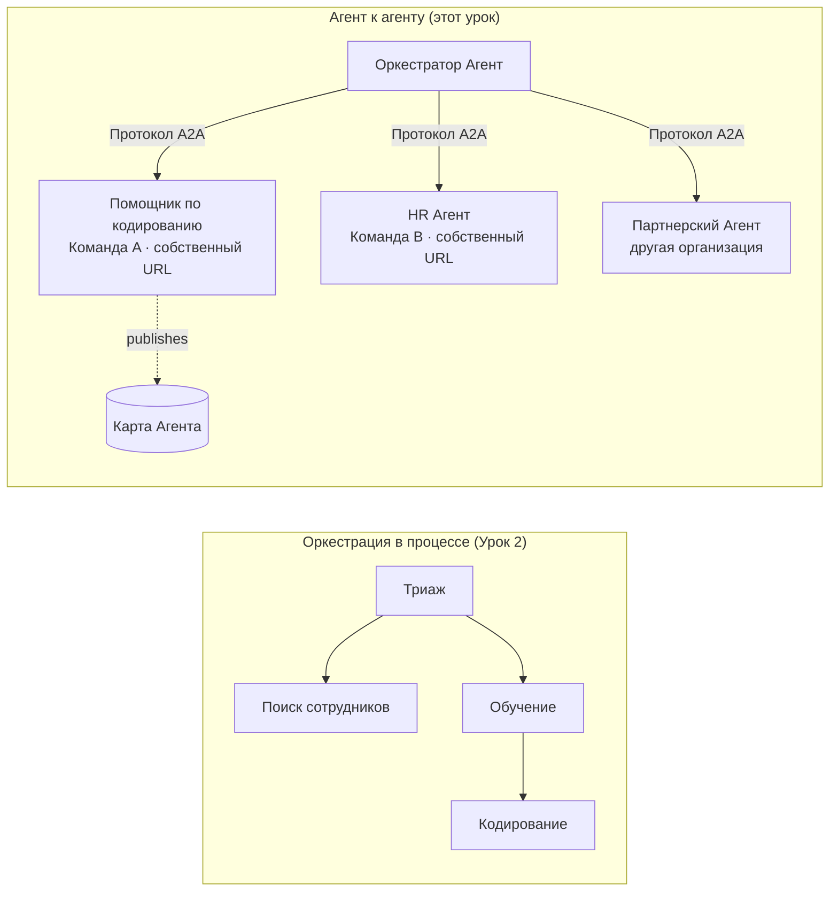

# Урок 7: Мультиагентная оркестрация и агент-к-агенту (A2A)

По [Уроку 6](../lesson-6-toolbox/README.md) вы можете создавать управляемые инструменты и размещённых агентов.
Но в реальных системах редко используется **один** агент. По мере масштабирования вы собираете вместе **множество** агентов — некоторые ваши,
некоторые принадлежат другим командам, некоторые работают в совершенно других организациях. Этот урок посвящён тому, 
как агенты работают **вместе**.

Вы уже встречали одну форму мультиагентного дизайна в
[уроке 2 в `agent-orchestration.py`](../lesson-2-agent-development/README.md): паттерн **передачи управления**,
когда агент первичной сортировки направляет задачи специалистам **внутри одного процесса**. Этот урок поднимается на
следующий уровень — до **агент-агент (A2A)**, открытого протокола для агентов, которые работают как независимые
**сетевые сервисы** и вызывают друг друга через границы процессов, команд и организаций.

## Цели обучения

К концу этого урока вы сможете:

- Объяснить разницу между **оркестрацией в процессе** (передача/рабочие процессы) и
  коммуникацией **агент-агент (A2A)**, и выбрать подходящий вариант.
- Описать строительные блоки A2A: **Карточка агента**, **навыки**, **задачи** и **обнаружение**.
- **Опубликовать** агента Microsoft Agent Framework как сервис A2A с помощью `A2AExecutor`.
- **Использовать** удалённого агента как сетевого партнёра с помощью `A2AAgent`.
- Применить корпоративные аспекты к A2A: **безопасность, идентификацию, управление, наблюдаемость и затраты**.

---

## Предварительные условия

1. Завершён [Урок 2](../lesson-2-agent-development/README.md) (разработка и оркестрация агентов).
2. Проект **Microsoft Foundry** с текущим развертыванием модели (например, `gpt-5.1` и
   `gpt-5-codex` для примера кодирования). Избегайте устаревших GPT-4o / GPT-4.1.
3. Аутентификация через **Azure CLI**: `az login`.
4. **Python 3.12+** с установленными зависимостями курса (`pip install -r ../requirements.txt`).
   Урок 7 добавляет предварительные пакеты `agent-framework-a2a`, `a2a-sdk` и `uvicorn`.
5. Переменные `FOUNDRY_PROJECT_ENDPOINT` и `FOUNDRY_MODEL` установлены в вашем `.env` (см. README курса).

---

## 1. Два способа взаимодействия агентов

Нет единого паттерна "мультиагент". Выберите тот, который соответствует вашим **границам**:

| Паттерн | Где работают агенты | Как они соединяются | Используйте когда |
|---------|--------------------|--------------------|------------------|
| **Передача / Workflow** (Урок 2) | Один процесс, одна кодовая база | Граф в памяти (`HandoffBuilder`, `WorkflowBuilder`) | Вы владеете всеми агентами и развертываете их вместе. |
| **Агент-агент (A2A)** (этот урок) | Раздельные сервисы, раздельные жизненные циклы | Открытый **протокол A2A** по HTTP, обнаружение через **Карточки агента** | Агенты принадлежат разным командам/организациям, масштабируются независимо или написаны на разных фреймворках. |

Передача — это про **маршрутизацию внутри приложения**. A2A — это про **композицию агентов как независимых сервисов** — аналог перехода от вызовов функций к микросервисам.




> **Они комбинируются.** Оркестратор, который вы создаёте с `HandoffBuilder`, может включать в себя **удалённых A2A агентов**
> как участников — маршрутизация в процессе к сервисам, которые сами могут работать где угодно.

---

## 2. Строительные блоки A2A

A2A — это **открытый протокол** (не специфика Microsoft), так что A2A-агента можно использовать через Microsoft
Agent Framework, LangGraph, кастомный код или стек другой компании. Важны четыре понятия:

- **Карточка агента** — небольшой JSON-документ, размещённый по адресу
  `/.well-known/agent-card.json`, который рекламирует **имя, описание, URL, версию, навыки и возможности** агента. Клиент
  с её помощью **обнаруживает**, что может делать удалённый агент.
- **Навыки** — заявленные возможности агента (`id`, `name`, `description`, `tags`,
  `examples`). Клиенты (и модели) используют их, чтобы решить, стоит ли вызывать агента.
- **Задачи** — вызов агента A2A — это **задача** с жизненным циклом (отправлена → выполняется →
  завершена/с ошибкой). Сервер отслеживает задачи в **хранилище задач**; поддерживается потоковое обновление.
- **Обнаружение** — клиент, зная только URL, получает Карточку агента и знает, как вызвать агента.

---

## 3. Открыть агента как сервис A2A — `a2a_server.py`

Сторона **Сборки/обслуживания** оборачивает любого агента Microsoft Agent Framework в `A2AExecutor` и монтирует его
на A2A HTTP-приложение. См. [`a2a_server.py`](../../../lesson-7-multi-agent-a2a/a2a_server.py). Ключевая связка:

```python
from agent_framework.a2a import A2AExecutor
from a2a.server.apps import A2AStarletteApplication
from a2a.server.request_handlers import DefaultRequestHandler
from a2a.server.tasks import InMemoryTaskStore
from a2a.types import AgentCapabilities, AgentCard, AgentSkill

agent = client.as_agent(name="coding-assistant", instructions="...")

agent_card = AgentCard(
    name="Coding Assistant",
    description="Generates runnable code samples...",
    url="http://localhost:9000/",
    version="1.0.0",
    capabilities=AgentCapabilities(streaming=True),
    default_input_modes=["text"],
    default_output_modes=["text"],
    skills=[AgentSkill(id="generate-code", name="Generate code",
                       description="Write a runnable code snippet.", tags=["code"])],
)

request_handler = DefaultRequestHandler(
    agent_executor=A2AExecutor(agent),
    task_store=InMemoryTaskStore(),
)
app = A2AStarletteApplication(agent_card=agent_card, http_handler=request_handler).build()
# обслуживается с помощью uvicorn на порту 9000
```

Обратите внимание, что код агента **не изменён** — `A2AExecutor` адаптирует вашего существующего агента под протокол.
Карточка агента делает агента **обнаруживаемым** для любого A2A клиента.

---

## 4. Использовать удалённого агента — `a2a_client.py`

Сторона **Потребления** подключается к удалённому агенту **по URL**, получает его Карточку агента и вызывает его
так же, как локального агента. См. [`a2a_client.py`](../../../lesson-7-multi-agent-a2a/a2a_client.py):

```python
from agent_framework.a2a import A2AAgent

remote_agent = A2AAgent(name="remote-coding-assistant", url="http://localhost:9000")
result = await remote_agent.run("Write a Python function that reverses a string.")
print(result.text)
```

В этом вся суть A2A: с точки зрения вызывающего удалённый агент ведёт себя как любой другой агент из `agent_framework`,
так что вы можете встроить его в рабочий процесс или передать ему управление — даже если он работает
в другом процессе, на другой машине, и принадлежит другой команде.

### Запустите полностью

```bash
# Терминал 1 — запуск службы A2A
python a2a_server.py

# Терминал 2 — вызов службы
python a2a_client.py "Write a Python function that reverses a string."
```

Вы увидите ответ помощника по программированию через протокол A2A. Откройте
`http://localhost:9000/.well-known/agent-card.json` в браузере, чтобы увидеть опубликованную Карточку агента.

---

## 5. Корпоративные аспекты

Превращение агентов в сетевые сервисы влечёт за собой те же проблемы, что и любая распределённая система —
плюс несколько специфичных для ИИ:

- **Идентификация и аутентификация.** Никогда не открывайте A2A агента без аутентификации. Карточка агента содержит
  `security` / `security_schemes`, а `A2AAgent` принимает `auth_interceptor`, чтобы вызывающие стороны могли передавать
  учётные данные (OAuth токены, API ключи). Используйте Entra ID / управляемые идентичности для
  аутентификации между сервисами в продакшене; поместите сервис за шлюзом.
- **Управление.** Комбинируйте A2A с [ящиком инструментов из Урока 6](../lesson-6-toolbox/README.md): удалённый
  агент можно публиковать как **инструмент A2A** внутри управляемого набора инструментов, чтобы RBAC, инъекция учётных данных
  и политики безопасности применялись централизованно.
- **Наблюдаемость.** Запрос теперь пересекает границы процессов, поэтому проксируйте трассировку по вызову.
  Включите [Foundry Observability / OpenTelemetry](../lesson-3-agent-evals/README.md) и на
  стороне оркестратора, и на каждом удалённом агенте, чтобы получить сквозную трассировку.
- **Версионирование.** Карточка агента имеет поле `version`. Относитесь к ней как к API: добавочные изменения безопасны;
  изменения, нарушающие контракт навыка, требуют новой версии и окна миграции для клиентов.
- **Надёжность.** Удалённые агенты могут падать независимо. Устанавливайте тайм-ауты (`A2AAgent(timeout=...)`), обрабатывайте
  частичные ошибки и не позволяйте одному медленному партнёру блокировать весь оркестратор.
- **Затраты.** Каждый вызов удалённого агента — это отдельное обращение к модели. Распараллеливание увеличивает расход токенов —
  планируйте бюджет и отдавайте предпочтение маршрутизации к **одному** лучшему агенту, а не широковещательной рассылке.

---

## Практические задания

1. **Добавьте второй сервис.** Скопируйте `a2a_server.py`, чтобы открыть агента **employee-search** на порту
   9001 с собственной Карточкой агента и навыками. Запустите оба сервиса и вызовите каждого клиента.
2. **Оркестрируйте удалённых партнёров.** Постройте небольшой `HandoffBuilder` (или простой маршрутизатор) с участниками,
   включающими двух `A2AAgent`, указывающих на ваши два сервиса. Направляйте запрос к нужному.
3. **Обезопасьте.** Добавьте `auth_interceptor` на клиенте и требуйте токен на сервере.
   Что ломается, если токен отсутствует? Где бы вы хранили токен в продакшене?
4. **Передача vs A2A.** Напишите два коротких абзаца: когда вы бы использовали внутренняя передача из урока 2,
   а когда оправдана дополнительная сложность A2A? Приведите конкретный пример каждого.

---

## Ресурсы

- [Agent-to-Agent (A2A) — Microsoft Agent Framework](https://learn.microsoft.com/agent-framework/user-guide/agent-orchestration/a2a)
- [Мультиагентная оркестрация — Microsoft Agent Framework](https://learn.microsoft.com/agent-framework/user-guide/agent-orchestration/)
- [Спецификация протокола A2A](https://a2a-protocol.org/)
- [A2A Python SDK (`a2a-sdk`)](https://github.com/a2aproject/a2a-python)
- [Foundry Agent Service — мультиагентные паттерны](https://learn.microsoft.com/azure/ai-foundry/agents/concepts/connected-agents)

---

**Предыдущий:** [Урок 6 — Microsoft Toolbox](../lesson-6-toolbox/README.md)

---

<!-- CO-OP TRANSLATOR DISCLAIMER START -->
**Отказ от ответственности**:
Этот документ был переведен с использованием сервиса машинного перевода [Co-op Translator](https://github.com/Azure/co-op-translator). Несмотря на наши усилия по обеспечению точности, имейте в виду, что автоматический перевод может содержать ошибки или неточности. Оригинальный документ на его исходном языке следует считать авторитетным источником. Для получения критически важной информации рекомендуется обратиться к профессиональному человеческому переводу. Мы не несем ответственности за любые недоразумения или неправильные толкования, возникшие в результате использования этого перевода.
<!-- CO-OP TRANSLATOR DISCLAIMER END -->