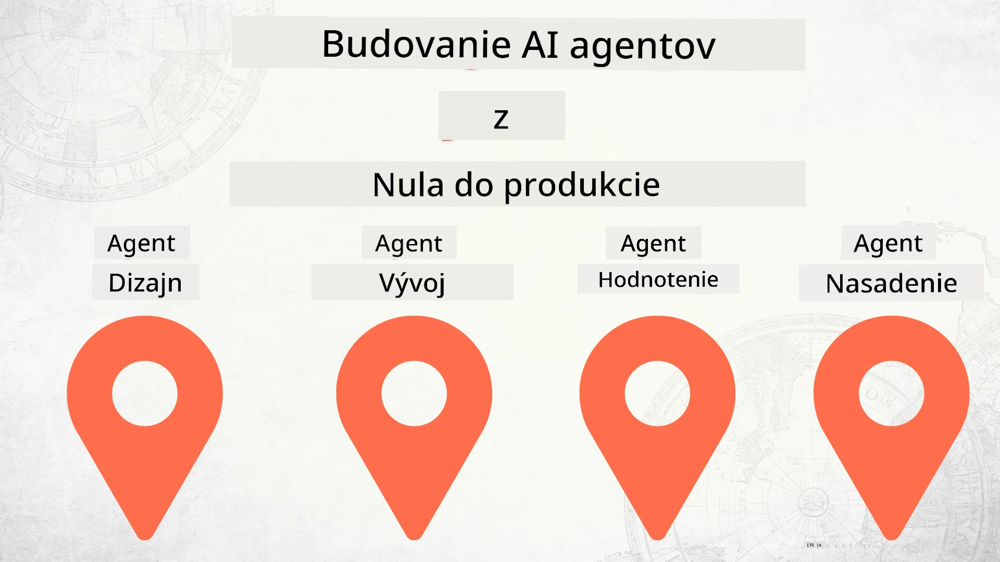

# Budovanie AI agentov od nuly po produkciu



### 🌐 Podpora viacerých jazykov

#### Podporované cez GitHub Action (automatizované a vždy aktuálne)

<!-- CO-OP TRANSLATOR LANGUAGES TABLE START -->
[Arabčina](../ar/README.md) | [Bengálčina](../bn/README.md) | [Bulharčina](../bg/README.md) | [Barmský (Myanmar)](../my/README.md) | [Čínština (zjednodušená)](../zh-CN/README.md) | [Čínština (tradičná, Hong Kong)](../zh-HK/README.md) | [Čínština (tradičná, Macao)](../zh-MO/README.md) | [Čínština (tradičná, Taiwan)](../zh-TW/README.md) | [Chorvátčina](../hr/README.md) | [Čeština](../cs/README.md) | [Dánčina](../da/README.md) | [Holandčina](../nl/README.md) | [Estónčina](../et/README.md) | [Fínčina](../fi/README.md) | [Francúzština](../fr/README.md) | [Nemčina](../de/README.md) | [Gréčtina](../el/README.md) | [Hebrejčina](../he/README.md) | [Hindi](../hi/README.md) | [Maďarčina](../hu/README.md) | [Indonézština](../id/README.md) | [Taliančina](../it/README.md) | [Japončina](../ja/README.md) | [Kannadčina](../kn/README.md) | [Kórejčina](../ko/README.md) | [Litinčina](../lt/README.md) | [Malajčina](../ms/README.md) | [Malayalam](../ml/README.md) | [Maráthčina](../mr/README.md) | [Nepálčina](../ne/README.md) | [Nigerijský pidžin](../pcm/README.md) | [Nórčina](../no/README.md) | [Perzština (Farsi)](../fa/README.md) | [Poľština](../pl/README.md) | [Portugalčina (Brazília)](../pt-BR/README.md) | [Portugalčina (Portugalsko)](../pt-PT/README.md) | [Pandžábčina (Gurmukhi)](../pa/README.md) | [Rumunčina](../ro/README.md) | [Ruština](../ru/README.md) | [Srbčina (Cyrilika)](../sr/README.md) | [Slovenčina](./README.md) | [Slovinčina](../sl/README.md) | [Španielčina](../es/README.md) | [Svahilčina](../sw/README.md) | [Švédčina](../sv/README.md) | [Tagalog (Filipínčina)](../tl/README.md) | [Tamil](../ta/README.md) | [Telugu](../te/README.md) | [Thajčina](../th/README.md) | [Turečtina](../tr/README.md) | [Ukrajinčina](../uk/README.md) | [Urdu](../ur/README.md) | [Vietnamčina](../vi/README.md)

> **Radšej klonovať lokálne?**

> Tento repozitár obsahuje viac ako 50 prekladov jazykov, čo výrazne zväčšuje veľkosť na stiahnutie. Ak chcete klonovať bez prekladov, použite sparse checkout:
> ```bash
> git clone --filter=blob:none --sparse https://github.com/microsoft/Building-AI-Agents-From-Zero-To-Production.git
> cd Building-AI-Agents-From-Zero-To-Production
> git sparse-checkout set --no-cone '/*' '!translations' '!translated_images'
> ```
> Toto vám poskytne všetko, čo potrebujete na dokončenie kurzu, a zároveň rýchlejšie stiahnutie.
<!-- CO-OP TRANSLATOR LANGUAGES TABLE END -->

## Kurz, ktorý vás naučí základy vývoja AI agentov

[](https://github.com/microsoft/Building-AI-Agents-From-Zero-To-Production/blob/master/LICENSE?WT.mc_id=academic-105485-koreyst)
[](https://GitHub.com/microsoft/Building-AI-Agents-From-Zero-To-Production/graphs/contributors/?WT.mc_id=academic-105485-koreyst)
[](https://GitHub.com/microsoft/Building-AI-Agents-From-Zero-To-Production/issues/?WT.mc_id=academic-105485-koreyst)
[](https://GitHub.com/microsoft/Building-AI-Agents-From-Zero-To-Production/pulls/?WT.mc_id=academic-105485-koreyst)
[](http://makeapullrequest.com?WT.mc_id=academic-105485-koreyst)

[](https://discord.gg/Kuaw3ktsu6)

## 🌱 Začíname

Tento kurz obsahuje lekcie pokrývajúce základy budovania a nasadzovania AI agentov.

Každá lekcia nadväzuje na predchádzajúcu, preto odporúčame začať od začiatku a prechádzať až na koniec.

Ak chcete objavovať viac tém o AI agentoch, môžete si pozrieť [Kurz AI agentov pre začiatočníkov](https://aka.ms/ai-agents-beginners).

### Spoznajte iných študentov, získajte odpovede na vaše otázky

Ak sa zaseknete alebo máte otázky o budovaní AI agentov, pridajte sa do nášho špecializovaného Discord kanála v [Microsoft Foundry Discord](https://discord.gg/Kuaw3ktsu6).

### Čo potrebujete

Každá lekcia má vlastný ukážkový kód, ktorý môžete spustiť lokálne. Môžete si [forknúť tento repozitár](https://github.com/microsoft/Building-AI-Agents-From-Zero-To-Production/fork) a vytvoriť si tak vlastnú kópiu.

Tento kurz momentálne používa:

- [Microsoft Agent Framework (MAF)](https://aka.ms/ai-agents-beginners/agent-framework)
- [Microsoft Foundry](https://azure.microsoft.com/products/ai-foundry)
- [Azure OpenAI Service](https://azure.microsoft.com/products/ai-foundry/models/openai)
- [Azure CLI](https://learn.microsoft.com/cli/azure/authenticate-azure-cli?view=azure-cli-latest)

Pred začatím sa, prosím, uistite, že máte prístup k týmto službám.

Čoskoro pribudnú ďalšie možnosti ohľadom hostovania modelu a služieb. 

## 🗃️ Lekcie

| **Lekcia**            | **Popis**                                                                                        |
|-----------------------|------------------------------------------------------------------------------------------------|
| [Návrh agenta](./lesson-1-agent-design/README.md)            | Úvod do nášho prípadu použitia "Developer Onboarding" a ako navrhovať efektívnych agentov     |
| [Vývoj agenta](./lesson-2-agent-development/README.md)       | Pomocou Microsoft Agent Framework (MAF) vytvorte 3 agentov na podporu nových vývojárov.        |
| [Hodnotenie agentov](./lesson-3-agent-evals/README.md)       | Pomocou Microsoft Foundry zistite, ako dobre si naše AI agenti vedú a ako ich zlepšiť.        |
| [Nasadenie agenta](./lesson-4-agent-deployment/README.md)    | S využitím Hosted Agents a OpenAI Chatkit uvidíte, ako nasadiť AI agenta do produkcie.       |


## 🎒 Iné kurzy

Náš tím produkuje aj ďalšie kurzy! Pozrite si:

<!-- CO-OP TRANSLATOR OTHER COURSES START -->
### LangChain
[](https://aka.ms/langchain4j-for-beginners)
[](https://aka.ms/langchainjs-for-beginners?WT.mc_id=m365-94501-dwahlin)

---

### Azure / Edge / MCP / Agenti
[](https://github.com/microsoft/AZD-for-beginners?WT.mc_id=academic-105485-koreyst)
[](https://github.com/microsoft/edgeai-for-beginners?WT.mc_id=academic-105485-koreyst)
[](https://github.com/microsoft/mcp-for-beginners?WT.mc_id=academic-105485-koreyst)
[](https://github.com/microsoft/ai-agents-for-beginners?WT.mc_id=academic-105485-koreyst)

---
 
### Generatívna AI séria
[](https://github.com/microsoft/generative-ai-for-beginners?WT.mc_id=academic-105485-koreyst)
[-9333EA?style=for-the-badge&labelColor=E5E7EB&color=9333EA)](https://github.com/microsoft/Generative-AI-for-beginners-dotnet?WT.mc_id=academic-105485-koreyst)
[-C084FC?style=for-the-badge&labelColor=E5E7EB&color=C084FC)](https://github.com/microsoft/generative-ai-for-beginners-java?WT.mc_id=academic-105485-koreyst)
[-E879F9?style=for-the-badge&labelColor=E5E7EB&color=E879F9)](https://github.com/microsoft/generative-ai-with-javascript?WT.mc_id=academic-105485-koreyst)

---
 
### Základné vzdelávanie
[](https://aka.ms/ml-beginners?WT.mc_id=academic-105485-koreyst)
[](https://aka.ms/datascience-beginners?WT.mc_id=academic-105485-koreyst)
[](https://aka.ms/ai-beginners?WT.mc_id=academic-105485-koreyst)
[](https://github.com/microsoft/Security-101?WT.mc_id=academic-96948-sayoung)
[](https://aka.ms/webdev-beginners?WT.mc_id=academic-105485-koreyst)
[](https://aka.ms/iot-beginners?WT.mc_id=academic-105485-koreyst)
[](https://github.com/microsoft/xr-development-for-beginners?WT.mc_id=academic-105485-koreyst)

---
 
### Séria Copilot
[](https://aka.ms/GitHubCopilotAI?WT.mc_id=academic-105485-koreyst)
[](https://github.com/microsoft/mastering-github-copilot-for-dotnet-csharp-developers?WT.mc_id=academic-105485-koreyst)
[](https://github.com/microsoft/CopilotAdventures?WT.mc_id=academic-105485-koreyst)
<!-- CO-OP TRANSLATOR OTHER COURSES END -->

## Prispievanie

Tento projekt vítá príspevky a návrhy. Väčšina príspevkov vyžaduje, aby ste súhlasili s
Dohodou o licencii prispievateľa (CLA), v ktorej deklarujete, že máte právo a skutočne
poskytujete nám práva na používanie vášho príspevku. Pre podrobnosti navštívte <https://cla.opensource.microsoft.com>.

Keď odošlete pull request, bot CLA automaticky zistí, či musíte poskytnúť
CLA a príslušne označí PR (napr. kontrola stavu, komentár). Jednoducho postupujte podľa pokynov
poskytnutých botom. Tento krok budete musieť vykonať iba raz pre všetky repozitáre využívajúce našu CLA.

Tento projekt prijal [Kodex správania sa pri otvorenom zdroji Microsoftu](https://opensource.microsoft.com/codeofconduct/).
Viac informácií nájdete v [Často kladené otázky o Kodexe správania](https://opensource.microsoft.com/codeofconduct/faq/) alebo
kontaktujte [opencode@microsoft.com](mailto:opencode@microsoft.com) s ďalšími otázkami alebo pripomienkami.

## Ochranné známky

Tento projekt môže obsahovať ochrané známky alebo logá projektov, produktov alebo služieb.
Autorizované použitie ochranných známok alebo log Microsoftu podlieha a musí dodržiavať
[Pokyny Microsoftu pre ochranné známky a značky](https://www.microsoft.com/legal/intellectualproperty/trademarks/usage/general).
Použitie ochranných známok alebo log Microsoftu v upravených verziách tohto projektu nesmie spôsobovať zmätok ani naznačovať podporu Microsoftu.
Akékoľvek použitie ochranných známok alebo log tretích strán podlieha pravidlám týchto tretích strán.

## Získanie pomoci

Ak sa zaseknete alebo máte otázky ohľadom tvorby AI aplikácií, pripojte sa:

[](https://discord.gg/Kuaw3ktsu6)

Ak máte spätnú väzbu k produktu alebo chyby počas vývoja, navštívte:

[](https://aka.ms/foundry/forum)

---

<!-- CO-OP TRANSLATOR DISCLAIMER START -->
**Vyhlásenie o zodpovednosti**:
Tento dokument bol preložený pomocou AI prekladateľskej služby [Co-op Translator](https://github.com/Azure/co-op-translator). Hoci sa snažíme o presnosť, berte prosím na vedomie, že automatizované preklady môžu obsahovať chyby alebo nepresnosti. Pôvodný dokument v jeho rodnom jazyku by mal byť považovaný za autoritatívny zdroj. Pre kritické informácie sa odporúča profesionálny ľudský preklad. Nie sme zodpovední za žiadne nedorozumenia alebo nesprávne výklady vyplývajúce z použitia tohto prekladu.
<!-- CO-OP TRANSLATOR DISCLAIMER END -->