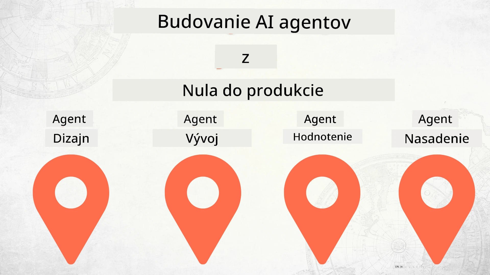

# Budovanie AI agentov od začiatku až do produkcie



### 🌐 Podpora viacerých jazykov

#### Podporované cez GitHub Action (automatizované a vždy aktuálne)

<!-- CO-OP TRANSLATOR LANGUAGES TABLE START -->
[Arabic](../ar/README.md) | [Bengali](../bn/README.md) | [Bulgarian](../bg/README.md) | [Burmese (Myanmar)](../my/README.md) | [Chinese (Simplified)](../zh-CN/README.md) | [Chinese (Traditional, Hong Kong)](../zh-HK/README.md) | [Chinese (Traditional, Macau)](../zh-MO/README.md) | [Chinese (Traditional, Taiwan)](../zh-TW/README.md) | [Croatian](../hr/README.md) | [Czech](../cs/README.md) | [Danish](../da/README.md) | [Dutch](../nl/README.md) | [Estonian](../et/README.md) | [Finnish](../fi/README.md) | [French](../fr/README.md) | [German](../de/README.md) | [Greek](../el/README.md) | [Hebrew](../he/README.md) | [Hindi](../hi/README.md) | [Hungarian](../hu/README.md) | [Indonesian](../id/README.md) | [Italian](../it/README.md) | [Japanese](../ja/README.md) | [Kannada](../kn/README.md) | [Khmer](../km/README.md) | [Korean](../ko/README.md) | [Lithuanian](../lt/README.md) | [Malay](../ms/README.md) | [Malayalam](../ml/README.md) | [Marathi](../mr/README.md) | [Nepali](../ne/README.md) | [Nigerian Pidgin](../pcm/README.md) | [Norwegian](../no/README.md) | [Persian (Farsi)](../fa/README.md) | [Polish](../pl/README.md) | [Portuguese (Brazil)](../pt-BR/README.md) | [Portuguese (Portugal)](../pt-PT/README.md) | [Punjabi (Gurmukhi)](../pa/README.md) | [Romanian](../ro/README.md) | [Russian](../ru/README.md) | [Serbian (Cyrillic)](../sr/README.md) | [Slovak](./README.md) | [Slovenian](../sl/README.md) | [Spanish](../es/README.md) | [Swahili](../sw/README.md) | [Swedish](../sv/README.md) | [Tagalog (Filipino)](../tl/README.md) | [Tamil](../ta/README.md) | [Telugu](../te/README.md) | [Thai](../th/README.md) | [Turkish](../tr/README.md) | [Ukrainian](../uk/README.md) | [Urdu](../ur/README.md) | [Vietnamese](../vi/README.md)

> **Preferujete klonovanie lokálne?**
>
> Tento repozitár obsahuje viac ako 50 prekladov jazykov, čo výrazne zvyšuje veľkosť sťahovania. Ak chcete klonovať bez prekladov, použite sparse checkout:
>
> **Bash / macOS / Linux:**
> ```bash
> git clone --filter=blob:none --sparse https://github.com/microsoft/Building-AI-Agents-From-Zero-To-Production.git
> cd Building-AI-Agents-From-Zero-To-Production
> git sparse-checkout set --no-cone '/*' '!translations' '!translated_images'
> ```
>
> **CMD (Windows):**
> ```cmd
> git clone --filter=blob:none --sparse https://github.com/microsoft/Building-AI-Agents-From-Zero-To-Production.git
> cd Building-AI-Agents-From-Zero-To-Production
> git sparse-checkout set --no-cone "/*" "!translations" "!translated_images"
> ```
>
> Toto vám poskytne všetko, čo potrebujete na dokončenie kurzu s oveľa rýchlejším stiahnutím.
<!-- CO-OP TRANSLATOR LANGUAGES TABLE END -->

## Kurz, ktorý vás naučí základy životného cyklu vývoja AI agentov

[](https://github.com/microsoft/Building-AI-Agents-From-Zero-To-Production/blob/master/LICENSE?WT.mc_id=academic-105485-koreyst)
[](https://GitHub.com/microsoft/Building-AI-Agents-From-Zero-To-Production/graphs/contributors/?WT.mc_id=academic-105485-koreyst)
[](https://GitHub.com/microsoft/Building-AI-Agents-From-Zero-To-Production/issues/?WT.mc_id=academic-105485-koreyst)
[](https://GitHub.com/microsoft/Building-AI-Agents-From-Zero-To-Production/pulls/?WT.mc_id=academic-105485-koreyst)
[](http://makeapullrequest.com?WT.mc_id=academic-105485-koreyst)

[](https://discord.gg/Kuaw3ktsu6)

## 🌱 Začíname

Tento kurz obsahuje lekcie pokrývajúce základy budovania a nasadzovania AI agentov.

Každá lekcia nadväzuje na predchádzajúcu, preto odporúčame začať od začiatku a postupne prejsť až na koniec.

Ak chcete bližšie preskúmať témy AI agentov, môžete si pozrieť [Kurz AI agentov pre začiatočníkov](https://aka.ms/ai-agents-beginners).

### Spojte sa s inými študentmi, získajte odpovede na svoje otázky

Ak sa zaseknete alebo máte otázky ohľadom budovania AI agentov, pripojte sa k nášmu špeciálnemu Discord kanálu v [Microsoft Foundry Discord](https://discord.gg/Kuaw3ktsu6).

### Čo potrebujete


Každá lekcia má vlastný príklad kódu, ktorý si môžete spustiť lokálne. Môžete [forknúť tento repozitár](https://github.com/microsoft/Building-AI-Agents-From-Zero-To-Production/fork), aby ste si vytvorili vlastnú kópiu.

Tento kurz aktuálne používa nasledujúce:

- [Microsoft Agent Framework (MAF)](https://aka.ms/ai-agents-beginners/agent-framework)
- [Microsoft Foundry](https://azure.microsoft.com/products/ai-foundry) — projekt s nasadeným modelom **GPT-5 série** (napríklad `gpt-5.1`). Nepoužívajte **nezaradené** modely GPT-4o / GPT-4.1.
- [Azure OpenAI Service](https://azure.microsoft.com/products/ai-foundry/models/openai)
- [Azure CLI](https://learn.microsoft.com/cli/azure/authenticate-azure-cli?view=azure-cli-latest) — prihláste sa pomocou `az login` pred spustením akéhokoľvek príkladu
- **Python 3.12 alebo novší**

Prosím, uistite sa, že máte prístup k týmto službám pred začatím.

> **💰 Náklady a upratovanie.** Praktické lekcie vytvárajú reálne Azure zdroje — projekt Microsoft Foundry,
> nasadenie modelu, vektorové úložisko a (v Lekciách 4–6) hosťované agentov a nástroje.
> Tieto môžu počas existencie generovať náklady. Po dokončení lekcie — alebo celého kurzu — vymažte
> zdroje, ktoré už nepotrebujete. Najjednoduchšie je vložiť všetko do dedikovanej skupiny zdrojov
> a vymazať celú skupinu, keď skončíte:
>
> ```bash
> az group delete --name <your-resource-group> --yes --no-wait
> ```
>
> Môžete tiež vymazať jednotlivých agentov, vektorové úložiská a nástroje z portálu Foundry.

> **Poznámka ku modelom.** Tento kurz poskytuje všetky modely prostredníctvom **Microsoft Foundry**. Nepoužíva
> *GitHub Models*, ktoré budú ukončené **30. júla 2026** — Microsoft Foundry je
> oficiálnou migračnou cestou. Ak máte starší kód, ktorý volá GitHub Models, smerujte ho namiesto toho na
> nasadenie modelu Foundry.

Čoskoro prídu ďalšie možnosti ohľadom hostovania modelov a služieb.

## 🗃️ Lekcie

| **Lekcia**         | **Popis**                                                                                  |
|--------------------|--------------------------------------------------------------------------------------------------|
| [Návrh agenta](./lesson-1-agent-design/README.md)       | Úvod do nášho prípadu použitia "Onboarding vývojára" a ako navrhnúť efektívnych agentov  |
| [Vývoj agenta](./lesson-2-agent-development/README.md)  | Použitím Microsoft Agent Framework (MAF) vytvorte súbor špecializovaných agentov na pomoc novým vývojárom pri onboardingu.       |
| [Hodnotenia agentov](./lesson-3-agent-evals/README.md)  | Pomocou Microsoft Foundry zistite, ako dobre naše AI agenty fungujú a ako ich zlepšiť. |
| [Nasadenie agenta](./lesson-4-agentdeployment/README.md)   | Pomocou hosťovaných agentov Microsoft Foundry a OpenAI ChatKit uvidíte, ako nasadiť AI agenta do produkcie.       |
| [Hosťované agenti v produkcii](./lesson-5-hosted-agents-production/README.md)   | Preneste hosťovaného agenta do podnikovej produkcie: Hosťovaní agenti vs Hosting schopností, vlastné úložisko, pamäť a správa.       |

| [Microsoft Toolbox](./lesson-6-toolbox/README.md)   | Definujte nástroje raz a riadte ich centrálne: vytvorte toolbox, používajte ho z agenta cez jedno MCP rozhranie a bezpečne verzujte nástroje.       |
| [Multi-Agent & A2A](./lesson-7-multi-agent-a2a/README.md)   | Skladajte agentov ako sieťové služby: vystavte agenta cez otvorený protokol Agent-to-Agent (A2A) a používajte vzdialeného agenta ako rovnocenného partnera.       |


## 🎒 Ďalšie kurzy

Náš tím produkuje ďalšie kurzy! Pozrite si:

<!-- CO-OP TRANSLATOR OTHER COURSES START -->
### LangChain
[](https://aka.ms/langchain4j-for-beginners)
[](https://aka.ms/langchainjs-for-beginners?WT.mc_id=m365-94501-dwahlin)
[](https://github.com/microsoft/langchain-for-beginners?WT.mc_id=m365-94501-dwahlin)
---

### Azure / Edge / MCP / Agenti
[](https://github.com/microsoft/AZD-for-beginners?WT.mc_id=academic-105485-koreyst)
[](https://github.com/microsoft/edgeai-for-beginners?WT.mc_id=academic-105485-koreyst)
[](https://github.com/microsoft/mcp-for-beginners?WT.mc_id=academic-105485-koreyst)
[](https://github.com/microsoft/ai-agents-for-beginners?WT.mc_id=academic-105485-koreyst)

---
 
### Generatívna AI séria

[](https://github.com/microsoft/generative-ai-for-beginners?WT.mc_id=academic-105485-koreyst)
[-9333EA?style=for-the-badge&labelColor=E5E7EB&color=9333EA)](https://github.com/microsoft/Generative-AI-for-beginners-dotnet?WT.mc_id=academic-105485-koreyst)
[-C084FC?style=for-the-badge&labelColor=E5E7EB&color=C084FC)](https://github.com/microsoft/generative-ai-for-beginners-java?WT.mc_id=academic-105485-koreyst)
[-E879F9?style=for-the-badge&labelColor=E5E7EB&color=E879F9)](https://github.com/microsoft/generative-ai-with-javascript?WT.mc_id=academic-105485-koreyst)

---
 
### Základné učenie
[](https://aka.ms/ml-beginners?WT.mc_id=academic-105485-koreyst)
[](https://aka.ms/datascience-beginners?WT.mc_id=academic-105485-koreyst)
[](https://aka.ms/ai-beginners?WT.mc_id=academic-105485-koreyst)
[](https://github.com/microsoft/Security-101?WT.mc_id=academic-96948-sayoung)
[](https://aka.ms/webdev-beginners?WT.mc_id=academic-105485-koreyst)
[](https://aka.ms/iot-beginners?WT.mc_id=academic-105485-koreyst)
[](https://github.com/microsoft/xr-development-for-beginners?WT.mc_id=academic-105485-koreyst)

---
 
### Série Copilot
[](https://aka.ms/GitHubCopilotAI?WT.mc_id=academic-105485-koreyst)
[](https://github.com/microsoft/mastering-github-copilot-for-dotnet-csharp-developers?WT.mc_id=academic-105485-koreyst)
[](https://github.com/microsoft/CopilotAdventures?WT.mc_id=academic-105485-koreyst)
<!-- CO-OP TRANSLATOR OTHER COURSES END -->

## Prispievanie

Tento projekt vítá príspevky a návrhy. Väčšina príspevkov vyžaduje, aby ste súhlasili s
Zmluvou o licenciách prispievateľa (CLA), ktorá prehlasuje, že máte právo a skutočne nám udeľujete
práva na použitie vášho príspevku. Pre podrobnosti navštívte <https://cla.opensource.microsoft.com>.

Keď odošlete pull request, CLA bot automaticky vyhodnotí, či je potrebné poskytnúť CLA
a príslušne označí PR (napr. kontrola stavu, komentár). Jednoducho sledujte pokyny
poskytnuté botom. Toto musíte spraviť iba raz vo všetkých repozitároch používajúcich našu CLA.

Tento projekt prijal [Microsoft Open Source Code of Conduct](https://opensource.microsoft.com/codeofconduct/).
Pre viac informácií pozrite [FAQ k pravidlám správania](https://opensource.microsoft.com/codeofconduct/faq/) alebo
kontaktujte [opencode@microsoft.com](mailto:opencode@microsoft.com) s ďalšími otázkami či pripomienkami.

## Ochranné známky

Tento projekt môže obsahovať ochranné známky alebo logá projektov, produktov alebo služieb. Autorizované používanie
ochranných známok alebo log Microsoft je podmienené dodržaním
[Pravidiel používania ochranných známok a značiek Microsoft](https://www.microsoft.com/legal/intellectualproperty/trademarks/usage/general).
Použitie ochranných známok alebo log Microsoft v upravených verziách tohto projektu nesmie spôsobovať zmätok ani naznačovať sponzorstvo Microsoft.
Akékoľvek použitie ochranných známok alebo log tretích strán je podmienené pravidlami týchto tretích strán.

## Získanie pomoci

Ak sa zaseknete alebo máte otázky ohľadom tvorby AI aplikácií, pripojte sa:

[](https://discord.gg/Kuaw3ktsu6)

Ak máte spätnú väzbu k produktu alebo chyby pri tvorbe, navštívte:

[](https://aka.ms/foundry/forum)

---

<!-- CO-OP TRANSLATOR DISCLAIMER START -->
**Vyhlásenie o zodpovednosti**:
Tento dokument bol preložený pomocou AI prekladateľskej služby [Co-op Translator](https://github.com/Azure/co-op-translator). Hoci sa snažíme o presnosť, vezmite prosím na vedomie, že automatické preklady môžu obsahovať chyby alebo nepresnosti. Pôvodný dokument v jeho natívnom jazyku by mal byť považovaný za autoritatívny zdroj. Pre kritické informácie sa odporúča profesionálny ľudský preklad. Nie sme zodpovední za žiadne nedorozumenia alebo nesprávne interpretácie vyplývajúce z použitia tohto prekladu.
<!-- CO-OP TRANSLATOR DISCLAIMER END -->