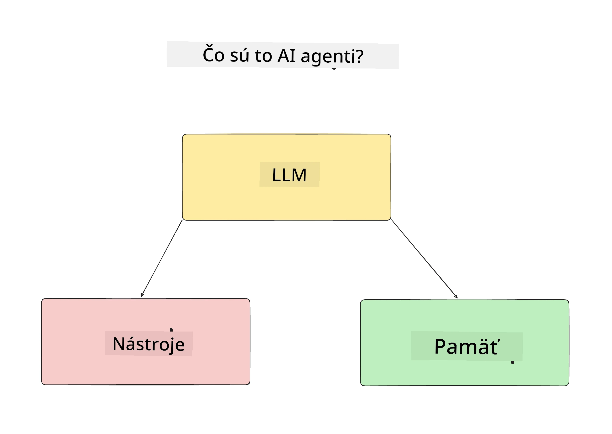
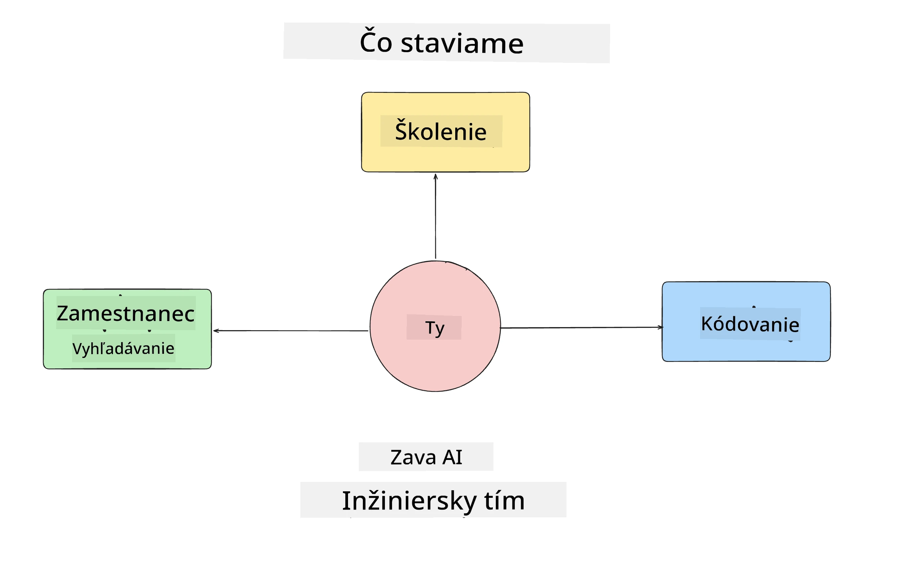
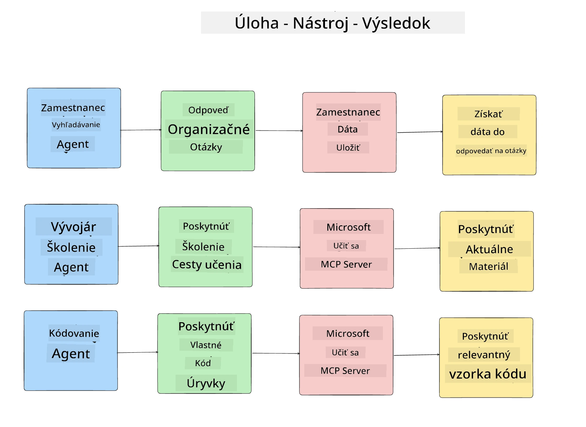
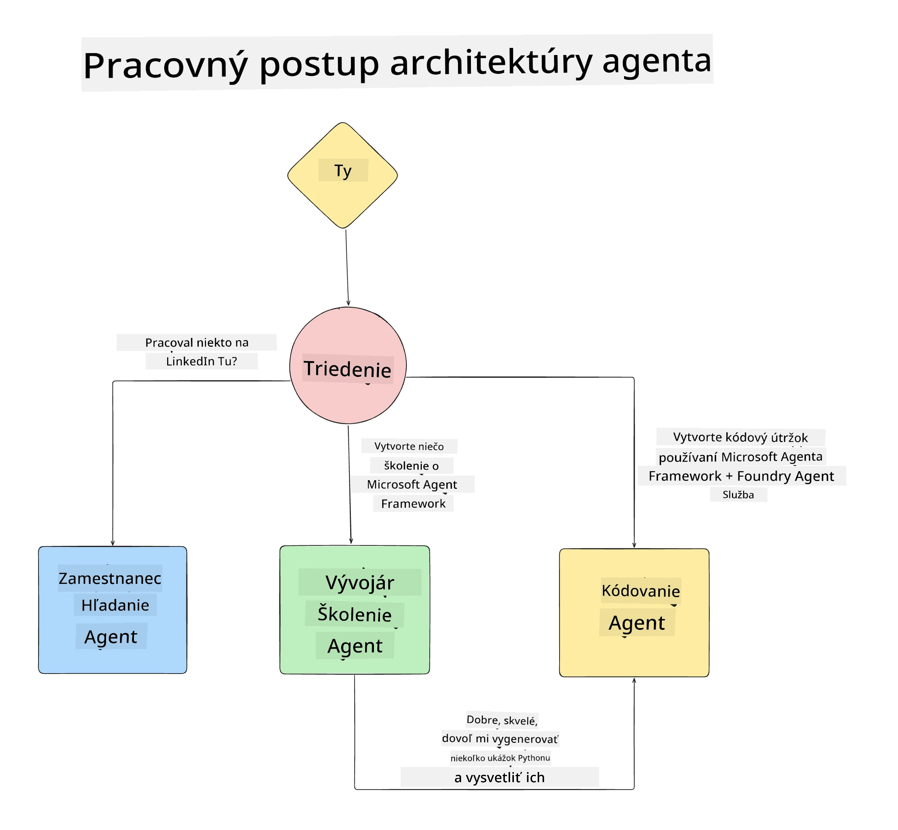

# Lekcia 1: Dizajn AI Agenta

Vitajte v prvej lekcii kurzu "Budovanie AI Agenta od Začiatočníka po Produkciu"!

V tejto lekcii pokryjeme:

- Definovanie, čo sú AI Agenti
  
- Diskusia o AI agentnej aplikácii, ktorú budujeme  

- Identifikácia potrebných nástrojov a služieb pre každého agenta
  
- Architektúra našej agentnej aplikácie
  
Začnime definovaním, čo je agent a prečo by sme ich používali v aplikácii.

> **Pred začatím kurzu.** Táto prvá lekcia je konceptuálna — nie je potrebné spúšťať žiadny kód.
> Od [Lekcie 2](../lesson-2-agent-development/README.md) budete potrebovať: **Azure
> predplatné** s prístupom k **Microsoft Foundry**, nasadený **model série GPT-5** (napríklad `gpt-5.1` — vyhnite sa ukončeným GPT-4o / GPT-4.1), **Python 3.12+** a **Azure CLI**
> (`az login`). Pozrite si [Čo potrebujete](../README.md#what-you-need) v README kurzu pre kompletný
> zoznam a odkazy.

## Čo sú to AI Agenti?

Ak skúmate, ako presne vytvoriť AI Agenta prvýkrát, môžete mať otázky, ako presne definovať, čo AI Agent je.

Jednoduchý spôsob, ako definovať AI Agenta je podľa komponentov, ktoré ho tvoria:

**Veľký jazykový model** - LLM umožní spracovávať prirodzený jazyk od používateľa, aby interpretoval úlohu, ktorú chce dokončiť, ako aj popisy nástrojov dostupných na jej vykonanie.

**Nástroje** - Toto budú funkcie, API, dátové úložiská a iné služby, ktoré môže LLM využiť na splnenie úloh požadovaných používateľom.

**Pamäť** - Toto je spôsob, akým uchovávame krátkodobé i dlhodobé interakcie medzi AI Agentom a používateľom. Ukladanie a získavanie týchto informácií je dôležité na zlepšovanie a uchovanie preferencií používateľa v čase.

## Náš Prípad Použitia AI Agenta

Pre tento kurz vytvoríme AI agentnú aplikáciu, ktorá pomôže novým vývojárom zorientovať sa v našom tíme vývoja AI agentov!

Predtým, než začneme vyvíjať, je prvým krokom k úspešnej AI agentnej aplikácii definovať jasné scenáre, ako očakávame, že naši používatelia budú pracovať s našimi AI agentmi.

Pre túto aplikáciu budeme pracovať s týmito scenármi:

**Scenár 1:** Nový zamestnanec sa pripojí do organizácie a chce zistiť viac o tíme, do ktorého sa pridal, a ako sa s ním spojiť.

**Scenár 2:** Nový zamestnanec chce vedieť, čo by bola najlepšia prvá úloha, na ktorej by mohol začať pracovať.

**Scenár 3:** Nový zamestnanec chce zhromaždiť vzdelávacie zdroje a ukážky kódu, ktoré mu pomôžu začať s touto úlohou.

## Identifikovanie Nástrojov a Služieb

Keď máme vytvorené tieto scenáre, ďalším krokom je namapovať ich na nástroje a služby, ktoré naši AI agenti budú potrebovať na splnenie týchto úloh.

Tento proces patrí do kategórie Kontextového Inžinierstva, pretože sa zameriavame na to, aby naši AI agenti mali správny kontext v správnom čase na vykonanie úloh.

Poďme na to scenár po scenári a vykonajme dobrý agentný dizajn tým, že vypíšeme každú úlohu agenta, nástroje a požadované výsledky.

### Scenár 1 - Agent na Vyhľadávanie Zamestnancov

**Úloha** - Odpovedať na otázky o zamestnancoch v organizácii, ako dátum nástupu, súčasný tím, umiestnenie a posledná pozícia.

**Nástroje** - Databáza aktuálneho zoznamu zamestnancov a organizačnej schémy

**Výsledky** - Schopný získavať informácie z databázy na odpovede na všeobecné otázky o organizácii a konkrétne otázky o zamestnancoch.

### Scenár 2 - Agent na Odporúčanie Úloh

**Úloha** - Na základe vývojárskych skúseností nového zamestnanca navrhnúť 1-3 problémy, na ktorých môže nový zamestnanec pracovať.

**Nástroje** - GitHub MCP Server na získanie otvorených problémov a vytváranie vývojárskeho profilu

**Výsledky** - Schopný prečítať posledných 5 commitov GitHub profilu a otvorené problémy na GitHub projekte a robiť odporúčania na základe zhody

### Scenár 3 - Agent Asistenta Kódu

**Úloha** - Na základe otvorených problémov, ktoré odporučil agent "Odporúčanie Úloh", vyhľadať zdroje a generovať ukážky kódu na pomoc zamestnancovi.

**Nástroje** - Microsoft Learn MCP na vyhľadanie zdrojov a Kódový Interpreter na generovanie vlastných ukážok kódu.

**Výsledky** - Ak používateľ žiada o ďalšiu pomoc, pracovný tok by mal použiť Learn MCP Server na poskytnutie odkazov a ukážok zdrojov a potom odovzdať agentovi Kódový Interpreter, aby vygeneroval malé ukážky kódu s vysvetleniami.

## Architektúra našej Agentnej Aplikácie

Teraz, keď sme definovali každého z našich agentov, vytvorme architektonický diagram, ktorý nám pomôže pochopiť, ako bude každý agent spolupracovať alebo pracovať samostatne v závislosti od úlohy:

## Ďalšie kroky

Teraz, keď sme navrhli každého agenta a náš agentný systém, poďme k ďalšej lekcii, kde vyvineme každého z týchto agentov!

---

<!-- CO-OP TRANSLATOR DISCLAIMER START -->
**Vyhlásenie o zodpovednosti**:
Tento dokument bol preložený pomocou AI prekladateľskej služby [Co-op Translator](https://github.com/Azure/co-op-translator). Hoci sa snažíme o presnosť, vezmite prosím na vedomie, že automatické preklady môžu obsahovať chyby alebo nepresnosti. Pôvodný dokument v jeho natívnom jazyku by mal byť považovaný za autoritatívny zdroj. Pre kritické informácie sa odporúča profesionálny ľudský preklad. Nie sme zodpovední za žiadne nedorozumenia alebo nesprávne interpretácie vyplývajúce z použitia tohto prekladu.
<!-- CO-OP TRANSLATOR DISCLAIMER END -->