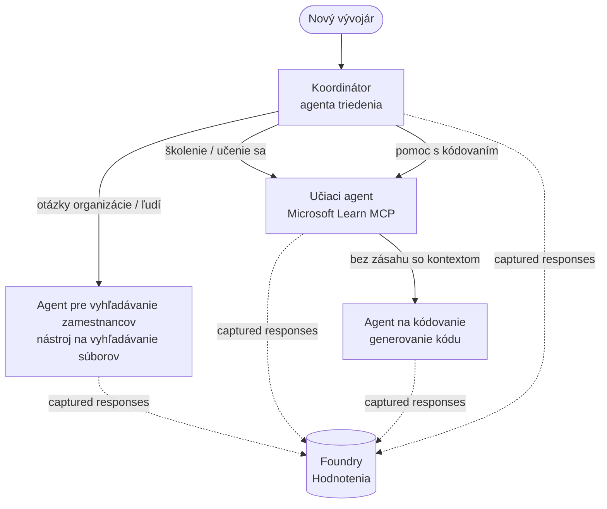

# Lekcia 3: Hodnotenie agentov s Microsoft Foundry

Vitajte pri tretej lekcii kurzu **"Budovanie AI agentov od nuly po produkciu"**!

V [Lekcii 2](../lesson-2-agent-development/README.md) ste stavali agentov. V tejto lekcii sa
naučíte odpovedať na oveľa ťažšiu otázku: **sú naozaj dobrí?** Poslať agenta, ktorý
beží, je jednoduché; vedieť, či správne smeruje, drží sa vášho zdrojového materiálu a správne používa
svoje nástroje, to je to, čo odlišuje demo od produkčného systému.

V tejto lekcii pokryjeme:

- Prečo je hodnotenie agentov dôležité a ako sa líši od tradičného testovania
- Rozdiel medzi **pozorovateľnosťou**, **smoke testami** a **hodnoteniami**
- Viac-agentný workflow, ktorý budeme merať
- Zabehnutí **Microsoft Foundry evaluátori** (relevantnosť, zakotvenie, presnosť volania nástrojov, využitie výstupu nástroja)
- Krok za krokom prehľad pipeline hodnotenia v [`agent-evals.py`](../../../lesson-3-agent-evals/agent-evals.py)
- Ako spustiť hodnotenie a čítať výsledky

---

## Prečo hodnotiť agentov?

Tradičný jednotkový test overuje, že `add(2, 2) == 4`. Agenti takto nefungujú — tá istá
výzva môže pri každom spustení vyprodukovať rozdielne znenie odpovede, nástroje môžu byť
volané v rôznom poradí a "správnosť" je často otázka stupňa, nie pravdivostnej hodnoty. Nemožno overiť


Namiesto toho hodnotíte agentov podľa **kvalitatívnych rozmerov** použitím modelovo založených *evaluátorov* (tiež


- Odpoveď skutočne adresovala otázku? (**relevantnosť**)
- Je odpoveď podložená získanými dátami, alebo agent halucinoval? (**zakotvenie**)
- Zavolal agent správny nástroj so správnymi argumentmi? (**presnosť volania nástroja**)


| Vrstva | Otázka, na ktorú odpovedá | Náklady | Kedy beží | Pokryté v |
|-------|-------------------------|---------|-----------|-----------|
| **Pozorovateľnosť / trasovanie** | *Čo agent urobil, krok za krokom?* | Zdarma (vždy zapnuté) | Neustále v produkcii | Táto lekcia |
| **Smoke testy** | *Je agent dostupný a sleduje základnú výzvu?* | Lacné, sekundy | Pri nasadení | [Lekcia 4](../lesson-4-agentdeployment/README.md#smoke-testing-the-hosted-agent-ci-gate) |


1. Dokončená [Lekcia 2](../lesson-2-agent-development/README.md) (agenti + vektorový obchod).
2. Projekt v **Microsoft Foundry**.
3. Overenie pomocou **Azure CLI**: `az login`.


   ```bash
   pip install -r ../requirements.txt
   ```


   | Premenná | Účel |
   |----------|-------|
   | `FOUNDRY_PROJECT_ENDPOINT` | Endpoint vášho projektu Foundry (`https://<account>.services.ai.azure.com/api/projects/<project>`). Číta ho `FoundryChatClient` agentov **a tiež** pomocník hodnotenia. |
   | `FOUNDRY_MODEL` | Nasadenie modelu, na ktorom **bežia agenti** (napr. `gpt-5.1`). |
   | `VECTOR_STORE_ID` | Vektorový obchod zamestnaneckého zoznamu vytvorený v Lekcii 2 |


> Agenti používajú `FoundryChatClient`, ktorý číta konfiguráciu z premenných s prefixom `FOUNDRY_`
> (`FOUNDRY_PROJECT_ENDPOINT`, `FOUNDRY_MODEL`). Cloudový pomocník hodnotenia
> používa SDK `azure-ai-projects` a ak nie je nastavený `AZURE_AI_PROJECT_ENDPOINT`,
> použije `FOUNDRY_PROJECT_ENDPOINT` — takže dve premenne `FOUNDRY_` stačia na
> spustenie celej lekcie.
>
> Evaluátori sú poháňaní modelom, takže `AZURE_AI_MODEL_DEPLOYMENT_NAME`
> určuje, ktoré nasadenie hodnotí — nemusí to byť ten istý model, aký používajú vaši


Na to, aby ste niečo hodnotili, ho musíte najprv spustiť. Táto lekcia znovu použije **Developer Onboarding**




Workflow je postavený pomocou orchestrácie **handoff** z Microsoft Agent Framework. Kľúčová
myšlienka hodnotenia je, že **každé kolo agenta je trvalo zaznamenané na serveri** a identifikované pomocou


[`agent-evals.py`](../../../lesson-3-agent-evals/agent-evals.py) implementuje šesťstupňovú pipeline. Tu je, čo každý krok robí


Workflow sa vykoná pomocou `run_stream(...)` a keď prúdia udalosti, kód zaznamenáva
`response_id` a `conversation_id` generované každým agentom. Trvalo uložené odpovede sú surovým
materiálom na hodnotenie — hodnotíte *skutočné* produkčné odpovede, nie znovu generované.

### Krok 2 — Zhrňte, čo bolo zachytené

Rýchly sumár vytlačí, koľko odpovedí každý agent vyprodukoval, aby ste mohli potvrdiť, že workflow
skutočne precvičil agentov, ktorých chcete hodnotiť.

### Krok 3 — Načítajte konečné odpovede

Pre každého agenta sa posledné `response_id` načíta cez OpenAI-kompatibilného klienta projektu
(`project_client.get_openai_client().responses.retrieve(...)`) a môžete si tak prezrieť
text, ktorý bude hodnotený.

### Krok 4 — Vytvorte hodnotenie

Hodnotenie sa vytvára pomocou štyroch **vstavaných Foundry evaluátorov**:

| Evaluátor | `evaluator_name` | Čo meria |
|----------|------------------|----------|
| Relevantnosť | `builtin.relevance` | Odpoveď adresuje požiadavku používateľa? |

| Zakotvenie | `builtin.groundedness` | Je odpoveď podporená získanými/dátovými nástrojmi (nie je vymyslená)? |
| Presnosť volania nástroja | `builtin.tool_call_accuracy` | Boli zavolané správne nástroje so správnymi argumentmi? |
| Využitie výstupu nástroja | `builtin.tool_output_utilization` | Skutočne agent využil výsledky nástroja vo svojej odpovedi? |

Každý hodnotiaci nástroj je inicializovaný s nasadením pomenovaným `AZURE_AI_MODEL_DEPLOYMENT_NAME`.

> **Prečo tieto štyri?** Relevantnosť a zakotvenie merajú *kvalitu odpovede*; dva nástroje
> hodnotiace nástroje merajú *agentné správanie* — časť, ktorú tradičné NLP metriky úplne vynechávajú. Pre
> systém s použitím nástrojov a viacerých agentov sú metriky nástrojov často miestom, kde sa skutočné regresie skrývajú.

### Krok 5 — Spustiť hodnotenie

Zachytené `response_id` sa predkladajú ako zdroj dát do `evals.runs.create(...)`. Služba prehrá každú uloženú odpoveď cez každý hodnotiaci nástroj.


### Krok 6 — Monitorovať a čítať výsledky

Kód opakovane kontroluje beh, kým nie je `dokončený` alebo `zlyhaný`, potom vytlačí počet výsledkov a
**`report_url`** — hlboký odkaz do portálu Foundry, kde môžete skontrolovať skóre pre jednotlivé metriky,
počty prešlo/neprešlo, a jednotlivé hodnotené odpovede.

---

## Spustiť to

```bash
cd lesson-3-agent-evals
python agent-evals.py
```

Predvolene hodnotí prvý ukážkový dotaz
(`"Som tu nový! Pracoval tu niekto v Microsofte?"`). Ďalšie dva viacnásobné zámerné ukážkové dotazy
sú zahrnuté v `run_evaluation_workflow()` — vymeňte premennú `query`, aby ste vyskúšali scenáre smerovania,
ktoré precvičujú viac agentov v jednom behu.

Očakávaný tok v konzole:

```
Step 1: Running Developer Onboarding Workflow
Step 2: Response Data Summary
Step 3: Fetching Agent Responses
Step 4: Creating Evaluation
Step 5: Running Evaluation
Step 6: Monitoring Evaluation
  Status: running ...
  Evaluation completed successfully
  Report URL: https://...   <-- open this in the Foundry portal
```

---

## Pozorovateľnosť a trasovanie

Hodnotenia vám povedia *aké dobré* boli odpovede; **pozorovateľnosť** vám hovorí, *čo sa stalo*,
aby sa odpovede vytvorili — každý prechod agenta, volanie nástroja, počet tokenov a latencia. V Microsoft Foundry,
behy agenta vytvárajú OpenTelemetry stopy, ktoré si môžete pozrieť v portáli, a Agent Framework ich môže
exportovať do Azure Monitor / Application Insights jediným volaním:

```python
from agent_framework.foundry import FoundryChatClient

client = FoundryChatClient()
client.configure_azure_monitor()   # exportovať stopy + metriky do Application Insights
```

Použite trasovanie na **ladenie** zlého hodnotiaceho skóre: keď zakotvenie klesne, stopa vám ukáže,
či nástroj na vyhľadávanie súborov nevrátil nič, alebo vrátil dáta, ktoré agent potom ignoroval (čo je
presne to, čo skóruje využitie výstupu nástroja).

---

## Od "behov" k "dobrým": ako to používať v praxi

- **Brána pred vydaním.** Spúšťajte hodnotenia na pevnej sade reprezentatívnych dotazov pred
  propagáciou nového promptu alebo modelu. Porovnajte skóre s predchádzajúcou verziou — považujte pokles za
  regresiu.
- **Nočný signál kvality.** Naplánujte hodnotenie na zachytenie odchýlok spôsobených dátami alebo zmenami
  závislostí.
- **Spárujte so smoke testami.** [Smoke test z Lekcie 4](../lesson-4-agentdeployment/README.md#smoke-testing-the-hosted-agent-ci-gate)
  je váš rýchly bránový test pre nasadenie; hodnotenia sú pomalšia, detailnejšia brána kvality. Spúšťajte lacný
  test pri každom zlúčení a drahý test podľa plánu alebo pred vydaním.

---

## Poznámka k modernizácii

Tento príklad sa migruje na aktuálnu Microsoft Agent Framework Foundry API povrch
(`agent_framework.foundry`). Ak aktualizujete kód, pozrite si zásady migrácie v koreňovom repozitári
[`MIGRATION-GUIDE.md`](../MIGRATION-GUIDE.md) pre overené importy a mapovania klientov pred/po (napríklad `AzureAIClient` -> `FoundryChatClient` a konštrukcia hostených nástrojov cez
`client.get_file_search_tool(...)` / `client.get_mcp_tool(...)`). Koncepty hodnotenia a vyššie uvedený šesťstupňový pipeline migráciou nie sú dotknuté.


---

## Zdroje

- [Hodnotenie generatívnych AI modelov a aplikácií (Microsoft Learn)](https://learn.microsoft.com/en-us/azure/ai-foundry/concepts/evaluation-approach-gen-ai)
- [Vstavaní hodnotitelia pre generatívnu AI](https://learn.microsoft.com/en-us/azure/ai-foundry/concepts/evaluation-evaluators/agent-evaluators)
- [Pozorovateľnosť v Microsoft Foundry](https://learn.microsoft.com/en-us/azure/ai-foundry/concepts/observability)
- [Microsoft Agent Framework](https://github.com/microsoft/agent-framework)
- [Orchestrace predávania agenta](https://learn.microsoft.com/en-us/agent-framework/workflows/orchestrations/handoff)

---

<!-- CO-OP TRANSLATOR DISCLAIMER START -->
**Vyhlásenie o zodpovednosti**:
Tento dokument bol preložený pomocou AI prekladateľskej služby [Co-op Translator](https://github.com/Azure/co-op-translator). Hoci sa snažíme o presnosť, vezmite prosím na vedomie, že automatické preklady môžu obsahovať chyby alebo nepresnosti. Pôvodný dokument v jeho natívnom jazyku by mal byť považovaný za autoritatívny zdroj. Pre kritické informácie sa odporúča profesionálny ľudský preklad. Nie sme zodpovední za žiadne nedorozumenia alebo nesprávne interpretácie vyplývajúce z použitia tohto prekladu.
<!-- CO-OP TRANSLATOR DISCLAIMER END -->