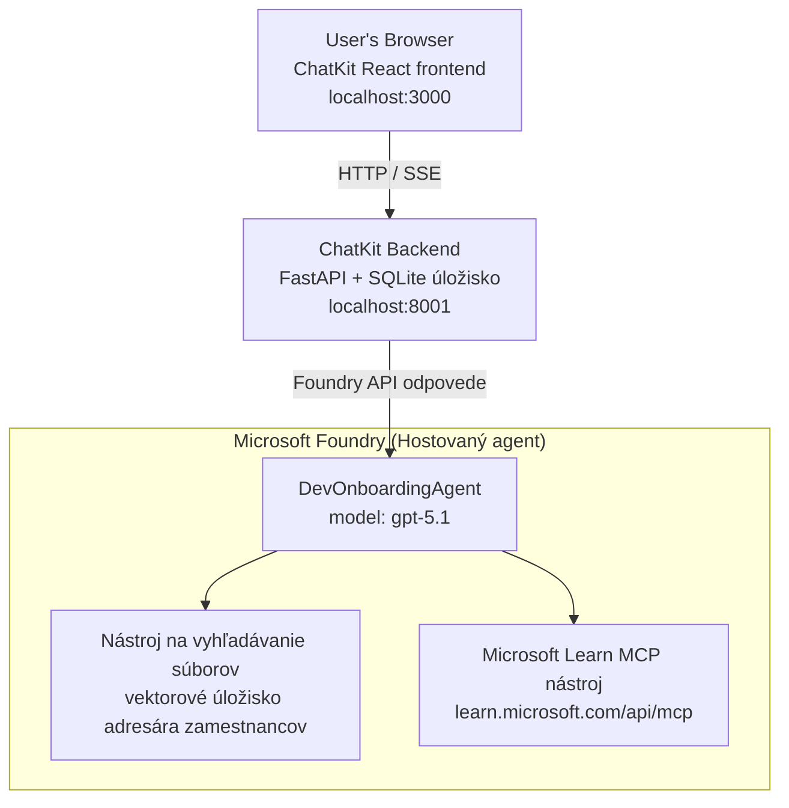

# Lekcia 4: Nasadenie agenta pomocou Microsoft Foundry Hostovaných agentov + ChatKit

Táto lekcia demonštruje, ako nasadiť agenta používajúceho nástroje do Microsoft Foundry ako hostovaného agenta a vytvoriť front-end založený na ChatKit na interakciu s ním.

## Architektúra

Hostovaný agent je **jeden `DevOnboardingAgent`** (bežiaci na `gpt-5.1`), ktorý odpovedá na otázky týkajúce sa onboarding-u vývojárov pomocou dvoch hostovaných nástrojov: nástroj **File Search** založený na vektorovom úložisku employee-directory a nástroj **Microsoft Learn MCP**. React front-end založený na ChatKit komunikuje s FastAPI backendom, ktorý volá agenta cez Foundry **Responses API**.



## Predpoklady

1. **Microsoft Foundry projekt** v regióne North Central US
2. **Azure CLI** prihlásený (`az login`)
3. **Azure Developer CLI** (`azd`) nainštalovaný
4. **Python 3.12+** a **Node.js 18+**
5. **Vektorové úložisko** vytvorené s údajmi o zamestnancoch

## Rýchly štart

### 1. Nastavte premenné prostredia

```bash
cd lesson-4-agentdeployment
cp .env.example .env
# Upravte .env s údajmi vášho projektu Microsoft Foundry
```

### 2. Nasadenie hostovaného agenta

**Možnosť A: Použitie Azure Developer CLI (odporúčané)**

```bash
cd hosted-agent
azd auth login
azd agent deploy
```

**Možnosť B: Použitie Docker + Azure Container Registry**

```bash
cd hosted-agent

# Vytvorte kontajner
docker build -t developer-onboarding-agent:latest .

# Značka pre ACR
docker tag developer-onboarding-agent:latest <your-acr>.azurecr.io/developer-onboarding-agent:latest

# Nahrať do ACR
az acr login --name <your-acr>
docker push <your-acr>.azurecr.io/developer-onboarding-agent:latest

# Nasadiť cez portál Microsoft Foundry alebo SDK
```

### 3. Spustenie ChatKit Backend-u

```bash
cd chatkit-server
python -m venv .venv
source .venv/bin/activate  # Na Windows: .venv\Scripts\activate
pip install -r requirements.txt
python app.py
```

Server sa spustí na `http://localhost:8001`

### 4. Spustenie ChatKit Frontend-u

```bash
cd chatkit-server/frontend
npm install
npm run dev
```

Frontend sa spustí na `http://localhost:3000`

### 5. Testovanie aplikácie

Otvorte `http://localhost:3000` vo vašom prehliadači a vyskúšajte tieto otázky:

**Vyhľadávanie zamestnancov:**
- "Som tu nový! Pracoval tu niekto v Microsoft?"
- "Kto má skúsenosti s Azure Functions?"

**Vzdelávacie zdroje:**
- "Vytvor učebnú cestu pre Kubernetes"
- "Aké certifikácie by som mal získať pre cloudovú architektúru?"

**Pomoc s kódovaním:**
- "Pomôž mi napísať Python kód na pripojenie k CosmosDB"
- "Ukáž mi, ako vytvoriť Azure Function"

**Viacagentové otázky:**
- "Začínam ako cloud inžinier. S kým by som sa mal spojiť a čo sa mám naučiť?"

## Štruktúra projektu

```
lesson-4-agentdeployment/
├── .env.example                 # Environment variables template
├── implementation-plan.md       # Detailed implementation guide
├── README.md                    # This file
├── hosted-agent/               # Microsoft Foundry hosted agent
│   ├── main.py                 # Multi-agent workflow implementation
│   ├── requirements.txt        # Python dependencies
│   ├── Dockerfile              # Container definition
│   └── agent.yaml              # Agent deployment configuration
└── chatkit-server/             # ChatKit server application
    ├── app.py                  # FastAPI backend
    ├── store.py                # SQLite persistence layer
    ├── requirements.txt        # Python dependencies
    └── frontend/               # React frontend
        ├── package.json
        ├── vite.config.ts
        ├── tsconfig.json
        ├── index.html
        └── src/
            ├── main.tsx
            ├── App.tsx
            ├── App.css
            └── index.css
```

## Agent a jeho nástroje

Hostovaný agent je **jeden agent** (`DevOnboardingAgent`, definovaný v `hosted-agent/main.py`), ktorý pokrýva tri oblasti onboardingu. Namiesto orchestrácie viacerých sub-agentov vystavuje každú schopnosť ako nástroj (alebo priamo používa model):

| Schopnosť | Ako je riešená | Nástroj |
|-----------|------------------|------|
| **Vyhľadávanie zamestnancov a spojenia** | Hostovaný File Search nástroj v Foundry cez vektorové úložisko employee-directory | `client.get_file_search_tool(vector_store_ids=[...])` |
| **Vzdelávanie a školenia** | Microsoft Learn MCP server (hostovaný MCP nástroj) | `client.get_mcp_tool(url="https://learn.microsoft.com/api/mcp")` |
| **Pomoc s kódovaním** | Riešené priamo modelom `gpt-5.1` — bez externého nástroja | — |


Agent je vytvorený pomocou `client.as_agent(name="DevOnboardingAgent", instructions=..., tools=[file_search_tool, learn_mcp_tool])` a spustený pomocou `from_agent_framework(agent).run()`.

> **Poznámka dizajnu.** Skoršie návrhy tejto lekcie používali viacagentový workflow `HandoffBuilder` (Triage → špecialisti). Dodávaný agent je jednotný agent používajúci nástroje, čo je jednoduchšie na nasadenie a pochopenie pre onboardingové otázky a odpovede. Pre príklad orchestrácie viacerých agentov a odovzdávania pozri Lekciu 2 a Lekciu 3.

## Smoke testovanie hosťovaného agenta (CI brána)

Úspešné nasadenie hosťovaného agenta len dokazuje, že riadiaca rovina akceptovala
definíciu — **neznamená**, že agent naozaj odpovedá. Chýbajúca závislosť,
nesprávne smerovanie modelu alebo vypršané pripojenie môžu spôsobiť tichého agenta so zeleným stavom.

Táto lekcia dodáva ľahký **smoke test**, ktorý slúži ako rýchla, lacná posilnená brána po nasadení.
Používa [AI Smoke Test](https://github.com/marketplace/actions/ai-smoke-test)
GitHub Action na odosielanie promptov POST metódou na Foundry **Responses** endpoint agenta
(`POST {project_endpoint}/agents/{agent_name}/endpoint/protocols/openai/responses`)
a overuje vrátený text. Odhalí zlomené nasadenia, regresiu autentifikácie,
posun systémového promptu a prerušenie vlákien v priebehu sekúnd.

> Smoke testy **nie sú** náhradou za plné vyhodnotenia v
> [Lekcii 3](../lesson-3-agent-evals/README.md) — sú jej doplnkom. Smoke testy odpovedajú
> na otázku *„je agent dostupný, odpovedá a dodržiava základné očakávania promptu?“*;
> hodnotenia odpovedajú *„aká dobrá je odpoveď?“*. Spúšťajte lacnú bránu pri každom nasadení.

### Čo sa testuje

Katalóg sa nachádza v [`hosted-agent/tests/smoke-tests.json`](../../../lesson-4-agentdeployment/hosted-agent/tests/smoke-tests.json)
a testuje tri oblasti agenta plus dodržiavanie promptu a viackolovú konverzáciu:

| Test | Čo overuje |
|------|------------|
| `reachability` | Agent odpovedá neprázdnym textom v rámci rozsahu |
| `employee-search` | Doména vyhľadávania súborov vráti zdravý `200` (odpoveď závisí od dát) |
| `learning-path` | Doména učenia zopakuje tému a vytvorí odpoveď vo forme cesty |
| `coding-assistance` | Doména kódovania vráti Python odpoveď v tvare kódu |
| `prompt-adherence-offtopic` | Mimo-tému žiadosť je presmerovaná, nie detailne zodpovedaná |
| `threading-turn-1/2` | Stav konverzácie sa zachováva medzi kolami cez `previous_response_id` |

### Spustenie v CI

Workflow v [`.github/workflows/smoke-test-hosted-agent.yml`](../../../.github/workflows/smoke-test-hosted-agent.yml)
má dve úlohy:

- **`static`** — rýchla, bez Azure brána, ktorá beží pri každom pull requeste a pushi:
  kompiluje všetky Python zdroje (`py_compile`) a kontroluje odkazy v Markdown. Nepotrebujete žiadne tajomstvá,
  takže to funguje aj pre fork PR.
- **`smoke`** — nižšie uvedený Azure-prepojený smoke test. Beží na požiadanie
  (Actions → **Agent CI (static + smoke)** → Spustiť workflow) a môže byť reťazený po vašom
  deploy workflow.

Nakonfigurujte tieto **premenné** a **tajomstvá** repozitára pre smoke úlohu:


| Druh | Názov | Hodnota |
|------|------|-------|

| Premenná | `FOUNDRY_PROJECT_ENDPOINT` | `https://<account>.services.ai.azure.com/api/projects/<project>` |
| Premenná | `HOSTED_AGENT_NAME` | Názov nasadeného agenta (napr. `dev-onboarding` — musí zodpovedať vášmu nasadeniu) |
| Tajomstvo | `AZURE_CLIENT_ID` / `AZURE_TENANT_ID` / `AZURE_SUBSCRIPTION_ID` | OIDC federovaná identita pre `azure/login` |

Identita runnera potrebuje rolu **`Azure AI User`** v rámci **Foundry scope projektu**, aby mohla
volať endpointy dátovej roviny pre Responses (a conversations). Udeľte ju pomocou:

```bash
az role assignment create \
  --assignee <object-id-or-appId-of-runner-identity> \
  --role "Azure AI User" \
  --scope "/subscriptions/<sub>/resourceGroups/<rg>/providers/Microsoft.CognitiveServices/accounts/<account>/projects/<project>"
```

### Spustenie lokálne

Môžete spustiť ten istý katalóg pred jeho odoslaním. Získajte token dátovej roviny s obmedzením na
`https://ai.azure.com/` a nastavte runner na vaše nasadenie:

```bash
# Audience MUSÍ byť https://ai.azure.com/ (tokeny cognitiveservices.azure.com sú odmietnuté)
export FOUNDRY_TOKEN=$(az account get-access-token --resource https://ai.azure.com/ --query accessToken -o tsv)

git clone https://github.com/JFolberth/ai-smoketest && cd ai-smoketest
python runner.py \
  --project-endpoint "https://<account>.services.ai.azure.com/api/projects/<project>" \
  --agent-name dev-onboarding \
  --tests-file ../lesson-4-agentdeployment/hosted-agent/tests/smoke-tests.json
```

Výstupné kódy: `0` všetko prešlo, `1` zlyhala asercia, `2` chyba runnera (chybný katalóg / token).

## Riešenie problémov

### Agent neodpovedá
- Skontrolujte, či je hostovaný agent nasadený a beží v Microsoft Foundry
- Skontrolujte, či `HOSTED_AGENT_NAME` a `HOSTED_AGENT_VERSION` zodpovedajú vášmu nasadeniu

### Chyby v vector store
- Overte, či je `VECTOR_STORE_ID` správne nastavené
- Skontrolujte, či vector store obsahuje údaje o zamestnancovi

### Chyby overenia
- Spustite `az login` na obnovenie prihlasovacích údajov
- Uistite sa, že máte prístup do projektu Microsoft Foundry

## Zdroje

- [Dokumentácia k Microsoft Foundry Hosted Agents](https://learn.microsoft.com/en-us/azure/ai-foundry/agents/concepts/hosted-agents)
- [Microsoft Agent Framework](https://github.com/microsoft/agent-framework)
- [Ukážka integrácie ChatKit](https://github.com/microsoft/agent-framework/tree/main/python/samples/demos/chatkit-integration)
- [Azure Developer CLI](https://learn.microsoft.com/en-us/azure/developer/azure-developer-cli/overview)
- [AI Smoke Test GitHub Action](https://github.com/marketplace/actions/ai-smoke-test)
- [Smoke Test Microsoft Foundry Agents s GitHub Actions (blog)](https://techcommunity.microsoft.com/blog/azuredevcommunityblog/smoke-test-microsoft-foundry-agents-with-github-actions/4531912)

---

## Ďalšie kroky

Váš agent beží na infraštruktúre spravovanej Microsoftom. Ak ho chcete uviesť do produkčného prostredia pre podniky —
kde budete kontrolovať, kde sa vaše dáta nachádzajú (suverenita dát, privátna sieť, vlastné Azure
Cosmos DB / Storage / AI Search) a riadiť jeho nástroje — pokračujte v
**[Lekcii 5: Produkčné hostované agenti](../lesson-5-hosted-agents-production/README.md)**, ktorá
vysvetľuje zásadný rozdiel medzi **Hosted Agents** a **Capability Hosts**.

---

<!-- CO-OP TRANSLATOR DISCLAIMER START -->
**Vyhlásenie o zodpovednosti**:
Tento dokument bol preložený pomocou AI prekladateľskej služby [Co-op Translator](https://github.com/Azure/co-op-translator). Hoci sa snažíme o presnosť, vezmite prosím na vedomie, že automatické preklady môžu obsahovať chyby alebo nepresnosti. Pôvodný dokument v jeho natívnom jazyku by mal byť považovaný za autoritatívny zdroj. Pre kritické informácie sa odporúča profesionálny ľudský preklad. Nie sme zodpovední za žiadne nedorozumenia alebo nesprávne interpretácie vyplývajúce z použitia tohto prekladu.
<!-- CO-OP TRANSLATOR DISCLAIMER END -->