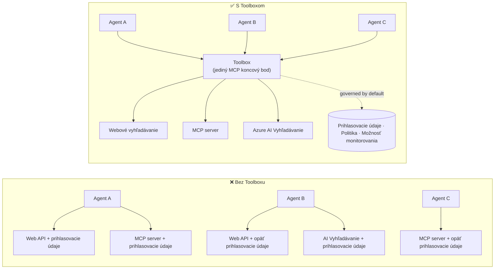

# Lekcia 6: Microsoft Toolbox — riadené nástroje pre agentov

Podľa [Lekcie 5](../lesson-5-hosted-agents-production/README.md) váš hostovaný agent beží v
produkcii so skladovacím a riadiacim nastavením, ktoré vaša organizácia potrebuje. Ale pozrite sa späť na
agenta z Lekcie 4: každý nástroj bol **tvrdé zakódovaný** v `main.py` — Microsoft Learn MCP URL,
vektorové úložisko pre vyhľadávanie súborov a podobne. To funguje pre jedného agenta. To **ne** škáluje pre
organizáciu s desiatkami agentov a tímov.

Táto lekcia predstavuje **Microsoft Toolbox**: spôsob, akým vám Foundry umožňuje definovať vybranú sadu
nástrojov **raz**, spravovať ich **centrálne** a sprístupniť ich ktorémukoľvek agentovi cez **jeden,
riadený koncový bod**.

## Ciele učenia

Na konci tejto lekcie budete vedieť:

- Vysvetliť problém roztrúsenosti nástrojov, ktorý Toolbox rieši.
- Opísať piliere **Build** a **Consume** a typy nástrojov, ktoré toolbox môže obsahovať.
- **Vytvoriť** verziu toolboxu pomocou Foundry SDK.
- **Použiť** toolbox z hostovaného agenta Microsoft Agent Framework cez jeden MCP koncový bod.
- Použiť **verzovanie** na doručenie zmien nástrojov bez zmien kódu agenta alebo potreby redeploy.
- Aplikovať **riadeniu**: RBAC, injekciu poverení a politiky ochranných pravidiel (RAI).

---

## Predpoklady

1. Dokončená [Lekcia 4](../lesson-4-agentdeployment/README.md) a ideálne
   [Lekcia 5](../lesson-5-hosted-agents-production/README.md).
2. Projekt **Microsoft Foundry** s oprávnením na vytváranie a správu zdrojov toolboxu.
3. Autentifikovaný **Azure CLI**: `az login`. API toolboxu vo Foundry vyžadujú
   tokenový rozsah `https://ai.azure.com/.default` (zobrazený v kóde nižšie).
4. **Python 3.12+** s nainštalovanými závislosťami kurzu (`pip install -r ../requirements.txt`).
5. Aktuálne nasadenie modelu, ktoré nie je vyradené (napríklad `gpt-5.1`). Vyhnite sa vyradeným GPT-4o / GPT-4.1.

---

## 1. Problém: roztrúsenosť nástrojov

Jeden agent môže závisieť od mnohých nástrojov — REST API, MCP serverov, konektorov a tokov — každý
s vlastným modelom autentifikácie a pridruženým tímom. Ako škálujete naprieč organizáciou:

- Tímy **nezávisle implementujú tie isté nástroje**.
- **Poverenia sa duplikujú** medzi agentmi a repozitármi.
- **Riadenie je nekonzistentné** — každý agent uplatňuje (alebo zabúda na) politiku sám.
- Je **malo viditeľnosti** do toho, aké nástroje existujú alebo kto ich používa.

Vývojári stagnujú — nie preto, že modely nie sú schopné, ale pretože **integrovanie nástrojov sa stáva
úzkym hrdlom**.



Podniky už majú infraštruktúru — brány, skrinky na poverenia, politiky, dohľadové nástroje.
Čo chýbalo, je vývojárska skúsenosť, ktorá by to zabalila do niečoho **znovupoužiteľného,
objaviteľného a štandardne riadeného**. To je Toolbox.

---

## 2. Čo je Toolbox

**Toolbox** je **riadený zdroj vo Foundry**. Definujete vybranú sadu nástrojov raz, spravujete ich
centrálne vo Foundry a sprístupňujete ich cez **jeden MCP-kompatibilný koncový bod**, ktorý akýkoľvek

agent dokáže využívať. Počas behu platforma rieši **vkladanie poverení, obnovenie tokenu a
vynucovanie podnikovej politiky**.

Pretože toolbox je spravovaný zdroj, môžete pridávať, odstraňovať alebo prekonfigurovať nástroje **bez
zmeny kódu vo vašom agente** — agent sa vždy pripája na ten istý endpoint.

Toolbox pokrýva životný cyklus nástroja štyrmi piliermi; **Build** a **Consume** sú dostupné
dnes:

| Pilier | Stav | Čo umožňuje |
|--------|--------|-----------------|
| **Build** | Dostupné dnes | Výber nástrojov, centrálna konfigurácia autentifikácie, publikovanie znovupoužiteľného toolboxu, ktorý môže používať každý tím. |
| **Consume** | Dostupné dnes | Pripojiť akýkoľvek agent na jeden MCP-kompatibilný endpoint pre dynamické objavovanie a vyvolávanie všetkých nástrojov v toolboxe. |

Povrch spotreby je **otvorený**: akýkoľvek MCP-kompatibilný runtime alebo klient môže používať toolbox —
Microsoft Agent Framework, LangGraph, GitHub Copilot, Claude Code, Microsoft Copilot Studio alebo
vlastný kód.

### Typy nástrojov, ktoré môže toolbox obsahovať

Web Search · MCP · Azure AI Search · Code Interpreter · File Search · OpenAPI · **Agent-to-Agent
(A2A)** · Fabric IQ · Tool Search · Work IQ · Browser Automation · Referencie schopností, plus
**Guardrail (RAI) politika** aplikovaná na úrovni toolboxu.

> **Tip:** Pridajte `description` ku **každému** nástroju, aby model vybral ten správny. Toolbox
> povoluje najviac **jeden nenazvaný nástroj na typ** — každému ďalšiemu inštancii rovnakého typu
> dajte jedinečný `name`, inak dostanete chybu `invalid_payload`.

---

## 3. Vytvorte toolbox

Toolboxy sa spravujú pomocou Foundry SDK (Python/.NET/JavaScript), REST API, `azd`
a **Microsoft Foundry Toolkit pre VS Code**. Tu je príklad v Pythone (`azure-ai-projects`):

```python
from azure.identity import DefaultAzureCredential
from azure.ai.projects import AIProjectClient
from azure.ai.projects.models import MCPTool, ToolboxSearchPreviewTool, WebSearchTool

endpoint = "https://<your-foundry-account>.services.ai.azure.com/api/projects/<your-project>"
project = AIProjectClient(endpoint=endpoint, credential=DefaultAzureCredential())

toolbox_version = project.toolboxes.create_toolbox_version(
    name="agent-tools",
    description="Web search + an MCP server + tool search",
    tools=[
        WebSearchTool(),
        MCPTool(
            server_label="myserver",
            server_url="https://your-mcp-server.example.com",
            require_approval="never",
            project_connection_id="my-key-auth-connection",  # poverenia sú uložené v Foundry
        ),
        ToolboxSearchPreviewTool(),
    ],
)
print(f"Created toolbox: {toolbox_version.name}, version: {toolbox_version.version}")
```

Všimnite si, čo **nerobíte**: žiadne tajomstvá v agente. Poverenia spravuje Foundry
**connection** (`project_connection_id`), ktoré platforma vkladá pri volaní.

> **Poznámka k preview:** Správa toolboxu (vytváranie/aktualizácia verzií) je preview funkcia.
> Operácie `project.toolboxes.*` zobrazené vyššie sú v preview zostavách SDK, REST API, `azd`
> a **Foundry Toolkit pre VS Code** — nie sú súčasťou pevne stanovenej verzie `azure-ai-projects`,
> ktorá sa používa inde v tomto kurze. Považujte uvedený príklad za tvar kroku Build; ak chcete
> plne fungujúcu cestu, vytvorte toolbox v **Foundry portáli** alebo v **Foundry Toolkit**. Krok
> **Consume** nižšie pracuje s pevnou verziou SDK používanou v kurze dnes.

---

## 4. Použite toolbox z vášho agenta

Toolbox vystavuje **MCP endpoint**. Sú dva vzory:

| Úloha | Endpoint | Kedy použiť |
|------|----------|-------------|
| **Spotrebiteľ toolboxu** | `{project_endpoint}/toolboxes/{name}/mcp?api-version=v1` | Pripojiť agentov. Vždy slúži **predvolenú verziu**. |
| **Vývojár toolboxu** | `{project_endpoint}/toolboxes/{name}/versions/{version}/mcp?api-version=v1` | Testovať konkrétnu verziu pred jej nasadením. |


> **Pripojte agentov k *koncovej* spotrebiteľskej bodke.** Pretože vždy slúži predvolenú verziu, vy

> môže propagovať nové verzie **bez zmeny kódu agenta alebo opätovného nasadenia**.

### Integrácia s agentom hosteným v rámci Microsoft Agent Framework

Pripomeňte si, že agent z Lekcie 4 pridal jediný pevne zakódovaný nástroj MCP pomocou `client.get_mcp_tool(...)`. S
Toolboxom naopak nasmerujete **jeden** `MCPStreamableHTTPTool` na koncový bod toolboxu — a agent
získa **každý** nástroj v toolboxe, riadený centrálne:

```python
import httpx
from azure.identity import DefaultAzureCredential, get_bearer_token_provider
from agent_framework import MCPStreamableHTTPTool

# Auth: Nástroje Foundry vyžadujú rozsah https://ai.azure.com/.default
credential = DefaultAzureCredential()
token_provider = get_bearer_token_provider(credential, "https://ai.azure.com/.default")
http_client = httpx.AsyncClient(auth=_ToolboxAuth(token_provider), timeout=120.0)

TOOLBOX_ENDPOINT = os.environ["TOOLBOX_ENDPOINT"]  # platforma vložená za behu programu

mcp_tool = MCPStreamableHTTPTool(
    name="toolbox",
    url=TOOLBOX_ENDPOINT,
    http_client=http_client,
    load_prompts=False,
)

agent = chat_client.as_agent(
    name="my-toolbox-agent",
    instructions="You are a helpful assistant with access to Foundry toolbox tools.",
    tools=[mcp_tool],
)
```

Zodpovedajúci `.env` (poznámka: používajte **aktuálny** model ako `gpt-5.1`, **nie** vyradený
`gpt-4o`):

```env
FOUNDRY_PROJECT_ENDPOINT=https://<account>.services.ai.azure.com/api/projects/<project>
TOOLBOX_ENDPOINT=https://<account>.services.ai.azure.com/api/projects/<project>/toolboxes/agent-tools/mcp?api-version=v1
AZURE_AI_MODEL_DEPLOYMENT_NAME=gpt-5.1
```

> **Najprv overte.** Pred zapojením úplného agenta sa pripojte k MCP klientskemu SDK (`pip install mcp`)
> na **verziovo-špecifický** koncový bod a vypíšte nástroje, aby ste potvrdili, že sa načítajú podľa očakávaní.

### Spustite ukážku konzumácie

Táto lekcia obsahuje spustiteľnú ukážku konzumácie, [`toolbox_agent.py`](../../../lesson-6-toolbox/toolbox_agent.py). Používa
rovnaký vzor `FoundryChatClient.get_mcp_tool(...)`, ktorý ste sa naučili v Lekcii 2, ale nasmeruje
jediný MCP nástroj na váš **toolbox** koncový bod — takže agent získa každý riadený nástroj v toolboxe:

```bash
# Vo vašom .env nastavte TOOLBOX_ENDPOINT na endpoint spotrebiteľa toolboxu, potom:
python lesson-6-toolbox/toolbox_agent.py
```

Otvorte vytlačenú URL `http://localhost:8096` a položte otázku, ktorá využije jeden z nástrojov vášho
toolboxu. Pridajte alebo aktualizujte nástroj v toolboxe a opýtajte sa znova — **bez zmeny tohto
kódu** — aby ste videli centralizované riadenie a verzovanie v akcii.

---

## 5. Verzovanie: bezpečné nasadzovanie zmien nástrojov

Verzovanie toolboxu vám dáva explicitnú kontrolu nad tým, kedy zmeny vstúpia do platnosti:

1. **Vytvorte** novú verziu toolboxu s aktualizovanou sadou nástrojov.
2. **Otestujte** ju na verziovo-špecifickom (vývojárskom) koncovom bode.
3. **Propagujte** ju na `default_version`, keď ste pripravení.

Každý agent smerovaný na **spotrebiteľský** koncový bod automaticky prevezme propagovanú verziu — **žiadne
zmeny kódu, žiadne opätovné nasadenie**. (Prvá verzia, ktorú vytvoríte, je automaticky propagovaná na predvolenú.)

Toto je ekvivalent riadenia nástrojov modrým/zeleným nasadením: zmenu validujete izolovane,
potom prepnete predvolenú verziu pre každého spotrebiteľa naraz.

---

## 6. Riadenie: ako Toolbox zlepšuje kontrolu

Toolbox je **predvolene riadený**. Ovládacie prvky riadenia, ktoré by ste mali poznať:

- **RBAC.** Priraďte rolu **Foundry User** v projekte každej identite: **vývojárovi**, ktorý
  spravuje verzie toolboxu, **spravovanej identite agenta** (pre hostených agentov volajúcich nástroje za
  behu), a pri OAuth tokov aj **koncovému používateľovi**, ktorého identita je sproxovaná.
- **Centralizované poverenia.** Poverenia nástrojov sú uložené v Foundry **connections**, nie v kóde agenta
  alebo `.env` súboroch. Platforma ich vkladá a obnovuje tokeny za behu.
- **Ochranné mechanizmy (RAI politika).** Pripojte pomenovanú politiku zodpovednej AI k verzii toolboxu cez
  `policies.rai_config.rai_policy_name`. Spúšťa sa na **vrstve toolboxu**, nezávisle od akéhokoľvek
  modelového filteru obsahu, kontroluje vstupy a výstupy nástroja.
- **Schvaľovanie MCP.** Na úrovni nástrojov `require_approval` určuje, či volanie MCP nástroja potrebuje schválenie —
  ten istý koncept schvaľovacieho workflow, ktorý ste videli v [Lekcii 5 §7](../lesson-5-hosted-agents-production/README.md#7-hosted-mcp-tools--approval-workflows).
- **Súkromné siete.** Toolbox podporuje konfigurácie virtuálnych sietí pre podniky, ktoré
  udržujú komunikáciu v rámci svojej siete.
- **Viditeľnosť.** Keďže nástroje sú evidované centrálne, konečne získate prehľad o tom, čo
  existuje a kto to využíva.

---

## Praktické cvičenia

1. **Refaktorujte Lekciu 4.** Agent z Lekcie 4 má pevne zakódovaný Microsoft Learn MCP nástroj. Navrhnite, ako
   by ste tento nástroj presunuli do toolboxu `agent-tools` a preadresovali `main.py` na spotrebiteľský
   koncový bod toolboxu. Čo sa zmení v `main.py`? Čo tam už nebude?
2. **Navrhnite zvýšenie verzie.** Potrebujete pridať nástroj Web Search do aktívneho toolboxu, ktorý používa
   päť agentov. Popíšte postup vytvorenia → testovania → propagácie a vysvetlite, prečo nie je potrebné
   žiadne opätovné nasadenie žiadneho z piatich agentov.
3. **Vyberte autentifikačné identity.** Pre hosteného agenta, ktorý volá OAuth MCP nástroj cez toolbox,
   uveďte, ktoré identity potrebujú rolu **Foundry User** a prečo.
4. **Umiestnenie ochranných mechanizmov.** Vysvetlite rozdiel medzi modelovým filterom obsahu a
   ochranným mechanizmom toolboxu a uveďte jeden prípad, kde je špecificky potrebný ochranný mechanizmus toolboxu.

---

## Zdroje

- [Vytvorte, otestujte a nasadte toolbox v Foundry](https://learn.microsoft.com/azure/foundry/agents/how-to/tools/toolbox)
- [Katalóg nástrojov — Foundry Agent Service](https://learn.microsoft.com/azure/foundry/agents/concepts/tool-catalog)
- [Microsoft Agent Framework — poskytovateľ Microsoft Foundry (nástroje)](https://learn.microsoft.com/agent-framework/agents/providers/microsoft-foundry)
- [Prehľad ochranných mechanizmov](https://learn.microsoft.com/azure/foundry/guardrails/guardrails-overview)
- [Začnite s Foundry vo VS Code (Foundry Toolkit)](https://learn.microsoft.com/azure/ai-foundry/how-to/develop/get-started-projects-vs-code)
- [Model Context Protocol](https://modelcontextprotocol.io/)

---

**Predchádzajúce:** [Lekcia 5 — Produkčné hostené agenty](../lesson-5-hosted-agents-production/README.md)
&nbsp;·&nbsp; **Ďalšie:** [Lekcia 7 — Multi-agent & A2A](../lesson-7-multi-agent-a2a/README.md)

---

<!-- CO-OP TRANSLATOR DISCLAIMER START -->
**Vyhlásenie o zodpovednosti**:
Tento dokument bol preložený pomocou AI prekladateľskej služby [Co-op Translator](https://github.com/Azure/co-op-translator). Hoci sa snažíme o presnosť, vezmite prosím na vedomie, že automatické preklady môžu obsahovať chyby alebo nepresnosti. Pôvodný dokument v jeho natívnom jazyku by mal byť považovaný za autoritatívny zdroj. Pre kritické informácie sa odporúča profesionálny ľudský preklad. Nie sme zodpovední za žiadne nedorozumenia alebo nesprávne interpretácie vyplývajúce z použitia tohto prekladu.
<!-- CO-OP TRANSLATOR DISCLAIMER END -->