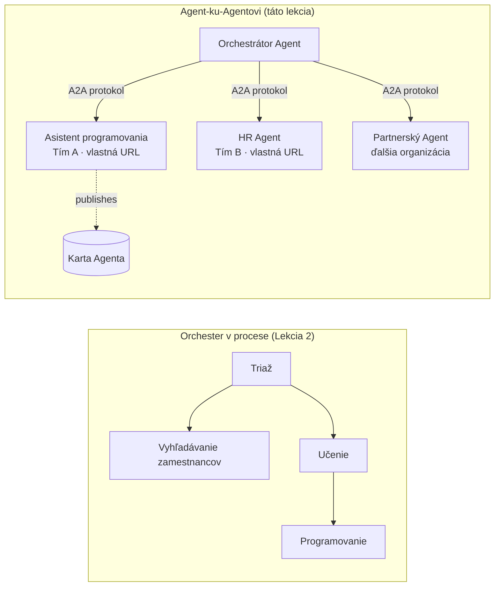

# Lekcia 7: Multi-agentné orchestrácie & Agent-ku-Agent (A2A)

V [Lekcii 6](../lesson-6-toolbox/README.md) ste mohli budovať riadené nástroje a hostovaných agentov.
Ale skutočné systémy zriedka používajú **jedného** agenta. Pri škálovaní kombinujete **mnoho** agentov – niektorí sú vaši,
niektorí patria iným tímom, ďalší bežia v úplne iných organizáciách. Táto lekcia je o tom,
ako agenti pracujú **spolu**.

Už ste sa stretli s jednou formou multi-agentného dizajnu v
[Lekcii 2 `agent-orchestration.py`](../lesson-2-agent-development/README.md): vzorec **handoff**,
kde triážny agent smeruje k špecialistom **v rámci jedného procesu**. Táto lekcia ide
o úroveň vyššie — k **Agent-ku-Agent (A2A)**, otvorenému protokolu pre agentov, ktorí bežia ako nezávislé
**sieťové služby** a volajú sa navzájom cez hranice procesov, tímov a organizácií.

## Ciele učenia

Na konci tejto lekcie budete schopní:

- Vysvetliť rozdiel medzi **v-procesnou orchestráciou** (handoff/pracovné toky) a
  **Agent-ku-Agent (A2A)** komunikáciou a vybrať tú správnu.
- Opísať stavebné bloky A2A: **Agent Card**, **zručnosti**, **úlohy** a **objavovanie**.
- **Sprístupniť** agenta Microsoft Agent Framework ako A2A službu s `A2AExecutor`.
- **Využiť** vzdialeného agenta ako sieťového partnera s `A2AAgent`.
- Aplikovať podnikové záležitosti do A2A: **bezpečnosť, identita, riadenie, sledovateľnosť a náklady**.

---

## Predpoklady

1. Dokončená [Lekcia 2](../lesson-2-agent-development/README.md) (vývoj a orchestrácia agentov).
2. Projekt **Microsoft Foundry** s aktuálnym nasadením modelu (napríklad `gpt-5.1` a
   `gpt-5-codex` pre ukážkový kód). Vyhnite sa zastaraným GPT-4o / GPT-4.1.
3. Autentifikovaný **Azure CLI**: `az login`.
4. **Python 3.12+** s nainštalovanými závislosťami kurzu (`pip install -r ../requirements.txt`).
   Lekcia 7 pridáva preview balíčky `agent-framework-a2a`, `a2a-sdk` a `uvicorn`.
5. `FOUNDRY_PROJECT_ENDPOINT` a `FOUNDRY_MODEL` nastavené vo vašom `.env` (pozri README kurzu).

---

## 1. Dva spôsoby, ako agenti spolupracujú

Neexistuje jediný "multi-agentný" vzorec. Vyberte ten, ktorý zodpovedá vášmu **horizontu**:

| Vzorec | Kde agenti bežia | Ako sa pripájajú | Použitie |
|---------|------------------|------------------|----------|
| **Handoff / Workflow** (Lekcia 2) | Jeden proces, jedna kódová báza | In-memory graf (`HandoffBuilder`, `WorkflowBuilder`) | Vlastníte všetkých agentov a nasadzujete ich spoločne. |
| **Agent-ku-Agent (A2A)** (táto lekcia) | Samostatné služby, samostatné životné cykly | Otvorený **A2A protokol** cez HTTP, objavované cez **Agent Cards** | Agenti patria rôznym tímom/organizáciám, škálujú nezávisle alebo sú napísaní v rôznych rámcoch. |

Handoff je o **smerovaní v rámci aplikácie**. A2A je o **kompozícii agentov ako
nezávislé služby** — agentná ekvivalentnosť prechod z volaní funkcií na mikroslužby.



> **Kombinujú sa.** Orchestrátor, ktorý zostavíte pomocou `HandoffBuilder`, môže mať **vzdialených A2A agentov**
> ako účastníkov — v-procesné smerovanie k službám, ktoré samotné bežia kdekoľvek.

---

## 2. Stavebné bloky A2A

A2A je **otvorený protokol** (nie špecifický pre Microsoft), takže A2A agenta môže používať Microsoft
Agent Framework, LangGraph, vlastný kód alebo iný firemný stack. Štyri koncepty sú podstatné:

- **Agent Card** — malý JSON dokument, publikovaný na
  `/.well-known/agent-card.json`, ktorý propaguje meno agenta, popis, URL, verziu,
  zručnosti a schopnosti. Klient tak **objavuje**, čo dokáže vzdialený agent.
- **Zručnosti** — deklarované veci, ktoré agent dokáže (`id`, `name`, `description`, `tags`,
  `examples`). Klienti (a modely) ich používajú, aby rozhodli, či volať agenta.
- **Úlohy** — volanie A2A agenta je **úloha** s životným cyklom (odoslané → spracováva sa →
  dokončená/neúspešná). Server sleduje úlohy v **task store**; sú podporované streamované aktualizácie.
- **Objavovanie** — klient dostanúc len URL stiahne Agent Card a vie, ako volať agenta.

---

## 3. Sprístupniť agenta ako A2A službu — `a2a_server.py`

Strana **Build/serve** zabalí každý Microsoft Agent Framework agenta pomocou `A2AExecutor` a pripojí ho
k A2A HTTP aplikácii. Pozri [`a2a_server.py`](../../../lesson-7-multi-agent-a2a/a2a_server.py). Kľúčové prepojenie:

```python
from agent_framework.a2a import A2AExecutor
from a2a.server.apps import A2AStarletteApplication
from a2a.server.request_handlers import DefaultRequestHandler
from a2a.server.tasks import InMemoryTaskStore
from a2a.types import AgentCapabilities, AgentCard, AgentSkill

agent = client.as_agent(name="coding-assistant", instructions="...")

agent_card = AgentCard(
    name="Coding Assistant",
    description="Generates runnable code samples...",
    url="http://localhost:9000/",
    version="1.0.0",
    capabilities=AgentCapabilities(streaming=True),
    default_input_modes=["text"],
    default_output_modes=["text"],
    skills=[AgentSkill(id="generate-code", name="Generate code",
                       description="Write a runnable code snippet.", tags=["code"])],
)

request_handler = DefaultRequestHandler(
    agent_executor=A2AExecutor(agent),
    task_store=InMemoryTaskStore(),
)
app = A2AStarletteApplication(agent_card=agent_card, http_handler=request_handler).build()
# podávané pomocou uvicorn na porte 9000
```

Všimnite si, že kód agenta je **nezmenený** — `A2AExecutor` adaptuje váš existujúci agent na protokol.
Agent Card je to, čo robí agenta **objaviteľným** pre akéhokoľvek A2A klienta.

---

## 4. Využiť vzdialeného agenta — `a2a_client.py`

Strana **Consume** sa pripája k vzdialenému agentovi **cez URL**, stiahne jeho Agent Card a volá ho
presne ako lokálneho agenta. Pozri [`a2a_client.py`](../../../lesson-7-multi-agent-a2a/a2a_client.py):

```python
from agent_framework.a2a import A2AAgent

remote_agent = A2AAgent(name="remote-coding-assistant", url="http://localhost:9000")
result = await remote_agent.run("Write a Python function that reverses a string.")
print(result.text)
```

To je celý zmysel A2A: z volajúceho pohľadu sa vzdialený agent správa ako akýkoľvek iný
`agent_framework` agent, takže ho môžete zahrnúť do pracovného toku alebo mu odovzdať úlohu — aj keď beží
v inom procese, na inom stroji, patriacom inému tímu.

### Spustiť ho kompletne

```bash
# Terminál 1 — spustite službu A2A
python a2a_server.py

# Terminál 2 — zavolajte ju
python a2a_client.py "Write a Python function that reverses a string."
```

Uvidíte odpoveď kódovacieho asistenta prichádzať cez A2A protokol. Otvorte
`http://localhost:9000/.well-known/agent-card.json` v prehliadači, aby ste videli zverejnený Agent Card.

---

## 5. Podnikové záležitosti

Prevod agentov na sieťové služby prináša rovnaké obavy ako akýkoľvek distribuovaný systém —
plus niekoľko špecifických pre AI:


- **Identita a autentifikácia.** Nikdy neodhaľujte A2A agenta bez autentifikácie. Karta agenta nesie
  `security` / `security_schemes` a `A2AAgent` prijíma `auth_interceptor`, aby volajúci mohli pripojiť
  poverenia (OAuth bearer tokeny, API kľúče). Používajte Entra ID / spravované identity pre
  autentifikáciu služieb medzi sebou v produkcii; umiestnite službu za bránu.
- **Governance.** Kombinujte A2A s [Nástrojovým boxom Lekcie 6](../lesson-6-toolbox/README.md): vzdialený
  agent môže byť publikovaný ako **A2A nástroj** v rámci riadeného nástrojového boxu, takže RBAC, injekcia poverení
  a bezpečnostné politiky sa uplatňujú centrálne.
- **Pozorovateľnosť.** Žiadosť teraz prechádza hranicami procesov, preto šírite trasovanie cez volanie.
  Povoliť [Foundry Observability / OpenTelemetry](../lesson-3-agent-evals/README.md) na **obu** stranách,
  orchestrátorovi aj každému vzdialenému agentovi, aby ste dostali jedno end-to-end trasovanie.
- **Verzovanie.** Karta agenta má `version`. Zaobchádzajte s ňou ako s API: pridávajúce zmeny sú bezpečné;
  zmena zmluvy zručnosti vyžaduje novú verziu a migračné okno pre používateľov.
- **Spoľahlivosť.** Vzdialení agenti zlyhávajú samostatne. Nastavte časové limity (`A2AAgent(timeout=...)`), riešte
  čiastočné zlyhania a nedovoľte jednému pomalému účastníkovi blokovať celú orchestráciu.
- **Náklady.** Každé volanie vzdialeného agenta je vlastné vyvolanie modelu. Rozvetvenie znásobuje spotrebu tokenov —
  rozpočtujte to a uprednostňujte smerovanie k **jednému** najlepšiemu agentovi pred vysielaním na viacerých.

---

## Praktické cvičenia

1. **Pridajte druhú službu.** Skopírujte `a2a_server.py` pre vystavenie agenta **employee-search** na porte
   9001 s vlastnou kartou agenta a schopnosťami. Spustite obe a nech klient volá každého z nich.
2. **Orchestrujte vzdialených účastníkov.** Vytvorte malý `HandoffBuilder` (alebo jednoduchý router), ktorého účastníkmi
   budú dvaja `A2AAgent`s smerujúci na vaše dve služby. Preposielajte dotaz na správneho.
3. **Zabezpečte to.** Pridajte `auth_interceptor` klientovi a na server požadujte bearer token.
   Čo sa pokazí, ak token chýba? Kde by ste uložili token v produkcii?
4. **Handoff verzus A2A.** Napíšte dva krátke odstavce: kedy by ste použili handoff z Lekcie 2 spustený v procese
   a kedy je odôvodnená vyššia zložitosť A2A? Uveďte konkrétny príklad pre každý prípad.

---

## Zdroje

- [Agent-to-Agent (A2A) — Microsoft Agent Framework](https://learn.microsoft.com/agent-framework/user-guide/agent-orchestration/a2a)
- [Multi-agent orchestration — Microsoft Agent Framework](https://learn.microsoft.com/agent-framework/user-guide/agent-orchestration/)
- [Špecifikácia protokolu A2A](https://a2a-protocol.org/)
- [A2A Python SDK (`a2a-sdk`)](https://github.com/a2aproject/a2a-python)
- [Foundry Agent Service — vzory pre multi-agentov](https://learn.microsoft.com/azure/ai-foundry/agents/concepts/connected-agents)

---

**Predchádzajúce:** [Lekcia 6 — Microsoft Toolbox](../lesson-6-toolbox/README.md)

---

<!-- CO-OP TRANSLATOR DISCLAIMER START -->
**Vyhlásenie o zodpovednosti**:
Tento dokument bol preložený pomocou AI prekladateľskej služby [Co-op Translator](https://github.com/Azure/co-op-translator). Hoci sa snažíme o presnosť, vezmite prosím na vedomie, že automatické preklady môžu obsahovať chyby alebo nepresnosti. Pôvodný dokument v jeho natívnom jazyku by mal byť považovaný za autoritatívny zdroj. Pre kritické informácie sa odporúča profesionálny ľudský preklad. Nie sme zodpovední za žiadne nedorozumenia alebo nesprávne interpretácie vyplývajúce z použitia tohto prekladu.
<!-- CO-OP TRANSLATOR DISCLAIMER END -->