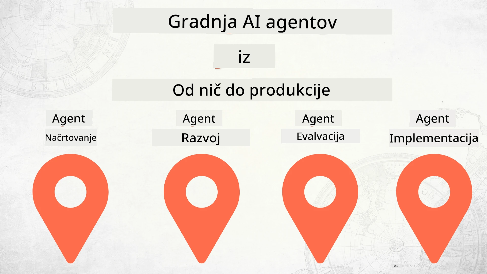

# Izdelava AI agentov od začetka do produkcije



### 🌐 Podpora več jezikov

#### Podprto preko GitHub akcije (avtomatizirano in vedno posodobljeno)

<!-- CO-OP TRANSLATOR LANGUAGES TABLE START -->
[Arabščina](../ar/README.md) | [Bengalščina](../bn/README.md) | [Bolgarščina](../bg/README.md) | [Burmanski (Mjanmar)](../my/README.md) | [Poenostavljena kitajščina](../zh-CN/README.md) | [Tradicionalna kitajščina (Hongkong)](../zh-HK/README.md) | [Tradicionalna kitajščina (Macau)](../zh-MO/README.md) | [Tradicionalna kitajščina (Tajvan)](../zh-TW/README.md) | [Hrvaščina](../hr/README.md) | [Češčina](../cs/README.md) | [Danščina](../da/README.md) | [Nizozemščina](../nl/README.md) | [Estonščina](../et/README.md) | [Finščina](../fi/README.md) | [Francoščina](../fr/README.md) | [Nemščina](../de/README.md) | [Grščina](../el/README.md) | [Hebrejščina](../he/README.md) | [Hindi](../hi/README.md) | [Madžarščina](../hu/README.md) | [Indonezijščina](../id/README.md) | [Italijanščina](../it/README.md) | [Japonščina](../ja/README.md) | [Kannada](../kn/README.md) | [Korejščina](../ko/README.md) | [Litovščina](../lt/README.md) | [Malezijščina](../ms/README.md) | [Malajalščina](../ml/README.md) | [Maratščina](../mr/README.md) | [Nepalščina](../ne/README.md) | [Nigerijski pidžin](../pcm/README.md) | [Norveščina](../no/README.md) | [Perzijski (Farsi)](../fa/README.md) | [Poljščina](../pl/README.md) | [Portugalski (Brazilija)](../pt-BR/README.md) | [Portugalski (Portugalska)](../pt-PT/README.md) | [Pandžabski (Gurmukhi)](../pa/README.md) | [Romunščina](../ro/README.md) | [Ruščina](../ru/README.md) | [Srbski (cirilica)](../sr/README.md) | [Slovaščina](../sk/README.md) | [Slovenščina](./README.md) | [Španščina](../es/README.md) | [Svahili](../sw/README.md) | [Švedščina](../sv/README.md) | [Tagalog (Filipini)](../tl/README.md) | [Tamilščina](../ta/README.md) | [Telugu](../te/README.md) | [Tajščina](../th/README.md) | [Turščina](../tr/README.md) | [Ukrajinščina](../uk/README.md) | [Urdu](../ur/README.md) | [Vietnamski](../vi/README.md)

> **Raje klonirati lokalno?**
>
> Ta repozitorij vključuje prevode v več kot 50 jezikih, kar znatno poveča velikost prenosa. Če želite klonirati brez prevodov, uporabite množični izrez:
>
> **Bash / macOS / Linux:**
> ```bash
> git clone --filter=blob:none --sparse https://github.com/microsoft/Building-AI-Agents-From-Zero-To-Production.git
> cd Building-AI-Agents-From-Zero-To-Production
> git sparse-checkout set --no-cone '/*' '!translations' '!translated_images'
> ```
>
> **CMD (Windows):**
> ```cmd
> git clone --filter=blob:none --sparse https://github.com/microsoft/Building-AI-Agents-From-Zero-To-Production.git
> cd Building-AI-Agents-From-Zero-To-Production
> git sparse-checkout set --no-cone "/*" "!translations" "!translated_images"
> ```
>
> Tako boste dobili vse, kar potrebujete za dokončanje tečaja, z veliko hitrejšim prenosom.
<!-- CO-OP TRANSLATOR LANGUAGES TABLE END -->

## Tečaj, ki vas uči osnov življenjskega cikla razvoja AI agentov

[](https://github.com/microsoft/Building-AI-Agents-From-Zero-To-Production/blob/master/LICENSE?WT.mc_id=academic-105485-koreyst)
[](https://GitHub.com/microsoft/Building-AI-Agents-From-Zero-To-Production/graphs/contributors/?WT.mc_id=academic-105485-koreyst)
[](https://GitHub.com/microsoft/Building-AI-Agents-From-Zero-To-Production/issues/?WT.mc_id=academic-105485-koreyst)
[](https://GitHub.com/microsoft/Building-AI-Agents-From-Zero-To-Production/pulls/?WT.mc_id=academic-105485-koreyst)
[](http://makeapullrequest.com?WT.mc_id=academic-105485-koreyst)

[](https://discord.gg/Kuaw3ktsu6)

## 🌱 Začetek

Ta tečaj vsebuje lekcije, ki pokrivajo osnove izdelave in uvajanja AI agentov.

Vsaka lekcija gradi na prejšnji, zato priporočamo začetek od začetka in postopno delo do konca.

Če želite raziskati več o temah AI agentov, si lahko ogledate [Tečaj AI agentov za začetnike](https://aka.ms/ai-agents-beginners).

### Spoznajte druge učence, dobite odgovore na vprašanja

Če se zataknete ali imate kakršnakoli vprašanja o izdelavi AI agentov, se pridružite naši namenski Discord kanalu v [Microsoft Foundry Discord](https://discord.gg/Kuaw3ktsu6).

### Kaj potrebujete

Vsaka lekcija ima lasten vzorec kode, ki ga lahko zaženete lokalno. Lahko [forkate ta repozitorij](https://github.com/microsoft/Building-AI-Agents-From-Zero-To-Production/fork) za ustvarjanje svoje kopije.

Ta tečaj trenutno uporablja:

- [Microsoft Agent Framework (MAF)](https://aka.ms/ai-agents-beginners/agent-framework)
- [Microsoft Foundry](https://azure.microsoft.com/products/ai-foundry)
- [Azure OpenAI Service](https://azure.microsoft.com/products/ai-foundry/models/openai)
- [Azure CLI](https://learn.microsoft.com/cli/azure/authenticate-azure-cli?view=azure-cli-latest)

Prosimo, zagotovite, da imate dostop do teh storitev pred začetkom.

Kmalu prihajajo dodatne možnosti za gostovanje modelov in storitve.

## 🗃️ Lekcije

| **Lekcija**              | **Opis**                                                                                      |
|-------------------------|------------------------------------------------------------------------------------------------|
| [Oblikovanje agentov](./lesson-1-agent-design/README.md)       | Uvod v naš primer uporabe "Vključitev razvijalcev" in kako oblikovati učinkovite agente         |
| [Razvoj agentov](./lesson-2-agent-development/README.md)      | Z uporabo Microsoft Agent Framework (MAF) ustvarite 3 agente za pomoč novim razvijalcem pri vključevanju.    |
| [Ocene agentov](./lesson-3-agent-evals/README.md)             | Z Microsoft Foundry preverite, kako dobro delujejo naši AI agenti in kako jih izboljšati.      |
| [Uvajanje agentov](./lesson-4-agent-deployment/README.md)      | Uporabite gostujoče agente in OpenAI Chatkit za uvajanje AI agenta v produkcijo.               |

## 🎒 Drugi tečaji

Naša ekipa izdeluje tudi druge tečaje! Oglejte si:

<!-- CO-OP TRANSLATOR OTHER COURSES START -->
### LangChain
[](https://aka.ms/langchain4j-for-beginners)
[](https://aka.ms/langchainjs-for-beginners?WT.mc_id=m365-94501-dwahlin)
[](https://github.com/microsoft/langchain-for-beginners?WT.mc_id=m365-94501-dwahlin)
---

### Azure / Edge / MCP / Agenti
[](https://github.com/microsoft/AZD-for-beginners?WT.mc_id=academic-105485-koreyst)
[](https://github.com/microsoft/edgeai-for-beginners?WT.mc_id=academic-105485-koreyst)
[](https://github.com/microsoft/mcp-for-beginners?WT.mc_id=academic-105485-koreyst)
[](https://github.com/microsoft/ai-agents-for-beginners?WT.mc_id=academic-105485-koreyst)

---
 
### Serija Generativne AI
[](https://github.com/microsoft/generative-ai-for-beginners?WT.mc_id=academic-105485-koreyst)
[-9333EA?style=for-the-badge&labelColor=E5E7EB&color=9333EA)](https://github.com/microsoft/Generative-AI-for-beginners-dotnet?WT.mc_id=academic-105485-koreyst)
[-C084FC?style=for-the-badge&labelColor=E5E7EB&color=C084FC)](https://github.com/microsoft/generative-ai-for-beginners-java?WT.mc_id=academic-105485-koreyst)
[-E879F9?style=for-the-badge&labelColor=E5E7EB&color=E879F9)](https://github.com/microsoft/generative-ai-with-javascript?WT.mc_id=academic-105485-koreyst)

---
 
### Glavno učenje
[](https://aka.ms/ml-beginners?WT.mc_id=academic-105485-koreyst)
[](https://aka.ms/datascience-beginners?WT.mc_id=academic-105485-koreyst)
[](https://aka.ms/ai-beginners?WT.mc_id=academic-105485-koreyst)
[](https://github.com/microsoft/Security-101?WT.mc_id=academic-96948-sayoung)
[](https://aka.ms/webdev-beginners?WT.mc_id=academic-105485-koreyst)
[](https://aka.ms/iot-beginners?WT.mc_id=academic-105485-koreyst)
[](https://github.com/microsoft/xr-development-for-beginners?WT.mc_id=academic-105485-koreyst)

---
 
### Serija Copilot
[](https://aka.ms/GitHubCopilotAI?WT.mc_id=academic-105485-koreyst)
[](https://github.com/microsoft/mastering-github-copilot-for-dotnet-csharp-developers?WT.mc_id=academic-105485-koreyst)
[](https://github.com/microsoft/CopilotAdventures?WT.mc_id=academic-105485-koreyst)
<!-- CO-OP TRANSLATOR OTHER COURSES END -->

## Prispevanje

Ta projekt vabi k prispevkom in predlogom. Večina prispevkov zahteva, da se strinjate z
dogovorom o licenci za prispevke (CLA), ki izjavlja, da imate pravico in dejansko daste
pravice za uporabo vašega prispevka. Za podrobnosti obiščite <https://cla.opensource.microsoft.com>.

Ko oddate pull request, bo bot CLA samodejno ugotovil, ali morate priskrbeti
CLA in ustrezno označil PR (npr. preverjanje stanja, komentar). Preprosto sledite navodilom, ki jih poda bot.
To boste morali storiti samo enkrat za vse repozitorije, ki uporabljajo naš CLA.

Ta projekt je sprejel [Microsoftov kodeks obnašanja za odprto kodo](https://opensource.microsoft.com/codeofconduct/).
Za več informacij si oglejte [pogosta vprašanja kodeksa obnašanja](https://opensource.microsoft.com/codeofconduct/faq/) ali
kontaktirajte [opencode@microsoft.com](mailto:opencode@microsoft.com) za dodatna vprašanja ali pripombe.

## Blagovne znamke

Ta projekt lahko vsebuje blagovne znamke ali logotipe za projekte, izdelke ali storitve. Pooblaščena uporaba Microsoftovih
blagovnih znamk ali logotipov je podvržena in mora slediti
[Microsoftovim smernicam za uporabo blagovnih znamk in znamk](https://www.microsoft.com/legal/intellectualproperty/trademarks/usage/general).
Uporaba Microsoftovih blagovnih znamk ali logotipov v spremenjenih različicah tega projekta ne sme povzročati zmede ali nakazovati sponzorstvo Microsofta.
Vsaka uporaba blagovnih znamk ali logotipov tretjih oseb je odvisna od pravil teh tretjih oseb.

## Pridobivanje pomoči

Če se zataknete ali imate kakršnakoli vprašanja o izdelavi AI aplikacij, se pridružite:

[](https://discord.gg/Kuaw3ktsu6)

Če imate povratne informacije o proizvodu ali napake med izdelavo, obiščite:

[](https://aka.ms/foundry/forum)

---

<!-- CO-OP TRANSLATOR DISCLAIMER START -->
**Omejitev odgovornosti**:
Ta dokument je bil preveden z uporabo storitve za avtomatski prevod AI [Co-op Translator](https://github.com/Azure/co-op-translator). Čeprav si prizadevamo za natančnost, vas prosimo, da upoštevate, da lahko avtomatizirani prevodi vsebujejo napake ali netočnosti. Izvirni dokument v njegovem maternem jeziku velja za avtoritativni vir. Za pomembne informacije priporočamo profesionalni človeški prevod. Za morebitne nesporazume ali napačne interpretacije, ki izhajajo iz uporabe tega prevoda, ne prevzemamo odgovornosti.
<!-- CO-OP TRANSLATOR DISCLAIMER END -->