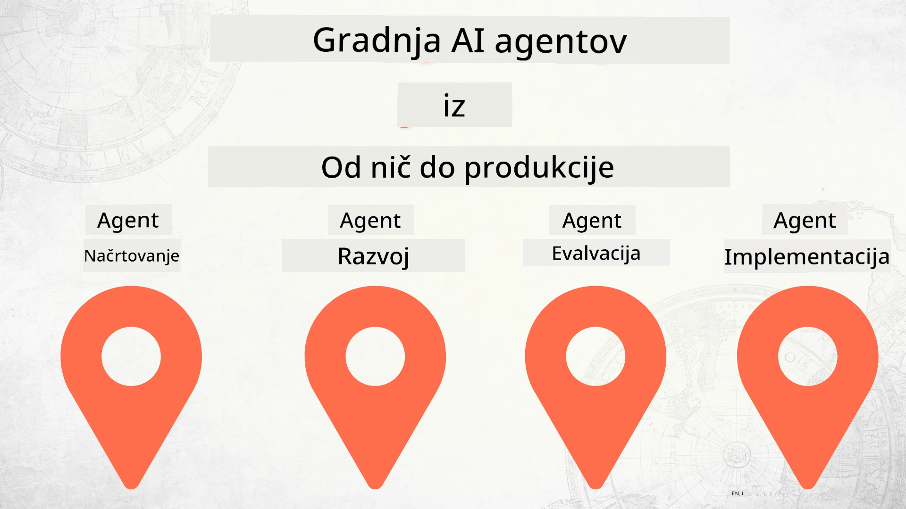

# Izgradnja AI agentov od začetka do produkcije



### 🌐 Podpora za več jezikov

#### Podprto preko GitHub akcije (avtomatizirano in vedno posodobljeno)

<!-- CO-OP TRANSLATOR LANGUAGES TABLE START -->
[Arabščina](../ar/README.md) | [Bengalščina](../bn/README.md) | [Bolgarščina](../bg/README.md) | [Burmanščina (Mjanmar)](../my/README.md) | [Kitajščina (poenostavljena)](../zh-CN/README.md) | [Kitajščina (tradicionalna, Hong Kong)](../zh-HK/README.md) | [Kitajščina (tradicionalna, Macao)](../zh-MO/README.md) | [Kitajščina (tradicionalna, Tajvan)](../zh-TW/README.md) | [Hrvaščina](../hr/README.md) | [Češčina](../cs/README.md) | [Danščina](../da/README.md) | [Nizozemščina](../nl/README.md) | [Estonščina](../et/README.md) | [Finščina](../fi/README.md) | [Francoščina](../fr/README.md) | [Nemščina](../de/README.md) | [Grščina](../el/README.md) | [Hebrejščina](../he/README.md) | [Hindi](../hi/README.md) | [Madžarščina](../hu/README.md) | [Indonezijščina](../id/README.md) | [Italijanščina](../it/README.md) | [Japonščina](../ja/README.md) | [Kannada](../kn/README.md) | [Khmerščina](../km/README.md) | [Korejščina](../ko/README.md) | [Litvanščina](../lt/README.md) | [Malajščina](../ms/README.md) | [Malajalam](../ml/README.md) | [Maratščina](../mr/README.md) | [Nepalščina](../ne/README.md) | [Nigerijski pidžin](../pcm/README.md) | [Norveščina](../no/README.md) | [Perzijščina (Farsi)](../fa/README.md) | [Poljščina](../pl/README.md) | [Portugalščina (Brazilija)](../pt-BR/README.md) | [Portugalščina (Portugalska)](../pt-PT/README.md) | [Pandžabščina (Gurmukhi)](../pa/README.md) | [Romunščina](../ro/README.md) | [Ruščina](../ru/README.md) | [Srbščina (cirilica)](../sr/README.md) | [Slovaščina](../sk/README.md) | [Slovenščina](./README.md) | [Španščina](../es/README.md) | [Svahilščina](../sw/README.md) | [Švedščina](../sv/README.md) | [Tagalog (Filipinski)](../tl/README.md) | [Tamilščina](../ta/README.md) | [Telugu](../te/README.md) | [Tajščina](../th/README.md) | [Turščina](../tr/README.md) | [Ukrajinščina](../uk/README.md) | [Urdu](../ur/README.md) | [Vietnamščina](../vi/README.md)

> **Raje klonirate lokalno?**
>
> Ta repozitorij vključuje več kot 50 jezikovnih prevodov, kar znatno poveča velikost prenosa. Če želite klonirati brez prevodov, uporabite sparse checkout:
>
> **Bash / macOS / Linux:**
> ```bash
> git clone --filter=blob:none --sparse https://github.com/microsoft/Building-AI-Agents-From-Zero-To-Production.git
> cd Building-AI-Agents-From-Zero-To-Production
> git sparse-checkout set --no-cone '/*' '!translations' '!translated_images'
> ```
>
> **CMD (Windows):**
> ```cmd
> git clone --filter=blob:none --sparse https://github.com/microsoft/Building-AI-Agents-From-Zero-To-Production.git
> cd Building-AI-Agents-From-Zero-To-Production
> git sparse-checkout set --no-cone "/*" "!translations" "!translated_images"
> ```
>
> To vam daje vse, kar potrebujete za dokončanje tečaja z veliko hitrejšim prenosom.
<!-- CO-OP TRANSLATOR LANGUAGES TABLE END -->

## Tečaj, ki vas uči osnov življenjskega cikla razvoja AI agenta

[](https://github.com/microsoft/Building-AI-Agents-From-Zero-To-Production/blob/master/LICENSE?WT.mc_id=academic-105485-koreyst)
[](https://GitHub.com/microsoft/Building-AI-Agents-From-Zero-To-Production/graphs/contributors/?WT.mc_id=academic-105485-koreyst)
[](https://GitHub.com/microsoft/Building-AI-Agents-From-Zero-To-Production/issues/?WT.mc_id=academic-105485-koreyst)
[](https://GitHub.com/microsoft/Building-AI-Agents-From-Zero-To-Production/pulls/?WT.mc_id=academic-105485-koreyst)
[](http://makeapullrequest.com?WT.mc_id=academic-105485-koreyst)

[](https://discord.gg/Kuaw3ktsu6)

## 🌱 Začetek

Ta tečaj vsebuje lekcije, ki pokrivajo temelje izgradnje in uvajanja AI agentov.

Vsaka lekcija gradi na prejši, zato priporočamo začetek od začetka in nadaljevanje do konca.

Če želite raziskati več tem o AI agentih, si lahko ogledate [Tečaj AI agentov za začetnike](https://aka.ms/ai-agents-beginners).

### Spoznajte druge udeležence, dobite odgovore na svoja vprašanja

Če se zataknete ali imate kakršnakoli vprašanja o izgradnji AI agentov, se pridružite našemu namenskem Discord kanalu v [Microsoft Foundry Discord](https://discord.gg/Kuaw3ktsu6).

### Kaj potrebujete


Vsaka lekcija ima svoj primer kode, ki jo lahko zaženete lokalno. Lahko [forkate ta repozitorij](https://github.com/microsoft/Building-AI-Agents-From-Zero-To-Production/fork) in ustvarite svojo kopijo.

Ta tečaj trenutno uporablja naslednje:

- [Microsoft Agent Framework (MAF)](https://aka.ms/ai-agents-beginners/agent-framework)
- [Microsoft Foundry](https://azure.microsoft.com/products/ai-foundry) — projekt z nameščenim modelom serije **GPT-5** (na primer `gpt-5.1`). Ne uporabljajte upokojenih modelov GPT-4o / GPT-4.1.
- [Azure OpenAI Service](https://azure.microsoft.com/products/ai-foundry/models/openai)
- [Azure CLI](https://learn.microsoft.com/cli/azure/authenticate-azure-cli?view=azure-cli-latest) — prijavite se z `az login` pred zagonom katerega koli primera
- **Python 3.12 ali novejši**

Poskrbite, da imate dostop do teh storitev, preden začnete.

> **💰 Stroški & čiščenje.** Praktične lekcije ustvarjajo dejanske Azure vire — Microsoft Foundry
> projekt, nameščeni model, vektorsko skladišče in (v Lekcijah 4–6) gostovane agente in orodja.
> Ti lahko povzročajo stroške, dokler obstajajo. Ko končate lekcijo — ali tečaj — izbrišite
> vire, ki jih ne potrebujete več. Najenostavnejši način je, da dajte vse v namensko skupino virov
> in izbrišete celotno skupino, ko končate:
>
> ```bash
> az group delete --name <your-resource-group> --yes --no-wait
> ```
>
> Prav tako lahko izbrišete posamezne agente, vektorska skladišča in orodja prek portala Foundry.

> **Opomba o modelih.** Ta tečaj vse modele zagotavlja preko **Microsoft Foundry**. Ne uporablja
> *GitHub Modelov*, ki so upokojeni 30. julija 2026 — Microsoft Foundry je
> uradna pot migracije. Če imate starejšo kodo, ki kliče GitHub Modele, usmerite jo na nameščen model Foundry
> namesto tega.

Kmalu prihajajo dodatne možnosti glede gostovanja modelov in storitev.

## 🗃️ Lekcije

| **Lekcija**         | **Opis**                                                                                  |
|--------------------|--------------------------------------------------------------------------------------------------|
| [Oblikovanje agenta](./lesson-1-agent-design/README.md)       | Uvod v naš "Uporaba agenta za uvajanje razvijalcev" primer in kako oblikovati učinkovite agente  |
| [Razvoj agenta](./lesson-2-agent-development/README.md)  | Z uporabo Microsoft Agent Framework (MAF) zgradite niz specializiranih agentov za pomoč novim razvijalcem pri uvajanju.       |
| [Vrednotenje agentov](./lesson-3-agent-evals/README.md)  | Z uporabo Microsoft Foundry ugotovite, kako dobro naši AI agenti delujejo in kako jih izboljšati. |
| [Oddaja agenta](./lesson-4-agentdeployment/README.md)   | Z uporabo gostovanih agentov Microsoft Foundry in OpenAI ChatKit oglejte, kako oddati AI agenta v produkcijo.       |
| [Gostovani agenti v produkciji](./lesson-5-hosted-agents-production/README.md)   | Prenesite gostovanega agenta v produkcijo podjetja: gostovani agenti v primerjavi z gostitelji zmožnosti, prinesite lastno shrambo, pomnilnik in upravljanje.       |

| [Microsoft Toolbox](./lesson-6-toolbox/README.md)   | Določite orodja enkrat in jih upravljajte centralno: zgradite orodjarno, jo uporabljajte iz agenta prek ene MCP končne točke in varno različicirajte orodja.       |
| [Multi-Agent & A2A](./lesson-7-multi-agent-a2a/README.md)   | Sestavite agente kot omrežne storitve: omogočite agenta preko odprtega protokola Agent-to-Agent (A2A) in oddaljenega agenta uporabljajte kot vrstnika.       |


## 🎒 Drugi tečaji

Naša ekipa ustvarja tudi druge tečaje! Oglejte si:

<!-- CO-OP TRANSLATOR OTHER COURSES START -->
### LangChain
[](https://aka.ms/langchain4j-for-beginners)
[](https://aka.ms/langchainjs-for-beginners?WT.mc_id=m365-94501-dwahlin)
[](https://github.com/microsoft/langchain-for-beginners?WT.mc_id=m365-94501-dwahlin)
---

### Azure / Edge / MCP / Agentje
[](https://github.com/microsoft/AZD-for-beginners?WT.mc_id=academic-105485-koreyst)
[](https://github.com/microsoft/edgeai-for-beginners?WT.mc_id=academic-105485-koreyst)
[](https://github.com/microsoft/mcp-for-beginners?WT.mc_id=academic-105485-koreyst)
[](https://github.com/microsoft/ai-agents-for-beginners?WT.mc_id=academic-105485-koreyst)

---
 
### Serija o generativni umetni inteligenci

[](https://github.com/microsoft/generative-ai-for-beginners?WT.mc_id=academic-105485-koreyst)
[-9333EA?style=for-the-badge&labelColor=E5E7EB&color=9333EA)](https://github.com/microsoft/Generative-AI-for-beginners-dotnet?WT.mc_id=academic-105485-koreyst)
[-C084FC?style=for-the-badge&labelColor=E5E7EB&color=C084FC)](https://github.com/microsoft/generative-ai-for-beginners-java?WT.mc_id=academic-105485-koreyst)
[-E879F9?style=for-the-badge&labelColor=E5E7EB&color=E879F9)](https://github.com/microsoft/generative-ai-with-javascript?WT.mc_id=academic-105485-koreyst)

---
 
### Osnovno učenje
[](https://aka.ms/ml-beginners?WT.mc_id=academic-105485-koreyst)
[](https://aka.ms/datascience-beginners?WT.mc_id=academic-105485-koreyst)
[](https://aka.ms/ai-beginners?WT.mc_id=academic-105485-koreyst)
[](https://github.com/microsoft/Security-101?WT.mc_id=academic-96948-sayoung)
[](https://aka.ms/webdev-beginners?WT.mc_id=academic-105485-koreyst)
[](https://aka.ms/iot-beginners?WT.mc_id=academic-105485-koreyst)
[](https://github.com/microsoft/xr-development-for-beginners?WT.mc_id=academic-105485-koreyst)

---
 
### Serija Copilot
[](https://aka.ms/GitHubCopilotAI?WT.mc_id=academic-105485-koreyst)
[](https://github.com/microsoft/mastering-github-copilot-for-dotnet-csharp-developers?WT.mc_id=academic-105485-koreyst)
[](https://github.com/microsoft/CopilotAdventures?WT.mc_id=academic-105485-koreyst)
<!-- CO-OP TRANSLATOR OTHER COURSES END -->

## Prispevanje

Ta projekt sprejema prispevke in predloge. Večina prispevkov od vas zahteva, da se strinjate z
Dogovorom o licenci za prispevanje (Contributor License Agreement - CLA), s katerim izjavite, da imate pravico in dejansko podeljujete
pravice za uporabo vašega prispevka. Za podrobnosti obiščite <https://cla.opensource.microsoft.com>.

Ko oddate pull request, bo bot za CLA samodejno ugotovil, ali morate predložiti
CLA in ustrezno označil PR (npr. preverjanje stanja, komentar). Preprosto sledite navodilom,
ki jih zagotovi bot. To boste morali storiti le enkrat za vse repozitorije, ki uporabljajo naš CLA.

Ta projekt je sprejel [Microsoftov Kodeks ravnanja v odprti kodi](https://opensource.microsoft.com/codeofconduct/).
Za več informacij si oglejte [Pogosta vprašanja o Kodeksu ravnanja](https://opensource.microsoft.com/codeofconduct/faq/) ali
kontaktirajte [opencode@microsoft.com](mailto:opencode@microsoft.com) za dodatna vprašanja ali komentarje.

## Znamke

Ta projekt lahko vsebuje blagovne znamke ali logotipe za projekte, izdelke ali storitve. Pooblaščena uporaba Microsoftovih
blagovnih znamk ali logotipov je predmet in mora slediti
[Microsoftovim smernicam za uporabo blagovnih znamk in znamk](https://www.microsoft.com/legal/intellectualproperty/trademarks/usage/general).
Uporaba Microsoftovih blagovnih znamk ali logotipov spremenjenih različicah tega projekta ne sme povzročati zmede ali nakazovati Microsoftovega sponzorstva.
Vsakršna uporaba blagovnih znamk ali logotipov tretjih oseb je podvržena politikam teh tretjih oseb.

## Pridobivanje pomoči

Če naletite na težave ali imate vprašanja o izdelavi AI aplikacij, se pridružite:

[](https://discord.gg/Kuaw3ktsu6)

Če imate povratne informacije o izdelku ali napake med izdelavo, obiščite:

[](https://aka.ms/foundry/forum)

---

<!-- CO-OP TRANSLATOR DISCLAIMER START -->
**Omejitev odgovornosti**:
Ta dokument je bil preveden z uporabo AI prevajalske storitve [Co-op Translator](https://github.com/Azure/co-op-translator). Čeprav si prizadevamo za natančnost, vas prosimo, da upoštevate, da avtomatizirani prevodi lahko vsebujejo napake ali netočnosti. Izvirni dokument v njegovem izvirnem jeziku je treba obravnavati kot avtoritativni vir. Za kritične informacije je priporočljiv strokovni človeški prevod. Ne odgovarjamo za morebitna nesporazume ali napačne interpretacije, ki izhajajo iz uporabe tega prevoda.
<!-- CO-OP TRANSLATOR DISCLAIMER END -->