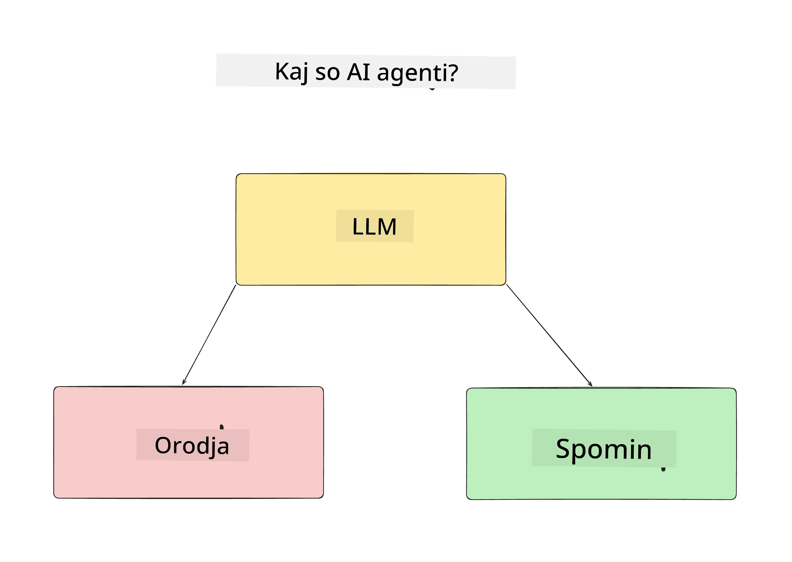
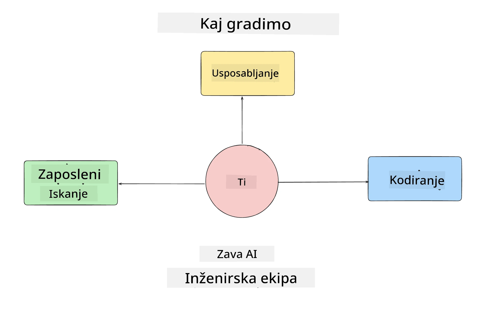
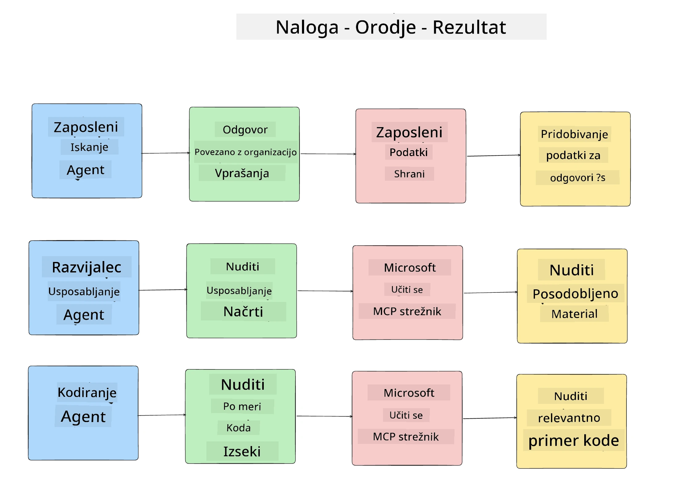
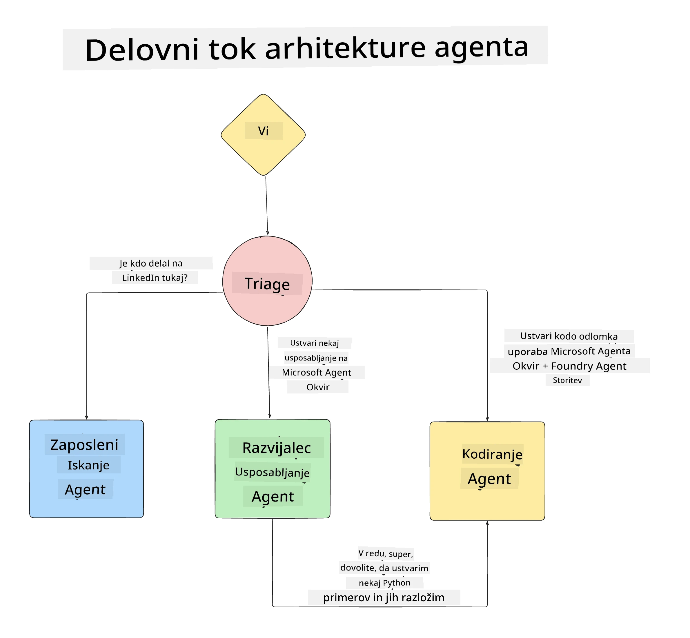

# Lekcija 1: Oblikovanje AI Agenta

Dobrodošli na prvo lekcijo tečaja "Gradnja AI Agenta od začetka do produkcije"!

V tej lekciji bomo obravnavali:

- Določitev, kaj so AI Agenti
  
- Pogovor o AI Agent aplikaciji, ki jo bomo gradili  

- Identifikacijo potrebnih orodij in storitev za vsak agent
  
- Arhitekturo naše Agent aplikacije
  
Začnimo z določitvijo kaj agenti so in zakaj jih uporabljamo v aplikaciji.

> **Preden začnete tečaj.** Ta prva lekcija je konceptualna — ni potrebno zagnati nobene kode.
> Od [Lekcije 2](../lesson-2-agent-development/README.md) naprej boste potrebovali: **Azure naročnino** z dostopom do **Microsoft Foundry**, nameščen **GPT-5 serijski model** (na primer `gpt-5.1` — izogibajte se upokojenima GPT-4o / GPT-4.1), **Python 3.12+** in **Azure CLI** (`az login`). Oglejte si [Kaj potrebujete](../README.md#what-you-need) v predstavitvi tečaja za celoten seznam in povezave.

## Kaj so AI Agenti?

Če prvič raziskujete, kako zgraditi AI Agent, boste morda imeli vprašanja, kako natančno opredeliti, kaj AI Agent pravzaprav je.

Enostaven način za definicijo AI Agenta je preko komponent, ki ga sestavljajo:

**Velik jezikovni model (LLM)** - LLM bo napajal tako zmožnost obdelave naravnega jezika od uporabnika, da interpretira nalogo, ki jo želi opraviti, kot tudi interpretacijo opisov orodij, ki so na voljo za izvedbo teh nalog.

**Orodja** - To so funkcije, API-ji, zbirke podatkov in druge storitve, ki jih lahko LLM izbira za izvedbo nalog, ki jih zahteva uporabnik.

**Pomnilnik** - Tako shranjujemo tako kratkoročne kot dolgoročne interakcije med AI Agentom in uporabnikom. Shranjevanje in pridobivanje teh informacij je pomembno za izboljšave in ohranjanje uporabniških nastavitev skozi čas.

## Naš primer uporabe AI Agenta

Za ta tečaj bomo zgradili AI Agent aplikacijo, ki novim razvijalcem pomaga pri vključitvi v našo ekipo za razvoj AI Agentov!

Preden začnemo z razvojnim delom, je prvi korak pri ustvarjanju uspešne AI Agent aplikacije določiti jasne scenarije, kako pričakujemo, da bodo naši uporabniki sodelovali z našimi AI Agenti.

Za to aplikacijo bomo delali s temi scenariji:

**Scenarij 1**: Novi zaposleni se pridruži naši organizaciji in želi izvedeti več o ekipi, ki ji je priključena, in kako jih kontaktirati.

**Scenarij 2:** Novi zaposleni želi vedeti, katera je najboljša prva naloga, da začne delati.

**Scenarij 3:** Novi zaposleni želi zbrati učne vire in primere kode za pomoč pri začetku pri dokončanju naloge.

## Identifikacija orodij in storitev

Ko imamo te scenarije, je naslednji korak, da jih preslikamo na orodja in storitve, ki jih bodo naši AI agenti potrebovali za dokončanje teh nalog.

Ta postopek spada pod kontekstno inženirstvo, saj se bomo osredotočili na zagotavljanje, da imajo naši AI Agenti pravi kontekst ob pravem času za dokončanje nalog.

Pojdimo scenario po scenariju in izvedimo dobro oblikovanje agenta tako, da našteto naloge, orodja in želene rezultate za vsakega agenta.

### Scenarij 1 - Agent za iskanje zaposlenih

**Naloga** - Odgovarjati na vprašanja o zaposlenih v organizaciji, kot so datum zaposlitve, trenutna ekipa, lokacija in zadnja pozicija.

**Orodja** - Zbirka podatkov trenutnega seznama zaposlenih in organigram

**Rezultati** - Zmožnost pridobiti informacije iz zbirke podatkov za odgovore na splošna organizacijska vprašanja in specifična vprašanja o zaposlenih.

### Scenarij 2 - Agent za priporočanje nalog

**Naloga** - Glede na izkušnje novega zaposlenega razvijalca predlagati 1-3 probleme, na katerih lahko novi zaposleni dela.

**Orodja** - GitHub MCP Strežnik za pridobivanje odprtih problemov in izgradnjo profila razvijalca

**Rezultati** - Zmožnost prebrati zadnjih 5 commitov GitHub profila in odprte probleme na GitHub projektu ter podati priporočila na podlagi ujemanja

### Scenarij 3 - Agent pomočnik za kodo

**Naloga** - Na podlagi odprtih problemov, ki jih je priporočil "Agent za priporočanje nalog", raziskati in zagotoviti vire ter ustvariti kode segmente za pomoč zaposlenemu.

**Orodja** - Microsoft Learn MCP za iskanje virov in Code Interpreter za generiranje prilagojenih kode segmentov.

**Rezultati** - Če uporabnik zahteva dodatno pomoč, naj delovni proces uporabi Learn MCP strežnik za zagotavljanje povezav in delčkov virov ter nato preda nalogo agentu Code Interpreter za generiranje majhnih kode segmentov z razlagami.

## Arhitektura naše Agent aplikacije

Zdaj, ko smo določili vsak naš agent, naredimo arhitekturni diagram, ki nam bo pomagal razumeti, kako bodo agenti delovali skupaj in ločeno glede na nalogo:

## Naslednji koraki

Ko smo zasnovali vsakega agenta in naš agenstski sistem, pojdimo na naslednjo lekcijo, kjer bomo razvili vsak od teh agentov!

---

<!-- CO-OP TRANSLATOR DISCLAIMER START -->
**Omejitev odgovornosti**:
Ta dokument je bil preveden z uporabo AI prevajalske storitve [Co-op Translator](https://github.com/Azure/co-op-translator). Čeprav si prizadevamo za natančnost, vas prosimo, da upoštevate, da avtomatizirani prevodi lahko vsebujejo napake ali netočnosti. Izvirni dokument v njegovem izvirnem jeziku je treba obravnavati kot avtoritativni vir. Za kritične informacije je priporočljiv strokovni človeški prevod. Ne odgovarjamo za morebitna nesporazume ali napačne interpretacije, ki izhajajo iz uporabe tega prevoda.
<!-- CO-OP TRANSLATOR DISCLAIMER END -->