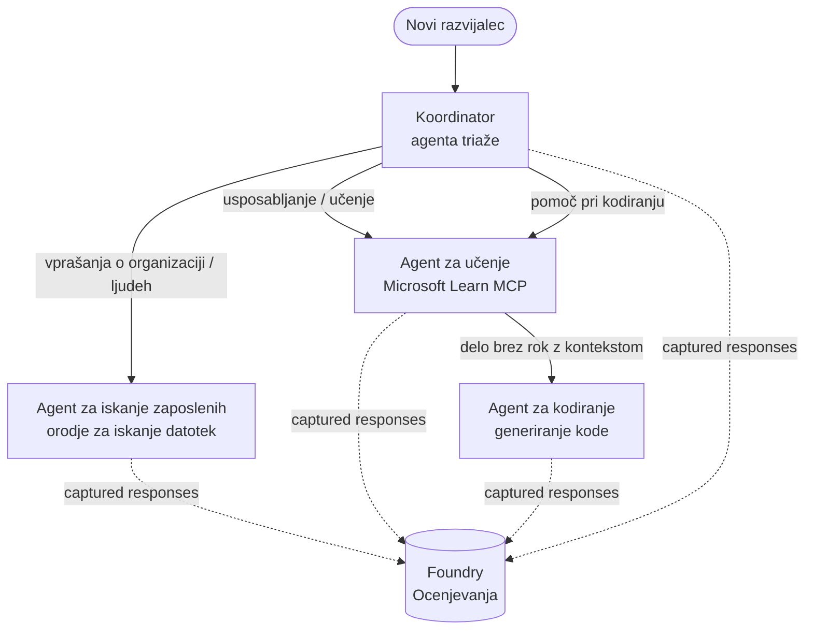

# Lekcija 3: Ocene agentov z Microsoft Foundry

Dobrodošli v tretji lekciji tečaja **"Ustvarjanje AI agentov od nič do produkcije"**!

V [Lekciji 2](../lesson-2-agent-development/README.md) ste ustvarili agente. V tej lekciji se boste
naučili odgovoriti na veliko težje vprašanje: **so dobri?** Poslati agenta, ki
deluje, je lahko; vedeti, ali pravilno usmerja, ostaja zanesljiv glede vaših podatkov in pravilno
uporablja svoja orodja, pa loči demo od produkcijskega sistema.

V tej lekciji bomo obravnavali:

- Zakaj je ocenjevanje agentov pomembno in kako se razlikuje od tradicionalnega testiranja
- Razliko med **opazljivostjo**, **smoke testiranjem** in **ocenjevanji**
- Delo v večagentnem poteku, ki ga bomo merili
- Vgrajene **Microsoft Foundry ocenjevalce** (relevantnost, utemeljenost, natančnost klica orodja, izkoriščanje izhoda orodja)
- Korak za korakom pregled ocenjevalne cevi v [`agent-evals.py`](../../../lesson-3-agent-evals/agent-evals.py)
- Kako jo zagnati in brati rezultate

---

## Zakaj ocenjevati agente?

Tradicionalni enotni test trdi, da `add(2, 2) == 4`. Agenti ne delujejo tako — isti
poziv lahko vsakič ustvari drugačne besede, orodja se lahko kličejo v različnih vrstah in
"pravilno" je pogosto stvar stopnje, ne pa boolean vrednosti. Ne morete trditi o točnih nizih.

Namesto tega agente ocenjujete po **dimenzijah kakovosti** z modeli *ocenjevalci* (tudi
imenovanimi "LLM kot sodnik") skupaj z determinističnimi preverjanji uporabe orodij. To vam pove stvari, kot so:

- Ali je odgovor res naslovil vprašanje? (**relevantnost**)
- Ali je odgovor podprt z pridobljenimi podatki ali je agent haluciniral? (**utemeljenost**)
- Ali je agent poklical pravo orodje z pravimi argumenti? (**natančnost klica orodja**)
- Ali je agent dejansko uporabljal tisto, kar je orodje vrnilo? (**izkoriščanje izhoda orodja**)

### Tri dopolnjujoče plasti kakovosti

To niso tekmovalne tehnike — produkcijski agent uporablja vse tri:

| Plast | Vprašanje, na katerega odgovarja | Strošek | Kdaj teče | Obravnavano v |
|-------|-------------------------------|---------|-----------|--------------|
| **Opazljivost / sledljivost** | *Kaj je agent naredil, korak za korakom?* | Brezplačno (vedno vklopljeno) | Neprekinjeno v produkciji | Ta lekcija |
| **Smoke testi** | *Ali je agent dosegljiv in sledi osnovnemu pozivu?* | Poceni, sekunde | Ob vsakem uvajanju | [Lekcija 4](../lesson-4-agentdeployment/README.md#smoke-testing-the-hosted-agent-ci-gate) |
| **Ocenjevanja** | *Kako **dobri** so odgovori?* | Počasneje, merjeno po modelu | Na zahtevo / ponoči / pred izdajo | Ta lekcija |

Smoke testi odgovarjajo "ali se je pokvarilo?"; ocenjevanja odgovarjajo "ali je dobro?". Želite oboje.

---

## Predpogoji

1. Dokončana [Lekcija 2](../lesson-2-agent-development/README.md) (agenti + vektorska shramba).
2. Projekt **Microsoft Foundry**.
3. Avtentikacija **Azure CLI**: `az login`.
4. Namestitev **Python 3.12+** in odvisnosti tečaja:

   ```bash
   pip install -r ../requirements.txt
   ```

5. Okoljske spremenljivke (ustvarite datoteko `.env` v tej mapi ali jih izvozite):

   | Spremenljivka | Namen |
   |---------------|-------|
   | `FOUNDRY_PROJECT_ENDPOINT` | Končna točka vašega Foundry projekta (`https://<account>.services.ai.azure.com/api/projects/<project>`). Prebere jo `FoundryChatClient` agentov **in** pomočnik za ocenjevanje. |
   | `FOUNDRY_MODEL` | Model namestitve, na katerem tečejo **agenti** (npr. `gpt-5.1`). |
   | `VECTOR_STORE_ID` | Vektorska shramba imenika zaposlenih, ustvarjena v Lekciji 2 |
   | `AZURE_AI_MODEL_DEPLOYMENT_NAME` | Model namestitve, ki ga uporabljajo **ocenjevalci** (privzeto `FOUNDRY_MODEL`, nato `gpt-5.1`) |

> Agenti uporabljajo `FoundryChatClient`, ki prebere konfiguracijo iz spremenljivk z
> predpono `FOUNDRY_` (`FOUNDRY_PROJECT_ENDPOINT`, `FOUNDRY_MODEL`). Pomočnik za ocenjevanje v oblaku
> uporablja SDK `azure-ai-projects` in bo uporabil `FOUNDRY_PROJECT_ENDPOINT`, če
> `AZURE_AI_PROJECT_ENDPOINT` ni nastavljen — zato sta dve spremenljivki `FOUNDRY_` dovolj,
> da zaženete celotno lekcijo.
>
> Ocenjevalce poganja model, zato `AZURE_AI_MODEL_DEPLOYMENT_NAME`
> nadzoruje, katera namestitev izvaja presojo — ni potrebno, da je isti model, ki ga uporabljajo vaši
> agenti.

---

## Potek dela, ki ga ocenjujemo

Za ocenjevanje nečesa ga morate najprej zagnati. Ta lekcija ponovno uporablja večagentni potek dela
**uvajanja razvijalca**: koordinator **triaže** preda nalogo trem specialistom.



Potek je zgrajen z orkestracijo prehoda iz Microsoft Agent Frameworka. Ključna
ideja za ocenjevanje je, da se **vsak obrat agenta shrani strežniško** in identificira z
`response_id`. Te ID-je posredujemo storitvi ocenjevanja.

---

## Ocenjevalna vaja, korak za korakom

[`agent-evals.py`](../../../lesson-3-agent-evals/agent-evals.py) izvaja šeststopenjsko cev. Tukaj je, kaj vsak korak počne
in zakaj.

### Korak 1 — Zaženi potek in spremljaj ID-je odzivov

Potek se izvede z `run_stream(...)`, in ko dogodki pritekajo nazaj, koda shrani
`response_id` in `conversation_id`, ki jih ustvari vsak agent. Shranjeni odgovori so surov
material za ocenjevanje — ocenjevali boste *prave* odzive iz produkcije, ne ponovne
generirane.

### Korak 2 — Povzemi zajeto

Kratek povzetek prikaže, koliko odgovorov je vsak agent ustvaril, tako da lahko potrdite, da je potek
dejansko uporabil agente, ki jih nameravate oceniti.

### Korak 3 — Pridobi končne odzive

Za vsakega agenta se zadnji `response_id` pridobi prek OpenAI-kompatibilnega
odjemalca projekta (`project_client.get_openai_client().responses.retrieve(...)`), da si lahko ogledate
besedilo, ki bo ocenjeno.

### Korak 4 — Ustvari ocenjevanje

Ocenjevanje se ustvari s štirimi **vgrajenimi Foundry ocenjevalci**:

| Ocenjevalec | `evaluator_name` | Kaj meri |
|------------|------------------|----------|
| Relevantnost | `builtin.relevance` | Ali odziv naslavlja uporabnikov zahtevek? |

| Utemeljenost | `builtin.groundedness` | Ali je odgovor podprt z izvlečenimi/ orodnimi podatki (ni zmotno izmišljen)? |
| Natančnost klicev orodij | `builtin.tool_call_accuracy` | So bila klicana prava orodja s pravimi argumenti? |
| Uporaba izhodov orodij | `builtin.tool_output_utilization` | Ali je agent dejansko uporabil rezultate orodij v svojem odgovoru? |

Vsak ocenjevalec se inicializira z nameščanjem, imenovanim z `AZURE_AI_MODEL_DEPLOYMENT_NAME`.

> **Zakaj ti štirje?** Relevantnost in utemeljenost merita *kakovost odgovora*; dva ocenjevalca orodij pa merita *agentno vedenje* — del, ki ga tradicionalne NLP metrike v celoti zgrešijo. Za sistem z več agenti, ki uporablja orodja, so metrični rezultati orodij pogosto tisti, kjer se skrivajo resne regresije.


### Korak 5 — Zaženi ocenjevanje

Zajeti `response_id` se posredujejo funkciji `evals.runs.create(...)` kot vir podatkov. Storitev predvaja vsako shranjeno odgovor skozi vse ocenjevalce.


### Korak 6 — Spremljaj in preberi rezultate

Koda vpraša stanje izvajanja vse dokler ne postane `completed` ali `failed`, nato izpiše štetje rezultatov in **`report_url`** — globoko povezavo do portala Foundry, kjer lahko pregledate rezultate po metriki, število uspehov/neuspehov ter posamezne ocenjene odgovore.


---

## Zaženi ga

```bash
cd lesson-3-agent-evals
python agent-evals.py
```

Privzeto oceni prvi primer poizvedbe
(`"I'm new here! Has anyone worked at Microsoft here?"`). Dva dodatna primera poizvedb z več nameni sta vključena v `run_evaluation_workflow()` — zamenjajte spremenljivko `query`, da preizkusite scenarije usmerjanja,
ki vključujejo več agentov v enem izvajanju.


Pričakovan potek v konzoli:

```
Step 1: Running Developer Onboarding Workflow
Step 2: Response Data Summary
Step 3: Fetching Agent Responses
Step 4: Creating Evaluation
Step 5: Running Evaluation
Step 6: Monitoring Evaluation
  Status: running ...
  Evaluation completed successfully
  Report URL: https://...   <-- open this in the Foundry portal
```

---

## Opazljivost in sledenje

Ocenjevanja vam povedo *kako dobri* so bili odgovori; **opazljivost** vam pove *kaj se je zgodilo*,
da so ti nastali — vsak premik agenta, klic orodja, štetje žetonov in zakasnitev. V Microsoft Foundry
agentna izvajanja pošiljajo OpenTelemetry sledove, ki jih lahko vidite v portalu, Agent Framework pa jih lahko
izvozi v Azure Monitor / Application Insights z enim klicem:

```python
from agent_framework.foundry import FoundryChatClient

client = FoundryChatClient()
client.configure_azure_monitor()   # izvozi sledi + meritve v Application Insights
```

Uporabite sledenje za **razhroščevanje** slabe ocene ocenjevanja: ko utemeljenost pade, sled vam pokaže,
ali orodje za iskanje datotek ni vrnilo ničesar, ali pa je vrnilo podatke, ki jih je agent nato ignoriral (kar je
natanko to, kar ocenjuje uporaba izhodov orodij).

---

## Od "izvajanj" do "dobrega": kako to uporabljati v praksi

- **Prehodni prag.** Zaženi ocenjevanja z nizom reprezentativnih poizvedb, preden promoviraš nov poziv ali model. Primerjaj rezultate s prejšnjo različico — padce obravnavaj kot regresije.

- **Nočni signal kakovosti.** Načrtuj ocenjevanja, da zaznaš odmike zaradi sprememb podatkov ali odvisnosti.

- **Poveži s kratkimi testi.** [Krati test Lekcije 4](../lesson-4-agentdeployment/README.md#smoke-testing-the-hosted-agent-ci-gate) je tvoj hiter prag za vsak deployment; ocenjevanja so počasnejši, globlji prag kakovosti. Cenejšega zaženi ob vsakem združitvi, dražjega pa po urniku ali pred izdajo.


---

## Opomba o modernizaciji

Ta primer je v postopku prenosa na trenutno Microsoft Agent Framework Foundry API površino
(`agent_framework.foundry`). Če posodabljaš kodo, si oglej korenski repozitorij
[`MIGRATION-GUIDE.md`](../MIGRATION-GUIDE.md) za preverjene uvoze in preslikave klientov pred in po (na primer `AzureAIClient` -> `FoundryChatClient`, in gradnja gostovanih orodij preko
`client.get_file_search_tool(...)` / `client.get_mcp_tool(...)`). Koncepti ocenjevanja in šeststopenjski potek zgoraj ostajajo nespremenjeni po tem prenosu.


---

## Viri

- [Ocenjevanje generativnih AI modelov in aplikacij (Microsoft Learn)](https://learn.microsoft.com/en-us/azure/ai-foundry/concepts/evaluation-approach-gen-ai)
- [Vgrajeni ocenjevalci za generativno AI](https://learn.microsoft.com/en-us/azure/ai-foundry/concepts/evaluation-evaluators/agent-evaluators)
- [Opazljivost v Microsoft Foundry](https://learn.microsoft.com/en-us/azure/ai-foundry/concepts/observability)
- [Microsoft Agent Framework](https://github.com/microsoft/agent-framework)
- [Orkestracija predaje agenta](https://learn.microsoft.com/en-us/agent-framework/workflows/orchestrations/handoff)

---

<!-- CO-OP TRANSLATOR DISCLAIMER START -->
**Omejitev odgovornosti**:
Ta dokument je bil preveden z uporabo AI prevajalske storitve [Co-op Translator](https://github.com/Azure/co-op-translator). Čeprav si prizadevamo za natančnost, vas prosimo, da upoštevate, da avtomatizirani prevodi lahko vsebujejo napake ali netočnosti. Izvirni dokument v njegovem izvirnem jeziku je treba obravnavati kot avtoritativni vir. Za kritične informacije je priporočljiv strokovni človeški prevod. Ne odgovarjamo za morebitna nesporazume ali napačne interpretacije, ki izhajajo iz uporabe tega prevoda.
<!-- CO-OP TRANSLATOR DISCLAIMER END -->