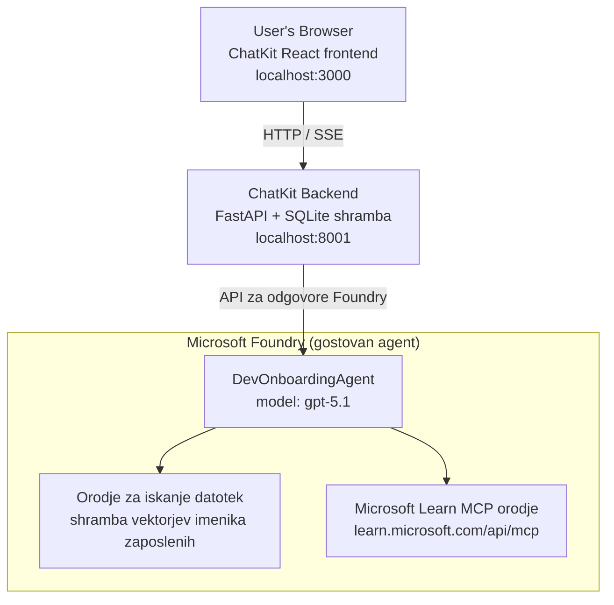

# Lekcija 4: Namestitev agenta z Microsoft Foundry gostovanimi agenti + ChatKit

Ta lekcija prikazuje, kako namestiti agenta, ki uporablja orodja, v Microsoft Foundry kot gostovanega agenta in ustvariti ChatKit-based frontend za interakcijo z njim.

## Arhitektura

Gostovani agent je **en sam `DevOnboardingAgent`** (deluje na `gpt-5.1`), ki odgovarja na vprašanja o uvajanju razvijalcev z uporabo dveh gostovanih orodij: orodja **File Search** nad veektorskim shranjevalnikom employee-directory in orodja **Microsoft Learn MCP**. ChatKit React frontend komunicira s FastAPI backendom, ki kliče agenta preko Foundry **Responses API**.



## Predpogoji

1. **Microsoft Foundry projekt** v regiji North Central US
2. **Azure CLI** avtentikacija (`az login`)
3. **Azure Developer CLI** (`azd`) nameščen
4. **Python 3.12+** in **Node.js 18+**
5. **Vector Store** ustvarjen z zaposlitvenimi podatki

## Hitri začetek

### 1. Nastavite okoljske spremenljivke

```bash
cd lesson-4-agentdeployment
cp .env.example .env
# Uredite .env z vašimi podatki projekta Microsoft Foundry
```

### 2. Namestite gostovanega agenta

**Možnost A: Uporaba Azure Developer CLI (priporočeno)**

```bash
cd hosted-agent
azd auth login
azd agent deploy
```

**Možnost B: Uporaba Docker + Azure Container Registry**

```bash
cd hosted-agent

# Zgradi vsebnik
docker build -t developer-onboarding-agent:latest .

# Oznaka za ACR
docker tag developer-onboarding-agent:latest <your-acr>.azurecr.io/developer-onboarding-agent:latest

# Potisni v ACR
az acr login --name <your-acr>
docker push <your-acr>.azurecr.io/developer-onboarding-agent:latest

# Namesti prek portala Microsoft Foundry ali SDK
```

### 3. Zaženite ChatKit Backend

```bash
cd chatkit-server
python -m venv .venv
source .venv/bin/activate  # Na Windows: .venv\Scripts\activate
pip install -r requirements.txt
python app.py
```

Strežnik bo zagnan na `http://localhost:8001`

### 4. Zaženite ChatKit Frontend

```bash
cd chatkit-server/frontend
npm install
npm run dev
```

Frontend bo zagnan na `http://localhost:3000`

### 5. Preizkusite aplikacijo

Odprite `http://localhost:3000` v vašem brskalniku in poizkusite sledeče poizvedbe:

**Iskanje zaposlenih:**
- "Sem nov tukaj! Ali je kdo delal pri Microsoftu?"
- "Kdo ima izkušnje z Azure Functions?"

**Učni viri:**
- "Ustvari učni načrt za Kubernetes"
- "Katere certifikate naj pridobim za oblak arhitekturo?"

**Pomoč pri kodiranju:**
- "Pomagaj mi napisati Python kodo za povezavo s CosmosDB"
- "Pokaži mi, kako ustvariti Azure Function"

**Poizvedbe z več agenti:**
- "Začenjam kot inženir za oblak. S kom se naj povežem in kaj naj se naučim?"

## Struktura projekta

```
lesson-4-agentdeployment/
├── .env.example                 # Environment variables template
├── implementation-plan.md       # Detailed implementation guide
├── README.md                    # This file
├── hosted-agent/               # Microsoft Foundry hosted agent
│   ├── main.py                 # Multi-agent workflow implementation
│   ├── requirements.txt        # Python dependencies
│   ├── Dockerfile              # Container definition
│   └── agent.yaml              # Agent deployment configuration
└── chatkit-server/             # ChatKit server application
    ├── app.py                  # FastAPI backend
    ├── store.py                # SQLite persistence layer
    ├── requirements.txt        # Python dependencies
    └── frontend/               # React frontend
        ├── package.json
        ├── vite.config.ts
        ├── tsconfig.json
        ├── index.html
        └── src/
            ├── main.tsx
            ├── App.tsx
            ├── App.css
            └── index.css
```

## Agent in njegova orodja

Gostovani agent je **en sam agent** (`DevOnboardingAgent`, definiran v `hosted-agent/main.py`), ki pokriva tri področja uvajanja. Namesto, da bi orkestriral ločene podagente, vsako zmožnost izpostavi kot orodje (ali se neposredno zanaša na model):

| Zmožnost | Kako je obravnavana | Orodje |
|-----------|------------------|------|
| **Iskanje in povezave z zaposlenimi** | Foundry gostovani File Search nad employee-directory vector store | `client.get_file_search_tool(vector_store_ids=[...])` |
| **Učenje in usposabljanje** | Microsoft Learn MCP strežnik (gostovano MCP orodje) | `client.get_mcp_tool(url="https://learn.microsoft.com/api/mcp")` |
| **Pomoč pri kodiranju** | Neposredno obravnavano z modelom `gpt-5.1` — brez zunanjega orodja | — |

Agenta ustvarimo z `client.as_agent(name="DevOnboardingAgent", instructions=..., tools=[file_search_tool, learn_mcp_tool])` in strežemo z `from_agent_framework(agent).run()`.

> **Oblikovalska nota.** Prejšnje različice te lekcije so uporabljale multi-agent workflow z `HandoffBuilder` (Triage → specialisti). Dostavljeni agent je en agent z uporabo orodij, kar je preprosteje za uvajanje in razumevanje Q&A za uvajanje. Za primer multi-agent orkestracije in prenosov glej Lekcijo 2 in Lekcijo 3.

## Smoke Testing gostovanega agenta (CI vrata)

Uspešna namestitev gostovanega agenta samo dokazuje, da je kontrolna raven sprejela
definicijo — **ne** dokazuje, da agent dejansko odgovarja. Manjkajoča odvisnost,
napačna usmeritev modela ali potekel povezovalni ključ lahko pustijo agenta zelenega, a tihega.

Ta lekcija ponuja lahko **smoke test**, ki deluje kot hiter, poceni post-deploy vhod.
Uporablja GitHub Action [AI Smoke Test](https://github.com/marketplace/actions/ai-smoke-test)
za pošiljanje pozivov na Foundry **Responses** končno točko agenta
(`POST {project_endpoint}/agents/{agent_name}/endpoint/protocols/openai/responses`)
in preverjanje vrnjenega besedila. Zazna pokvarjene namestitve, regresije avtentikacije,
premik sistemskih pozivov in prekinitve niti v nekaj sekundah.

> Smoke testi **niso** nadomestilo za popolne ocene v
> [Lekciji 3](../lesson-3-agent-evals/README.md) — dopolnjujejo jih. Smoke testi
> odgovarjajo na *"ali je agent dosegljiv, odgovarja in sledi osnovnim pričakovanjem?"*;
> ocene odgovarjajo na *"kako dober je odgovor?"*. Zaženi ta poceni test ob vsakem nameščanju.

### Kaj se testira

Katalog je v [`hosted-agent/tests/smoke-tests.json`](../../../lesson-4-agentdeployment/hosted-agent/tests/smoke-tests.json)
in pokriva tri domene agenta plus spoštovanje poziva in večkratno nit:

| Test | Kaj preverja |
|------|------------------|
| `reachability` | Agent odgovori z ne-praznim, na temo usmerjenim besedilom |
| `employee-search` | Domena iskanja datotek vrne uspešen status `200` (odgovor je odvisen od podatkov) |
| `learning-path` | Učna domena ponovi temo in poda odgovor v stilu učne poti |
| `coding-assistance` | Domena kodiranja vrne odgovor v obliki kode Python |
| `prompt-adherence-offtopic` | Zahteva izven teme je preusmerjena, ni podrobno odgovorjena |
| `threading-turn-1/2` | Stanje pogovora se ohrani med potezami preko `previous_response_id` |

### Zaženi v CI

Potek dela v [`.github/workflows/smoke-test-hosted-agent.yml`](../../../.github/workflows/smoke-test-hosted-agent.yml)
ima dve nalogi:

- **`static`** — hiter, brez Azure vrata, ki teče ob vsakem pull requestu in push-u:
  prevede vse Python vire (`py_compile`) in preveri Markdown povezave. Brez skrivnosti,
  zato deluje tudi na fork PR-jih.
- **`smoke`** — Azure-povezan smoke test spodaj. Zažene se po potrebi
  (Actions → **Agent CI (static + smoke)** → Run workflow) in je lahko povezan po vaši
  namestitvi.

Nastavite naslednje **spremenljivke** in **skrivnosti** repozitorija za smoke nalogo:

| Vrsta | Ime | Vrednost |
|------|------|-------|
| Spremenljivka | `FOUNDRY_PROJECT_ENDPOINT` | `https://<account>.services.ai.azure.com/api/projects/<project>` |
| Spremenljivka | `HOSTED_AGENT_NAME` | Ime nameščenega agenta (npr. `dev-onboarding` — mora ustrezati vaši namestitvi) |
| Skrivnost | `AZURE_CLIENT_ID` / `AZURE_TENANT_ID` / `AZURE_SUBSCRIPTION_ID` | OIDC federirana identiteta za `azure/login` |

Identiteta izvajalca potrebuje vlogo **`Azure AI User`** v obsegu **Foundry projekta**, da lahko
kliče končne točke Responses (in conversations) podatkovnega sloja. Dodelite z:

```bash
az role assignment create \
  --assignee <object-id-or-appId-of-runner-identity> \
  --role "Azure AI User" \
  --scope "/subscriptions/<sub>/resourceGroups/<rg>/providers/Microsoft.CognitiveServices/accounts/<account>/projects/<project>"
```

### Zaženi lokalno

Enak katalog lahko zaženete pred potiskanjem. Pridobite podatkovni žeton z obsegom
`https://ai.azure.com/` in usmerite izvajalca na vašo namestitev:

```bash
# Ciljna skupina MORA biti https://ai.azure.com/ (žetoni cognitiveservices.azure.com so zavrnjeni)
export FOUNDRY_TOKEN=$(az account get-access-token --resource https://ai.azure.com/ --query accessToken -o tsv)

git clone https://github.com/JFolberth/ai-smoketest && cd ai-smoketest
python runner.py \
  --project-endpoint "https://<account>.services.ai.azure.com/api/projects/<project>" \
  --agent-name dev-onboarding \
  --tests-file ../lesson-4-agentdeployment/hosted-agent/tests/smoke-tests.json
```

Izhodne kode: `0` vsi testi uspešni, `1` je neuspešna trditev, `2` napaka izvajalca (slab katalog / žeton).

## Odpravljanje težav

### Agent ne odgovarja
- Preverite, da je gostovani agent nameščen in deluje v Microsoft Foundry
- Preverite, da `HOSTED_AGENT_NAME` in `HOSTED_AGENT_VERSION` ustrezata vaši namestitvi

### Napake v vector store
- Preverite, da je `VECTOR_STORE_ID` pravilno nastavljen
- Preverite, da vector store vsebuje zaposlitvene podatke

### Napake avtentikacije
- Zaženite `az login` za osvežitev poverilnic
- Preverite, da imate dostop do Microsoft Foundry projekta

## Viri

- [Microsoft Foundry Hosted Agents Dokumentacija](https://learn.microsoft.com/en-us/azure/ai-foundry/agents/concepts/hosted-agents)
- [Microsoft Agent Framework](https://github.com/microsoft/agent-framework)
- [Primer integracije ChatKit](https://github.com/microsoft/agent-framework/tree/main/python/samples/demos/chatkit-integration)
- [Azure Developer CLI](https://learn.microsoft.com/en-us/azure/developer/azure-developer-cli/overview)
- [AI Smoke Test GitHub Action](https://github.com/marketplace/actions/ai-smoke-test)
- [Smoke test Microsoft Foundry agentov z GitHub Actions (blog)](https://techcommunity.microsoft.com/blog/azuredevcommunityblog/smoke-test-microsoft-foundry-agents-with-github-actions/4531912)

---

## Naslednji koraki

Vaš agent teče na Microsoft-u upravljani infrastrukturi. Za prehod v proizvodnjo v podjetju —
nadzor nad tem, kje živijo njegovi podatki (suverenost podatkov, zasebno omrežje, lastna Azure
Cosmos DB / Storage / AI Search) in upravljanje njegovih orodij — nadaljujte na
**[Lekcija 5: Produkcijski gostovani agenti](../lesson-5-hosted-agents-production/README.md)**, ki
pojasnjuje ključno razliko med **Hosted Agents** in **Capability Hosts**.

---

<!-- CO-OP TRANSLATOR DISCLAIMER START -->
**Omejitev odgovornosti**:
Ta dokument je bil preveden z uporabo AI prevajalske storitve [Co-op Translator](https://github.com/Azure/co-op-translator). Čeprav si prizadevamo za natančnost, vas prosimo, da upoštevate, da avtomatizirani prevodi lahko vsebujejo napake ali netočnosti. Izvirni dokument v njegovem izvirnem jeziku je treba obravnavati kot avtoritativni vir. Za kritične informacije je priporočljiv strokovni človeški prevod. Ne odgovarjamo za morebitna nesporazume ali napačne interpretacije, ki izhajajo iz uporabe tega prevoda.
<!-- CO-OP TRANSLATOR DISCLAIMER END -->