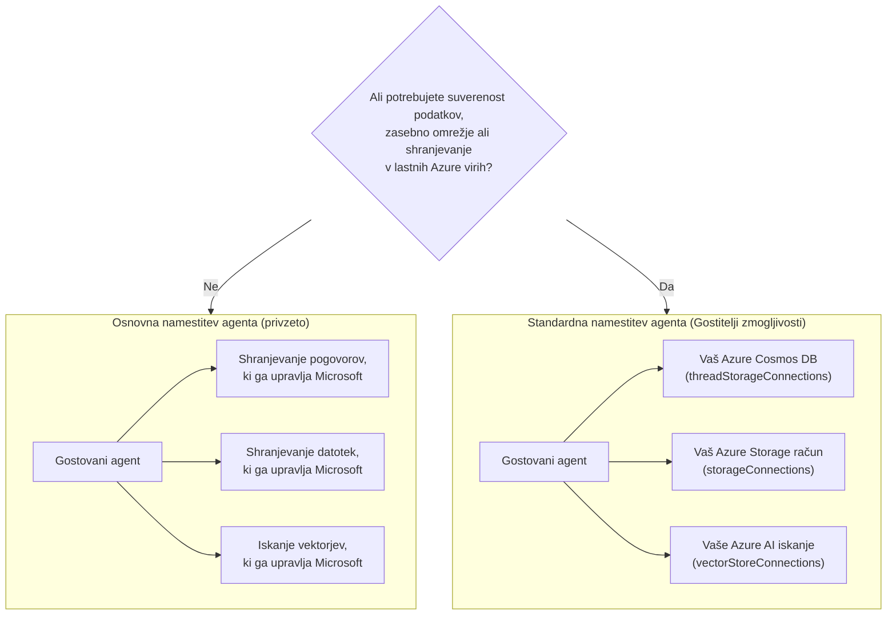

# Lekcija 5: Gostujoči produkcijski agenti — shranjevanje, pomnilnik in upravljanje

V [Lekciji 4](../lesson-4-agentdeployment/README.md) ste namestili razvijalskega onboardinga
agenta kot **Microsoft Foundry gostujočega agenta** in pred njega postavili ChatKit vmesnik. Ta
lekcija je odgovorila na vprašanje *"kako dostaviti agenta?"*. Ta lekcija odgovarja na nadaljnja vprašanja
v podjetju: **Kje so podatki mojega agenta shranjeni? Kdo jih nadzoruje? Kako izpolniti zahteve glede skladnosti,
omrežja in upravljanja?**

Najpomembnejša ideja te lekcije je razlikovanje med **Gostujočim agentom** in
**Gostiteljem zmogljivosti** — dvema konceptoma, ki jih je lahko zamenjati, a rešujeta povsem različne
probleme.

## Cilji učenja

Do konca te lekcije boste znali:

- Pojasniti, kaj vam prinaša **Gostujoči agent** (upravljanje izvajanja s strani Microsofta) in česa **ne**.
- Pojasniti, kaj je **Gostitelj zmogljivosti** in kdaj ga natančno potrebujete.
- Izbrati med **osnovno namestitvijo agenta** (shramba pod Microsoftovim upravljanjem) in **standardno namestitvijo agenta**
  (uporaba lastnih Azure virov).
- Razumeti, kako so **zgodovina pogovorov, nalaganje datotek in vektorske shrambe** trajno shranjeni ter
  kako jih preusmeriti v svoj Azure Cosmos DB, Azure Storage in Azure AI Search.
- Uporabiti nadzorne ukrepe: suverenost podatkov, zasebno omrežje in **odobritev orodja gostujočega MCP**.

---

## Predpogoji

1. Dokončana [Lekcija 4](../lesson-4-agentdeployment/README.md) — gostujoči agent je nameščen.
2. Projekt **Microsoft Foundry** in Azure račun z dovoljenjem za kreiranje virov
   (Cosmos DB, Storage, Azure AI Search) in dodeljevanje vlog v naročnini/skupini virov.
3. Avtoriziran **Azure CLI**: `az login` (in `az account set --subscription <id>`, če imate
   več naročnin).
4. Nameščen **Azure Developer CLI** (`azd`) — uporablja se za provisioning standardne nastavitve.
5. **Python 3.12+** z nameščenimi odvisnostmi tečaja (`pip install -r ../requirements.txt`).
6. Trenutna, neupokojena implementacija modela (npr. `gpt-5.1`). Izogibajte se upokojenim GPT-4o / GPT-4.1.

> Ta lekcija je predvsem konceptualna in fokusirana na načrtovanje upravljanja. Lahko jo preberete od prve do
> zadnje strani brez nameščanja česarkoli, nato pa uporabite praktične vaje, ko boste pripravljeni konfigurirati
> standardno nastavitveno okolje.

---

## 1. Gostujoči agenti: kaj Foundry upravlja za vas

**Gostujoči agent** je agent, katerega *izvrševalno okolje* v celoti upravlja Microsoft
Foundry Agent Service. Ko namestite gostujočega agenta (kot ste naredili v Lekciji 4), Foundry zagotavlja:

- **Računalniške vire** — okolje za izvajanje vašega agentnega kode in orodij.
- **Prilagajanje zmogljivosti** — replike se prilagajajo glede na obremenitev (glejte `agent.yaml` `scale` v Lekciji 4).
- **Identiteto** — upravljano identiteto za agenta, ki se avtenticira v Azure brez skrivnosti.
- **Opazovanje** — sledenje in telemetrija (glejte razdelek o opazovanju v Lekciji 3).
- **Upravljanje seans** — niti/pogovori, tako da večkrožni pogovori "pomnijo" prejšnje korake.

> **Ključna točka:** Ni treba konfigurirati Gostitelja zmogljivosti zgolj za *zagon* gostujočega
> agenta. Gostujoči agent deluje takoj na Microsoftovo upravljani infrastrukturi.

---

## 2. Gostujoči agenti proti Gostiteljem zmogljivosti

**Gostujoči agenti in Gostitelji zmogljivosti rešujejo različne probleme.**

**Gostujoči agenti** zagotavljajo Microsoftovo upravljano izvrševalno okolje, vključno z računalniškimi viri, prilagajanjem zmogljivosti,
identiteto, opazovanjem in upravljanjem seans. Za zagon gostujočega
agenta ni potreben Gostitelj zmogljivosti.

**Gostitelji zmogljivosti** so potrebni le, kadar želite, da Agent Service uporablja **strankine
vire** namesto Microsoftovo upravljane shrambe. Če ste zadovoljni z privzeto
Microsoftovo upravljano shrambo, iskanjem po vektorjih in trajnostjo pogovorov, **konfiguracija Gostitelja zmogljivosti
ni potrebna.**

Če vaša organizacija zahteva **suverenost podatkov, zasebno omrežje, skladnost ali
shranjevanje v lastnih virih Azure Cosmos DB, Azure Storage računu in Azure AI Search-u**, potem
konfigurirate Gostitelje zmogljivosti, da povežete Agent Service s temi viri.

V eni povedi:

> **Gostujoči agent** se nanaša na *kje vaš agent teče*. **Gostitelj zmogljivosti** pa na *kje živijo
> podatki vašega agenta*.

| Skrb | Gostujoči agent | Gostitelj zmogljivosti |
|---------|--------------|-----------------|
| Računalniški viri / prilagajanje / identiteta | ✅ Zagotovljeno | — |
| Opazovanje / sledenje | ✅ Zagotovljeno | — |
| Upravljanje seans pogovora in niti | ✅ Zagotovljeno | Preusmeri *kje se shranjuje* |
| Kje je shranjena zgodovina pogovorov | Privzeto upravlja Microsoft | Vaš Azure Cosmos DB |
| Kje so shranjene naložene datoteke | Privzeto upravlja Microsoft | Vaš Azure Storage račun |
| Kje so shranjene vektorske vdelave | Privzeto upravlja Microsoft | Vaš Azure AI Search |
| Zahteva se za zagon agenta? | ✅ Da (je gostitelj agenta) | ❌ Ne — opcijsko |
| Zahteva se za suverenost podatkov / lastna shramba? | ❌ Samo ne zadostuje | ✅ Da |

---

## 3. Osnovna proti standardni nastavitvi agenta

Foundry opisuje dve nastavitvi podatkov kot **osnovno** in **standardno**.



### Kdaj ostati pri osnovni nastavitvi (brez Gostitelja zmogljivosti)

- Razvoj, prototipiranje in testiranje.
- Znotraj interna orodja, kjer Microsoftovo upravljana shramba ustreza vaši politiki ravnanja s podatki.
- Želite najhitrejšo pot do delujočega agenta z najmanjšo infrastrukturo.

### Kdaj potrebujete standardno nastavitev (Gostitelji zmogljivosti)

- **Suverenost podatkov** — vsi podatki agenta morajo ostati v vaši Azure naročnini/regiji.
- **Varnostni nadzor** — morate uporabljati lastne račune za shranjevanje, baze podatkov in iskalne storitve.
- **Skladnost** — imate regulatorne ali organizacijske zahteve glede lokacije podatkov.
- **Zasebno omrežje** — promet mora ostati znotraj vašega virtualnega omrežja (uporabite lastno virtualno omrežje).

> **Priporočilo Microsofta:** uporabite *ločene* Foundry račune/projekte za standardno in
> osnovno nastavitev. Izogibajte se mešanju vrst nastavitev v istem Foundry računu.

---

## 4. Kako delujejo Gostitelji zmogljivosti

**Gostitelj zmogljivosti** je pod-vir, ki ga konfigurirate na **dveh ravneh**: Foundry **računu**
in Foundry **projektu**. Pove Agent Service, kje shranjevati in obdelovati podatke agenta:
zgodovino pogovorov, nalaganje datotek in vektorske shrambe.

Dve pravili sta najpomembnejši:

1. **Račun pred projektom.** Projekti ne morejo imeti Gostitelja zmogljivosti, če najprej ni
   konfiguriran gostitelj zmogljivosti na ravni računa.

2. **Brez dedovanja konfiguracije.** Gostitelj zmogljivosti **projekta** je tisti, ki ga Agent Service
   dejansko prebere, da se odloči, katere vire za shranjevanje/pogovor/vektor bo uporabil. Povezave na ravni računa
   *niso* samodejno uporabljene v projektu — gostitelj zmogljivosti projekta jih mora
   izrecno navesti.

### Povezave, ki jih standardna nastavitev potrebuje

Gostitelji zmogljivosti se sklicujejo na **povezave** (ustvarjene v vašem Foundry računu/projektu), ki kažejo na
vaše Azure vire:

| Lastnost gostitelja zmogljivosti | Shrani | Vaš Azure vir |
|-------------------------------|--------|--------------|
| `threadStorageConnections` | Definicije agentov + zgodovina pogovorov | Azure Cosmos DB |
| `storageConnections` | Nalaganje datotek / blob storage | Azure Storage Account |
| `vectorStoreConnections` | Vektorske ugnezditve za vračanje/iskanje | Azure AI Search |
| `aiServicesConnections` *(neobvezno)* | Vaši lastni modeli | Azure OpenAI |

Vsaka povezava mora imeti izpolnjena polja `authType`, `category`, `target` (URL končne točke **storitev**, ne
ID vira) in `metadata.ResourceId` (polni Azure ID vira), sicer Agent Service
ne more razrešiti vira med izvajanjem.

### Konfiguracija gostiteljev zmogljivosti (krmilna ravnina)

Gostitelji zmogljivosti se trenutno upravljajo preko **Azure Resource Manager REST API** (za upravljanje gostiteljev zmogljivosti še ni
SDK-ja). Najprej ustvarite gostitelja zmogljivosti **računa**:

```http
PUT https://management.azure.com/subscriptions/{subscriptionId}/resourceGroups/{rg}/providers/Microsoft.CognitiveServices/accounts/{account}/capabilityHosts/{name}?api-version=2025-06-01

{
  "properties": { "capabilityHostKind": "Agents" }
}
```

Nato ustvarite gostitelja zmogljivosti **projekta**, ki se sklicuje na vaše povezave:

```http
PUT https://management.azure.com/subscriptions/{subscriptionId}/resourceGroups/{rg}/providers/Microsoft.CognitiveServices/accounts/{account}/projects/{project}/capabilityHosts/{name}?api-version=2025-06-01

{
  "properties": {
    "capabilityHostKind": "Agents",
    "threadStorageConnections": ["my-cosmosdb-connection"],
    "vectorStoreConnections":  ["my-ai-search-connection"],
    "storageConnections":      ["my-storage-connection"]
  }
}
```

> **Zahteve, ki si jih zapomnite:**
> - **Eden gostitelj zmogljivosti na obseg.** Drugi z istim obsegom vrne `409 Conflict`.
> - **Brez posodobitev.** Za spremembo konfiguracije morate gostitelja zmogljivosti **izbrisati in znova ustvariti**.
> - **Brisanje je uničujoče.** Brisanje gostitelja zmogljivosti odstrani dostop agentov do datotek,
>   pogovorov in vektorskih skladišč, na katere je kazal.

### Preverite, ali deluje

Po konfiguraciji izvedite testni pogovor in potrdite, da:

- Pogovori se pojavijo v **vašem Azure Cosmos DB**.
- Naložene datoteke se pojavijo v **vašem Azure Storage računu**.
- Vektorski podatki se pojavijo v **vašem Azure AI Search indeksu**.

---

## 5. Upravljanje spomina in konteksta

"Upravljanje sej" (funkcija Hosted Agent) in "kje so shranjene niti" (zadeva gostitelja zmogljivosti)
skupaj predstavljata **spomin** vašega agenta:

- **Nit** (pogovor) hrani urejene poteze klepeta. API Responses povezuje klice nitim preko `previous_response_id`
  (to ste videli v testih v Lekciji 4).
- Pri **osnovni nastavitvi** stanje nit/pogovora živi v Microsoftu upravljanem shranjevanju.
- Pri **standardni nastavitvi** isto stanje trajno shrani v **vašem Azure Cosmos DB** preko
  `threadStorageConnections` — s tem dobite trajno, poizvedljivo in suvereno zgodovino pogovorov.

To je razlika med agentom, ki "si zapomni znotraj seje", in podjetniškim
sistemom, kjer je vsak pogovor shranjen znotraj vaše lastne mejne skladnosti.

---

## 6. Kontrolni seznam za upravljanje in varnost

Ta kontrolni seznam uporabite pri napredovanju gostovanega agenta iz prototipa v produkcijo:

- [ ] **Odločite za osnovno ali standardno nastavitev** z uporabo vprašanj v §3 — dokumentirajte odločitev.
- [ ] **Suverenost podatkov:** če je potrebno, konfigurirajte gostitelje zmogljivosti tako, da zgodovina pogovorov
      (Cosmos DB), datoteke (Storage) in vektorji (AI Search) ostanejo v vaši naročnini/regiji.
- [ ] **Zasebno omrežje:** za standardno nastavitev omejite promet z Bring Your Own Virtual
      Network, da podatki ne zapustijo vašega omrežja (pomaga preprečiti iznos podatkov).
- [ ] **RBAC:** dodeljujte minimalne pravice. Ustvarjanje gostiteljev zmogljivosti zahteva **Contributor** na
      Foundry računu; dodeljevanje dostopa do vaših Azure virov zahteva **User Access Administrator**
      ali **Owner**.
- [ ] **Upravljanje gostovanih MCP orodij:** preglejte vsak MCP strežnik, na katerega lahko agent kliče, in nastavite
      **način odobritve** (glej §7). Nikoli ne izpostavite nepreverjenega zunanjega orodja produkcijskemu agentu.
- [ ] **Opazovanje:** potrdite, da je sledenje/telemetrija vklopljena (Lekcija 3), da lahko revidirate klice orodij.
- [ ] **Stroški:** viri, ki jih prinesete sami (Cosmos DB, AI Search, Storage), se zaračunavajo na *vašo* naročnino —
      spremljajte njihovo velikost in nadzorujte. Osnovna nastavitev združi shranjevanje v upravljano storitev.

---

## 7. Gostovana MCP orodja in odobritveni poteki

Agent za uvajanje razvijalcev v Lekciji 4 že uporablja **Gostovano MCP orodje** — 
[Microsoft Learn MCP strežnik](https://learn.microsoft.com/api/mcp) — dodano z:

```python
client.get_mcp_tool(
    name="Microsoft Learn MCP",
    url="https://learn.microsoft.com/api/mcp",
    approval_mode="never_require",
)
```

**Model Context Protocol (MCP)** je odprt standard, ki agentu omogoča odkrivanje in klic zunanjih orodij preko enotnega vmesnika. **Gostovana MCP orodja**
omogočajo Foundryju klic MCP strežnika v imenu agenta. V produkciji so pomembni dva upravljavska vzvoda:


  - `never_require` je priročno za zaupanja vreden, samo-bralni strežnik, kot je Microsoft Learn.
  - Za strežnike, ki lahko **pišejo** ali dostopajo do občutljivih sistemov, zahtevajte odobritev, da se klic
    pregleda pred izvršitvijo. To je vaš **odobritveni potek**.
- **Seznam dovoljenih strežnikov** — povežite le MCP strežnike, ki ste jih pregledali in jim zaupate. MCP
  URL obravnavajte kot vsako drugo produkcijsko odvisnost.


> **Preizkusite:** spremenite `approval_mode` agenta iz Lekcije 4 na zahtevano odobritev, ponovno ga zaženite in
> opazujte, kako klici orodij sedaj čakajo na potrditev pred izvajanjem.

---

## Vaje z vklopom

1. **Klasificirajte scenarij.** Za vsak od teh odločite *osnovno* ali *standardno* nastavitev in to utemeljite:
   (a) demo na hackathonu, (b) pomočnik za uvajanje v zdravstvu, ki obravnava PII, (c) notranji
   FAQ bot, (d) bančni agent, ki mora vse podatke hraniti znotraj regije.
2. **Preslikajte shranjevanje.** Za agenta iz Lekcije 4 navedite, katera lastnost gostitelja zmogljivosti bi shranila
   (a) zgodovino klepeta, (b) naložene datoteke zaposlenih, (c) vektorske ugnezditve.
3. **Oblikujte odobritveni potek.** Dodajte hipotetično MCP orodje "ustvari Jira vstopnico" agentu.
   Kateri `approval_mode` bi uporabili in zakaj?
4. **Analiza stroškov.** Napišite dve ali tri povedi o posledicah stroškov ob prehodu z osnovne
   na standardno nastavitev za agenta z visokim prometom.

---

## Viri

- [Gostitelji zmogljivosti — Microsoft Foundry](https://learn.microsoft.com/azure/foundry/agents/concepts/capability-hosts)
- [Standardna nastavitev agenta (vgrajena pripravljenost za podjetja)](https://learn.microsoft.com/azure/foundry/agents/concepts/standard-agent-setup)

- [Uporabite lastne vire](https://learn.microsoft.com/azure/foundry/agents/how-to/use-your-own-resources)

- [Nastavite svoje okolje agenta (osnovno proti standardnemu)](https://learn.microsoft.com/azure/foundry/agents/environment-setup)
- [Nastavite zasebno omrežje za Foundry Agent Service](https://learn.microsoft.com/azure/foundry/agents/how-to/virtual-networks)
- [Dodajte povezavo v svoj projekt](https://learn.microsoft.com/azure/foundry/how-to/connections-add)
- [Microsoft Learn MCP strežnik](https://learn.microsoft.com/training/support/mcp)
- [Model Context Protocol](https://modelcontextprotocol.io/)

---

**Prejšnje:** [Lekcija 4 — Namestitev agenta](../lesson-4-agentdeployment/README.md) &nbsp;·&nbsp; **Naslednje:** [Lekcija 6 — Microsoft Toolbox](../lesson-6-toolbox/README.md)

---

<!-- CO-OP TRANSLATOR DISCLAIMER START -->
**Omejitev odgovornosti**:
Ta dokument je bil preveden z uporabo AI prevajalske storitve [Co-op Translator](https://github.com/Azure/co-op-translator). Čeprav si prizadevamo za natančnost, vas prosimo, da upoštevate, da avtomatizirani prevodi lahko vsebujejo napake ali netočnosti. Izvirni dokument v njegovem izvirnem jeziku je treba obravnavati kot avtoritativni vir. Za kritične informacije je priporočljiv strokovni človeški prevod. Ne odgovarjamo za morebitna nesporazume ali napačne interpretacije, ki izhajajo iz uporabe tega prevoda.
<!-- CO-OP TRANSLATOR DISCLAIMER END -->