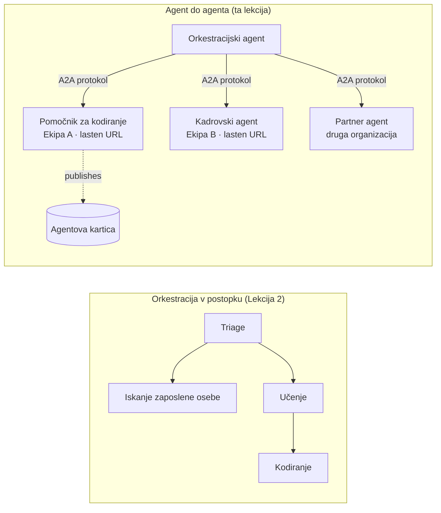

# Lekcija 7: Več-agentna orkestracija in agent-do-agenta (A2A)

Z [Lekcijo 6](../lesson-6-toolbox/README.md) lahko zgradite upravljana orodja in gostovane agente.
Vendar pravi sistemi redko uporabljajo **enega** agenta. Ko se širšate, sestavljate **mnoge** agente – nekatere imate vi,
nekatere pripadajo drugim ekipam, nekatere pa tečejo v drugih organizacijah. Ta lekcija govori o
tem, kako agenti delujejo **skupaj**.

Že ste se srečali z eno obliko več-agentnega oblikovanja v
[Lekciji 2, `agent-orchestration.py`](../lesson-2-agent-development/README.md): vzorcu **predaje**
, kjer agent triaže usmerja do specialistov **znotraj enega procesa**. Ta lekcija se premakne
na višjo raven — do **agent-do-agenta (A2A)**, odprtega protokola za agente, ki tečejo kot neodvisne
**mrežne storitve** in kličejo drug drugega preko procesnih, ekipnih in organizacijskih meja.

## Cilji učenja

Do konca te lekcije boste znali:

- Pojasniti razliko med **orkestracijo znotraj procesa** (predaja/ delovni tokovi) in
  komunikacijo **agent-do-agenta (A2A)** ter izbrati pravo.
- Opisati gradnike A2A: **Agentova kartica**, **spretnosti**, **naloge** in **odkrivanje**.
- **Izpostaviti** Microsoft Agent Framework agenta kot A2A storitev z `A2AExecutor`.
- **Uporabiti** oddaljenega agenta kot mrežnega vrstnika s `A2AAgent`.
- Uporabiti podjetniške vidike za A2A: **varnost, identiteto, upravljanje, opazovanje in stroške**.

---

## Predpogoji

1. Zaključena [Lekcija 2](../lesson-2-agent-development/README.md) (razvoj in orkestracija agentov).
2. Projekt **Microsoft Foundry** z aktivno nameščeno različico modela (na primer `gpt-5.1` in
   `gpt-5-codex` za vzorec kodiranja). Izognite se upokojenim GPT-4o / GPT-4.1.
3. **Azure CLI** prijavljen: `az login`.
4. **Python 3.12+** z nameščenimi odvisnostmi tečaja (`pip install -r ../requirements.txt`).
   Lekcija 7 doda predogledne pakete `agent-framework-a2a`, `a2a-sdk` in `uvicorn`.
5. `FOUNDRY_PROJECT_ENDPOINT` in `FOUNDRY_MODEL` nastavljena v vaši `.env` datoteki (glej README tečaja).

---

## 1. Dva načina sodelovanja agentov

Obstaja več vzorcev "več agentov". Izberite tistega, ki ustreza vaši **meji**:

| Vzorec | Kje tečejo agenti | Kako so povezani | Uporabite, ko |
|---------|------------------|------------------|----------|
| **Predaja / delovni tok** (Lekcija 2) | En proces, ena koda | V-pomnilni graf (`HandoffBuilder`, `WorkflowBuilder`) | Imate vse agente in jih nameščate skupaj. |
| **Agent-do-agenta (A2A)** (ta lekcija) | Ločene storitve, ločeni življenjski cikli | Odprti **A2A protokol** preko HTTP, odkrito s **Agentovimi karticami** | Agenti so v lasti različnih ekip/organizacij, neodvisno skalirajo ali so napisani v različnih okvirjih. |

Predaja je o **usmerjanju znotraj aplikacije**. A2A je o **sestavljanju agentov kot
neodvisnih storitev** — ekvivalent premika iz klicev funkcij na mikro storitve.



> **Sestavljajo se.** Orkestrator, ki ga zgradite s `HandoffBuilder`, lahko vključuje **oddaljene A2A agente**
> kot udeležence — usmerjanje znotraj procesa do storitev, ki same tečejo kjerkoli.

---

## 2. Gradniki A2A

A2A je **odprti protokol** (ni specifičen za Microsoft), zato lahko Microsoft Agent Framework, LangGraph, lastna koda
ali infrastruktura drugih podjetij uporablja A2A agente. Štirje koncepti so pomembni:

- **Agentova kartica** — majhen JSON dokument, objavljen na
  `/.well-known/agent-card.json`, ki predstavlja agenta s **imenom, opisom, URL-jem, različico,
  spretnostmi in zmogljivostmi**. Tako naročnik **odkriva**, kaj lahko oddaljeni agent naredi.
- **Spretnosti** — deklarirane stvari, ki jih agent zna (`id`, `ime`, `opis`, `oznake`,
  `primeri`). Naročniki (in modeli) jih uporabljajo za odločitev, ali ga poklicati.
- **Naloge** — klic A2A agenta je **naloga** z življenjskim ciklom (oddana → v postopku →
  zaključena / neuspešna). Strežnik sledi nalogam v **shrambi nalog**; podprto je pretakanje posodobitev.
- **Odkrivanje** — naročnik z zgolj URL-jem prenese Agentovo kartico in ve, kako agentu klicati.

---

## 3. Izpostavite agenta kot A2A storitev — `a2a_server.py`

Stran **gradnje/strežbe** obdela kateregakoli Microsoft Agent Framework agenta z `A2AExecutor` in ga
namesti na A2A HTTP aplikacijo. Glej [`a2a_server.py`](../../../lesson-7-multi-agent-a2a/a2a_server.py). Ključna povezava:

```python
from agent_framework.a2a import A2AExecutor
from a2a.server.apps import A2AStarletteApplication
from a2a.server.request_handlers import DefaultRequestHandler
from a2a.server.tasks import InMemoryTaskStore
from a2a.types import AgentCapabilities, AgentCard, AgentSkill

agent = client.as_agent(name="coding-assistant", instructions="...")

agent_card = AgentCard(
    name="Coding Assistant",
    description="Generates runnable code samples...",
    url="http://localhost:9000/",
    version="1.0.0",
    capabilities=AgentCapabilities(streaming=True),
    default_input_modes=["text"],
    default_output_modes=["text"],
    skills=[AgentSkill(id="generate-code", name="Generate code",
                       description="Write a runnable code snippet.", tags=["code"])],
)

request_handler = DefaultRequestHandler(
    agent_executor=A2AExecutor(agent),
    task_store=InMemoryTaskStore(),
)
app = A2AStarletteApplication(agent_card=agent_card, http_handler=request_handler).build()
# postreženo z uvicorn na vratih 9000
```

Opazite, da je agentna koda **nespremenjena** — `A2AExecutor` prilagodi vaš obstoječi agent protokolu.
Agentova kartica je torej tisto, kar ga naredi **odkritega** za kateregakoli A2A naročnika.

---

## 4. Porabite oddaljenega agenta — `a2a_client.py`

Stran **porabe** poveže do oddaljenega agenta **po URL-ju**, prenese njegovo Agentovo kartico in ga kliče
točno kot lokalnega agenta. Glej [`a2a_client.py`](../../../lesson-7-multi-agent-a2a/a2a_client.py):

```python
from agent_framework.a2a import A2AAgent

remote_agent = A2AAgent(name="remote-coding-assistant", url="http://localhost:9000")
result = await remote_agent.run("Write a Python function that reverses a string.")
print(result.text)
```

To je celotni namen A2A: z vidika kličočega se oddaljeni agent vede kot kateri koli drug
`agent_framework` agent, zato ga lahko vključite v delovne tokove ali mu predate delo — tudi če teče
v drugem procesu, na drugem računalniku, v lasti druge ekipe.

### Zaženite od začetka do konca

```bash
# Terminal 1 — začnite storitev A2A
python a2a_server.py

# Terminal 2 — pokličite jo
python a2a_client.py "Write a Python function that reverses a string."
```

Odgovor pomočnika za kodiranje boste prejeli preko A2A protokola. Odprite
`http://localhost:9000/.well-known/agent-card.json` v brskalniku, da vidite objavljeno Agentovo kartico.

---

## 5. Podjetniški vidiki

Pretvorba agentov v mrežne storitve prinaša enake izzive kot kateri koli distribuirani sistem —
plus nekaj specifičnih za umetno inteligenco:


- **Identiteta in overjanje.** Nikoli ne razkrivajte neavtenticiranega A2A agenta. Kartica agenta nosi
  `security` / `security_schemes`, in `A2AAgent` sprejema `auth_interceptor`, da klicatelji pripnejo
  poverilnice (OAuth preverjevalne žetone, API ključe). Za overjanje med storitvami v produkciji uporabite Entra ID / upravljane identitete;
  storitev postavite za proxy strežnik.
- **Upravljanje.** Združite A2A z [Orodjarno lekcije 6](../lesson-6-toolbox/README.md): oddaljenega
  agenta je mogoče objaviti kot **A2A orodje** znotraj upravljane orodjarne, da veljata RBAC, vbrizgavanje poverilnic
  in politike varnostnih omejitev na centralni ravni.
- **Opazljivost.** Zahteva zdaj presega meje procesov, zato prenesite sledenje prek klica.
  Omogočite [Foundry Observability / OpenTelemetry](../lesson-3-agent-evals/README.md) na **obeh**
  orkestratorju in vsakem oddaljenem agentu, da dobite enoten sled od začetka do konca.
- **Različice.** Kartica agenta ima `version`. Obnašajte se do nje kot do API-ja: dodatne spremembe so varne;
  sprememba pogodbe o veščini zahteva novo različico in prehodno obdobje za odjemalce.
- **Zanesljivost.** Oddaljeni agenti odpovedo neodvisno. Nastavite časovne omejitve (`A2AAgent(timeout=...)`), obravnavajte
  delne odpovedi in ne dovolite, da eden sam počasen kolega blokira celotno orkestracijo.
- **Stroški.** Vsak klic oddaljenega agenta je svojevrsten poziv modela. Širjenje povečuje porabo žetonov —
  načrtujte za to in raje usmerjajte k **enem** najboljšemu agentu kot pošiljanje množicam.

---

## Praktične vaje

1. **Dodajte drugo storitev.** Kopirajte `a2a_server.py`, da razkrijete agenta **employee-search** na vratih
   9001 z lastno Kartico agenta in veščinami. Zaženite oba in naj ju stranka pokliče.
2. **Orkestrirajte oddaljene kolege.** Zgradite majhen `HandoffBuilder` (ali enostaven usmerjevalnik), katerega udeleženci
   vključujejo dva `A2AAgent`s, ki kažeta na vaši dve storitvi. Usmerite poizvedbo do pravega.
3. **Zavarujte jo.** Dodajte `auth_interceptor` klientu in zahtevajte preverjevalni žeton na strežniku.
   Kaj se pokvari, če žeton manjka? Kje bi hranili žeton v produkciji?
4. **Handoff proti A2A.** Napišite dva kratka odstavka: kdaj bi obdržali prenos v procesu iz lekcije 2,
   in kdaj je dodatna kompleksnost A2A upravičena? Podajte konkreten primer za vsakega.

---

## Viri

- [Agent-to-Agent (A2A) — Microsoft Agent Framework](https://learn.microsoft.com/agent-framework/user-guide/agent-orchestration/a2a)
- [Orkestracija več agentov — Microsoft Agent Framework](https://learn.microsoft.com/agent-framework/user-guide/agent-orchestration/)
- [Specifikacija protokola A2A](https://a2a-protocol.org/)
- [A2A Python SDK (`a2a-sdk`)](https://github.com/a2aproject/a2a-python)
- [Foundry Agent Service — vzorci za več agentov](https://learn.microsoft.com/azure/ai-foundry/agents/concepts/connected-agents)

---

**Prejšnje:** [Lekcija 6 — Microsoft Toolbox](../lesson-6-toolbox/README.md)

---

<!-- CO-OP TRANSLATOR DISCLAIMER START -->
**Omejitev odgovornosti**:
Ta dokument je bil preveden z uporabo AI prevajalske storitve [Co-op Translator](https://github.com/Azure/co-op-translator). Čeprav si prizadevamo za natančnost, vas prosimo, da upoštevate, da avtomatizirani prevodi lahko vsebujejo napake ali netočnosti. Izvirni dokument v njegovem izvirnem jeziku je treba obravnavati kot avtoritativni vir. Za kritične informacije je priporočljiv strokovni človeški prevod. Ne odgovarjamo za morebitna nesporazume ali napačne interpretacije, ki izhajajo iz uporabe tega prevoda.
<!-- CO-OP TRANSLATOR DISCLAIMER END -->