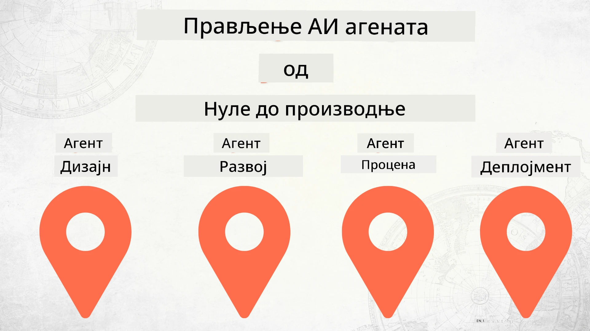

# Прављење AI агената од нуле до продукције



### 🌐 Подршка за више језика

#### Подржано преко GitHub Action (Аутоматизовано и увек ажурирано)

<!-- CO-OP TRANSLATOR LANGUAGES TABLE START -->
[Arabic](../ar/README.md) | [Bengali](../bn/README.md) | [Bulgarian](../bg/README.md) | [Burmese (Myanmar)](../my/README.md) | [Chinese (Simplified)](../zh-CN/README.md) | [Chinese (Traditional, Hong Kong)](../zh-HK/README.md) | [Chinese (Traditional, Macau)](../zh-MO/README.md) | [Chinese (Traditional, Taiwan)](../zh-TW/README.md) | [Croatian](../hr/README.md) | [Czech](../cs/README.md) | [Danish](../da/README.md) | [Dutch](../nl/README.md) | [Estonian](../et/README.md) | [Finnish](../fi/README.md) | [French](../fr/README.md) | [German](../de/README.md) | [Greek](../el/README.md) | [Hebrew](../he/README.md) | [Hindi](../hi/README.md) | [Hungarian](../hu/README.md) | [Indonesian](../id/README.md) | [Italian](../it/README.md) | [Japanese](../ja/README.md) | [Kannada](../kn/README.md) | [Khmer](../km/README.md) | [Korean](../ko/README.md) | [Lithuanian](../lt/README.md) | [Malay](../ms/README.md) | [Malayalam](../ml/README.md) | [Marathi](../mr/README.md) | [Nepali](../ne/README.md) | [Nigerian Pidgin](../pcm/README.md) | [Norwegian](../no/README.md) | [Persian (Farsi)](../fa/README.md) | [Polish](../pl/README.md) | [Portuguese (Brazil)](../pt-BR/README.md) | [Portuguese (Portugal)](../pt-PT/README.md) | [Punjabi (Gurmukhi)](../pa/README.md) | [Romanian](../ro/README.md) | [Russian](../ru/README.md) | [Serbian (Cyrillic)](./README.md) | [Slovak](../sk/README.md) | [Slovenian](../sl/README.md) | [Spanish](../es/README.md) | [Swahili](../sw/README.md) | [Swedish](../sv/README.md) | [Tagalog (Filipino)](../tl/README.md) | [Tamil](../ta/README.md) | [Telugu](../te/README.md) | [Thai](../th/README.md) | [Turkish](../tr/README.md) | [Ukrainian](../uk/README.md) | [Urdu](../ur/README.md) | [Vietnamese](../vi/README.md)

> **Преферирате да клонирате локално?**
>
> Овај репозиторијум укључује више од 50 превода што значајно повећава величину преузимања. Да бисте клонирали без превода, користите sparse checkout:
>
> **Bash / macOS / Linux:**
> ```bash
> git clone --filter=blob:none --sparse https://github.com/microsoft/Building-AI-Agents-From-Zero-To-Production.git
> cd Building-AI-Agents-From-Zero-To-Production
> git sparse-checkout set --no-cone '/*' '!translations' '!translated_images'
> ```
>
> **CMD (Windows):**
> ```cmd
> git clone --filter=blob:none --sparse https://github.com/microsoft/Building-AI-Agents-From-Zero-To-Production.git
> cd Building-AI-Agents-From-Zero-To-Production
> git sparse-checkout set --no-cone "/*" "!translations" "!translated_images"
> ```
>
> Ово вам даје све што вам је потребно за завршетак курса са знатно бржим преузимањем.
<!-- CO-OP TRANSLATOR LANGUAGES TABLE END -->

## Курс који вас учи основама животног циклуса развоја AI агената

[](https://github.com/microsoft/Building-AI-Agents-From-Zero-To-Production/blob/master/LICENSE?WT.mc_id=academic-105485-koreyst)
[](https://GitHub.com/microsoft/Building-AI-Agents-From-Zero-To-Production/graphs/contributors/?WT.mc_id=academic-105485-koreyst)
[](https://GitHub.com/microsoft/Building-AI-Agents-From-Zero-To-Production/issues/?WT.mc_id=academic-105485-koreyst)
[](https://GitHub.com/microsoft/Building-AI-Agents-From-Zero-To-Production/pulls/?WT.mc_id=academic-105485-koreyst)
[](http://makeapullrequest.com?WT.mc_id=academic-105485-koreyst)

[](https://discord.gg/Kuaw3ktsu6)

## 🌱 Почетак рада

Овај курс садржи лекције о основама прављења и распоређивања AI агената.

Свака лекција надовезује се на претходну, зато препоручујемо да почнете од почетка и пролазите кроз курс до краја.

Ако желите да истражите више о темама AI агената, можете погледати [Курс за почетнике у AI агентима](https://aka.ms/ai-agents-beginners).

### Упознајте друге учеснике, добијте одговоре на ваша питања

Ако запнете или имате било каквих питања о прављењу AI агената, придружите се нашем посвећеном Discord каналу у [Microsoft Foundry Discord](https://discord.gg/Kuaw3ktsu6).

### Шта вам је потребно

Свака лекција има свој пример кода који можете покренути локално. Можете [форкирати овај репо](https://github.com/microsoft/Building-AI-Agents-From-Zero-To-Production/fork) да направите своју копију.

Овај курс тренутно користи следеће:

- [Microsoft Agent Framework (MAF)](https://aka.ms/ai-agents-beginners/agent-framework)
- [Microsoft Foundry](https://azure.microsoft.com/products/ai-foundry)
- [Azure OpenAI Service](https://azure.microsoft.com/products/ai-foundry/models/openai)
- [Azure CLI](https://learn.microsoft.com/cli/azure/authenticate-azure-cli?view=azure-cli-latest)

Молимо вас да проверите да ли имате приступ овим услугама пре него што почнете.

Ускоро долазе и друге опције око хостинга модела и услуга.

## 🗃️ Лекције

| **Лекција**         | **Опис**                                                                                  |
|--------------------|--------------------------------------------------------------------------------------------------|
| [Дизајн агента](./lesson-1-agent-design/README.md)       | Увод у случај коришћења "Userboarding Development" агента и како дизајнирати ефективне агенте  |
| [Развој агента](./lesson-2-agent-development/README.md)  | Коришћењем Microsoft Agent Framework-а (MAF), креирајте 3 агента која помажу новим програмерима да се укључе.       |
| [Евалуације агената](./lesson-3-agent-evals/README.md)  | Уз помоћ Microsoft Foundry сазнајте колико добро наши AI агенти раде и како их побољшати. |
| [Распоређивање агената](./lesson-4-agent-deployment/README.md)   | Коришћењем Hosted Agents и OpenAI Chatkit-а, видите како се AI агент распоређује у продукцију.       |


## 🎒 Остали курсеви

Наш тим производи и друге курсеве! Погледајте:

<!-- CO-OP TRANSLATOR OTHER COURSES START -->
### LangChain
[](https://aka.ms/langchain4j-for-beginners)
[](https://aka.ms/langchainjs-for-beginners?WT.mc_id=m365-94501-dwahlin)
[](https://github.com/microsoft/langchain-for-beginners?WT.mc_id=m365-94501-dwahlin)
---

### Azure / Edge / MCP / Агенти
[](https://github.com/microsoft/AZD-for-beginners?WT.mc_id=academic-105485-koreyst)
[](https://github.com/microsoft/edgeai-for-beginners?WT.mc_id=academic-105485-koreyst)
[](https://github.com/microsoft/mcp-for-beginners?WT.mc_id=academic-105485-koreyst)
[](https://github.com/microsoft/ai-agents-for-beginners?WT.mc_id=academic-105485-koreyst)

---
 
### Генеративни AI серијал
[](https://github.com/microsoft/generative-ai-for-beginners?WT.mc_id=academic-105485-koreyst)
[-9333EA?style=for-the-badge&labelColor=E5E7EB&color=9333EA)](https://github.com/microsoft/Generative-AI-for-beginners-dotnet?WT.mc_id=academic-105485-koreyst)
[-C084FC?style=for-the-badge&labelColor=E5E7EB&color=C084FC)](https://github.com/microsoft/generative-ai-for-beginners-java?WT.mc_id=academic-105485-koreyst)
[-E879F9?style=for-the-badge&labelColor=E5E7EB&color=E879F9)](https://github.com/microsoft/generative-ai-with-javascript?WT.mc_id=academic-105485-koreyst)

---
 
### Основно учење
[](https://aka.ms/ml-beginners?WT.mc_id=academic-105485-koreyst)
[](https://aka.ms/datascience-beginners?WT.mc_id=academic-105485-koreyst)
[](https://aka.ms/ai-beginners?WT.mc_id=academic-105485-koreyst)
[](https://github.com/microsoft/Security-101?WT.mc_id=academic-96948-sayoung)
[](https://aka.ms/webdev-beginners?WT.mc_id=academic-105485-koreyst)
[](https://aka.ms/iot-beginners?WT.mc_id=academic-105485-koreyst)
[](https://github.com/microsoft/xr-development-for-beginners?WT.mc_id=academic-105485-koreyst)

---
 
### Copilot серија
[](https://aka.ms/GitHubCopilotAI?WT.mc_id=academic-105485-koreyst)
[](https://github.com/microsoft/mastering-github-copilot-for-dotnet-csharp-developers?WT.mc_id=academic-105485-koreyst)
[](https://github.com/microsoft/CopilotAdventures?WT.mc_id=academic-105485-koreyst)
<!-- CO-OP TRANSLATOR OTHER COURSES END -->

## Допринос

Овај пројекат поздравља доприносе и предлоге. Већина доприноса захтева да се сложите са
Уговором о лиценци доприносиоца (CLA) којим изјављујете да имате право и заиста нам дајете
права на коришћење вашег доприноса. За детаље посетите <https://cla.opensource.microsoft.com>.

Када пошаљете захтев за повлачење (pull request), CLA бот ће аутоматски одредити да ли је потребно
да доставите CLA и означити PR на одговарајући начин (нпр. провера статуса, коментар). Једноставно пратите упутства
која вам бот даје. Ово ћете морати да урадите само једном за све репозиторијуме који користе наш CLA.

Овај пројекат је усвојио [Microsoft општи кодекс понашања за отворени софтвер](https://opensource.microsoft.com/codeofconduct/).
За више информација погледајте [FAQ о Кодексу понашања](https://opensource.microsoft.com/codeofconduct/faq/) или
контактирајте [opencode@microsoft.com](mailto:opencode@microsoft.com) за додатна питања или коментаре.

## Заштитни знаци

Овај пројекат може да садржи заштитне знаке или логотипе пројеката, производа или услуга. Овлашћена употреба Microsoft
заштитних знакова или логотипа подлеже и мора следити
[Microsoft-ова упутства за коришћење заштитних знакова и брендова](https://www.microsoft.com/legal/intellectualproperty/trademarks/usage/general).
Употреба Microsoft-ових заштитних знакова или логотипа у изменљивим верзијама овог пројекта не сме изазивати конфузију нити имплицирати помоћ Microsoft-а.
Свака употреба заштитних знакова или логотипа трећих страна подлеже политикама тих трећих страна.

## Помоћ

Ако запнете или имате питања о прављењу AI апликација, придружите се:

[](https://discord.gg/Kuaw3ktsu6)

Ако имате повратне информације о производу или грешке током прављења, посетите:

[](https://aka.ms/foundry/forum)

---

<!-- CO-OP TRANSLATOR DISCLAIMER START -->
**Пажња**:
Овај документ је преведен коришћењем АИ услуге за превод [Co-op Translator](https://github.com/Azure/co-op-translator). Иако настојимо да превод буде тачан, молимо вас да имате у виду да аутоматски преводи могу садржати грешке или нетачности. Оригинални документ на свом изворном језику треба сматрати ауторитетом. За критичне информације препоручује се професионални људски превод. Нисмо одговорни за било каква неспоразума или погрешна тумачења која произлазе из коришћења овог превода.
<!-- CO-OP TRANSLATOR DISCLAIMER END -->