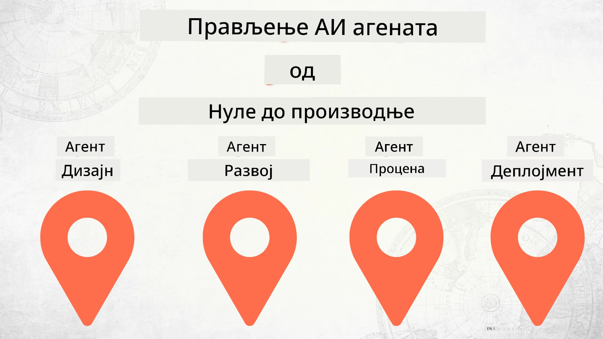

# Прављење AI агената од почетка до производње



### 🌐 Подршка за више језика

#### Подржано преко GitHub акције (Аутоматизовано и увек ажурно)

<!-- CO-OP TRANSLATOR LANGUAGES TABLE START -->
[Arabic](../ar/README.md) | [Bengali](../bn/README.md) | [Bulgarian](../bg/README.md) | [Burmese (Myanmar)](../my/README.md) | [Chinese (Simplified)](../zh-CN/README.md) | [Chinese (Traditional, Hong Kong)](../zh-HK/README.md) | [Chinese (Traditional, Macau)](../zh-MO/README.md) | [Chinese (Traditional, Taiwan)](../zh-TW/README.md) | [Croatian](../hr/README.md) | [Czech](../cs/README.md) | [Danish](../da/README.md) | [Dutch](../nl/README.md) | [Estonian](../et/README.md) | [Finnish](../fi/README.md) | [French](../fr/README.md) | [German](../de/README.md) | [Greek](../el/README.md) | [Hebrew](../he/README.md) | [Hindi](../hi/README.md) | [Hungarian](../hu/README.md) | [Indonesian](../id/README.md) | [Italian](../it/README.md) | [Japanese](../ja/README.md) | [Kannada](../kn/README.md) | [Khmer](../km/README.md) | [Korean](../ko/README.md) | [Lithuanian](../lt/README.md) | [Malay](../ms/README.md) | [Malayalam](../ml/README.md) | [Marathi](../mr/README.md) | [Nepali](../ne/README.md) | [Nigerian Pidgin](../pcm/README.md) | [Norwegian](../no/README.md) | [Persian (Farsi)](../fa/README.md) | [Polish](../pl/README.md) | [Portuguese (Brazil)](../pt-BR/README.md) | [Portuguese (Portugal)](../pt-PT/README.md) | [Punjabi (Gurmukhi)](../pa/README.md) | [Romanian](../ro/README.md) | [Russian](../ru/README.md) | [Serbian (Cyrillic)](./README.md) | [Slovak](../sk/README.md) | [Slovenian](../sl/README.md) | [Spanish](../es/README.md) | [Swahili](../sw/README.md) | [Swedish](../sv/README.md) | [Tagalog (Filipino)](../tl/README.md) | [Tamil](../ta/README.md) | [Telugu](../te/README.md) | [Thai](../th/README.md) | [Turkish](../tr/README.md) | [Ukrainian](../uk/README.md) | [Urdu](../ur/README.md) | [Vietnamese](../vi/README.md)

> **Волите да клонирате локално?**
>
> Овај репозиторијум укључује преводе на преко 50 језика што значајно повећава величину преузимања. За клонирање без превода, користите sparse checkout:
>
> **Bash / macOS / Linux:**
> ```bash
> git clone --filter=blob:none --sparse https://github.com/microsoft/Building-AI-Agents-From-Zero-To-Production.git
> cd Building-AI-Agents-From-Zero-To-Production
> git sparse-checkout set --no-cone '/*' '!translations' '!translated_images'
> ```
>
> **CMD (Windows):**
> ```cmd
> git clone --filter=blob:none --sparse https://github.com/microsoft/Building-AI-Agents-From-Zero-To-Production.git
> cd Building-AI-Agents-From-Zero-To-Production
> git sparse-checkout set --no-cone "/*" "!translations" "!translated_images"
> ```
>
> Ово вам даје све што вам треба да завршите курс са много бржим преузимањем.
<!-- CO-OP TRANSLATOR LANGUAGES TABLE END -->

## Курс који вас учи основама животног циклуса развоја AI агената

[](https://github.com/microsoft/Building-AI-Agents-From-Zero-To-Production/blob/master/LICENSE?WT.mc_id=academic-105485-koreyst)
[](https://GitHub.com/microsoft/Building-AI-Agents-From-Zero-To-Production/graphs/contributors/?WT.mc_id=academic-105485-koreyst)
[](https://GitHub.com/microsoft/Building-AI-Agents-From-Zero-To-Production/issues/?WT.mc_id=academic-105485-koreyst)
[](https://GitHub.com/microsoft/Building-AI-Agents-From-Zero-To-Production/pulls/?WT.mc_id=academic-105485-koreyst)
[](http://makeapullrequest.com?WT.mc_id=academic-105485-koreyst)

[](https://discord.gg/Kuaw3ktsu6)

## 🌱 Започните

Овај курс садржи лекције које покривају основе прављења и пуштања у рад AI агената.

Сваку лекцију треба проћи редом, зато препоручујемо да почнете од почетка и наставите до краја.

Ако желите више да истражите теме о AI агентима, можете погледати [Курс AI агената за почетнике](https://aka.ms/ai-agents-beginners).

### Упознајте друге ученика, добијте одговоре на ваша питања

Ако запнете или имате питања о прављењу AI агената, придружите се нашем посвећеном Discord каналу у [Microsoft Foundry Discord](https://discord.gg/Kuaw3ktsu6).

### Шта је потребно

Свaka лекција има свој код који можете покренути локално. Можете [форковати овај репозиторијум](https://github.com/microsoft/Building-AI-Agents-From-Zero-To-Production/fork) и направити своју копију.

За овај курс се тренутно користе следеће:

- [Microsoft Agent Framework (MAF)](https://aka.ms/ai-agents-beginners/agent-framework)
- [Microsoft Foundry](https://azure.microsoft.com/products/ai-foundry) — пројекат са имплементираним моделом серије **GPT-5** (на пример `gpt-5.1`). Не користити пензионисане моделе GPT-4o / GPT-4.1.
- [Azure OpenAI Service](https://azure.microsoft.com/products/ai-foundry/models/openai)
- [Azure CLI](https://learn.microsoft.com/cli/azure/authenticate-azure-cli?view=azure-cli-latest) — пријавите се командом `az login` пре покретања било ког примера
- **Python 3.12 или новији**

Молимо осигурајте да имате приступ овим услугама пре него што започнете.

> **💰 Трошкови и чишћење.** Практичне лекције креирају стварне Azure ресурсе — Microsoft Foundry
> пројекат, распоређени модел, сервиси за складиштење вектора и (у лекцијама 4–6) хостовани агенти и алатке.
> Ови ресурси могу правити трошкове док постоје. Када завршите лекцију — или цео курс — избришите
> ресурсе који вам више нису потребни. Најједноставнији начин је да све ставите у посебну групу ресурса
> и избришете целу групу када завршите:
>
> ```bash
> az group delete --name <your-resource-group> --yes --no-wait
> ```
>
> Такође можете избрисати појединачне агенте, складишта вектора и алатке преко Foundry портала.

> **Напомена о моделима.** Овај курс користи све моделе преко **Microsoft Foundry**. Не користи се
> *GitHub Models*, који ће бити пензионисан 30. јула 2026. — Microsoft Foundry је
> званични миграциони пут. Ако имате старији код који користи GitHub Models, усмерите га на
> распоређени модел у Foundry-у.

Ускоро долазе и друге опције за хостинг модела и услуге.

## 🗃️ Лекције

| **Лекција**         | **Опис**                                                                                  |
|--------------------|--------------------------------------------------------------------------------------------------|
| [Дизајн агента](./lesson-1-agent-design/README.md)       | Увод у случај коришћења „Увођење развојних инжењера“ и како дизајнирати ефикасне агенте  |
| [Развој агента](./lesson-2-agent-development/README.md)  | Коришћењем Microsoft Agent Framework (MAF), направите скуп специјализованих агената који помажу новим развојним инжењерима.       |
| [Евалуације агената](./lesson-3-agent-evals/README.md)  | Коришћењем Microsoft Foundry, сазнајте колико добро AI агенти функционишу и како их побољшати. |
| [Деплој агената](./lesson-4-agentdeployment/README.md)   | Коришћењем Microsoft Foundry хостованих агената и OpenAI ChatKit-а, погледајте како да имплементирате AI агента у производњу.       |
| [Хостовани агенти за производњу](./lesson-5-hosted-agents-production/README.md)   | Донесите хостованог агента у корпоративну производњу: Хостовани агенти у односу на Capability Hosts, интеграција сопственог складишта, меморије и управљања.       |
| [Microsoft алатке](./lesson-6-toolbox/README.md)   | Дефинишите алатке једном и управљајте их централизовано: направите алат, користите га преко једног MCP ендпоинта из агента и безбедно верзионирајте алатке.       |
| [Мултиагент & A2A](./lesson-7-multi-agent-a2a/README.md)   | Компонујте агенте као повезане сервисе: изложите агента преко отвореног A2A (Agent-to-Agent) протокола и користите удаљеног агента као сарадника.       |


## 🎒 Други курсеви

Наш тим производи и друге курсеве! Погледајте:

<!-- CO-OP TRANSLATOR OTHER COURSES START -->
### LangChain
[](https://aka.ms/langchain4j-for-beginners)
[](https://aka.ms/langchainjs-for-beginners?WT.mc_id=m365-94501-dwahlin)
[](https://github.com/microsoft/langchain-for-beginners?WT.mc_id=m365-94501-dwahlin)
---

### Azure / Edge / MCP / Агенти
[](https://github.com/microsoft/AZD-for-beginners?WT.mc_id=academic-105485-koreyst)
[](https://github.com/microsoft/edgeai-for-beginners?WT.mc_id=academic-105485-koreyst)
[](https://github.com/microsoft/mcp-for-beginners?WT.mc_id=academic-105485-koreyst)
[](https://github.com/microsoft/ai-agents-for-beginners?WT.mc_id=academic-105485-koreyst)

---
 
### Серии генеративне вештачке интелигенције

[](https://github.com/microsoft/generative-ai-for-beginners?WT.mc_id=academic-105485-koreyst)
[-9333EA?style=for-the-badge&labelColor=E5E7EB&color=9333EA)](https://github.com/microsoft/Generative-AI-for-beginners-dotnet?WT.mc_id=academic-105485-koreyst)
[-C084FC?style=for-the-badge&labelColor=E5E7EB&color=C084FC)](https://github.com/microsoft/generative-ai-for-beginners-java?WT.mc_id=academic-105485-koreyst)
[-E879F9?style=for-the-badge&labelColor=E5E7EB&color=E879F9)](https://github.com/microsoft/generative-ai-with-javascript?WT.mc_id=academic-105485-koreyst)

---
 
### Основно учење
[](https://aka.ms/ml-beginners?WT.mc_id=academic-105485-koreyst)
[](https://aka.ms/datascience-beginners?WT.mc_id=academic-105485-koreyst)
[](https://aka.ms/ai-beginners?WT.mc_id=academic-105485-koreyst)
[](https://github.com/microsoft/Security-101?WT.mc_id=academic-96948-sayoung)
[](https://aka.ms/webdev-beginners?WT.mc_id=academic-105485-koreyst)
[](https://aka.ms/iot-beginners?WT.mc_id=academic-105485-koreyst)
[](https://github.com/microsoft/xr-development-for-beginners?WT.mc_id=academic-105485-koreyst)

---
 
### Сериија Копилот
[](https://aka.ms/GitHubCopilotAI?WT.mc_id=academic-105485-koreyst)
[](https://github.com/microsoft/mastering-github-copilot-for-dotnet-csharp-developers?WT.mc_id=academic-105485-koreyst)
[](https://github.com/microsoft/CopilotAdventures?WT.mc_id=academic-105485-koreyst)
<!-- CO-OP TRANSLATOR OTHER COURSES END -->

## Допринос

Овај пројекат поздравља доприносе и предлоге. Већина доприноса захтева да се сложите са
Уговором о лиценци доприносиоца (CLA) којим изјављујете да имате право, и заиста нам дајете
права на коришћење вашег доприноса. За детаље посетите <https://cla.opensource.microsoft.com>.

Када пошаљете захтев за спајање, CLA бот ће аутоматски утврдити да ли треба да доставите
CLA и одговарајуће означити PR (нпр. провера статуса, коментар). Само следите упутства
бота. Ово ћете морати да урадите само једном за све репозиторијуме који користе наш CLA.

Овај пројекат је усвојио [Microsoftов Кодекс понашања за отворени извор](https://opensource.microsoft.com/codeofconduct/).
За више информација погледајте [Често постављана питања о Кодексу понашања](https://opensource.microsoft.com/codeofconduct/faq/) или
контактирајте [opencode@microsoft.com](mailto:opencode@microsoft.com) за додатна питања или коментаре.

## Заштитни знаци

Овај пројекат може садржати заштитне знаке или логотипе пројеката, производа или услуга. Овлашћена употреба Microsoft-
ових заштитних знакова или логотипа подлеже и мора поштовати
[Microsoftова правила за употребу заштитних знакова и брендова](https://www.microsoft.com/legal/intellectualproperty/trademarks/usage/general).
Коришћење Microsoft заштитних знакова или логотипа у модификованим верзијама овог пројекта не сме изазивати конфузију нити имплицирати спонзорство Microsoft-а.
Свако коришћење заштитних знакова или логотипа трећих страна подлеже правилима тих трећих страна.

## Добијање помоћи

Ако запнете или имате питања о изради АИ апликација, прикључите се:

[](https://discord.gg/Kuaw3ktsu6)

Ако имате повратне информације о производу или грешке током развоја посетите:

[](https://aka.ms/foundry/forum)

---

<!-- CO-OP TRANSLATOR DISCLAIMER START -->
**Изјава о одрицању одговорности**:
Овај документ је преведен коришћењем услуге за аутоматски превод [Co-op Translator](https://github.com/Azure/co-op-translator). Иако тежимо тачности, имајте у виду да аутоматски преводи могу садржати грешке или нетачности. Оригинални документ на његовом изворном језику треба сматрати ауторитативним извором. За критичне информације препоручује се професионални људски превод. Нисмо одговорни за било каква неспоразума или погрешна тумачења која произилазе из коришћења овог превода.
<!-- CO-OP TRANSLATOR DISCLAIMER END -->