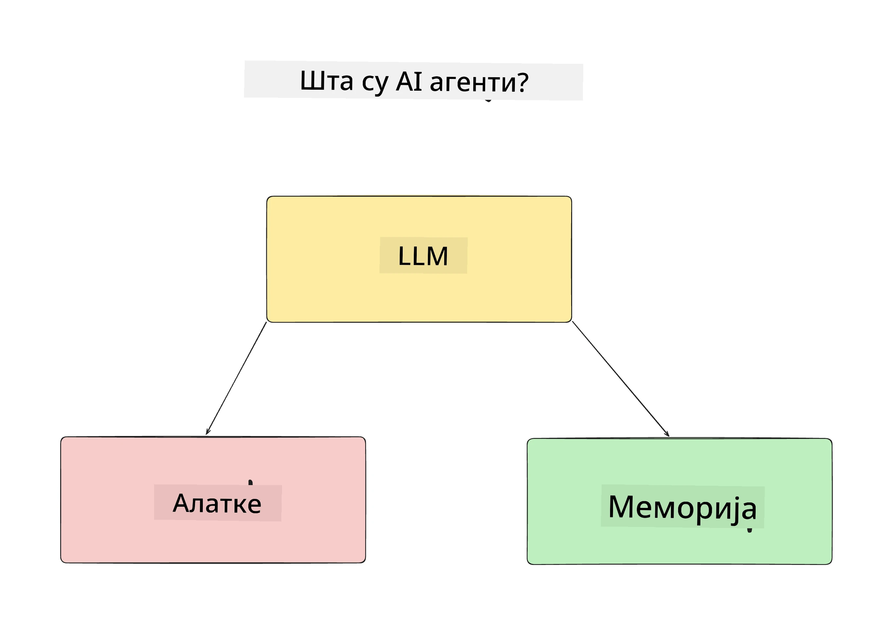
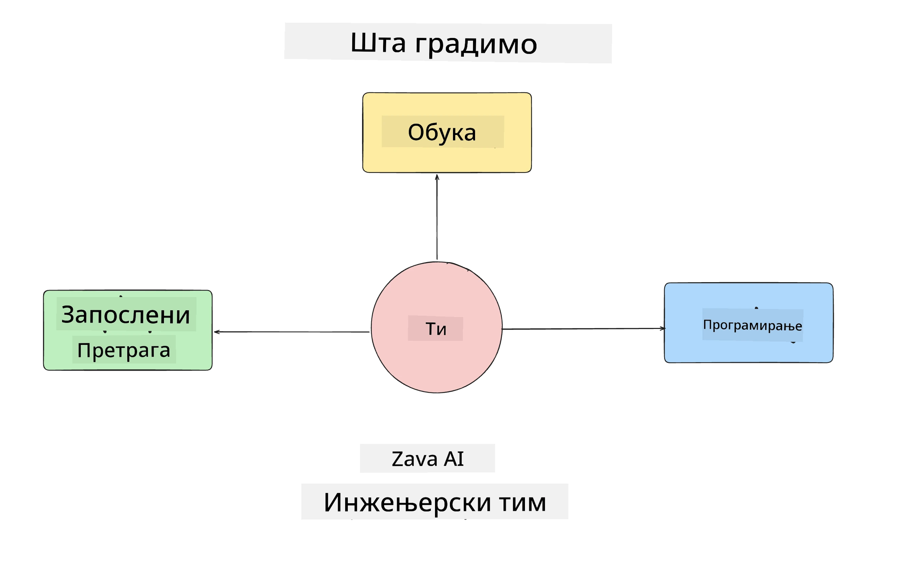
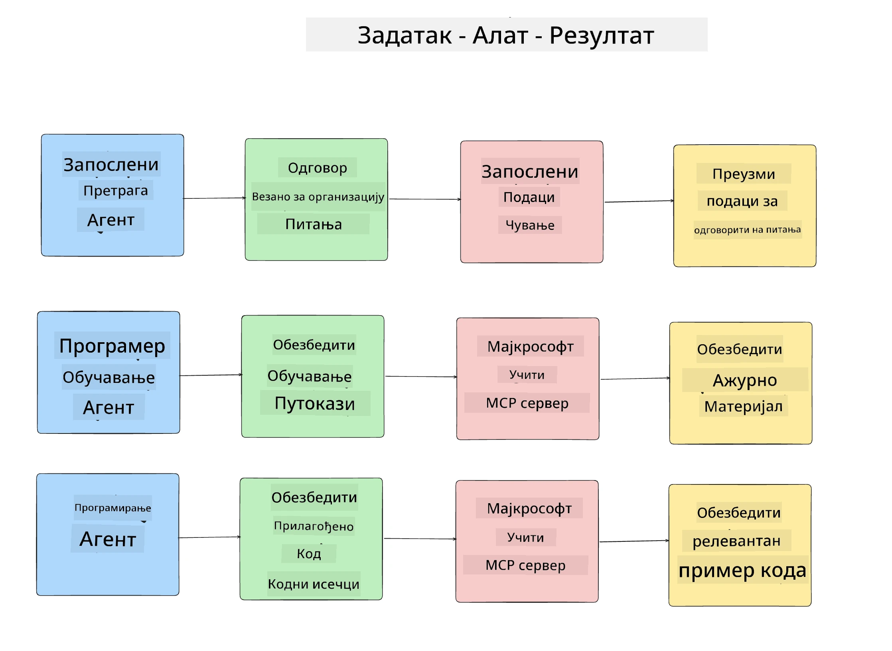
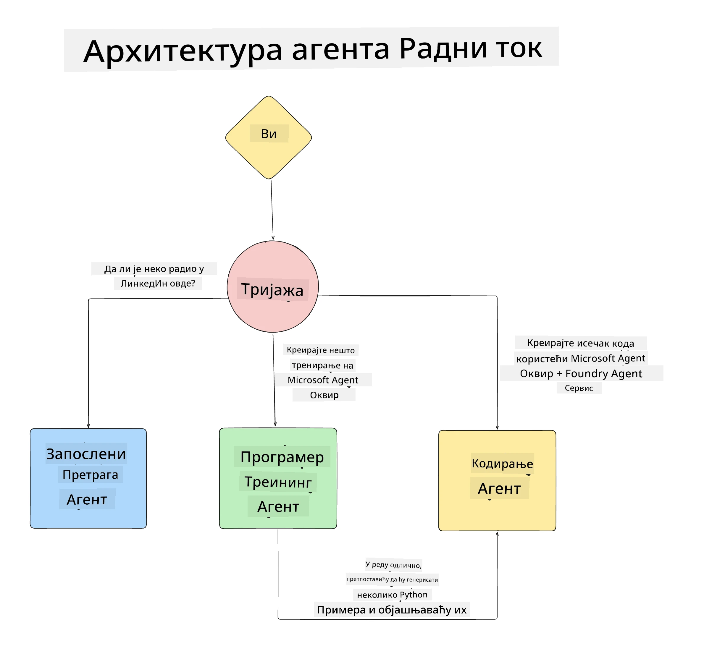

# Лекција 1: Дизајн AI Агента

Добро дошли у прву лекцију курса "Изградња AI Агента од Нуле до Продукције"!

У овој лекцији ћемо обрадити:

- Дефинисање шта су AI агенти
  
- Разговор о AI агенцијској апликацији коју правимо  

- Идентификовање неопходних алата и услуга за сваког агента
  
- Дизајн наше агенцијске апликације
  
Хајде да почнемо дефинисањем шта је агент и зашто бисмо их користили у апликацији.

> **Пре него што почнете курс.** Ова прва лекција је концептуална — нема кода за извршавање.
> Од [Лекције 2](../lesson-2-agent-development/README.md) надаље биће вам потребно: **Azure претплата** са приступом **Microsoft Foundry**, распоређени **GPT-5 серијски модел** (на пример `gpt-5.1` — избегавајте повучени GPT-4o / GPT-4.1), **Python 3.12+** и **Azure CLI** (`az login`). Погледајте [Шта вам је потребно](../README.md#what-you-need) у README-у курса за целу листу и линкове.

## Шта су AI Агенти?

Ако први пут истражујете како изградити AI агента, можда имате питања како тачно дефинисати шта је AI агент.

Једноставан начин за дефинисање шта је AI агент јесте кроз компоненте које га чине:

**Велики језички модел** - Језички модел (LLM) ће омогућити обраду природног језика од корисника, како би интерпретирао задатак који желе да изврше, као и тумачење описа алата доступних за извођење тих задатака.

**Алатке** - Ово ће бити функције, API-ји, складишта података и друге услуге које LLM може изабрати да користи за извршење задатака које корисник тражи.

**Памет** - Овде чувамо како краткорочне тако и дугорочне интеракције између AI агента и корисника. Чување и дохват ових информација је важно за унапређења и чување корисничких преференција током времена.

## Наш случај употребе AI агента

За овај курс ћемо изградити апликацију AI агента која помаже новим програмерима да се интегришу у наш тим за развој AI агената!

Пре него што започнемо развој, први корак ка успешној AI агенцијској апликацији је дефинисање јасних сценарија о томе како очекујемо да наши корисници користе наше AI агенте.

За ову апликацију ћемо радити са следећим сценаријима:

**Сценарио 1**: Нови запослени придружује се нашој организацији и жели да сазна више о тиму у који је ушао и како да се повеже са њима.

**Сценарио 2:** Нови запослени жели да зна који би био најбољи први задатак на којем би почео да ради.

**Сценарио 3:** Нови запослени жели да прикупи ресурсе за учење и примерке кода који ће му помоћи да започне са извршењем тог задатка.

## Идентификовање алата и услуга

Сада када имамо креиране ове сценарије, следећи корак је да их повежемо са алатима и услугама које ће наши AI агенти користити да заврше те задатке.

Овај процес спада у категорију контекстуалног инжењеринга јер ћемо се фокусирати на то да AI агенти имају прави контекст у правом тренутку да заврше задатке.

Хајде да ову анализу урадимо сценарио по сценарио и применимо добар агентски дизајн тако што ћемо навести задатак, алате и жељене резултате за сваког агента.

### Сценарио 1 - Агент за претрагу запослених

**Задатак** - Одговорити на питања о запосленима у организацији као што су датум пријема, тренутни тим, локација и последња позиција.

**Алатке** - Складиште података о тренутној листи запослених и организационој шеми

**Резултати** - Способност да дохвати информације из складишта како би одговорио на општа питања о организацији и специфична питања о запосленима.

### Сценарио 2 - Агент за препоруку задатака

**Задатак** - На основу развојног искуства новог запосленог, предложити 1-3 проблема на којима нови запослени може радити.

**Алатке** - GitHub MCP сервер за добијање отворених проблема и изградњу развојног профила

**Резултати** - Способност читања последњих 5 комита са GitHub профила и отворених проблема на GitHub пројекту и давање препорука на основу поклапања

### Сценарио 3 - Агент помоћник за код

**Задатак** - На основу отворених проблема које је препоручио "Агент за препоруку задатака", истражити и обезбедити ресурсе и генерисати сегменте кода који ће помоћи запосленом.

**Алатке** - Microsoft Learn MCP за проналажење ресурса и Code Interpreter за генерисање прилагођених сегмената кода.

**Резултати** - Ако корисник затражи додатну помоћ, радни ток треба да користи Learn MCP сервер за пружање линкова и сегмената ка ресурсима, а затим да преда агенту Code Interpreter да генерише мале сегменте кода са објашњењима.

## Архитектура наше агенцијске апликације

Сада када смо дефинисали сваког од наших агената, хајде да направимо дијаграм архитектуре који ће нам помоћи да разумемо како ће сваки агент радити заједно и одвојено у зависности од задатка:

## Следећи кораци

Сада када смо дизајнирали сваког агента и наш агенцијски систем, пређимо на следећу лекцију где ћемо развијати сваког од ових агената!

---

<!-- CO-OP TRANSLATOR DISCLAIMER START -->
**Изјава о одрицању одговорности**:
Овај документ је преведен коришћењем услуге за аутоматски превод [Co-op Translator](https://github.com/Azure/co-op-translator). Иако тежимо тачности, имајте у виду да аутоматски преводи могу садржати грешке или нетачности. Оригинални документ на његовом изворном језику треба сматрати ауторитативним извором. За критичне информације препоручује се професионални људски превод. Нисмо одговорни за било каква неспоразума или погрешна тумачења која произилазе из коришћења овог превода.
<!-- CO-OP TRANSLATOR DISCLAIMER END -->