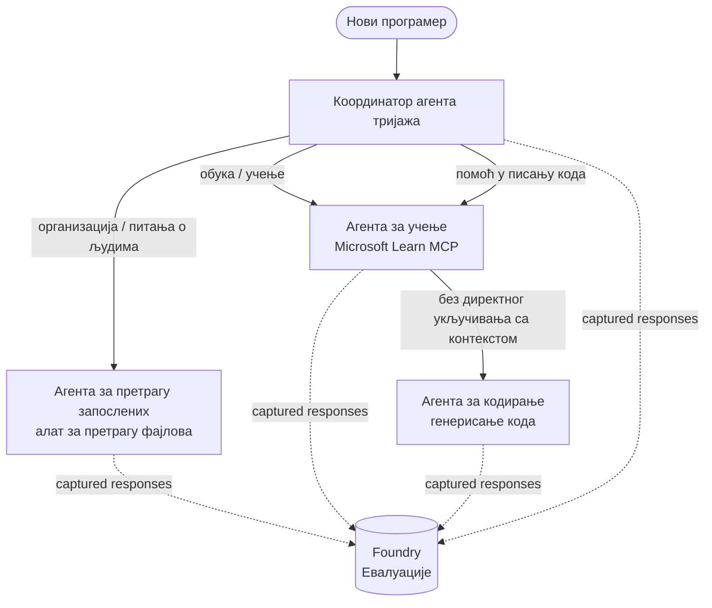

# Лекција 3: Процене агената уз Microsoft Foundry

Добродошли у трећу лекцију курса **"Изградња AI агената од почетка до продукције"**!

У [Лекцији 2](../lesson-2-agent-development/README.md) сте изградили агенте. У овој лекцији ћете
научити како да одговорите на много тежи изазов: **да ли су они добри?** Испорука агента који
ради је лака; знати да ли исправно усмерава, да ли остаје у оквиру ваших података и исправно користи
алате раздваја демо од продукционог система.

У овој лекцији ћемо покрити:

- Зашто је важно процењивати агенте и како се то разликује од традиционалног тестирања
- Разлику између **посматрања**, **смок тестова** и **процена**
- Вишерадна радна струја агената коју ћемо мерити
- Уграђене **Microsoft Foundry оцене** (релевантност, ослоњеност на податке, прецизност позива алата, коришћење излаза алата)
- Корак-по-корак преглед процеса процене у [`agent-evals.py`](../../../lesson-3-agent-evals/agent-evals.py)
- Како га покренути и прочитати резултате

---

## Зашто процењивати агенте?

Традиционални јединични тест тврди да је `add(2, 2) == 4`. Агенти не функционишу тако — исти
упит може генерисати различите формулације сваки пут, алати могу бити позивани у различитом реду, и
„исправно“ је често питање степена, а не буловске вредности. Не можете тврдити на основу тачних низа.

Уместо тога, агенти се процењују по **квалитетним димензијама** користећи моделе *процењивача* (такође
названи „LLM као судија“) уз детерминистичке провере коришћења алата. Ово вам говори ствари као што су:

- Да ли је одговор заиста адресирао питање? (**релевантност**)
- Да ли одговор има подршку у пронађеним подацима, или је агент измишљао? (**ослоњеност на податке**)
- Да ли је агент позвао прави алат са правим аргументима? (**прецизност позива алата**)
- Да ли је агент заиста искористио оно што је алат вратио? (**коришћење излаза алата**)

### Три допуњујућа слоја квалитета

Ово нису супротстављене технике — продукциони агент користи сва три:

| Слој | Питање на које одговара | Трошак | Када се покреће | Покривено у |
|-------|--------------------|------|--------------|------------|
| **Посматрање / праћење** | *Шта је агент урадио, корак по корак?* | Бесплатно (увек укључено) | Континуирано у продукцији | Ова лекција |
| **Смок тестови** | *Да ли је агент доступан и прати свој основни упит?* | Јефтино, секунде | При свакој имплементацији | [Лекција 4](../lesson-4-agentdeployment/README.md#smoke-testing-the-hosted-agent-ci-gate) |
| **Процене** | *Колико су одговори **добри**?* | Спорије, по моделу | По захтеву / ноћно / пре издања | Ова лекција |

Смок тестови одговарају на питање "да ли је нешто пукло?"; процене одговарају "да ли је добро?". Желите оба.

---

## Предуслови

1. Завршена [Лекција 2](../lesson-2-agent-development/README.md) (агенти + векторска база).
2. Пројекат у **Microsoft Foundry**.
3. **Azure CLI** аутентификација: `az login`.
4. **Python 3.12+** и зависности курса су инсталирани:

   ```bash
   pip install -r ../requirements.txt
   ```


5. Променљиве окружења (направите `.env` фајл у овом фолдеру или их извозите):

   | Променљива | Намена |
   |----------|---------|
   | `FOUNDRY_PROJECT_ENDPOINT` | Ваш Foundry пројекат endpoint (`https://<account>.services.ai.azure.com/api/projects/<project>`). Читају га агенти преко `FoundryChatClient` **и** помоћник за евалуацију. |
   | `FOUNDRY_MODEL` | Размештање модела на којем **агенти** раде (нпр. `gpt-5.1`). |
   | `VECTOR_STORE_ID` | Векторска база података за адресар запослених креирана у Лекцији 2 |
   | `AZURE_AI_MODEL_DEPLOYMENT_NAME` | Размештање модела које користе **оцениоци** (подразумевано `FOUNDRY_MODEL`, а затим `gpt-5.1`) |

> Агенти користе `FoundryChatClient`, који чита конфигурацију из променљивих са префиксом `FOUNDRY_`
> (`FOUNDRY_PROJECT_ENDPOINT`, `FOUNDRY_MODEL`). Помоћник за евалуацију у облаку
> користи `azure-ai-projects` SDK и враћа се на `FOUNDRY_PROJECT_ENDPOINT` ако
> `AZURE_AI_PROJECT_ENDPOINT` није подешен — тако да су две `FOUNDRY_` променљиве довољне
> за рад целе лекције.
>
> Оцениоци сами раде на моделу, па `AZURE_AI_MODEL_DEPLOYMENT_NAME`
> контролише које размештање врши оцењивање — не мора да буде исти модел који
> користе ваши агенти.

---

## Радни ток који оцењујемо

Да бисте нешто оценили, прво морате да га покренете. Ова лекција поново користи мулти-агентски радни ток **Developer Onboarding**: координатор **тријажа** прослеђује тријама специјалистима.




Радни ток је направљен уз коришћење Microsoft Agent Framework-а и његове **handoff** оркестрације. Кључна
идеја за евалуацију је да се **сви одговори агента трајно чувају на серверу** и идентификују помоћу
`response_id`. Управо те ID-је предајемо сервису за евалуацију.

---

## Поступак евалуације, корак по корак

[`agent-evals.py`](../../../lesson-3-agent-evals/agent-evals.py) имплементира шестокорачан поступак. Ево шта сваки корак ради
и зашто.

### Корак 1 — Покрените радни ток и пратите response ID-јеве

Радни ток се извршава помоћу `run_stream(...)`, а како догађаји стижу, код бележи
`response_id` и `conversation_id` које производи сваки агент. Трајно сачувани одговори представљају
прави материјал за евалуацију — оцењујете *стварне* одговоре из продукције, не поново генерисане.


### Корак 2 — Резимирајте оно што је снимљено

Брзи резиме исписује колико је одговора произвео сваки агент, тако да можете потврдити да је радни ток
заиста користио агенте које сте намеравали да оцените.

### Корак 3 — Прикупите коначне одговоре

За сваког агента, задњи `response_id` се преузима кроз OpenAI-компатибилан
клијент пројекта (`project_client.get_openai_client().responses.retrieve(...)`) како бисте могли да прегледате
текст који ће бити оцењен.

### Корак 4 — Направите евалуацију

Евалуација се прави са четири **улазна Foundry оцениоца**:

| Оценивач | `evaluator_name` | Шта мери |
|-----------|------------------|------------------|

| Релевантност | `builtin.relevance` | Да ли одговор одговара на захтев корисника? |

| Основаност | `builtin.groundedness` | Да ли је одговор подржан подацима добијеним претрагом/алатком (да није измишљен)? |
| Тачност позива алата | `builtin.tool_call_accuracy` | Да ли су позвани прави алати са правим аргументима? |
| Користивост излаза алата | `builtin.tool_output_utilization` | Да ли је агент заиста искористио резултате алата у свом одговору? |

Сваком оцењивачу се додељује издање названо `AZURE_AI_MODEL_DEPLOYMENT_NAME`.

> **Зашто ова четири?** Релевантност и основаност мере *квалитет одговора*; два оцењивача алата мере *поведу агентa* — оно што традиционалне NLP метрике потпуно пропуштају. За систем са више агената који користи алате, метрике алата су често место где се крију стварни регресионaлни проблеми.
> 
> 

### Корак 5 — Покрени евалуацију

Сакупљени `response_id` се прослеђују у `evals.runs.create(...)` као извор података. Сервис репродукује сваки сачувани одговор кроз сваког оцењивача.


### Корак 6 — Праћење и читање резултата

Код прати покретање док се не заврши или не пропадне, затим исписује бројеве резултата и
**`report_url`** — дубоку везу у Foundry портал где можете прегледати појединачне по метрици оцене,
бројеве пролаза/падова и појединачно оцењене одговоре.

---

## Покрени га

```bash
cd lesson-3-agent-evals
python agent-evals.py
```

По дефаулту оцењује први пример упита
(`"Ја сам нов овде! Да ли је ико радио у Microsoft-у овде?"`). Два додатна мулти-интенција примерка упита
су укључена у `run_evaluation_workflow()` — промените вредност променљиве `query` да бисте испробали сценарије рутирања
који укључују више агената у једном покретању.

Очекивани ток у конзоли:

```
Step 1: Running Developer Onboarding Workflow
Step 2: Response Data Summary
Step 3: Fetching Agent Responses
Step 4: Creating Evaluation
Step 5: Running Evaluation
Step 6: Monitoring Evaluation
  Status: running ...
  Evaluation completed successfully
  Report URL: https://...   <-- open this in the Foundry portal
```

---

## Посматрање и праћење трага

Евалуације вам говоре *колико су добри* одговори били; **посматрање** вам говори *шта се догодило*
да би их произвело — сваки прелазак агента, позив алата, број токена и кашњење. У Microsoft Foundry,
покретања агената емитују OpenTelemetry трагове које можете гледати у порталу, а Agent Framework може
извозити их у Azure Monitor / Application Insights једним позивом:

```python
from agent_framework.foundry import FoundryChatClient

client = FoundryChatClient()
client.configure_azure_monitor()   # извози трагове + метрике у Application Insights
```

Користите праћење за **откривање грешака** када је оцена лоша: када основаност опадне, траг вам показује
да ли алат за претрагу фајлова није вратио ништа, или је вратио податке које је агент игнорисао (што
тачно мери метрика користивости излаза алата).

---

## Од „покретања“ до „добро“: како ово користити у пракси

- **Прелиминарна провера.** Покрените евалуације на ограниченом скупу репрезентативних упита пре него што
  промовишете нови промпт или модел. Упоредите резултате са претходном верзијом — пад третирајте као
  регресију.
- **Ночно сигналисање квалитета.** Закажите извођење евалуације да бисте уочили померања услед промена података или зависности.
- **Упарите са димним тестовима.** [Димни тест из Лекције 4](../lesson-4-agentdeployment/README.md#smoke-testing-the-hosted-agent-ci-gate)
  је ваш брзи проверавач по распоређивању; евалуације су спорија, темељнија провера квалитета. Покрећите јефтину
  на сваком спајању и скупу на распореду или пре издања.


(`agent_framework.foundry`). Ако ажурирате код, погледајте корен репозиторијума
[`MIGRATION-GUIDE.md`](../MIGRATION-GUIDE.md) за верификованa пре/после увоз и клиентске
мапе (на пример `AzureAIClient` -> `FoundryChatClient`, и конструисање хостираног алата преко
`client.get_file_search_tool(...)` / `client.get_mcp_tool(...)`). Концепти евалуације и
шестостепени процес горе нису измењени овом миграцијом.


---

## Ресурси

- [Оцена генеративних AI модела и апликација (Microsoft Learn)](https://learn.microsoft.com/en-us/azure/ai-foundry/concepts/evaluation-approach-gen-ai)
- [Уграђени оцењивачи за генеративни AI](https://learn.microsoft.com/en-us/azure/ai-foundry/concepts/evaluation-evaluators/agent-evaluators)
- [Посматрање у Microsoft Foundry](https://learn.microsoft.com/en-us/azure/ai-foundry/concepts/observability)
- [Microsoft Agent Framework](https://github.com/microsoft/agent-framework)
- [Оркестрација предаје агената](https://learn.microsoft.com/en-us/agent-framework/workflows/orchestrations/handoff)

---

<!-- CO-OP TRANSLATOR DISCLAIMER START -->
**Изјава о одрицању одговорности**:
Овај документ је преведен коришћењем услуге за аутоматски превод [Co-op Translator](https://github.com/Azure/co-op-translator). Иако тежимо тачности, имајте у виду да аутоматски преводи могу садржати грешке или нетачности. Оригинални документ на његовом изворном језику треба сматрати ауторитативним извором. За критичне информације препоручује се професионални људски превод. Нисмо одговорни за било каква неспоразума или погрешна тумачења која произилазе из коришћења овог превода.
<!-- CO-OP TRANSLATOR DISCLAIMER END -->