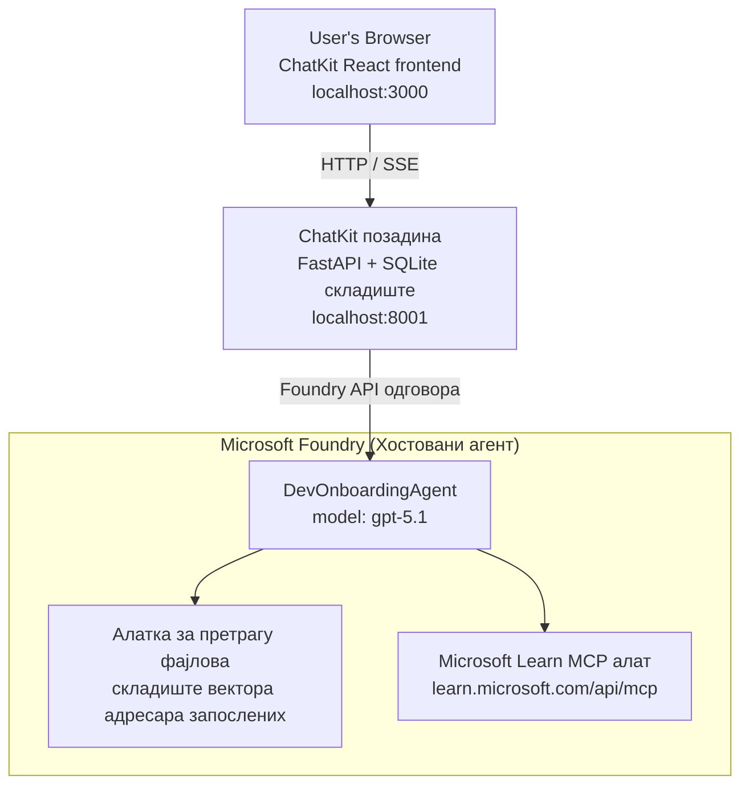

# Лекција 4: Деплој агента са Microsoft Foundry хостованим агентима + ChatKit

Ова лекција приказује како да се деплојира агент који користи алате на Microsoft Foundry као хостовани агент и како да се креира ChatKit базиран фронтенд за интеракцију са њим.

## Архитектура

Хостовани агент је **један `DevOnboardingAgent`** (који ради на `gpt-5.1`) који одговара на питања о увођењу програмера користећи два хостована алата: алат за **претрагу фајлова** преко вектор продавнице запослених и алат **Microsoft Learn MCP**. ChatKit React фронтенд комуницира са FastAPI бекендом, који позива агента преко Foundry **Responses API**.



## Захтеви

1. **Microsoft Foundry пројекат** у региону North Central US
2. **Azure CLI** аутентификован (`az login`)
3. **Azure Developer CLI** (`azd`) инсталиран
4. **Python 3.12+** и **Node.js 18+**
5. **Вектор продавница** креирана са подацима о запосленима

## Брзи почетак

### 1. Подесите променљиве окружења

```bash
cd lesson-4-agentdeployment
cp .env.example .env
# Уредите .env са детаљима вашег Microsoft Foundry пројекта
```

### 2. Деплој хостованог агента

**Опција А: Користећи Azure Developer CLI (препоручено)**

```bash
cd hosted-agent
azd auth login
azd agent deploy
```

**Опција Б: Користећи Docker + Azure Container Registry**

```bash
cd hosted-agent

# Изградите контејнер
docker build -t developer-onboarding-agent:latest .

# Ознака за ACR
docker tag developer-onboarding-agent:latest <your-acr>.azurecr.io/developer-onboarding-agent:latest

# Пошаљите у ACR
az acr login --name <your-acr>
docker push <your-acr>.azurecr.io/developer-onboarding-agent:latest

# Деплој преко Microsoft Foundry портала или SDK-а
```

### 3. Покрените ChatKit бекенд

```bash
cd chatkit-server
python -m venv .venv
source .venv/bin/activate  # На Виндоус-у: .venv\Scripts\activate
pip install -r requirements.txt
python app.py
```

Сервер ће почети са радом на `http://localhost:8001`

### 4. Покрените ChatKit фронтенд

```bash
cd chatkit-server/frontend
npm install
npm run dev
```

Фронтенд ће почети са радом на `http://localhost:3000`

### 5. Тестирајте апликацију

Отворите `http://localhost:3000` у вашем прегледачу и испробајте ове упите:

**Претраживање запослених:**
- "Ја сам нов овде! Да ли је неко радио у Microsoft-у?"
- "Ко има искуства са Azure Functions?"

**Ресурси за учење:**
- "Направи пут учења за Kubernetes"
- "Које сертификате треба да стекнем за облачну архитектуру?"

**Помоћ око кодирања:**
- "Помози ми да напишем Python код за повезивање са CosmosDB-ом"
- "Покажи ми како да направим Azure Function"

**Више агената упита:**
- "Почињем као cloud инженер. Са ким да се повежем и шта треба да научим?"

## Структура пројекта

```
lesson-4-agentdeployment/
├── .env.example                 # Environment variables template
├── implementation-plan.md       # Detailed implementation guide
├── README.md                    # This file
├── hosted-agent/               # Microsoft Foundry hosted agent
│   ├── main.py                 # Multi-agent workflow implementation
│   ├── requirements.txt        # Python dependencies
│   ├── Dockerfile              # Container definition
│   └── agent.yaml              # Agent deployment configuration
└── chatkit-server/             # ChatKit server application
    ├── app.py                  # FastAPI backend
    ├── store.py                # SQLite persistence layer
    ├── requirements.txt        # Python dependencies
    └── frontend/               # React frontend
        ├── package.json
        ├── vite.config.ts
        ├── tsconfig.json
        ├── index.html
        └── src/
            ├── main.tsx
            ├── App.tsx
            ├── App.css
            └── index.css
```

## Агент и његови алати

Хостовани агент је **једини агент** (`DevOnboardingAgent`, дефинисан у `hosted-agent/main.py`) који обрађује три домена увођења. Уместо да оркестрира одвојене под-агенте, он изложије сваку могућност као алат (или се ослања директно на модел):

| Могућност | Како се обрађује | Алат |
|-----------|------------------|------|
| **Претрага и повезивања запослених** | Foundry хостовани File Search преко вектор продавнице запослених | `client.get_file_search_tool(vector_store_ids=[...])` |
| **Учење и обука** | Microsoft Learn MCP сервер (хостовани MCP алат) | `client.get_mcp_tool(url="https://learn.microsoft.com/api/mcp")` |
| **Помоћ око кодирања** | Обрађује `gpt-5.1` модел директно — без спољашњег алата | — |

Агента се креира са `client.as_agent(name="DevOnboardingAgent", instructions=..., tools=[file_search_tool, learn_mcp_tool])` и сервира се са `from_agent_framework(agent).run()`.

> **Напомена о дизајну.** Ранијe нацрте ове лекције користиле су `HandoffBuilder` мулти-агентски радни ток (Тријажа → специјалисти). Испорућени агент је један агент који користи алате, што је једноставније за имплементацију и разумевање у Q&A увођењу. За пример мулти-агентске оркестрације и преноса, видети Лекцију 2 и Лекцију 3.

## Брзо тестирање хостованог агента (CI гейт)

Деплој хостованог агента "успешно" доказује само да је контролна раван прихватила
дефиницију — он **не** доказује да агент стварно одговара. Недостајућа зависност,
лоша рутирања модела или истекла конекција могу оставити агента који је зелени, али ћутљив.

Ова лекција испоручује лагани **smoke тест** који функционише као брза, јефтина контрола после деплоја.
Користи [AI Smoke Test](https://github.com/marketplace/actions/ai-smoke-test)
GitHub акцију да ПОШТА упите агенту на Foundry **Responses** крајњу тачку
(`POST {project_endpoint}/agents/{agent_name}/endpoint/protocols/openai/responses`)
и прави проверу на враћени текст. У року од секунди хвата прекинуте деплоје, регресије аутентификације,
одступања system-prompt-а и кварове у текућим разговорима.

> Smoke тестови **нису** замена за пуну евалуацију у
> [Лекцији 3](../lesson-3-agent-evals/README.md) — они су допуна. Smoke тестови
> одговарају на питање *"да ли је агент доступан, одговара и прати основна очекивања?"*;
> евалуације одговарају на питање *"какав је квалитет одговора?"*. Пустите овај јефтини тест при сваком деплоју.

### Шта се тестира

Каталог се налази у [`hosted-agent/tests/smoke-tests.json`](../../../lesson-4-agentdeployment/hosted-agent/tests/smoke-tests.json)
и тестира три домена агента, придржавање промпта и вишетоковну конверзацију:

| Тест | Шта проверава |
|------|------------------|
| `reachability` | Агент одговара непразним, релевантним текстом |
| `employee-search` | Домен претраге фајлова враћа здрав `200` (одговор зависи од података) |
| `learning-path` | Домен учења одзвања тему и даје одговор у стилу пута учења |
| `coding-assistance` | Домен кодирања враћа Python код као одговор |
| `prompt-adherence-offtopic` | Захтев ван теме је преусмерен, није детаљно одговаран |
| `threading-turn-1/2` | Стање конверзације се задржава између корака преко `previous_response_id` |

### Покрените у CI

Радни ток у [`.github/workflows/smoke-test-hosted-agent.yml`](../../../.github/workflows/smoke-test-hosted-agent.yml)
има два посла:

- **`static`** — брзи gate без Azure који се покреће на сваком pull request-у и push-у:
  компајлира све Python изворе (`py_compile`) и проверава Markdown линкове. Није потребно имати тајне,
  па ради и на PR-овима из форкова.
- **`smoke`** — Azure-connected smoke тест испод. Покреће се по потреби
  (Actions → **Agent CI (static + smoke)** → Run workflow) и може бити ланац након вашег
  deploy workflow-а.

Конфигуришите ове **променљиве** и **тајне** репозиторијума за smoke job:

| Тип | Име | Вредност |
|------|------|-------|
| Променљива | `FOUNDRY_PROJECT_ENDPOINT` | `https://<account>.services.ai.azure.com/api/projects/<project>` |
| Променљива | `HOSTED_AGENT_NAME` | Име деплојованог агента (нпр. `dev-onboarding` — мора одговарати вашем деплоју) |
| Тајна | `AZURE_CLIENT_ID` / `AZURE_TENANT_ID` / `AZURE_SUBSCRIPTION_ID` | OIDC федеративни идентитет за `azure/login` |

Идентитет руннера треба **`Azure AI User`** улогу у опсегу Foundry пројекта како би могао
да позива Responses (и conversations) крајње тачке податковне равни. Додајте му ову улогу помоћу:

```bash
az role assignment create \
  --assignee <object-id-or-appId-of-runner-identity> \
  --role "Azure AI User" \
  --scope "/subscriptions/<sub>/resourceGroups/<rg>/providers/Microsoft.CognitiveServices/accounts/<account>/projects/<project>"
```

### Покрените локално

Исти каталог можете покренути пре пушања. Набавите токен податковне равни опсега
`https://ai.azure.com/` и усмерите руннер на ваш деплој:

```bash
# Аудиторијум МОРА бити https://ai.azure.com/ (токени са cognitiveservices.azure.com се одбијају)
export FOUNDRY_TOKEN=$(az account get-access-token --resource https://ai.azure.com/ --query accessToken -o tsv)

git clone https://github.com/JFolberth/ai-smoketest && cd ai-smoketest
python runner.py \
  --project-endpoint "https://<account>.services.ai.azure.com/api/projects/<project>" \
  --agent-name dev-onboarding \
  --tests-file ../lesson-4-agentdeployment/hosted-agent/tests/smoke-tests.json
```

Кодови изласка: `0` све је прошло, `1` нека асерција није успела, `2` грешка руннера (лош каталог / токен).

## Решење проблема

### Агент не одговара
- Проверите да ли је хостовани агент деплојован и покренут у Microsoft Foundry
- Проверите да ли `HOSTED_AGENT_NAME` и `HOSTED_AGENT_VERSION` одговарају вашем деплоју

### Грешке вектор продавнице
- Уверите се да је `VECTOR_STORE_ID` подешен исправно
- Проверите да вектор продавница садржи податке о запосленима

### Грешке аутентификације
- Покрените `az login` да освежите креденцијале
- Уверите се да имате приступ Microsoft Foundry пројекту

## Ресурси

- [Microsoft Foundry Hosted Agents документација](https://learn.microsoft.com/en-us/azure/ai-foundry/agents/concepts/hosted-agents)
- [Microsoft Agent Framework](https://github.com/microsoft/agent-framework)
- [ChatKit Integration пример](https://github.com/microsoft/agent-framework/tree/main/python/samples/demos/chatkit-integration)
- [Azure Developer CLI](https://learn.microsoft.com/en-us/azure/developer/azure-developer-cli/overview)
- [AI Smoke Test GitHub акција](https://github.com/marketplace/actions/ai-smoke-test)
- [Smoke Test Microsoft Foundry агената са GitHub Actions (блог)](https://techcommunity.microsoft.com/blog/azuredevcommunityblog/smoke-test-microsoft-foundry-agents-with-github-actions/4531912)

---

## Следећи кораци

Ваш агент ради на инфраструктури коју управља Microsoft. Да га пребаците у производњу за предузећа —
контролишући где његови подаци живе (суверенитет података, приватно умрежавање, довођење сопственог Azure
Cosmos DB / Storage / AI Search) и управљајући његовим алатима — наставите са
**[Лекцијом 5: Производни хостовани агенти](../lesson-5-hosted-agents-production/README.md)**, која
објашњава суштинску разлику између **Hosted Agents** и **Capability Hosts**.

---

<!-- CO-OP TRANSLATOR DISCLAIMER START -->
**Изјава о одрицању одговорности**:
Овај документ је преведен коришћењем услуге за аутоматски превод [Co-op Translator](https://github.com/Azure/co-op-translator). Иако тежимо тачности, имајте у виду да аутоматски преводи могу садржати грешке или нетачности. Оригинални документ на његовом изворном језику треба сматрати ауторитативним извором. За критичне информације препоручује се професионални људски превод. Нисмо одговорни за било каква неспоразума или погрешна тумачења која произилазе из коришћења овог превода.
<!-- CO-OP TRANSLATOR DISCLAIMER END -->