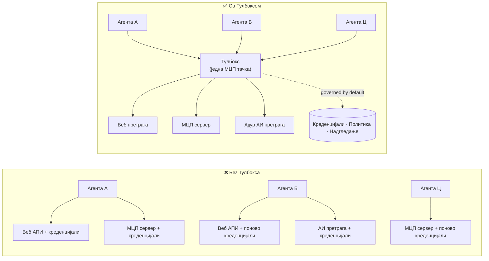

# Лекција 6: Microsoft Toolbox — Контролисани алати за агенте

У [Лекцији 5](../lesson-5-hosted-agents-production/README.md) ваш хостирани агент ради у
продукцији са складиштењем и управљачким положајем који ваша организација захтева. Али погледајте
назад на Лекцију 4 агента: сваки алат је био **тврдокодирани** у `main.py` — Microsoft Learn MCP URL,
векторски фајл-претрагањa, и тако даље. То функционише за једног агента. Не скалира се на
организацију са деценијама агената и тимова.

Ова лекција представља **Microsoft Toolbox**: начин на који Foundry омогућава да дефинишете куриран скуп
алата **једном**, управљате њима **централно**, и изложите их било ком агенту преко **једног,
контролисаног крајњег тачке**.

## Циљеви учења

До краја ове лекције моћи ћете да:

- Објасните проблем раширености алата који Toolbox решава.
- Опишете стубове **Build** и **Consume** и типове алата које колекција алата може да садржи.
- **Направите** верзију колекције алата помоћу Foundry SDK-а.
- **Потрошите** колекцију алата из Microsoft Agent Framework хостираног агента преко једне MCP крајње тачке.
- Користите **верзионисање** за испоруку измена алата без промене или поновног путања кода агента.
- Примјењујете **управљање**: RBAC, убризгавање акредитива и прописи чувари (RAI).

---

## Предуслови

1. Завршене [Лекција 4](../lesson-4-agentdeployment/README.md) и по могућству
   [Лекција 5](../lesson-5-hosted-agents-production/README.md).
2. **Microsoft Foundry** пројекат са дозволом за креирање и управљање ресурса колекције алата.
3. **Azure CLI** аутентификован: `az login`. Foundry toolbox API-ји захтевају
   `https://ai.azure.com/.default` опсег токена (показано у коду испод).
4. **Python 3.12+** са инсталираним зависностима курса (`pip install -r ../requirements.txt`).
5. Тренутно, не пензионисано распоређивање модела (на пример `gpt-5.1`). Избегавајте пензионисане GPT-4o / GPT-4.1.

---

## 1. Проблем: раширеност алата

Један агент може зависити од много алата — REST API-ја, MCP сервера, конектора и токова — сваки
са својим моделом аутентификације и тимом власника. Како се скалирате преко организације:

- Тимови **поново имплементирају исте алате** независно.
- **Акредитиви се дуплирају** између агената и репозиторјума.
- **Управљање постаје неконзистентно** — сваки агент примењује (или заборавља) политику самостално.
- Постоји **мало видљивости** у вези са постојећим алатима или ко их користи.

Девелопери запињу — не зато што модели нису способни, већ зато што **интеграција алата постаје
usko grlo**.



Предузећа већ имају инфраструктуру — пролазе, трезоре акредитива, политике, посматрање.
Оно што је недостајало је искуство програмера које пакује то у нешто **поново употребљиво,
открививо и подразумевано контролисано**. То је Toolbox.

---

## 2. Шта је Toolbox

**Toolbox** је **управљани Foundry ресурс**. Дефинишете курирану групу алата једном, управљате
њима централно у Foundry-у и излажете их преко **једне MCP-компатибилне крајње тачке** која било који

агенс може да користи. Током извршавања платформа управља **убацивањем акредитива, освежавањем токена, и
спровођењем корпоративне политике**.

Пошто је тулбокс управљани ресурс, можете додавати, уклањати или пренаменити алате **без
мењања кода у вашем агенту** — агент се увек повезује на исту крајњу тачку.

Тулбокс покрива животни циклус алата кроз четири стуба; **Build** и **Consume** су доступни
данас:

| Стуб | Статус | Шта омогућава |
|--------|--------|-----------------|
| **Build** | Доступно данас | Изаберите алате, централно конфигуришите аутентикацију, објавите тулбокс који може сваки тим да користи. |
| **Consume** | Доступно данас | Повежите било који агент на једну MCP-компатибилну крајњу тачку да динамички откријете и покренете све алате у тулбоксу. |

Површинa конзумирања је **отворена**: било који MCP-компатибилни runtime или клијент може користити тулбокс —
Microsoft Agent Framework, LangGraph, GitHub Copilot, Claude Code, Microsoft Copilot Studio, или
прилагођени код.

### Типови алата које тулбокс може да садржи

Веб претрага · MCP · Azure AI Search · Code Interpreter · Претрага фајлова · OpenAPI · **Агент-кАгент
(A2A)** · Fabric IQ · Претрага алата · Work IQ · Аутоматизација прегледача · Референце за вештине, плус
**Guardrail (RAI) политика** која се примењује на нивоу тулбокса.

> **Савет:** Додајте `description` за **сваког** алата како би модел могао да изабере прави. Тулбокс
> дозвољава највише **један алат без имена по типу** — сваки додатни примерак истог типа дајте
> јединствено `name`, иначе ћете добити грешку `invalid_payload`.

---

## 3. Направите тулбокс

Тулбоксови се управљају помоћу Foundry SDK-ова (Python/.NET/JavaScript), REST API-ја, `azd`, и
**Microsoft Foundry Toolkit за VS Code**. Овде је Python (`azure-ai-projects`) пример:

```python
from azure.identity import DefaultAzureCredential
from azure.ai.projects import AIProjectClient
from azure.ai.projects.models import MCPTool, ToolboxSearchPreviewTool, WebSearchTool

endpoint = "https://<your-foundry-account>.services.ai.azure.com/api/projects/<your-project>"
project = AIProjectClient(endpoint=endpoint, credential=DefaultAzureCredential())

toolbox_version = project.toolboxes.create_toolbox_version(
    name="agent-tools",
    description="Web search + an MCP server + tool search",
    tools=[
        WebSearchTool(),
        MCPTool(
            server_label="myserver",
            server_url="https://your-mcp-server.example.com",
            require_approval="never",
            project_connection_id="my-key-auth-connection",  # акредитиви се налазе у Фаундрију
        ),
        ToolboxSearchPreviewTool(),
    ],
)
print(f"Created toolbox: {toolbox_version.name}, version: {toolbox_version.version}")
```

Приметите шта **не радите**: нема тајни у агенту. Акредитиви се држе у Foundry
**конекцији** (`project_connection_id`) и платформа их убацује током позива.

> **Напомена за преглед.** Управљање тулбоксом (креирање/ажурирање верзија) је могућност у прегледу.
> Операције `project.toolboxes.*` приказане изнад се испоручују у preview SDK верзијама, REST API-ју, `azd`,
> и **Foundry Toolkit за VS Code** — нису у закључаној верзији `azure-ai-projects` која се користи
> у другим деловима овог курса. Сматрајте наведени код као облик Build корака; за
> лакши приступ, креирајте тулбокс у **Foundry порталу** или уз **Foundry Toolkit**. Корак
> **Consume** ниже ради са закључаном SDK верзијом у овом курсу.

---

## 4. Користите тулбокс из вашег агента

Тулбокс излаже **MCP крајњу тачку**. Постоје два модела:

| Улога | Крајња тачка | Када користити |
|------|----------|-------------|
| **Корисник тулбокса** | `{project_endpoint}/toolboxes/{name}/mcp?api-version=v1` | Повезује агенте. Увек служи **подразумевану верзију**. |
| **Развијач тулбокса** | `{project_endpoint}/toolboxes/{name}/versions/{version}/mcp?api-version=v1` | Тестирајте одређену верзију пре промоције. |


> **Повежите агенте са *consumer* крајњом тачком.** Јер она увек служи подразумевану верзију, ви

> може промовисати нове верзије **без промене кода агента или поновног распоређивања**.

### Интеграција са агентом заснованим на Microsoft Agent Framework-у

Подсетите се да је агент из 4. лекције додао један тврдо кодирани MCP алат помоћу `client.get_mcp_tool(...)`. Са
Toolbox-ом уместо тога усмеравате **један** `MCPStreamableHTTPTool` на крајњу тачку Toolbox-а — и агент
добија **све** алате у Toolbox-у, централизовано управљане:

```python
import httpx
from azure.identity import DefaultAzureCredential, get_bearer_token_provider
from agent_framework import MCPStreamableHTTPTool

# Аутентификација: Foundry алатка захтева https://ai.azure.com/.default приступ
credential = DefaultAzureCredential()
token_provider = get_bearer_token_provider(credential, "https://ai.azure.com/.default")
http_client = httpx.AsyncClient(auth=_ToolboxAuth(token_provider), timeout=120.0)

TOOLBOX_ENDPOINT = os.environ["TOOLBOX_ENDPOINT"]  # платформа уметнута у време извршавања

mcp_tool = MCPStreamableHTTPTool(
    name="toolbox",
    url=TOOLBOX_ENDPOINT,
    http_client=http_client,
    load_prompts=False,
)

agent = chat_client.as_agent(
    name="my-toolbox-agent",
    instructions="You are a helpful assistant with access to Foundry toolbox tools.",
    tools=[mcp_tool],
)
```

Одговарајући `.env` (напомена: користите **тренутни** модел као што је `gpt-5.1`, **не** пензионисани
`gpt-4o`):

```env
FOUNDRY_PROJECT_ENDPOINT=https://<account>.services.ai.azure.com/api/projects/<project>
TOOLBOX_ENDPOINT=https://<account>.services.ai.azure.com/api/projects/<project>/toolboxes/agent-tools/mcp?api-version=v1
AZURE_AI_MODEL_DEPLOYMENT_NAME=gpt-5.1
```

> **Прво проверите.** Пре него што повежете цео агент, повежите MCP клијент SDK (`pip install mcp`) са
> **верзијском специфичном** крајњом тачком и листајте алате да бисте потврдили да се учитавају како треба.

### Покрените пример конзумирања

Ова лекција садржи покретачки пример са стране конзумирања, [`toolbox_agent.py`](../../../lesson-6-toolbox/toolbox_agent.py). Он користи
исти образац `FoundryChatClient.get_mcp_tool(...)` који сте научили у 2. лекцији, али усмерава једини
MCP алат на вашу **toolbox** крајњу тачку — тако агент добија сваки централизовано управљани алат из toolbox-а:

```bash
# У вашем .env фајлу, подесите TOOLBOX_ENDPOINT на ваш цонсумер ендпоинт тулбокса, затим:
python lesson-6-toolbox/toolbox_agent.py
```

Отворите исписани URL `http://localhost:8096` и поставите питање које користи један од алата у вашем
toolbox-у. Додајте или надоградите алат у toolbox-у и поново питајте — **без промене овог
кода** — да бисте видели централно управљање и верзионисање у акцији.

---

## 5. Верзионисање: безбедно пуштање измена алата

Верзионисање Toolbox-а вам даје јасну контролу када измене ступају на снагу:

1. **Креирајте** нову верзију Toolbox-а са ажурираним скупом алата.
2. **Тестирајте** је на верзијски специфичној (развојној) крајњој тачки.
3. **Промовишите** је у `default_version` када будете спремни.

Сваки агент усмерен ка **конзументској** крајњој тачки аутоматски преузима промовисану верзију — **без
промене кода, без поновног распоређивања**. (Прва верзија коју креирате аутоматски је промовисана као подразумевана.)

Ово је еквивалент управљања алатима као код blue/green deploy: верификујете измену изоловано,
затим пребацујете подразумевану верзију за све кориснике одједном.

---

## 6. Управљање: како Toolbox побољшава контролу

Toolbox је **по подразумеваној вредности управљан**. Контроле управљања које треба да знате:

- **RBAC.** Доделите улогу **Foundry User** на пројекту сваком идентитету: **развојном програмеру** који
  управља верзијама toolbox-а, **идентитету агента** (за агенте смештене у језгру који позивају алате у
  време извршавања), и за OAuth токове идентичности **крајњег корисника** чији идентитет се проксира.
- **Централизоване акредитиве.** Акредитиви алата живе у Foundry **конекцијама**, а не у коду агента
  или `.env` фајловима. Платформа их убацује и обновљује токене у време извршавања.
- **Ограде (RAI политика).** Приложите именовану политику одговорног AI-а верзији toolbox-а преко
  `policies.rai_config.rai_policy_name`. Покреће се на **нивоју toolbox-а**, независно од свих
  филтера садржаја на нивоу модела, прегледа уносе и износе алата.
- **MCP одобрење.** За сваки алат, `require_approval` контролише да ли MCP позив алата захтева одобрење —
  исти концепт одобрења који сте видели у [Лекција 5 §7](../lesson-5-hosted-agents-production/README.md#7-hosted-mcp-tools--approval-workflows).
- **Приватне мреже.** Toolbox подржава конфигурације виртуалне мреже за ентитете који
  држе саобраћај унутар своје мреже.
- **Видљивост.** Пошто су алати каталогизовани централизовано, коначно добијате инвентар шта
  постоји и ко га користи.

---

## Практичне вежбе

1. **Рефактори 4. лекцију.** Агент из 4. лекције тврдо кодира Microsoft Learn MCP алат. Исцртајте како бисте
   преместили тај алат у `agent-tools` toolbox и усмерили `main.py` на крајњу тачку конзумента toolbox-а.
   Које измене су потребне у `main.py`? Шта више тамо не живи?
2. **Осмислите повећање верзије.** Потребно је додати Web Search алат у живи toolbox који користи пет
   агената. Опишите секвенцу креирања → тестирања → промоције и објасните зашто ниједан од пет агената
   не мора да се поново распоређује.
3. **Изаберите аутентификационе идентитете.** За смештеног агента који позива MCP алат заснован на OAuth преко
   toolbox-а, набројите који идентитети требају улогу **Foundry User** и зашто.
4. **Постављање заштитних ограда.** Објасните разлику између филтера садржаја на нивоу модела и
   заштитне ограде toolbox-а, и дајте један сценарио где вам је посебно потребна заштитна ограда toolbox-а.

---

## Ресурси

- [Креирајте, тестирајте и распоредите toolbox у Foundry](https://learn.microsoft.com/azure/foundry/agents/how-to/tools/toolbox)
- [Каталог алата — Foundry Agent Service](https://learn.microsoft.com/azure/foundry/agents/concepts/tool-catalog)
- [Microsoft Agent Framework — Microsoft Foundry провајдер (алати)](https://learn.microsoft.com/agent-framework/agents/providers/microsoft-foundry)
- [Преглед заштитних ограда](https://learn.microsoft.com/azure/foundry/guardrails/guardrails-overview)
- [Започните са Foundry у VS Code (Foundry Toolkit)](https://learn.microsoft.com/azure/ai-foundry/how-to/develop/get-started-projects-vs-code)
- [Model Context Protocol](https://modelcontextprotocol.io/)

---

**Претходно:** [Лекција 5 — Производни смештени агенти](../lesson-5-hosted-agents-production/README.md)
&nbsp;·&nbsp; **Следеће:** [Лекција 7 — Мулти-агент & A2A](../lesson-7-multi-agent-a2a/README.md)

---

<!-- CO-OP TRANSLATOR DISCLAIMER START -->
**Изјава о одрицању одговорности**:
Овај документ је преведен коришћењем услуге за аутоматски превод [Co-op Translator](https://github.com/Azure/co-op-translator). Иако тежимо тачности, имајте у виду да аутоматски преводи могу садржати грешке или нетачности. Оригинални документ на његовом изворном језику треба сматрати ауторитативним извором. За критичне информације препоручује се професионални људски превод. Нисмо одговорни за било каква неспоразума или погрешна тумачења која произилазе из коришћења овог превода.
<!-- CO-OP TRANSLATOR DISCLAIMER END -->