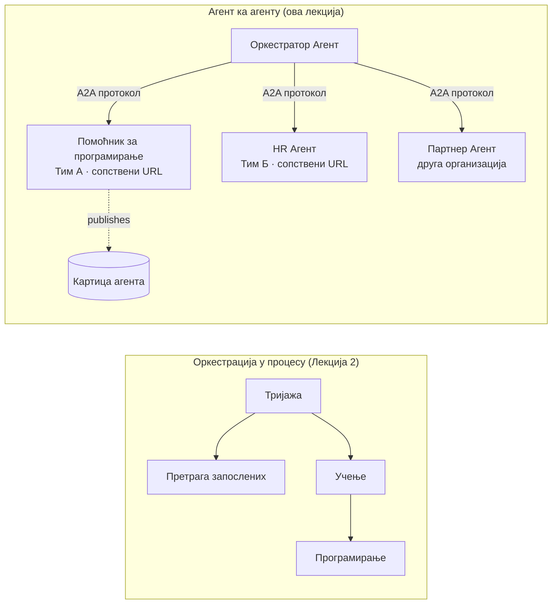

# Лекција 7: Оркестрација више агената и комуникација агент-агент (A2A)

Након [Лекције 6](../lesson-6-toolbox/README.md) можете изградити контролисане алате и хостоване агенте.
Али стварни системи ретко користе **једног** агента. Како скалирате, састављате **много** агената — неке које
поседујете ви, неке које поседују други тимови, неке који раде у потпуно другим организацијама. Ова лекција је о
томе како агенти раде **заједно**.

Већ сте упознали један облик дизајна са више агената у
[Лекцији 2 - `agent-orchestration.py`](../lesson-2-agent-development/README.md): образац **преноса**
где агенат за тријажу усмерава ка специјалистима **унутар једног процеса**. Ова лекција иде
корак даље — до **Агент-агент (A2A)**, отвореног протокола за агенте који раде као независни
**мрежни сервиси** и међусобно се позивају преко процеса, тимских и организационих граница.

## Циљеви учења

До краја ове лекције моћи ћете да:

- Објасните разлику између **оркестрације унутар процеса** (пренос/радни токови) и
  **Aгент-агент (A2A)** комуникације, и одаберете прави приступ.
- Опишете грађевне блокове A2A: **Agent Card**, **вештине**, **задатке**, и **откривање**.
- **Изложите** агента Microsoft Agent Framework-а као A2A сервис уз `A2AExecutor`.
- **Конзумирате** удаљеног агента као мрежног колегу уз `A2AAgent`.
- Примените корпоративне аспекте на A2A: **безбедност, идентитет, управљање, посматрање и трошкове**.

---

## Предзнања

1. Завршена [Лекција 2](../lesson-2-agent-development/README.md) (развој и оркестрација агената).
2. **Microsoft Foundry** пројекат са текућим увођењем модела (нпр. `gpt-5.1`, и
   `gpt-5-codex` за пример кодирања). Избегавајте застарели GPT-4o / GPT-4.1.
3. Аутентификован преко **Azure CLI**: `az login`.
4. **Python 3.12+** са инсталираним зависностима курса (`pip install -r ../requirements.txt`).
   Лекција 7 додаје preview пакете: `agent-framework-a2a`, `a2a-sdk`, и `uvicorn`.
5. Постављени `FOUNDRY_PROJECT_ENDPOINT` и `FOUNDRY_MODEL` у вашем `.env` (погледајте README курса).

---

## 1. Два начина како агенти раде заједно

Не постоји један „мулти-агент“ образац. Изаберите онај који одговара вашој **граници**:

| Образац | Где агенти раде | Како се повезују | Користите када |
|---------|------------------|------------------|----------|
| **Пренос / Радни ток** (Лекција 2) | Један процес, једна кодна база | Граф у меморији (`HandoffBuilder`, `WorkflowBuilder`) | Власник сте свих агената и распоређујете их заједно. |
| **Агент-агент (A2A)** (ова лекција) | Одвојени сервиси, одвојени животни циклуси | Отворени **A2A протокол** преко HTTP, откривен путем **Agent Cards** | Агенти су у власништву различитих тимова/организација, скалирају се независно, или су написани у различитим оквирима. |

Пренос се односи на **усмеравање у апликацији**. A2A је о **састављању агената као
независних сервиса** — агенцијски еквивалент преласка са позива функција на микросервисе.



> **Компонирају се.** Оркестратор који направите са `HandoffBuilder` може имати **удаљене A2A агенте**
> као учеснике — усмеравање унутар процеса ка сервисима који могу радити било где.

---

## 2. Грађевни блокови A2A

A2A је **отворени протокол** (није специфичан за Microsoft), тако да A2A агента може користити Microsoft
Agent Framework, LangGraph, сопствени код или стек друге компаније. Четири појма су важна:

- **Agent Card** — мали JSON документ, објављен на
  `/.well-known/agent-card.json`, који рекламира агентово **име, опис, URL, верзију,
  вештине и могућности**. Ово је начин да клијент **открије** шта удаљени агент може да уради.
- **Вештине (Skills)** — декларације о томе шта агент може да ради (`id`, `name`, `description`, `tags`,
  `examples`). Клијенти (и модели) то користе да одлуче да ли да га позову.
- **Задаци (Tasks)** — позив A2A агента је **задаци** са животним циклусом (пристигло → у раду →
  завршено/неуспешно). Сервер прати задатке у **task store**; подржане су стриминг исправке.
- **Откривање (Discovery)** — клијент који има само URL скида Agent Card и зна како да позове агента.

---

## 3. Изложите агента као A2A сервис — `a2a_server.py`

Страна за **Изградњу/сервирање** обавија било који Microsoft Agent Framework агент уз `A2AExecutor` и објављује га
као A2A HTTP апликацију. Погледајте [`a2a_server.py`](../../../lesson-7-multi-agent-a2a/a2a_server.py). Кључно повезивање:

```python
from agent_framework.a2a import A2AExecutor
from a2a.server.apps import A2AStarletteApplication
from a2a.server.request_handlers import DefaultRequestHandler
from a2a.server.tasks import InMemoryTaskStore
from a2a.types import AgentCapabilities, AgentCard, AgentSkill

agent = client.as_agent(name="coding-assistant", instructions="...")

agent_card = AgentCard(
    name="Coding Assistant",
    description="Generates runnable code samples...",
    url="http://localhost:9000/",
    version="1.0.0",
    capabilities=AgentCapabilities(streaming=True),
    default_input_modes=["text"],
    default_output_modes=["text"],
    skills=[AgentSkill(id="generate-code", name="Generate code",
                       description="Write a runnable code snippet.", tags=["code"])],
)

request_handler = DefaultRequestHandler(
    agent_executor=A2AExecutor(agent),
    task_store=InMemoryTaskStore(),
)
app = A2AStarletteApplication(agent_card=agent_card, http_handler=request_handler).build()
# сервирано помоћу увикорна на порту 9000
```

Обратите пажњу да је агентски код **непромењен** — `A2AExecutor` адаптира ваш постојећи агент на протокол.
Agent Card га чини **откривеним** сваком A2A клијенту.

---

## 4. Конзумирање удаљеног агента — `a2a_client.py`

Страна за **Конзумирање** повезује се на удаљеног агента **по URL-у**, преузима његову Agent Card и позива га
као да је локални агент. Погледајте [`a2a_client.py`](../../../lesson-7-multi-agent-a2a/a2a_client.py):

```python
from agent_framework.a2a import A2AAgent

remote_agent = A2AAgent(name="remote-coding-assistant", url="http://localhost:9000")
result = await remote_agent.run("Write a Python function that reverses a string.")
print(result.text)
```

Цела поента A2A је: са стране позиваоца удаљени агент се понаша као било који други
`agent_framework` агент, тако да га можете укључити у радни ток или му препустити део — иако ради
у другом процесу, на другом рачунару, у власништву другог тима.

### Покрените од почетка до краја

```bash
# Терминал 1 — покрени А2А услугу
python a2a_server.py

# Терминал 2 — позови је
python a2a_client.py "Write a Python function that reverses a string."
```

Видећете одговор помоћника за кодирање преко A2A протокола. Отворите
`http://localhost:9000/.well-known/agent-card.json` у прегледачу да видите објављену Agent Card.

---

## 5. Корпоративна брига

Претварање агената у мрежне сервисе уводи исте бриге као и свако дистрибуирано окружење —
плус неколико специфичних за вештачку интелигенцију:

- **Идентитет и аутентификација.** Никад не излажите A2A агента без аутентификације. Agent Card носи
  `security` / `security_schemes`, а `A2AAgent` прихвата `auth_interceptor` тако да позиваоци могу да приложe
  креденцијале (OAuth bearer токене, API кључеве). У продукцији користите Entra ID / managed identities
  за аутентификацију сервис-сервис; ставите сервис иза gateway-а.
- **Управљање (Governance).** Комбинујте A2A са [Лекцијом 6 Toolbox](../lesson-6-toolbox/README.md): удаљени
  агент може бити објављен као **A2A алат** у контролисаном алатнику тако да се примењују RBAC, убризгавање креденцијала,
  и правила заштите централно.
- **Посматрање (Observability).** Захтеви сада прелазе границе процеса, па пренесите трасу позива.
  Омогућите [Foundry Observability / OpenTelemetry](../lesson-3-agent-evals/README.md) на **обе**
  стране — оркестратору и сваком удаљеном агенту, да бисте добили једну крај-до-крај трасу.
- **Верзионисање.** Agent Card има `version`. Понашајте се као са API-јем: додатне промене су безбедне;
  прекидање уговора за вештину захтева нову верзију и период миграције за кориснике.
- **Поузданост.** Удаљени агенти независно пресује. Поставите тајмауте (`A2AAgent(timeout=...)`), рукујте
  делимичним неуспесима, и не дозволите да један спор колега блокира целу оркестрацију.
- **Трошкови.** Свакa удаљена позив агента је сопствена употреба модела. Фен-аут множи потрошњу токена —
  буџетирајте то, и дајте предност усмеравању ка **једном** најбољем агенту уместо емитовању ка многима.

---

## Практични задаци

1. **Додавање другог сервиса.** Копирајте `a2a_server.py` да бисте изложили агента **employee-search** на порту
   9001 са сопственим Agent Card-ом и вештинама. Покрените оба и позовите их из клијента.
2. **Оркестрација удаљених колега.** Направите мали `HandoffBuilder` (или обичан рутер) чији учесници
   укључују два `A2AAgent` који показују на ваша два сервиса. Усмерите упит ка правом.
3. **Осигурајте то.** Додајте `auth_interceptor` клијенту и захтевајте bearer токен на серверу.
   Шта се сруши ако токен недостаје? Где бисте чували токен у продукцији?
4. **Пренос vs A2A.** Напишите два кратка пасуса: када бисте задржали Лекцију 2 са преносом унутар процеса,
   а када је додатна сложеност A2A оправдана? Дајте конкретан пример за сваки случај.

---

## Ресурси

- [Agent-to-Agent (A2A) — Microsoft Agent Framework](https://learn.microsoft.com/agent-framework/user-guide/agent-orchestration/a2a)
- [Оркестрација више агената — Microsoft Agent Framework](https://learn.microsoft.com/agent-framework/user-guide/agent-orchestration/)
- [A2A спецификација протокола](https://a2a-protocol.org/)
- [A2A Python SDK (`a2a-sdk`)](https://github.com/a2aproject/a2a-python)
- [Foundry Agent Service — мулти-агентски обрасци](https://learn.microsoft.com/azure/ai-foundry/agents/concepts/connected-agents)

---

**Претходна:** [Лекција 6 — Microsoft Toolbox](../lesson-6-toolbox/README.md)

---

<!-- CO-OP TRANSLATOR DISCLAIMER START -->
**Изјава о одрицању одговорности**:
Овај документ је преведен коришћењем услуге за аутоматски превод [Co-op Translator](https://github.com/Azure/co-op-translator). Иако тежимо тачности, имајте у виду да аутоматски преводи могу садржати грешке или нетачности. Оригинални документ на његовом изворном језику треба сматрати ауторитативним извором. За критичне информације препоручује се професионални људски превод. Нисмо одговорни за било каква неспоразума или погрешна тумачења која произилазе из коришћења овог превода.
<!-- CO-OP TRANSLATOR DISCLAIMER END -->