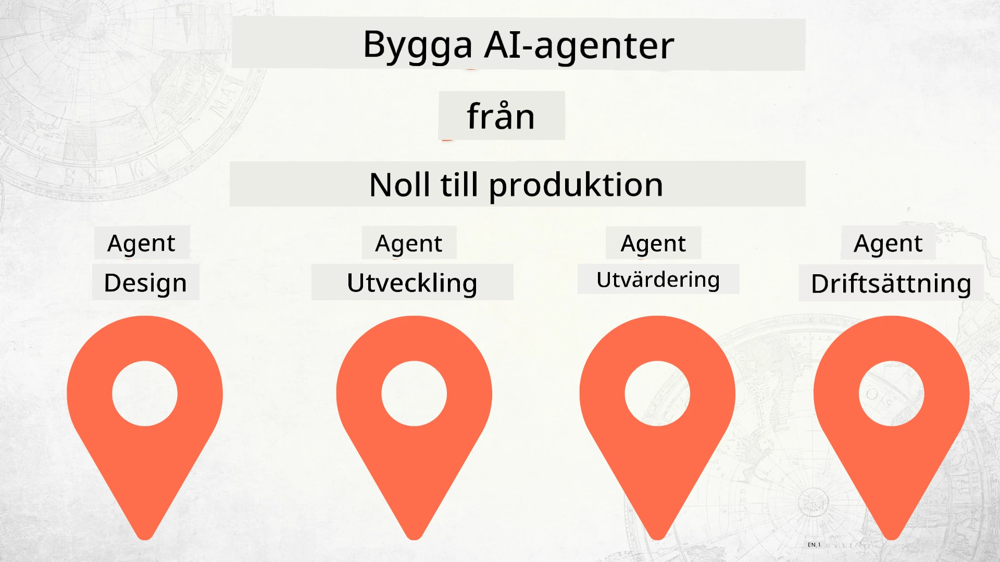

# Bygga AI-agenter från grunden till produktion



### 🌐 Flerspråkigt stöd

#### Stöds via GitHub Action (Automatiserat & Alltid Uppdaterat)

<!-- CO-OP TRANSLATOR LANGUAGES TABLE START -->
[Arabic](../ar/README.md) | [Bengali](../bn/README.md) | [Bulgarian](../bg/README.md) | [Burmese (Myanmar)](../my/README.md) | [Chinese (Simplified)](../zh-CN/README.md) | [Chinese (Traditional, Hong Kong)](../zh-HK/README.md) | [Chinese (Traditional, Macau)](../zh-MO/README.md) | [Chinese (Traditional, Taiwan)](../zh-TW/README.md) | [Croatian](../hr/README.md) | [Czech](../cs/README.md) | [Danish](../da/README.md) | [Dutch](../nl/README.md) | [Estonian](../et/README.md) | [Finnish](../fi/README.md) | [French](../fr/README.md) | [German](../de/README.md) | [Greek](../el/README.md) | [Hebrew](../he/README.md) | [Hindi](../hi/README.md) | [Hungarian](../hu/README.md) | [Indonesian](../id/README.md) | [Italian](../it/README.md) | [Japanese](../ja/README.md) | [Kannada](../kn/README.md) | [Khmer](../km/README.md) | [Korean](../ko/README.md) | [Lithuanian](../lt/README.md) | [Malay](../ms/README.md) | [Malayalam](../ml/README.md) | [Marathi](../mr/README.md) | [Nepali](../ne/README.md) | [Nigerian Pidgin](../pcm/README.md) | [Norwegian](../no/README.md) | [Persian (Farsi)](../fa/README.md) | [Polish](../pl/README.md) | [Portuguese (Brazil)](../pt-BR/README.md) | [Portuguese (Portugal)](../pt-PT/README.md) | [Punjabi (Gurmukhi)](../pa/README.md) | [Romanian](../ro/README.md) | [Russian](../ru/README.md) | [Serbian (Cyrillic)](../sr/README.md) | [Slovak](../sk/README.md) | [Slovenian](../sl/README.md) | [Spanish](../es/README.md) | [Swahili](../sw/README.md) | [Swedish](./README.md) | [Tagalog (Filipino)](../tl/README.md) | [Tamil](../ta/README.md) | [Telugu](../te/README.md) | [Thai](../th/README.md) | [Turkish](../tr/README.md) | [Ukrainian](../uk/README.md) | [Urdu](../ur/README.md) | [Vietnamese](../vi/README.md)

> **Föredrar du att klona lokalt?**
>
> Detta repo innehåller över 50 språköversättningar vilket avsevärt ökar nedladdningsstorleken. För att klona utan översättningar, använd sparsamt checkout:
>
> **Bash / macOS / Linux:**
> ```bash
> git clone --filter=blob:none --sparse https://github.com/microsoft/Building-AI-Agents-From-Zero-To-Production.git
> cd Building-AI-Agents-From-Zero-To-Production
> git sparse-checkout set --no-cone '/*' '!translations' '!translated_images'
> ```
>
> **CMD (Windows):**
> ```cmd
> git clone --filter=blob:none --sparse https://github.com/microsoft/Building-AI-Agents-From-Zero-To-Production.git
> cd Building-AI-Agents-From-Zero-To-Production
> git sparse-checkout set --no-cone "/*" "!translations" "!translated_images"
> ```
>
> Detta ger dig allt du behöver för att slutföra kursen med en mycket snabbare nedladdning.
<!-- CO-OP TRANSLATOR LANGUAGES TABLE END -->

## En kurs som lär dig grunderna i AI-agentens utvecklingslivscykel

[](https://github.com/microsoft/Building-AI-Agents-From-Zero-To-Production/blob/master/LICENSE?WT.mc_id=academic-105485-koreyst)
[](https://GitHub.com/microsoft/Building-AI-Agents-From-Zero-To-Production/graphs/contributors/?WT.mc_id=academic-105485-koreyst)
[](https://GitHub.com/microsoft/Building-AI-Agents-From-Zero-To-Production/issues/?WT.mc_id=academic-105485-koreyst)
[](https://GitHub.com/microsoft/Building-AI-Agents-From-Zero-To-Production/pulls/?WT.mc_id=academic-105485-koreyst)
[](http://makeapullrequest.com?WT.mc_id=academic-105485-koreyst)

[](https://discord.gg/Kuaw3ktsu6)

## 🌱 Kom igång

Denna kurs har lektioner som täcker grunderna i att bygga och distribuera AI-agenter.

Varje lektion bygger vidare på den föregående, så vi rekommenderar att börja från början och arbeta dig igenom till slutet.

Om du vill utforska mer om AI-agentämnen kan du kolla in [AI Agents For Beginners Course](https://aka.ms/ai-agents-beginners).

### Möt andra elever, få dina frågor besvarade

Om du fastnar eller har några frågor om att bygga AI-agenter, gå med i vår dedikerade Discord-kanal i [Microsoft Foundry Discord](https://discord.gg/Kuaw3ktsu6).

### Vad du behöver

Varje lektion har sitt eget kodexempel som du kan köra lokalt. Du kan [forka detta repo](https://github.com/microsoft/Building-AI-Agents-From-Zero-To-Production/fork) för att skapa din egen kopia.

Denna kurs använder för närvarande följande:

- [Microsoft Agent Framework (MAF)](https://aka.ms/ai-agents-beginners/agent-framework)
- [Microsoft Foundry](https://azure.microsoft.com/products/ai-foundry) — ett projekt med en distribuerad **GPT-5-serie** modell (t.ex. `gpt-5.1`). Använd **inte** de pensionerade GPT-4o / GPT-4.1 modellerna.
- [Azure OpenAI Service](https://azure.microsoft.com/products/ai-foundry/models/openai)
- [Azure CLI](https://learn.microsoft.com/cli/azure/authenticate-azure-cli?view=azure-cli-latest) — logga in med `az login` innan du kör något exempel
- **Python 3.12 eller senare**

Se till att du har tillgång till dessa tjänster innan du börjar.

> **💰 Kostnad & städning.** Praktiska lektioner skapar riktiga Azure-resurser — ett Microsoft Foundry
> projekt, en modelldistribution, en vektorlager och (i Lektionerna 4–6) hostade agenter och verktygslådor.
> Dessa kan medföra kostnad så länge de finns kvar. När du avslutar en lektion — eller hela kursen — ta bort
> resurser som du inte längre behöver. Det enklaste är att lägga allt i en dedikerad resurs-
> grupp och ta bort hela gruppen när du är klar:
>
> ```bash
> az group delete --name <your-resource-group> --yes --no-wait
> ```
>
> Du kan också ta bort individuella agenter, vektorlager och verktygslådor från Foundry-portalen.

> **Notera om modeller.** Denna kurs använder alla modeller via **Microsoft Foundry**. Den använder **inte**
> *GitHub Models*, som pensioneras den **30 juli 2026** — Microsoft Foundry är
> den officiella migrationsvägen. Om du har äldre kod som anropar GitHub Models, peka den istället mot en Foundry
> modelldistribution.

Fler alternativ kring modellhosting och tjänster kommer snart. 

## 🗃️ Lektioner

| **Lektion**         | **Beskrivning**                                                                                  |
|--------------------|--------------------------------------------------------------------------------------------------|
| [Agent Design](./lesson-1-agent-design/README.md)       | En introduktion till vårt "Utvecklarens Onboarding" Agentfall och hur man designar effektiva agenter  |
| [Agent Development](./lesson-2-agent-development/README.md)  | Med Microsoft Agent Framework (MAF), bygg en uppsättning specialiserade agenter för att hjälpa nya utvecklare att onboarda.       |
| [Agent Evaluations](./lesson-3-agent-evals/README.md)  | Med Microsoft Foundry, ta reda på hur väl våra AI-agenter presterar och hur man förbättrar dem. |
| [Agent Deployment](./lesson-4-agentdeployment/README.md)   | Med Microsoft Foundry hostade agenter och OpenAI ChatKit, se hur man distribuerar en AI-agent i produktion.       |
| [Production Hosted Agents](./lesson-5-hosted-agents-production/README.md)   | Ta en hostad agent till företagsproduktion: Hostade agenter vs Capability Hosts, ta med egen lagring, minne och styrning.       |
| [Microsoft Toolbox](./lesson-6-toolbox/README.md)   | Definiera verktyg en gång och styr dem centralt: bygg en verktygslåda, använd den från en agent via en MCP-endpoint, och versionera verktyg säkert.       |
| [Multi-Agent & A2A](./lesson-7-multi-agent-a2a/README.md)   | Sätt samman agenter som nätverkade tjänster: exponera en agent över det öppna Agent-to-Agent (A2A) protokollet och använd en fjärragent som en jämlike.       |


## 🎒 Andra kurser

Vårt team producerar andra kurser! Kolla in:

<!-- CO-OP TRANSLATOR OTHER COURSES START -->
### LangChain
[](https://aka.ms/langchain4j-for-beginners)
[](https://aka.ms/langchainjs-for-beginners?WT.mc_id=m365-94501-dwahlin)
[](https://github.com/microsoft/langchain-for-beginners?WT.mc_id=m365-94501-dwahlin)
---

### Azure / Edge / MCP / Agenter
[](https://github.com/microsoft/AZD-for-beginners?WT.mc_id=academic-105485-koreyst)
[](https://github.com/microsoft/edgeai-for-beginners?WT.mc_id=academic-105485-koreyst)
[](https://github.com/microsoft/mcp-for-beginners?WT.mc_id=academic-105485-koreyst)
[](https://github.com/microsoft/ai-agents-for-beginners?WT.mc_id=academic-105485-koreyst)

---
 
### Generativ AI-serie

[](https://github.com/microsoft/generative-ai-for-beginners?WT.mc_id=academic-105485-koreyst)
[-9333EA?style=for-the-badge&labelColor=E5E7EB&color=9333EA)](https://github.com/microsoft/Generative-AI-for-beginners-dotnet?WT.mc_id=academic-105485-koreyst)
[-C084FC?style=for-the-badge&labelColor=E5E7EB&color=C084FC)](https://github.com/microsoft/generative-ai-for-beginners-java?WT.mc_id=academic-105485-koreyst)
[-E879F9?style=for-the-badge&labelColor=E5E7EB&color=E879F9)](https://github.com/microsoft/generative-ai-with-javascript?WT.mc_id=academic-105485-koreyst)

---
 
### Kärnkunskap
[](https://aka.ms/ml-beginners?WT.mc_id=academic-105485-koreyst)
[](https://aka.ms/datascience-beginners?WT.mc_id=academic-105485-koreyst)
[](https://aka.ms/ai-beginners?WT.mc_id=academic-105485-koreyst)
[](https://github.com/microsoft/Security-101?WT.mc_id=academic-96948-sayoung)
[](https://aka.ms/webdev-beginners?WT.mc_id=academic-105485-koreyst)
[](https://aka.ms/iot-beginners?WT.mc_id=academic-105485-koreyst)
[](https://github.com/microsoft/xr-development-for-beginners?WT.mc_id=academic-105485-koreyst)

---
 
### Copilot-serien
[](https://aka.ms/GitHubCopilotAI?WT.mc_id=academic-105485-koreyst)
[](https://github.com/microsoft/mastering-github-copilot-for-dotnet-csharp-developers?WT.mc_id=academic-105485-koreyst)
[](https://github.com/microsoft/CopilotAdventures?WT.mc_id=academic-105485-koreyst)
<!-- CO-OP TRANSLATOR OTHER COURSES END -->

## Bidra

Detta projekt välkomnar bidrag och förslag. De flesta bidrag kräver att du godkänner en
Contributor License Agreement (CLA) som intygar att du har rätt att, och faktiskt gör, ge oss
rättigheterna att använda ditt bidrag. För detaljer, besök <https://cla.opensource.microsoft.com>.

När du skickar in en pull-begäran kommer en CLA-bot automatiskt avgöra om du behöver tillhandahålla
en CLA och märka PR lämpligt (t.ex. statuskontroll, kommentar). Följ bara anvisningarna
från boten. Du behöver bara göra detta en gång för alla repos som använder vår CLA.

Detta projekt har antagit [Microsofts öppna källkodsetikett](https://opensource.microsoft.com/codeofconduct/).
För mer information se [Etikettens FAQ](https://opensource.microsoft.com/codeofconduct/faq/) eller
kontakta [opencode@microsoft.com](mailto:opencode@microsoft.com) med eventuella ytterligare frågor eller kommentarer.

## Varumärken

Detta projekt kan innehålla varumärken eller logotyper för projekt, produkter eller tjänster. Auktoriserad användning av Microsofts
varumärken eller logotyper är föremål för och måste följa
[Microsofts varumärkes- och varumärkesriktlinjer](https://www.microsoft.com/legal/intellectualproperty/trademarks/usage/general).
Användning av Microsofts varumärken eller logotyper i modifierade versioner av detta projekt får inte skapa förvirring eller antyda Microsofts sponsring.
All användning av tredjeparts varumärken eller logotyper är föremål för dessa tredje parters policys.

## Få hjälp

Om du kör fast eller har frågor om att bygga AI-appar, gå med i:

[](https://discord.gg/Kuaw3ktsu6)

Om du har produktfeedback eller stöter på fel när du bygger, besök:

[](https://aka.ms/foundry/forum)

---

<!-- CO-OP TRANSLATOR DISCLAIMER START -->
**Ansvarsfriskrivning**:
Detta dokument har översatts med hjälp av AI-översättningstjänsten [Co-op Translator](https://github.com/Azure/co-op-translator). Även om vi strävar efter noggrannhet, var vänlig notera att automatiska översättningar kan innehålla fel eller brister. Det ursprungliga dokumentet på dess modersmål bör betraktas som den auktoritativa källan. För kritisk information rekommenderas professionell mänsklig översättning. Vi ansvarar inte för några missförstånd eller feltolkningar som uppstår till följd av användningen av denna översättning.
<!-- CO-OP TRANSLATOR DISCLAIMER END -->