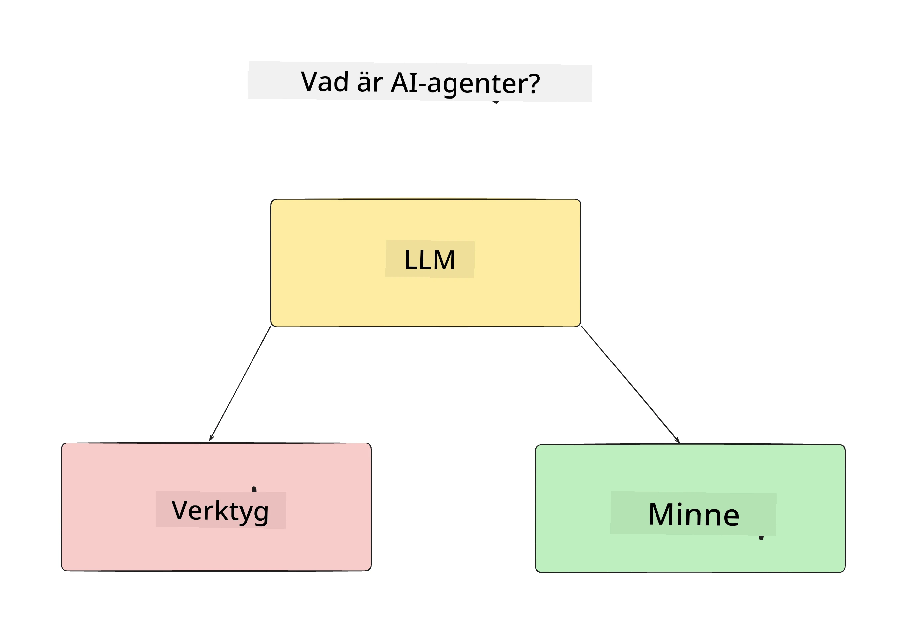
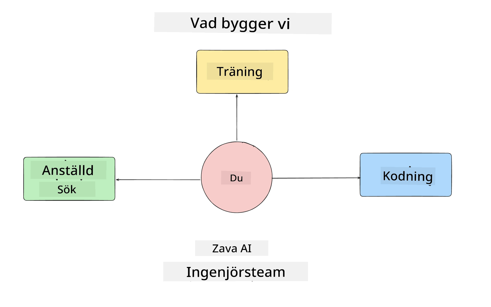
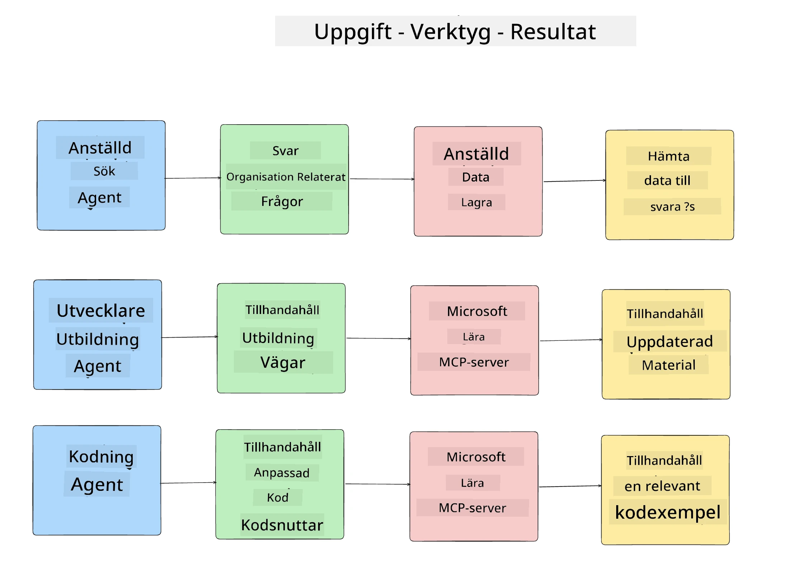
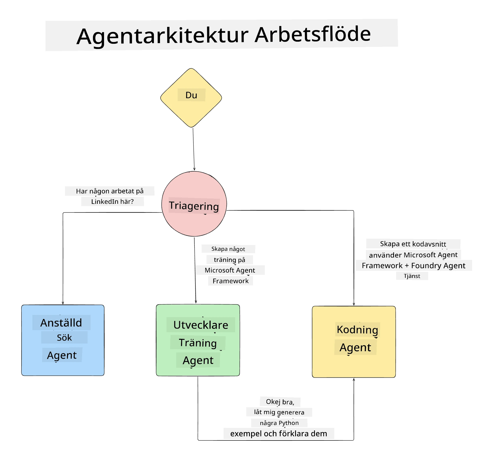

# Lektion 1: AI Agent Design

Välkommen till den första lektionen i kursen "Bygga AI Agent från noll till produktion"!

I denna lektion kommer vi att täcka:

- Definiera vad AI-agenter är
  
- Diskutera AI Agent-applikationen vi bygger  

- Identifiera de verktyg och tjänster som krävs för varje agent
  
- Arkitektera vår Agent-applikation
  
Låt oss börja med att definiera vad en agent är och varför vi vill använda dem i en applikation.

> **Innan du börjar kursen.** Denna första lektion är konceptuell — det finns ingen kod att köra.
> Från och med [Lektion 2](../lesson-2-agent-development/README.md) behöver du: en **Azure
> prenumeration** med tillgång till **Microsoft Foundry**, en distribuerad **GPT-5 serie modell** (till
> exempel `gpt-5.1` — undvik de pensionerade GPT-4o / GPT-4.1), **Python 3.12+**, och **Azure CLI**
> (`az login`). Se [Vad du behöver](../README.md#what-you-need) i kursens README för hela
> listan och länkar.

## Vad är AI-agenter?

Om detta är första gången du utforskar hur man bygger en AI-agent kan du ha frågor om hur man exakt definierar vad en AI-agent är.

Ett enkelt sätt att definiera vad en AI Agent är, är genom de komponenter som utgör den:

**Stort språkmodell** – LLM kommer att driva både förmågan att bearbeta naturligt språk från användaren för att tolka uppgiften de vill utföra samt tolka beskrivningarna av de verktyg som finns tillgängliga för att slutföra dessa uppgifter.

**Verktyg** – Dessa kommer att vara funktioner, API:er, datalager och andra tjänster som LLM kan välja att använda för att slutföra de uppgifter som användaren begär.

**Minne** – Så här lagrar vi både kortsiktiga och långsiktiga interaktioner mellan AI-agenten och användaren. Att lagra och hämta denna information är viktigt för att göra förbättringar och spara användarpreferenser över tid.

## Vårt AI Agent-användningsfall

För denna kurs ska vi bygga en AI Agent-applikation som hjälper nya utvecklare att komma igång i vårt AI Agent-utvecklingsteam!

Innan vi gör något utvecklingsarbete är första steget för att skapa en framgångsrik AI Agent-applikation att definiera tydliga scenarier för hur vi förväntar oss att våra användare ska arbeta med våra AI-agenter.

För denna applikation kommer vi att arbeta med dessa scenarier:

**Scenario 1**: En nyanställd ansluter till vår organisation och vill veta mer om det team de gått med i och hur man kopplar kontakt med dem.

**Scenario 2:** En nyanställd vill veta vilken som skulle bli den bästa första uppgiften för dem att börja arbeta med.

**Scenario 3:** En nyanställd vill samla in lärresurser och kodexempel för att hjälpa dem att komma igång med att slutföra den här uppgiften.

## Identifiera verktygen och tjänsterna

Nu när vi har skapat dessa scenarier är nästa steg att koppla dem till de verktyg och tjänster som våra AI-agenter behöver för att slutföra uppgifterna.

Denna process faller under kategorin Kontextteknik eftersom vi kommer att fokusera på att se till att våra AI-agenter har rätt kontext vid rätt tidpunkt för att slutföra uppgifterna.

Låt oss göra detta scenario för scenario och utföra god agentdesign genom att lista varje agents uppgift, verktyg och önskade resultat.

### Scenario 1 - Medarbetarsökningsagent

**Uppgift** - Besvara frågor om anställda i organisationen såsom anställningsdatum, nuvarande team, plats och senaste position.

**Verktyg** - Datalager med aktuell anställdlista och organisationsschema

**Resultat** - Ska kunna hämta information från datalagret för att besvara allmänna organisationsfrågor och specifika frågor om anställda.

### Scenario 2 - Uppgiftsrekommendationsagent

**Uppgift** - Baserat på den nya anställdes utvecklarerfarenhet, komma på 1-3 ärenden som den nya anställda kan arbeta med.

**Verktyg** - GitHub MCP Server för att få öppna ärenden och bygga en utvecklarprofil

**Resultat** - Ska kunna läsa de senaste 5 commits från en GitHub-profil och öppna ärenden på ett GitHub-projekt och ge rekommendationer baserat på en matchning

### Scenario 3 - Kodassistentagent

**Uppgift** - Baserat på de öppna ärenden som rekommenderades av "Uppgiftsrekommendationsagenten", forskar och tillhandahåller resurser samt genererar kodexempel för att hjälpa den anställda.

**Verktyg** - Microsoft Learn MCP för att hitta resurser och Code Interpreter för att generera anpassade kodexempel.

**Resultat** - Om användaren ber om ytterligare hjälp ska arbetsflödet använda Learn MCP Server för att tillhandahålla länkar och utdrag till resurser och sedan överlämna till Code Interpreter-agenten för att generera små kodexempel med förklaringar.

## Arkitektera vår Agent-applikation

Nu när vi har definierat var och en av våra agenter, låt oss skapa ett arkitekturdiagram som hjälper oss att förstå hur varje agent kommer att arbeta tillsammans och separat beroende på uppgiften:

## Nästa steg

Nu när vi har designat varje agent och vårt agentbaserade system, låt oss gå vidare till nästa lektion där vi ska utveckla var och en av dessa agenter!

---

<!-- CO-OP TRANSLATOR DISCLAIMER START -->
**Ansvarsfriskrivning**:
Detta dokument har översatts med hjälp av AI-översättningstjänsten [Co-op Translator](https://github.com/Azure/co-op-translator). Även om vi strävar efter noggrannhet, var vänlig notera att automatiska översättningar kan innehålla fel eller brister. Det ursprungliga dokumentet på dess modersmål bör betraktas som den auktoritativa källan. För kritisk information rekommenderas professionell mänsklig översättning. Vi ansvarar inte för några missförstånd eller feltolkningar som uppstår till följd av användningen av denna översättning.
<!-- CO-OP TRANSLATOR DISCLAIMER END -->