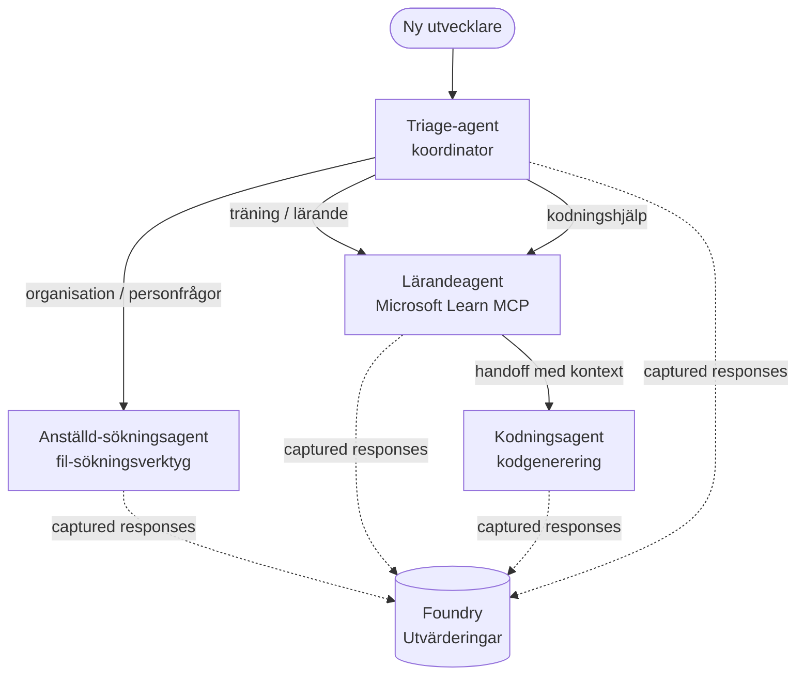

# Lektion 3: Agentutvärderingar med Microsoft Foundry

Välkommen till den tredje lektionen i kursen **"Bygga AI-agenter från noll till produktion"**!

I [Lektion 2](../lesson-2-agent-development/README.md) byggde du agenter. I denna lektion
kommer du att lära dig att besvara en mycket svårare fråga: **är de bra?** Att leverera en agent som
fungerar är enkelt; att veta om den dirigerar korrekt, håller sig förankrad i din data och använder sina
verktyg på rätt sätt är vad som skiljer en demo från ett produktsystem.

I denna lektion kommer vi att täcka:

- Varför agentutvärdering är viktigt och hur det skiljer sig från traditionell testning
- Skillnaden mellan **observabilitet**, **smoke tests** och **utvärderingar**
- Det multi-agent arbetsflöde vi ska mäta
- De inbyggda **Microsoft Foundry-utvärderarna** (relevans, förankring, korrekthet vid verktygsanrop, användning av verktygsresultat)
- En steg-för-steg genomgång av utvärderingspipen i [`agent-evals.py`](../../../lesson-3-agent-evals/agent-evals.py)
- Hur man kör den och läser resultaten

---

## Varför utvärdera agenter?

Ett traditionellt enhetstest försäkrar att `add(2, 2) == 4`. Agenter fungerar inte så — samma
prompt kan ge olika formulering varje gång, verktyg kan anropas i olika ordningar, och
"korrekt" är ofta en gradfråga snarare än ett booleskt värde. Du kan inte göra exakta strängsatsningar.

Istället utvärderar du agenter längs **kvalitetsdimensioner** med modellbaserade *utvärderare* (också
kallade "LLM-som-domare") plus deterministiska kontroller av verktygsanvändning. Detta berättar saker som:

- Adresserade svaret faktiskt frågan? (**relevans**)
- Stöds svaret av den hämtade datan, eller hallucinerade agenten? (**förankring**)
- Anropade agenten rätt verktyg med rätt argument? (**korrekthet vid verktygsanrop**)
- Använde agenten faktiskt vad verktyget returnerade? (**användning av verktygsresultat**)

### Tre kompletterande kvalitetslager

Dessa är inga konkurrerande tekniker — en produktionsagent använder alla tre:

| Lager | Fråga det svarar på | Kostnad | När det körs | Täcks i |
|-------|--------------------|------|--------------|------------|
| **Observabilitet / spårning** | *Vad gjorde agenten, steg för steg?* | Gratis (alltid på) | Kontinuerligt i produktion | Denna lektion |
| **Smoke tests** | *Är agenten nåbar och följer sin grundläggande prompt?* | Billigt, sekunder | Vid varje utrullning | [Lektion 4](../lesson-4-agentdeployment/README.md#smoke-testing-the-hosted-agent-ci-gate) |
| **Utvärderingar** | *Hur **bra** är svaren?* | Långsammare, modellmätt | På begäran / nattligt / före release | Denna lektion |

Smoke tests svarar på "gick det sönder?"; utvärderingar svarar på "är det bra?". Du vill ha båda.

---

## Förutsättningar

1. Genomförd [Lektion 2](../lesson-2-agent-development/README.md) (agenter + vektorlagring).
2. Ett **Microsoft Foundry**-projekt.
3. **Azure CLI** autentiserad: `az login`.
4. **Python 3.12+** och kursens beroenden installerade:

   ```bash
   pip install -r ../requirements.txt
   ```


5. Miljövariabler (skapa en `.env`-fil i denna mapp eller exportera dem):

   | Variabel | Syfte |
   |----------|---------|
   | `FOUNDRY_PROJECT_ENDPOINT` | Din Foundry-projekts slutpunkt (`https://<kontonamn>.services.ai.azure.com/api/projects/<projekt>`). Lästs av agenternas `FoundryChatClient` **och** utvärderingshjälpen. |
   | `FOUNDRY_MODEL` | Modellutplacering som **agenterna** körs på (t.ex. `gpt-5.1`). |
   | `VECTOR_STORE_ID` | Vektorlagret för anställdadirektoriet som skapades i Lektion 2 |
   | `AZURE_AI_MODEL_DEPLOYMENT_NAME` | Modellutplacering som används **av utvärderarna** (standard är `FOUNDRY_MODEL`, sedan `gpt-5.1`) |

> Agenterna använder `FoundryChatClient`, som läser konfiguration från variabler med prefix `FOUNDRY_`
> (`FOUNDRY_PROJECT_ENDPOINT`, `FOUNDRY_MODEL`). Cloud-utvärderingshjälpen
> använder SDK:n `azure-ai-projects` och faller tillbaka på `FOUNDRY_PROJECT_ENDPOINT` om
> `AZURE_AI_PROJECT_ENDPOINT` inte är satt — så de två `FOUNDRY_`-variablerna räcker för att
> köra hela lektionen.
>
> Utvärderarna drivs själva av en modell, så `AZURE_AI_MODEL_DEPLOYMENT_NAME`
> styr vilken utplacering som gör bedömningen — det behöver inte vara samma modell som dina
> agenter använder.

---

## Arbetsflödet vi utvärderar

För att utvärdera något måste du först köra det. Den här lektionen återanvänder arbetsflödet **Developer Onboarding**
med flera agenter: en **triage**-koordinator lämnar över till tre specialister.



Arbetsflödet är byggt med Microsoft Agent Frameworks **handoff**-orkestrering. Nyckel-
idén för utvärdering är att **varje agentomgång sparas server-side** och identifieras med en
`response_id`. Dessa ID:n är vad vi lämnar till utvärderingstjänsten.

---

## Utvärderingspipelinjen, steg för steg

[`agent-evals.py`](../../../lesson-3-agent-evals/agent-evals.py) implementerar en pipeline med sex steg. Här är vad varje steg gör
och varför.

### Steg 1 — Kör arbetsflödet och spåra response IDs

Arbetsflödet körs med `run_stream(...)`, och när händelser strömmas tillbaka lagrar koden
`response_id` och `conversation_id` som varje agent genererar. Sparade svar är rå-
materialet för utvärdering — du bedömer *riktiga* produktionslika svar, inte nygenererade.


### Steg 2 — Sammanfatta vad som fångades

En snabb sammanfattning skriver ut hur många svar varje agent producerade, så du kan bekräfta att
arbetsflödet faktiskt använde de agenter du tänker bedöma.

### Steg 3 — Hämta de slutgiltiga svaren

För varje agent hämtas det sista `response_id` via projektets OpenAI-kompatibla
klient (`project_client.get_openai_client().responses.retrieve(...)`) så att du kan förhandsgranska
texten som ska bedömas.

### Steg 4 — Skapa utvärderingen

En utvärdering skapas med fyra **inbyggda Foundry-utvärderare**:

| Utvärderare | `evaluator_name` | Vad den mäter |
|-----------|------------------|------------------|

| Relevans | `builtin.relevance` | Adresserar svaret användarens begäran? |

| Grundlagdhet | `builtin.groundedness` | Är svaret underbyggt av hämtade/verktygsdata (inte hallucinerat)? |
| Verktygsanropsnoggrannhet | `builtin.tool_call_accuracy` | Anropades rätt verktyg med rätt argument? |
| Användning av verktygsutdata | `builtin.tool_output_utilization` | Använde agenten faktiskt verktygsresultaten i sitt svar? |

Varje utvärderare initieras med distributionen namngiven av `AZURE_AI_MODEL_DEPLOYMENT_NAME`.

> **Varför dessa fyra?** Relevans och grundlagdhet mäter *svarskvalitet*; de två verktygs-
> utvärderarna mäter *agentbeteende* — den del som traditionella NLP-mått helt missar. För ett
> verktygsanvändande, multi-agent-system är verktygsmått ofta där verkliga regressionsproblem döljer sig.

### Steg 5 — Kör utvärderingen

De insamlade `response_id`s skickas till `evals.runs.create(...)` som datakälla. Tjänsten spelar
upp varje lagrat svar genom varje utvärderare.

### Steg 6 — Övervaka och läs resultat

Koden pollar körningen tills den är `completed` eller `failed`, och skriver sedan ut resultaträkningar
och en **`report_url`** — en djup länk till Foundry-portalen där du kan granska poäng per mått,
godkända/icke godkända räkningar och individuella bedömda svar.

---

## Kör den

```bash
cd lesson-3-agent-evals
python agent-evals.py
```

Som standard utvärderas den första exempel-frågan
(`"Jag är ny här! Har någon jobbat på Microsoft här?"`). Två fler multi-intent-exempel
ingår i `run_evaluation_workflow()` — byt `query`-variabeln för att testa routing-scenarier
som aktiverar fler agenter i en och samma körning.

Förväntad konsolutmatning:

```
Step 1: Running Developer Onboarding Workflow
Step 2: Response Data Summary
Step 3: Fetching Agent Responses
Step 4: Creating Evaluation
Step 5: Running Evaluation
Step 6: Monitoring Evaluation
  Status: running ...
  Evaluation completed successfully
  Report URL: https://...   <-- open this in the Foundry portal
```

---

## Observabilitet och spårning

Utvärderingar berättar för dig *hur bra* svaren var; **observabilitet** berättar för dig *vad som hände*
för att producera dem — varje agentsteg, verktygsanrop, tokenräkning och latens. I Microsoft Foundry
skickar agentkörningar OpenTelemetry-spår som du kan visa i portalen, och Agent Framework kan
exportera dem till Azure Monitor / Application Insights med ett enda anrop:

```python
from agent_framework.foundry import FoundryChatClient

client = FoundryChatClient()
client.configure_azure_monitor()   # exportera spår + mätvärden till Application Insights
```

Använd spårning för att **felsöka** en dålig utvärderingspoäng: när grundlagdheten sjunker visar spåret
om fil-sökverktyget inte gav något resultat, eller om det gav data som agenten sedan ignorerade
(vilket är precis vad poängen för användning av verktygsutdata mäter).

---

## Från "körningar" till "bra": hur man använder detta i praktiken

- **Försläpp-port.** Kör utvärderingar mot en fast uppsättning representativa frågor innan du
  uppgraderar en ny prompt eller modell. Jämför poäng med föregående version – behandla en nedgång
  som en regression.
- **Nattlig kvalitetsindikator.** Schemalägg utvärderingen för att fånga drift från data- eller
  beroendeförändringar.
- **Kombinera med röktester.** [Lektion 4:s röktest](../lesson-4-agentdeployment/README.md#smoke-testing-the-hosted-agent-ci-gate)
  är din snabba per-distributions port; utvärderingar är den långsammare, djupare kvalitetsporten. Kör det
  billiga på varje sammanslagning och det dyrare på ett schema eller före släpp.

---

## Moderniseringsanmärkning

Den här mallen migreras till den aktuella Microsoft Agent Framework Foundry API-yta
(`agent_framework.foundry`). Om du uppdaterar koden, se repository-roten
[`MIGRATION-GUIDE.md`](../MIGRATION-GUIDE.md) för verifierade före/efter import- och klient-
mappningar (till exempel `AzureAIClient` -> `FoundryChatClient` och konstruktion av värd-verktyg via
`client.get_file_search_tool(...)` / `client.get_mcp_tool(...)`). Utvärderingskoncepten och den
sexstegs pipeline ovan påverkas inte av migrationen.

---

## Resurser

- [Utvärdera generativa AI-modeller och applikationer (Microsoft Learn)](https://learn.microsoft.com/en-us/azure/ai-foundry/concepts/evaluation-approach-gen-ai)
- [Inbyggda utvärderare för generativ AI](https://learn.microsoft.com/en-us/azure/ai-foundry/concepts/evaluation-evaluators/agent-evaluators)
- [Observabilitet i Microsoft Foundry](https://learn.microsoft.com/en-us/azure/ai-foundry/concepts/observability)
- [Microsoft Agent Framework](https://github.com/microsoft/agent-framework)
- [Agent överlämningsorkestrering](https://learn.microsoft.com/en-us/agent-framework/workflows/orchestrations/handoff)

---

<!-- CO-OP TRANSLATOR DISCLAIMER START -->
**Ansvarsfriskrivning**:
Detta dokument har översatts med hjälp av AI-översättningstjänsten [Co-op Translator](https://github.com/Azure/co-op-translator). Även om vi strävar efter noggrannhet, var vänlig notera att automatiska översättningar kan innehålla fel eller brister. Det ursprungliga dokumentet på dess modersmål bör betraktas som den auktoritativa källan. För kritisk information rekommenderas professionell mänsklig översättning. Vi ansvarar inte för några missförstånd eller feltolkningar som uppstår till följd av användningen av denna översättning.
<!-- CO-OP TRANSLATOR DISCLAIMER END -->