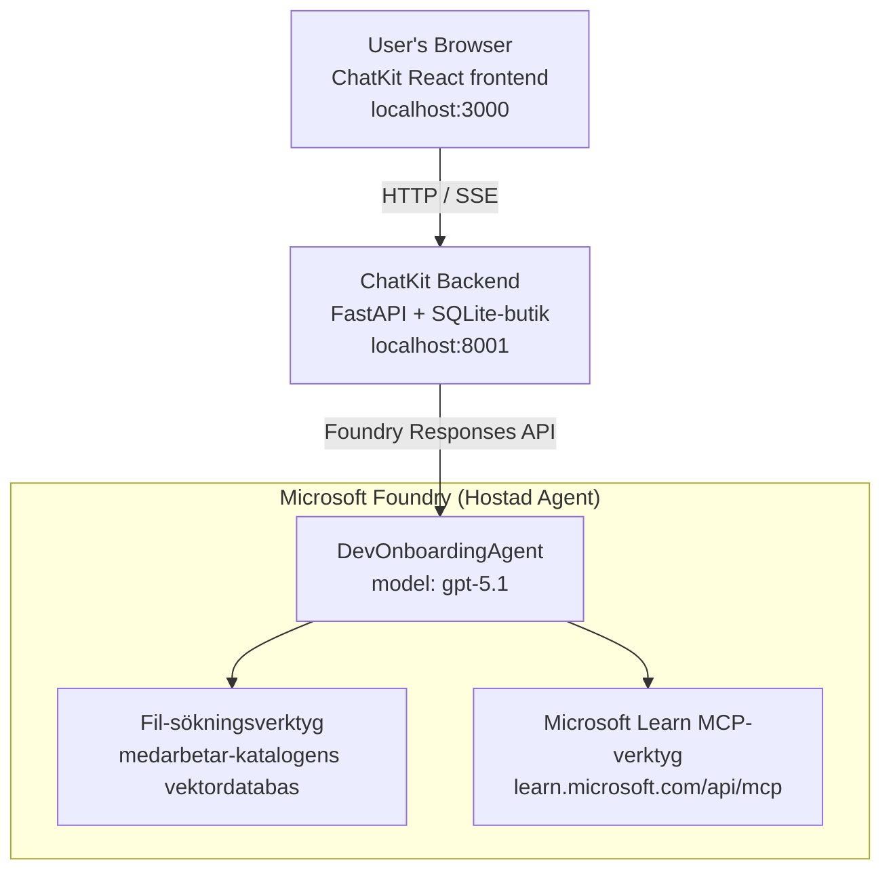

# Lektion 4: Agentutplacering med Microsoft Foundry Hostade Agenter + ChatKit

Denna lektion visar hur man distribuerar en verktygsanvändande agent till Microsoft Foundry som en hostad agent och skapar ett ChatKit-baserat frontend för att interagera med den.

## Arkitektur

Den hostade agenten är en **enkel `DevOnboardingAgent`** (körs på `gpt-5.1`) som svarar på frågor om onboarding för utvecklare med hjälp av två hostade verktyg: ett **Fil Söknings** verktyg över vektorlagret för anställdas katalog, och verktyget **Microsoft Learn MCP**. Ett ChatKit React frontend kommunicerar med en FastAPI backend, som anropar agenten via Foundrys **Responses API**.



## Förutsättningar

1. **Microsoft Foundry-projekt** i North Central US-regionen
2. **Azure CLI** autentiserad (`az login`)
3. **Azure Developer CLI** (`azd`) installerad
4. **Python 3.12+** och **Node.js 18+**
5. **Vektorlagring** skapad med anställdas data

## Snabbstart

### 1. Ställ in miljövariabler

```bash
cd lesson-4-agentdeployment
cp .env.example .env
# Redigera .env med dina Microsoft Foundry-projektuppgifter
```

### 2. Distribuera den hostade agenten

**Alternativ A: Använd Azure Developer CLI (Rekommenderat)**

```bash
cd hosted-agent
azd auth login
azd agent deploy
```

**Alternativ B: Använd Docker + Azure Container Registry**

```bash
cd hosted-agent

# Bygg containern
docker build -t developer-onboarding-agent:latest .

# Tagg för ACR
docker tag developer-onboarding-agent:latest <your-acr>.azurecr.io/developer-onboarding-agent:latest

# Skjut upp till ACR
az acr login --name <your-acr>
docker push <your-acr>.azurecr.io/developer-onboarding-agent:latest

# Distribuera via Microsoft Foundry-portalen eller SDK
```

### 3. Starta ChatKit backend

```bash
cd chatkit-server
python -m venv .venv
source .venv/bin/activate  # På Windows: .venv\Scripts\activate
pip install -r requirements.txt
python app.py
```

Servern kommer att starta på `http://localhost:8001`

### 4. Starta ChatKit frontend

```bash
cd chatkit-server/frontend
npm install
npm run dev
```

Frontend kommer att starta på `http://localhost:3000`

### 5. Testa applikationen

Öppna `http://localhost:3000` i din webbläsare och prova dessa frågor:

**Sök anställda:**
- "Jag är ny här! Har någon jobbat på Microsoft?"
- "Vem har erfarenhet av Azure Functions?"

**Lärresurser:**
- "Skapa en lärväg för Kubernetes"
- "Vilka certifieringar bör jag ta för molnarkitektur?"

**Kodningshjälp:**
- "Hjälp mig skriva Python-kod för att ansluta till CosmosDB"
- "Visa mig hur man skapar en Azure Function"

**Frågor med flera agenter:**
- "Jag börjar som molningenjör. Vem bör jag kontakta och vad bör jag lära mig?"

## Projektstruktur

```
lesson-4-agentdeployment/
├── .env.example                 # Environment variables template
├── implementation-plan.md       # Detailed implementation guide
├── README.md                    # This file
├── hosted-agent/               # Microsoft Foundry hosted agent
│   ├── main.py                 # Multi-agent workflow implementation
│   ├── requirements.txt        # Python dependencies
│   ├── Dockerfile              # Container definition
│   └── agent.yaml              # Agent deployment configuration
└── chatkit-server/             # ChatKit server application
    ├── app.py                  # FastAPI backend
    ├── store.py                # SQLite persistence layer
    ├── requirements.txt        # Python dependencies
    └── frontend/               # React frontend
        ├── package.json
        ├── vite.config.ts
        ├── tsconfig.json
        ├── index.html
        └── src/
            ├── main.tsx
            ├── App.tsx
            ├── App.css
            └── index.css
```

## Agenten och dess verktyg

Den hostade agenten är en **enkel agent** (`DevOnboardingAgent`, definierad i `hosted-agent/main.py`) som hanterar tre onboarding-domäner. Istället för att orkestrera separata sub-agenter, exponerar den varje kapacitet som ett verktyg (eller förlitar sig direkt på modellen):

| Kapacitet | Hur det hanteras | Verktyg |
|-----------|------------------|------|
| **Sök och kopplingar mellan anställda** | Foundry-hostad Fil Sökning över vektorlagret för anställdas katalog | `client.get_file_search_tool(vector_store_ids=[...])` |
| **Lärande & utbildning** | Microsoft Learn MCP-server (hostat MCP-verktyg) | `client.get_mcp_tool(url="https://learn.microsoft.com/api/mcp")` |
| **Kodningshjälp** | Hanteras direkt av modellen `gpt-5.1` — inget externt verktyg | — |

Agenten skapas med `client.as_agent(name="DevOnboardingAgent", instructions=..., tools=[file_search_tool, learn_mcp_tool])` och körs med `from_agent_framework(agent).run()`.

> **Designanmärkning.** Tidigare utkast av denna lektion använde ett `HandoffBuilder` multi-agent arbetsflöde (Triage → specialister). Den levererade agenten är en enkel verktygsanvändande agent, vilket är enklare att distribuera och resonera kring för onboarding-typ frågor och svar. För ett exempel på multi-agent orkestrering och överlämningar, se Lektion 2 och Lektion 3.

## Röktestning av den hostade agenten (CI-gate)

Att distribuera en hostad agent "framgångsrikt" bevisar endast att kontrollplanet accepterade
definitionen — det bevisar **inte** att agenten faktiskt svarar. En saknad beroende,
dålig modellriktning eller en utgången anslutning kan lämna en grön-men-tyst agent.

Denna lektion levererar ett lättviktigt **röktest** som fungerar som en snabb, billig post-distribuerings-
gate. Det använder [AI Smoke Test](https://github.com/marketplace/actions/ai-smoke-test)
GitHub Action för att POSTa promptar till agentens Foundry **Responses**-endpoint
(`POST {project_endpoint}/agents/{agent_name}/endpoint/protocols/openai/responses`)
och kontrollera det returnerade textsvaret. Det fångar trasiga distributioner, autentiseringsregressioner,
system-promptdrift och trådningsbrott på några sekunder.

> Röktester är **inte** en ersättning för de fullständiga utvärderingarna i
> [Lektion 3](../lesson-3-agent-evals/README.md) — de är ett komplement. Röktester
> besvarar *"är agenten nåbar, svarar och följer grundläggande promptförväntningar?"*;
> utvärderingar besvarar *"hur bra är svaret?"*. Kör den billiga gaten vid varje distribution.

### Vad som testas

Katalogen finns i [`hosted-agent/tests/smoke-tests.json`](../../../lesson-4-agentdeployment/hosted-agent/tests/smoke-tests.json)
och täcker agentens tre domäner plus prompt-adherens och trådning över flera turer:

| Test | Vad den verifierar |
|------|------------------|
| `reachability` | Agent svarar med icke-tom, relevant text |
| `employee-search` | Fil-sökningsdomänen returnerar ett giltigt `200` (svaret beror på data) |
| `learning-path` | Lärdomän ekar ämnet och ger ett svar i form av en lärväg |
| `coding-assistance` | Kodningsdomän returnerar ett kodformat Python-svar |
| `prompt-adherence-offtopic` | Ofrågetema begäran omdirigeras, besvaras inte i detalj |
| `threading-turn-1/2` | Konversationsstatus bevaras över turer via `previous_response_id` |

### Kör det i CI

Arbetsflödet i [`.github/workflows/smoke-test-hosted-agent.yml`](../../../.github/workflows/smoke-test-hosted-agent.yml)
har två jobb:

- **`static`** — en snabb, ingen-Azure-gate som körs vid varje pull request och push:
  den kompilerar all Python-kod (`py_compile`) och kontrollerar Markdown-länkar. Inga hemligheter
  krävs, så den fungerar på fork PRs.
- **`smoke`** — den Azure-anslutna röktesten nedan. Den kan köras på begäran
  (Actions → **Agent CI (static + smoke)** → Kör arbetsflöde) och kan kedjas efter din
  distributionsarbetsflöde.

Konfigurera dessa repository **variabler** och **hemligheter** för smoke-jobbet:

| Typ | Namn | Värde |
|------|------|-------|
| Variabel | `FOUNDRY_PROJECT_ENDPOINT` | `https://<account>.services.ai.azure.com/api/projects/<project>` |
| Variabel | `HOSTED_AGENT_NAME` | Namn på distribuerad agent (t.ex. `dev-onboarding` — måste matcha din distribution) |
| Hemlighet | `AZURE_CLIENT_ID` / `AZURE_TENANT_ID` / `AZURE_SUBSCRIPTION_ID` | OIDC federerat identitet för `azure/login` |

Köraridentiteten behöver rollen **`Azure AI User`** på **Foundry projektomfång** så den kan
anropa Responses (och samtal) data-plan endpoints. Tilldela med:

```bash
az role assignment create \
  --assignee <object-id-or-appId-of-runner-identity> \
  --role "Azure AI User" \
  --scope "/subscriptions/<sub>/resourceGroups/<rg>/providers/Microsoft.CognitiveServices/accounts/<account>/projects/<project>"
```

### Kör det lokalt

Du kan köra samma katalog innan du pushar. Skaffa en data-planetoken scoped till
`https://ai.azure.com/` och peka löparen till din distribution:

```bash
# Publiken MÅSTE vara https://ai.azure.com/ (cognitiveservices.azure.com-token avslås)
export FOUNDRY_TOKEN=$(az account get-access-token --resource https://ai.azure.com/ --query accessToken -o tsv)

git clone https://github.com/JFolberth/ai-smoketest && cd ai-smoketest
python runner.py \
  --project-endpoint "https://<account>.services.ai.azure.com/api/projects/<project>" \
  --agent-name dev-onboarding \
  --tests-file ../lesson-4-agentdeployment/hosted-agent/tests/smoke-tests.json
```

Utgångskoder: `0` alla passerade, `1` en kontroll misslyckades, `2` löparfel (dålig katalog / token).

## Felsökning

### Agent svarar inte
- Verifiera att den hostade agenten är distribuerad och körs i Microsoft Foundry
- Kontrollera att `HOSTED_AGENT_NAME` och `HOSTED_AGENT_VERSION` matchar din distribution

### Fel i vektorlagring
- Säkerställ att `VECTOR_STORE_ID` är korrekt inställd
- Verifiera att vektorlagret innehåller anställdas data

### Autentiseringsfel
- Kör `az login` för att uppdatera referenser
- Säkerställ att du har åtkomst till Microsoft Foundry-projektet

## Resurser

- [Microsoft Foundry Hostade Agenterdokumentation](https://learn.microsoft.com/en-us/azure/ai-foundry/agents/concepts/hosted-agents)
- [Microsoft Agent Framework](https://github.com/microsoft/agent-framework)
- [ChatKit Integrationsprov](https://github.com/microsoft/agent-framework/tree/main/python/samples/demos/chatkit-integration)
- [Azure Developer CLI](https://learn.microsoft.com/en-us/azure/developer/azure-developer-cli/overview)
- [AI Smoke Test GitHub Action](https://github.com/marketplace/actions/ai-smoke-test)
- [Röktesta Microsoft Foundry-agenter med GitHub Actions (blogg)](https://techcommunity.microsoft.com/blog/azuredevcommunityblog/smoke-test-microsoft-foundry-agents-with-github-actions/4531912)

---

## Nästa steg

Din agent körs på Microsoft-hanterad infrastruktur. För att ta den till företagsproduktion —
kontrollera var dess data bor (data suveränitet, privat nätverk, ta med din egen Azure
Cosmos DB / Storage / AI Search) och styra dess verktyg — fortsätt till
**[Lektion 5: Produktionshostade agenter](../lesson-5-hosted-agents-production/README.md)**, som
förklarar den avgörande skillnaden mellan **Hostade Agenter** och **Kapabilitetsvärdar**.

---

<!-- CO-OP TRANSLATOR DISCLAIMER START -->
**Ansvarsfriskrivning**:
Detta dokument har översatts med hjälp av AI-översättningstjänsten [Co-op Translator](https://github.com/Azure/co-op-translator). Även om vi strävar efter noggrannhet, var vänlig notera att automatiska översättningar kan innehålla fel eller brister. Det ursprungliga dokumentet på dess modersmål bör betraktas som den auktoritativa källan. För kritisk information rekommenderas professionell mänsklig översättning. Vi ansvarar inte för några missförstånd eller feltolkningar som uppstår till följd av användningen av denna översättning.
<!-- CO-OP TRANSLATOR DISCLAIMER END -->