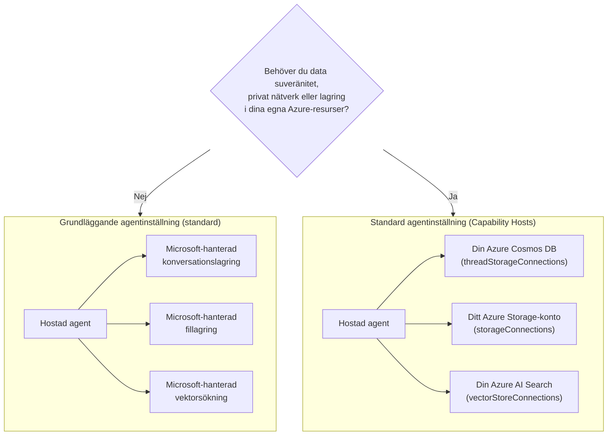

# Lektion 5: Produktionshostade agenter — Lagring, minne & styrning

I [Lektion 4](../lesson-4-agentdeployment/README.md) distribuerade du Developer Onboarding
Agent som en **Microsoft Foundry Hostad Agent** och satte en ChatKit-frontend framför den. Den
lektionen svarade på *"hur levererar jag en agent?"*. Den här lektionen svarar på de frågor som kommer härnäst
i ett företag: **Var lagras min agents data? Vem kontrollerar den? Hur uppfyller jag krav på efterlevnad,
nätverk och styrning?**

Den allra viktigaste idén i denna lektion är skillnaden mellan en **Hostad Agent** och en
**Capability Host** — två begrepp som är lätta att förväxla men löser helt olika
problem.

## Läromål

I slutet av denna lektion kommer du att kunna:

- Förklara vad en **Hostad Agent** ger dig (Microsoft-hanterad körning) och vad den **inte** gör.
- Förklara vad en **Capability Host** är och exakt när du behöver en.
- Välja mellan **grundläggande agentuppsättning** (Microsoft-hanterad lagring) och **standardagentuppsättning**
  (använd egna Azure-resurser).
- Förstå hur **samtalshistorik, filuppladdningar och vektorbutiker** sparas och hur
  du omdirigerar dem till din egen Azure Cosmos DB, Azure Storage och Azure AI Search.
- Tillämpa styrningskontroller: datasuveränitet, privat nätverk och **godkännande av hostade MCP-verktyg**.

---

## Förkunskaper

1. Genomförd [Lektion 4](../lesson-4-agentdeployment/README.md) — du har en hostad agent distribuerad.
2. Ett **Microsoft Foundry**-projekt och ett Azure-konto med behörighet att skapa resurser
   (Cosmos DB, Storage, Azure AI Search) och tilldela roller i prenumerationen/resursgruppen.
3. **Azure CLI** autentiserad: `az login` (och `az account set --subscription <id>` om du har
   mer än en prenumeration).
4. **Azure Developer CLI** (`azd`) installerad — används för provisioneringsflödet i standarduppsättningen.
5. **Python 3.12+** med kursens beroenden installerade (`pip install -r ../requirements.txt`).
6. En aktuell, ej pensionerad modellutplacering (till exempel `gpt-5.1`). Undvik pensionerade GPT-4o / GPT-4.1.

> Den här lektionen är mest konceptuell och fokuserad på kontrollplanet. Du kan läsa den från början till slut utan
> att provisionera något, och sedan använda övningarna när du är redo att konfigurera en
> standarduppsättning.

---

## 1. Hostade agenter: vad Foundry hanterar åt dig

En **Hostad Agent** är en agent vars *körningsmiljö* är helt hanterad av Microsoft
Foundry Agent Service. När du distribuerar en hostad agent (som du gjorde i Lektion 4), tillhandahåller Foundry:

- **Beräkning** — runtime som kör din agentkod och verktyg.
- **Skalning** — repliker skalas upp och ner med belastning (se `agent.yaml` `scale` i Lektion 4).
- **Identitet** — en hanterad identitet för agenten, så den autentiserar till Azure utan hemligheter.
- **Observerbarhet** — spårning och telemetri (se Lektion 3:s avsnitt om observerbarhet).
- **Sessionshantering** — trådar/samtal, så att flerstegs-chattar "kommer ihåg" tidigare steg.

> **Nyckelpoäng:** Du behöver **inte** konfigurera en Capability Host bara för att *köra* en Hostad
> Agent. En hostad agent fungerar direkt på Microsoft-hanterad infrastruktur.

---

## 2. Hostade agenter vs Capability Hosts

**Hostade agenter och Capability Hosts löser olika problem.**

**Hostade agenter** tillhandahåller Microsoft-hanterad körningsmiljö, inklusive beräkning, skalning,
identitet, observerbarhet och sessionshantering. Du behöver **inte** Capability Hosts bara för att köra
en Hostad Agent.

**Capability Hosts** krävs bara när du vill att Agent Service ska använda **kundägda
resurser** istället för Microsoft-hanterad lagring. Om du är nöjd med standard
Microsoft-hanterad lagring, vektorsökning och samtalspersistens, **krävs ingen Capability Host
konfiguration.**

Om din organisation kräver **datasuveränitet, privat nätverk, efterlevnadskontroller eller
lagring i dina egna Azure Cosmos DB-, Azure Storage-konton och Azure AI Search-resurser**, då
konfigurerar du Capability Hosts för att koppla Agent Service till dessa resurser.

I en mening:

> En **Hostad Agent** handlar om *var din agent körs*. En **Capability Host** handlar om *var din
> agents data finns*.

| Bekymmer | Hostad Agent | Capability Host |
|---------|--------------|-----------------|
| Beräkning / skalning / identitet | ✅ Tillhandahållen | — |
| Observerbarhet / spårning | ✅ Tillhandahållen | — |
| Samtals- & trådsessionshantering | ✅ Tillhandahållen | Omdirigerar *var det lagras* |
| Var samtalshistoriken lagras | Microsoft-hanterad som standard | Din Azure Cosmos DB |
| Var uppladdade filer lagras | Microsoft-hanterad som standard | Ditt Azure Storage-konto |
| Var vektorinbäddningar lagras | Microsoft-hanterad som standard | Din Azure AI Search |
| Krävs för att köra en agent? | ✅ Ja (det *är* agentvärden) | ❌ Nej — valfritt |
| Krävs för datasuveränitet / BYO-lagring? | ❌ Ej tillräckligt ensam | ✅ Ja |

---

## 3. Grundläggande vs standard agentuppsättning

Foundry beskriver de två datakonfigurationerna som **grundläggande** och **standard** agentuppsättning.



### När du ska stanna kvar på grundläggande uppsättning (ingen Capability Host)

- Utveckling, prototypframställning och testning.
- Interna verktyg där Microsoft-hanterad lagring uppfyller din datapolicy.
- Du vill ha den snabbaste vägen till en fungerande agent med minsta möjliga infrastruktur.

### När du behöver standarduppsättning (Capability Hosts)

- **Datasuveränitet** — all agentdata måste stanna inom din Azure-prenumeration/region.
- **Säkerhetskontroll** — du måste använda egna lagringskonton, databaser och söktjänster.
- **Efterlevnad** — du har regulatoriska eller organisatoriska krav på var data lagras.
- **Privat nätverk** — trafiken måste stanna inom ditt virtuella nätverk (använd eget virtuellt nätverk).

> **Rekommendation från Microsoft:** använd *separata* Foundry-konton/projekt för standard- vs
> grundläggande uppsättning. Undvik att blanda uppsättningstyper inom samma Foundry-konto.

---

## 4. Hur Capability Hosts fungerar

En **Capability Host** är en underresurs som du konfigurerar på **två nivåer**: Foundry **konto**
och Foundry **projekt**. Den talar om för Agent Service var agentdata ska lagras och behandlas:
samtalshistorik, filuppladdningar och vektorbutiker.

Två regler är viktigast:

1. **Konto före projekt.** Du kan inte skapa en projektspecifik capability host om inte en
   kontonivå capability host redan finns.
2. **Ingen arv av konfiguration.** Den **projektspecifika** capability host är vad Agent Service
   faktiskt läser för att bestämma vilka lager-/samtals-/vektorresurser som ska användas. Kontonivå
   anslutningar används *inte* automatiskt av ett projekt — projektets capability host måste
   referera till dem uttryckligen.

### Anslutningar som en standarduppsättning behöver

Capability hosts refererar till **anslutningar** (skapade i ditt Foundry-konto/projekt) som pekar på
dina Azure-resurser:

| Capability host-egenskap | Lagrar | Din Azure-resurs |
|--------------------------|--------|---------------------|
| `threadStorageConnections` | Agentdefinitioner + samtalshistorik | Azure Cosmos DB |
| `storageConnections` | Filuppladdningar / blob-lagring | Azure Storage-konto |
| `vectorStoreConnections` | Vektorinbäddningar för återvinning/sökning | Azure AI Search |
| `aiServicesConnections` *(valfritt)* | Dina egna modellutplaceringar | Azure OpenAI |

Varje anslutning måste ha `authType`, `category`, `target` (tjänstens **endpoint-URL**, inte
resurs-ID) och `metadata.ResourceId` (fullständigt Azure-resurs-ID) ifylld, annars kan inte Agent Service
lösa resurserna vid körning.

### Konfigurera capability hosts (kontrollplan)

Capability hosts hanteras för närvarande via **Azure Resource Manager REST API** (det finns inget
SDK för hantering av capability hosts än). Skapa först **konto** capability host:

```http
PUT https://management.azure.com/subscriptions/{subscriptionId}/resourceGroups/{rg}/providers/Microsoft.CognitiveServices/accounts/{account}/capabilityHosts/{name}?api-version=2025-06-01

{
  "properties": { "capabilityHostKind": "Agents" }
}
```

Skapa sedan **projekt** capability host som refererar till dina anslutningar:

```http
PUT https://management.azure.com/subscriptions/{subscriptionId}/resourceGroups/{rg}/providers/Microsoft.CognitiveServices/accounts/{account}/projects/{project}/capabilityHosts/{name}?api-version=2025-06-01

{
  "properties": {
    "capabilityHostKind": "Agents",
    "threadStorageConnections": ["my-cosmosdb-connection"],
    "vectorStoreConnections":  ["my-ai-search-connection"],
    "storageConnections":      ["my-storage-connection"]
  }
}
```

> **Begränsningar att komma ihåg:**
> - **En capability host per nivå.** En andra på samma nivå ger `409 Conflict`.
> - **Inga uppdateringar.** För att ändra konfigurationen måste du **ta bort och skapa om** capability host.
> - **Radering är destruktiv.** Att ta bort en capability host tar bort agenters åtkomst till filer,
>   samtal och vektorbutiker den pekade på.

### Verifiera att den fungerar

Efter konfiguration, kör ett testsamtal och bekräfta att:

- Samtal dyker upp i **din Azure Cosmos DB**.
- Uppladdade filer finns i **ditt Azure Storage-konto**.
- Vektordata finns i **ditt Azure AI Search-index**.

---

## 5. Minne och kontexthantering

"Sessionshantering" (en funktion för Hostad Agent) och "var trådar lagras" (en fråga för Capability Host)
kombineras för att ge din agent **minne**:

- En **tråd** (samtal) håller ordnade steg i en chatt. Responses API trådar anrop
  samman via `previous_response_id` (det såg du i Lektion 4:s röktester).
- Vid **grundläggande uppsättning** lever tråd-/samtalstillstånd i Microsoft-hanterad lagring.
- Vid **standarduppsättning** sparas samma tillstånd i **din Azure Cosmos DB** via
  `threadStorageConnections` — vilket ger dig hållbar, sökbar, suverän samtalshistorik.

Detta är skillnaden mellan en agent som "kommer ihåg inom en session" och ett företags-
system där varje samtal sparas inom din egen efterlevnadsgräns.

---

## 6. Styrnings- och säkerhetschecklista

Använd denna checklista när du promoverar en hostad agent från prototyp till produktion:

- [ ] **Bestäm grundläggande vs standard uppsättning** med frågor i §3 — dokumentera beslutet.
- [ ] **Datasuveränitet:** om det krävs, konfigurera Capability Hosts så att samtalshistorik
      (Cosmos DB), filer (Storage) och vektorer (AI Search) stannar inom din prenumeration/region.
- [ ] **Privat nätverk:** för standarduppsättning, begränsa trafik med Bring Your Own Virtual
      Network så att data inte kan lämna ditt nätverk (hjälper till att förhindra dataexfiltration).
- [ ] **RBAC:** bevilja minsta privilegium. Skapande av capability hosts kräver **Contributor** på
      Foundry-kontot; tilldelning av åtkomst till dina Azure-resurser kräver **User Access Administrator**
      eller **Owner**.
- [ ] **Hostad MCP-verktygsstyrning:** granska varje MCP-server din agent kan anropa och ställ in ett
      **godkännandeläge** (se §7). Exponera aldrig ett ogranskat externt verktyg för en produktionsagent.
- [ ] **Observerbarhet:** bekräfta att spårning/telemetri är på (Lektion 3) så att du kan granska verktygsanrop.
- [ ] **Kostnad:** BYO-resurser (Cosmos DB, AI Search, Storage) debiteras *din* prenumeration —
      mät och övervaka dem. Grundläggande uppsättning inkluderar lagring i den hanterade tjänsten.

---

## 7. Hostade MCP-verktyg och godkännandeflöden

Developer Onboarding Agent i Lektion 4 använder redan ett **hostat MCP-verktyg** — den
[Microsoft Learn MCP-servern](https://learn.microsoft.com/api/mcp) — tillagd med:

```python
client.get_mcp_tool(
    name="Microsoft Learn MCP",
    url="https://learn.microsoft.com/api/mcp",
    approval_mode="never_require",
)
```

**Model Context Protocol (MCP)** är en öppen standard som låter en agent upptäcka och anropa
externa verktyg över ett enhetligt gränssnitt. **Hostade MCP-verktyg** låter Foundry anropa en MCP-server på
agentens vägnar. Två styrningsspakar är viktiga i produktion:

- **`approval_mode`** — styr om en människa/anropare måste godkänna varje verktygsanrop.
  - `never_require` är bekvämt för en betrodd, skrivskyddad server som Microsoft Learn.
  - För servrar som kan **skriva** eller nå känsliga system, krävs godkännande så att ett anrop
    granskas innan det utförs. Detta är ditt **godkännandeflöde**.
- **Server-tillåtelselista** — anslut enbart MCP-servrar som du har granskat och litar på. Behandla en MCP
  URL som varje annan produktionsberoende.

> **Prova:** ändra Lesson 4-agentens `approval_mode` till att kräva godkännande, distribuera om, och
> observera hur verktygsanrop nu pausar för bekräftelse innan de körs.

---

## Praktiska övningar

1. **Klassificera ett scenario.** För var och en av dessa, bestäm *grundläggande* eller *standard* uppsättning och motivera:
   (a) en hackathon-demo, (b) en vårdintroduktionsassistent som hanterar PII, (c) en intern
   FAQ-bot, (d) en bankagent som måste behålla all data inom regionen.
2. **Kartlägg lagringen.** För agenten i Lektion 4, lista vilken capability-host-egenskap som skulle lagra
   dess (a) chatthistorik, (b) uppladdade anställdfiler, (c) vektorinbäddningar.
3. **Designa ett godkännandeflöde.** Lägg till ett hypotetiskt "skapa Jira-ticket"-MCP-verktyg till agenten.
   Vilket `approval_mode` skulle du använda och varför?
4. **Kostnadsavvägning.** Skriv två eller tre meningar om kostnadsimplikationer av att gå från grundläggande
   till standarduppsättning för en agent med hög trafik.

---

## Resurser

- [Capability hosts — Microsoft Foundry](https://learn.microsoft.com/azure/foundry/agents/concepts/capability-hosts)
- [Standard agent setup (inbyggd företagsberedskap)](https://learn.microsoft.com/azure/foundry/agents/concepts/standard-agent-setup)
- [Använd egna resurser](https://learn.microsoft.com/azure/foundry/agents/how-to/use-your-own-resources)

- [Ställ in din agentmiljö (grundläggande vs standard)](https://learn.microsoft.com/azure/foundry/agents/environment-setup)
- [Ställ in privat nätverk för Foundry Agent Service](https://learn.microsoft.com/azure/foundry/agents/how-to/virtual-networks)
- [Lägg till en anslutning till ditt projekt](https://learn.microsoft.com/azure/foundry/how-to/connections-add)
- [Microsoft Learn MCP-server](https://learn.microsoft.com/training/support/mcp)
- [Model Context Protocol](https://modelcontextprotocol.io/)

---

**Föregående:** [Lektion 4 — Agentdistribution](../lesson-4-agentdeployment/README.md) &nbsp;·&nbsp; **Nästa:** [Lektion 6 — Microsoft Toolbox](../lesson-6-toolbox/README.md)

---

<!-- CO-OP TRANSLATOR DISCLAIMER START -->
**Ansvarsfriskrivning**:
Detta dokument har översatts med hjälp av AI-översättningstjänsten [Co-op Translator](https://github.com/Azure/co-op-translator). Även om vi strävar efter noggrannhet, var vänlig notera att automatiska översättningar kan innehålla fel eller brister. Det ursprungliga dokumentet på dess modersmål bör betraktas som den auktoritativa källan. För kritisk information rekommenderas professionell mänsklig översättning. Vi ansvarar inte för några missförstånd eller feltolkningar som uppstår till följd av användningen av denna översättning.
<!-- CO-OP TRANSLATOR DISCLAIMER END -->