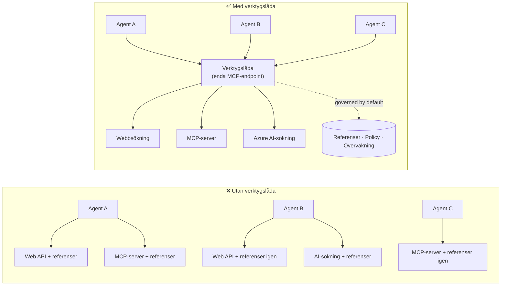

# Lektion 6: Microsoft Toolbox — Styrda verktyg för agenter

Genom [Lektion 5](../lesson-5-hosted-agents-production/README.md) kör din hostade agent i
produktion med den lagring och styrning som din organisation behöver. Men titta tillbaka på
Lektion 4-agenten: varje verktyg var **hårdkodat** i `main.py` — Microsoft Learn MCP URL:en,
fil-sökningsvektorlager, och så vidare. Det fungerar för en agent. Det **skalar inte** till en
organisation med dussintals agenter och team.

Den här lektionen introducerar **Microsoft Toolbox**: sättet Foundry låter dig definiera en kurerad uppsättning
verktyg **en gång**, hantera dem **centralt**, och exponera dem för vilken agent som helst genom ett **enda,
styrt slutpunkt**.

## Lärandemål

I slutet av denna lektion kommer du att kunna:

- Förklara problemet med verktygsspridning som Toolbox löser.
- Beskriva pelarna **Bygg** och **Använd** samt de verktygstyper en toolbox kan innehålla.
- **Bygga** en toolbox-version med Foundry SDK.
- **Använda** en toolbox från en Microsoft Agent Framework hostad agent via ett enda MCP-slutpunkt.
- Använda **versionshantering** för att leverera verktygsändringar utan ändringar i agentkod eller omdistribueringar.
- Tillämpa **styrning**: RBAC, credential injection och guardrail (RAI-) policyer.

---

## Förkunskaper

1. Avslutad [Lektion 4](../lesson-4-agentdeployment/README.md) och helst även
   [Lektion 5](../lesson-5-hosted-agents-production/README.md).
2. Ett **Microsoft Foundry**-projekt med behörighet att skapa och hantera toolbox-resurser.
3. **Azure CLI** autentiserad: `az login`. Foundry toolbox API:er kräver
   `https://ai.azure.com/.default` token-scope (visas i koden nedan).
4. **Python 3.12+** med kursens beroenden installerade (`pip install -r ../requirements.txt`).
5. En nu aktuell, icke pensionerad modellversion (till exempel `gpt-5.1`). Undvik pensionerade GPT-4o / GPT-4.1.

---

## 1. Problemet: verktygsspridning

En enda agent kan lita på många verktyg — REST API:er, MCP-servrar, connectors och flöden — varje
med sin egen autentiseringsmodell och ägande team. När du skalar upp i en organisation:

- Team **återimplementerar samma verktyg** oberoende av varandra.
- **Credentials dupliceras** över agenter och repos.
- **Styrning blir inkonsekvent** — varje agent upprätthåller (eller glömmer) policy på egen hand.
- Det finns **liten insyn** i vilka verktyg som finns eller vem som använder dem.

Utvecklare stagnerar — inte för att modellerna inte kan, utan för att **verktygsintegration blir
flaskhalsen**.



Företag har redan infrastrukturen — gateways, credential vaults, policies, observability.
Vad som saknades var en utvecklarupplevelse som paketerar detta till något **återanvändbart,
upptäckbart och styrt som standard**. Det är Toolbox.

---

## 2. Vad en Toolbox är

En **Toolbox** är en **hanterad Foundry-resurs**. Du definierar en kurerad uppsättning verktyg en gång, hanterar
dem centralt i Foundry och exponerar dem genom **en enda MCP-kompatibel slutpunkt** som vilken
agent som helst kan använda. Vid körning hanterar plattformen **credential injection, tokenförnyelse och
företagsstyrning**.

Eftersom en toolbox är en hanterad resurs, kan du lägga till, ta bort eller omkonfigurera verktyg **utan
att ändra kod i din agent** — agenten kopplar alltid mot samma endpoint.

Toolbox täcker verktygslivscykeln genom fyra pelare; **Bygg** och **Använd** finns tillgängliga
idag:

| Pelare | Status | Vad den möjliggör |
|--------|--------|-----------------|
| **Bygg** | Tillgänglig idag | Välj verktyg, konfigurera autentisering centralt, publicera en återanvändbar toolbox som vilket team som helst kan använda. |
| **Använd** | Tillgänglig idag | Koppla vilken agent som helst till en MCP-kompatibel endpoint för att dynamiskt upptäcka och anropa alla verktyg i toolboxen. |

Konsumtionsytan är **öppen**: vilken MCP-kompatibel runtime eller klient som helst kan använda en toolbox —
Microsoft Agent Framework, LangGraph, GitHub Copilot, Claude Code, Microsoft Copilot Studio eller
egen kod.

### Verktygstyper en toolbox kan innehålla

Webbsök · MCP · Azure AI Search · Code Interpreter · Fil-sökning · OpenAPI · **Agent-till-agent
(A2A)** · Fabric IQ · Verksamhetssök · Work IQ · Webbläsarautomatisering · Skickreferenser, plus en
**Guardrail (RAI) policy** som appliceras på toolboxnivå.

> **Tips:** Lägg till en `description` på **varje** verktyg så att modellen kan välja rätt. En toolbox
> tillåter högst **ett namnlöst verktyg per typ** — ge varje ytterligare instans av samma typ ett
> unikt `name`, annars får du ett `invalid_payload`-fel.

---

## 3. Bygg en toolbox

Toolboxar hanteras med Foundry SDK (Python/.NET/JavaScript), REST API, `azd` och
**Microsoft Foundry Toolkit för VS Code**. Här är Python (`azure-ai-projects`) mönstret:

```python
from azure.identity import DefaultAzureCredential
from azure.ai.projects import AIProjectClient
from azure.ai.projects.models import MCPTool, ToolboxSearchPreviewTool, WebSearchTool

endpoint = "https://<your-foundry-account>.services.ai.azure.com/api/projects/<your-project>"
project = AIProjectClient(endpoint=endpoint, credential=DefaultAzureCredential())

toolbox_version = project.toolboxes.create_toolbox_version(
    name="agent-tools",
    description="Web search + an MCP server + tool search",
    tools=[
        WebSearchTool(),
        MCPTool(
            server_label="myserver",
            server_url="https://your-mcp-server.example.com",
            require_approval="never",
            project_connection_id="my-key-auth-connection",  # autentiseringsuppgifter finns i Foundry
        ),
        ToolboxSearchPreviewTool(),
    ],
)
print(f"Created toolbox: {toolbox_version.name}, version: {toolbox_version.version}")
```

Notera vad du **inte** gör: inga hemligheter i agenten. Credentials hålls av en Foundry
**connection** (`project_connection_id`) och injiceras av plattformen vid anropstid.

> **Förhandsgranskningsnotis.** Toolbox **hantering** (skapande/uppdatering av versioner) är en funktion i förhandsgranskning.
> `project.toolboxes.*`-operationerna ovan finns i förhandsgransknings-SDK-bygg, REST API, `azd`,
> och **Foundry Toolkit för VS Code** — de finns **inte** i den låsta `azure-ai-projects` som används
> i övrigt i denna kurs. Behandla ovanstående kodsnutt som formen på Bygg-steget; för ett
> klickväg, skapa toolboxen i **Foundry-portalen** eller **Foundry Toolkit**. Steget
> **Använd** nedan fungerar med kursens låsta SDK idag.

---

## 4. Använd en toolbox från din agent

En toolbox exponerar en **MCP-slutpunkt**. Det finns två mönster:

| Roll | Slutpunkt | När man ska använda |
|------|----------|-------------|
| **Toolbox-användare** | `{project_endpoint}/toolboxes/{name}/mcp?api-version=v1` | Koppla agenter. Serverar alltid **standardversionen**. |
| **Toolbox-utvecklare** | `{project_endpoint}/toolboxes/{name}/versions/{version}/mcp?api-version=v1` | Testa en specifik version innan den främjas. |

> **Koppla agenter till *användar*-slutpunkten.** Eftersom den alltid levererar standardversionen kan du
> främja nya versioner **utan att ändra agentkod eller distribuera om**.

### Integrera med en Microsoft Agent Framework hostad agent

Kom ihåg att Lektion 4-agenten lade till ett enda hårdkodat MCP-verktyg med `client.get_mcp_tool(...)`. Med
Toolbox pekar du istället **ett** `MCPStreamableHTTPTool` på toolbox-slutpunkten — och agenten
får **alla** verktyg i toolboxen, styrda centralt:

```python
import httpx
from azure.identity import DefaultAzureCredential, get_bearer_token_provider
from agent_framework import MCPStreamableHTTPTool

# Auth: Foundry-verktygslådan kräver scopes https://ai.azure.com/.default
credential = DefaultAzureCredential()
token_provider = get_bearer_token_provider(credential, "https://ai.azure.com/.default")
http_client = httpx.AsyncClient(auth=_ToolboxAuth(token_provider), timeout=120.0)

TOOLBOX_ENDPOINT = os.environ["TOOLBOX_ENDPOINT"]  # plattform-injicerad vid körning

mcp_tool = MCPStreamableHTTPTool(
    name="toolbox",
    url=TOOLBOX_ENDPOINT,
    http_client=http_client,
    load_prompts=False,
)

agent = chat_client.as_agent(
    name="my-toolbox-agent",
    instructions="You are a helpful assistant with access to Foundry toolbox tools.",
    tools=[mcp_tool],
)
```

Motsvarande `.env` (notera: använd en **aktuell** modell som `gpt-5.1`, **inte** den pensionerade
`gpt-4o`):

```env
FOUNDRY_PROJECT_ENDPOINT=https://<account>.services.ai.azure.com/api/projects/<project>
TOOLBOX_ENDPOINT=https://<account>.services.ai.azure.com/api/projects/<project>/toolboxes/agent-tools/mcp?api-version=v1
AZURE_AI_MODEL_DEPLOYMENT_NAME=gpt-5.1
```

> **Verifiera först.** Innan du kopplar in hela agenten, koppla en MCP-klient SDK (`pip install mcp`) till
> den **versionsspecifika** slutpunkten och lista verktygen för att bekräfta att de laddas som förväntat.

### Kör användningsexemplet

Den här lektionen levererar ett körbart exempel på användarsidan, [`toolbox_agent.py`](../../../lesson-6-toolbox/toolbox_agent.py). Den använder
samma `FoundryChatClient.get_mcp_tool(...)`-mönster som du lärde dig i Lektion 2, men pekar MCP-verktyget
på din **toolbox**-slutpunkt — så agenten får alla styrda verktyg i toolboxen:

```bash
# I din .env, ställ in TOOLBOX_ENDPOINT till din verktygslådans konsumentendpunkt, sedan:
python lesson-6-toolbox/toolbox_agent.py
```

Öppna den utskrivna `http://localhost:8096`-URL:en och ställ en fråga som använder ett av dina
toolbox-verktyg. Lägg till eller uppgradera ett verktyg i toolboxen och fråga igen — **utan att ändra denna
kod** — för att se central styrning och versionshantering i praktiken.

---

## 5. Versionshantering: leverera verktygsändringar säkert

Toolbox-versionering ger dig explicit kontroll över när ändringar träder i kraft:

1. **Skapa** en ny toolbox-version med den uppdaterade verktygsuppsättningen.
2. **Testa** den mot den versionsspecifika (utvecklar) slutpunkten.
3. **Främja** den till `default_version` när du är redo.

Varje agent som pekar på **användar**-slutpunkten plockar upp den främjade versionen automatiskt — **inga
kodändringar, ingen omdistribuering**. (Den första version du skapar främjas automatiskt till standard.)

Detta är verktygsstyrningens motsvarighet till en blue/green-deploy: du validerar en ändring isolerat,
sedan vänder du om standardversionen för alla användare samtidigt.

---

## 6. Styrning: hur Toolbox förbättrar kontrollen

Toolbox är **styrt som standard**. De styrspakar du bör känna till:

- **RBAC.** Ge **Foundry User**-rollen på projektet till varje identitet: **utvecklaren** som
  hanterar toolbox-versioner, **agentens hanterade identitet** (för hostade agenter som anropar verktyg vid körning),
  och, för OAuth-flöden, **slutanvändaren** vars identitet proxyas.
- **Centraliserade credentials.** Verktygscredentials finns i Foundry **connections**, inte i agentkod
  eller `.env`-filer. Plattformen injicerar dem och förnyar tokens vid körning.
- **Guardrails (RAI-policy).** Fäst en namngiven ansvarsfull AI-policy på en toolbox-version via
  `policies.rai_config.rai_policy_name`. Den körs på **toolbox-nivån**, oberoende av någon
  modellnivå innehållsfilter, och granskar verktygsinmatningar och -utmatningar.
- **MCP-godkännande.** Per-verktyg `require_approval` styr om ett MCP-verktygsanrop behöver godkännande —
  samma godkännandearbetsflödeskoncept du såg i [Lektion 5 §7](../lesson-5-hosted-agents-production/README.md#7-hosted-mcp-tools--approval-workflows).
- **Privat nätverk.** Toolbox stödjer virtuell nätverkskonfiguration för företag som
  håller trafiken inom sitt nätverk.
- **Insyn.** Eftersom verktyg katalogiseras centralt får du äntligen en inventering av vad
  som finns och vem som använder det.

---

## Praktiska övningar

1. **Refaktorera Lektion 4.** Lektion 4-agenten hårdkodar Microsoft Learn MCP-verktyget. Skissa hur du
   skulle flytta det verktyget till en `agent-tools` toolbox och peka om `main.py` till toolbox-användarens
   slutpunkt. Vad ändras i `main.py`? Vad bor inte längre där?
2. **Designa en versionsuppdatering.** Du behöver lägga till ett webb-sökningsverktyg till en live-toolbox som används av fem
   agenter. Beskriv sekvensen skapa → testa → främja och förklara varför ingen av de fem agenterna
   behöver distribueras om.
3. **Välj autentiseringsidentiteterna.** För en hostad agent som anropar ett OAuth-baserat MCP-verktyg via en
   toolbox, lista vilka identiteter som behöver **Foundry User**-rollen och varför.
4. **Guardrail-placering.** Förklara skillnaden mellan ett modellnivå-innehållsfilter och en
   toolbox-guardrail, och ge ett exempel på när du särskilt behöver toolbox-guardrail.

---

## Resurser

- [Skapa, testa och distribuera en toolbox i Foundry](https://learn.microsoft.com/azure/foundry/agents/how-to/tools/toolbox)
- [Verktygskatalog — Foundry Agent Service](https://learn.microsoft.com/azure/foundry/agents/concepts/tool-catalog)
- [Microsoft Agent Framework — Microsoft Foundry leverantör (verktyg)](https://learn.microsoft.com/agent-framework/agents/providers/microsoft-foundry)
- [Guardrails översikt](https://learn.microsoft.com/azure/foundry/guardrails/guardrails-overview)
- [Kom igång med Foundry i VS Code (Foundry Toolkit)](https://learn.microsoft.com/azure/ai-foundry/how-to/develop/get-started-projects-vs-code)
- [Model Context Protocol](https://modelcontextprotocol.io/)

---

**Föregående:** [Lektion 5 — Produktion Hostade Agenter](../lesson-5-hosted-agents-production/README.md)
&nbsp;·&nbsp; **Nästa:** [Lektion 7 — Multi-Agent & A2A](../lesson-7-multi-agent-a2a/README.md)

---

<!-- CO-OP TRANSLATOR DISCLAIMER START -->
**Ansvarsfriskrivning**:
Detta dokument har översatts med hjälp av AI-översättningstjänsten [Co-op Translator](https://github.com/Azure/co-op-translator). Även om vi strävar efter noggrannhet, var vänlig notera att automatiska översättningar kan innehålla fel eller brister. Det ursprungliga dokumentet på dess modersmål bör betraktas som den auktoritativa källan. För kritisk information rekommenderas professionell mänsklig översättning. Vi ansvarar inte för några missförstånd eller feltolkningar som uppstår till följd av användningen av denna översättning.
<!-- CO-OP TRANSLATOR DISCLAIMER END -->