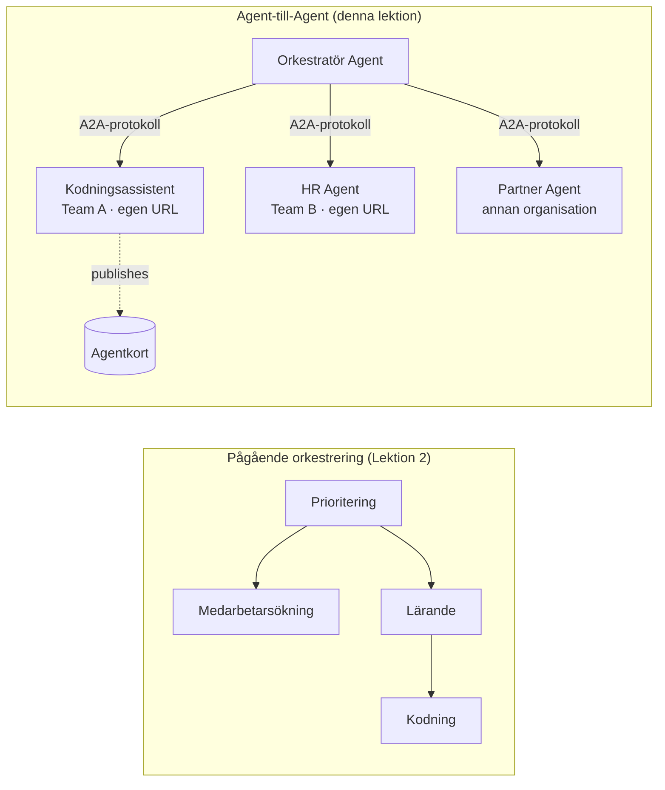

# Lektion 7: Multi-Agent Orkestrering & Agent-till-Agent (A2A)

I [Lektion 6](../lesson-6-toolbox/README.md) kan du bygga styrda verktyg och hostade agenter.
Men verkliga system använder sällan **en** agent. När du skalar upp, sätter du ihop **många** agenter — några du
äger, några ägs av andra team, några körs helt i andra organisationer. Den här lektionen handlar om
hur agenter arbetar **tillsammans**.

Du har redan träffat en form av multi-agent design i
[Lektion 2:s `agent-orchestration.py`](../lesson-2-agent-development/README.md): **handoff**
mönstret, där en triage-agent dirigerar till specialister **inne i en enda process**. Den här lektionen går
ett steg högre — till **Agent-till-Agent (A2A)**, det öppna protokollet för agenter som körs som oberoende
**nätverkstjänster** och anropar varandra över process-, team- och organisationsgränser.

## Lärandemål

I slutet av den här lektionen kommer du att kunna:

- Förklara skillnaden mellan **in-process orkestrering** (handoff/workflows) och
  **Agent-till-Agent (A2A)** kommunikation, och välja rätt metod.
- Beskriva A2A-byggstenarna: **Agent Card**, **skills**, **tasks**, och **discovery**.
- **Exponera** en Microsoft Agent Framework-agent som en A2A-tjänst med `A2AExecutor`.
- **Konsumera** en fjärragent som en nätverksansluten peer med `A2AAgent`.
- Tillämpa företagsaspekter på A2A: **säkerhet, identitet, styrning, observerbarhet och kostnad**.

---

## Förkunskaper

1. Avslutad [Lektion 2](../lesson-2-agent-development/README.md) (agentutveckling & orkestrering).
2. Ett **Microsoft Foundry**-projekt med en aktuell modellutplacering (till exempel `gpt-5.1`, och
   `gpt-5-codex` för kodexemplet). Undvik utfasade GPT-4o / GPT-4.1.
3. **Azure CLI** autentiserad: `az login`.
4. **Python 3.12+** med kursens beroenden installerade (`pip install -r ../requirements.txt`).
   Lektion 7 lägger till preview-paketen `agent-framework-a2a`, `a2a-sdk`, och `uvicorn`.
5. `FOUNDRY_PROJECT_ENDPOINT` och `FOUNDRY_MODEL` satta i din `.env` (se kursens README).

---

## 1. Två sätt agenter arbetar tillsammans

Det finns inget enda "multi-agent" mönster. Välj det som passar din **gräns**:

| Mönster | Var agenter körs | Hur de kopplas ihop | Använd när |
|---------|------------------|--------------------|----------|
| **Handoff / Workflow** (Lektion 2) | En process, en kodbas | Minnesstruktur (`HandoffBuilder`, `WorkflowBuilder`) | Du äger alla agenter och distribuerar dem tillsammans. |
| **Agent-till-Agent (A2A)** (denna lektion) | Separata tjänster, separata livscykler | Öppet **A2A-protokoll** över HTTP, upptäckt via **Agent Cards** | Agenter ägs av olika team/org, skalas oberoende, eller är skrivna i olika ramverk. |

Handoff handlar om **routning inne i en applikation**. A2A handlar om att **sätta ihop agenter som
oberoende tjänster** — agentekvivalenten till att gå från funktionsanrop till mikrotjänster.



> **De komponerar.** En orkestrator du bygger med `HandoffBuilder` kan ha **fjärra A2A-agenter**
> som deltagare — in-process routning till tjänster som själva kan köras var som helst.

---

## 2. A2A-byggstenarna

A2A är ett **öppet protokoll** (inte Microsoft-specifikt), så en A2A-agent kan användas av Microsoft
Agent Framework, LangGraph, egen kod eller en annan leverantörs stack. Fyra koncept är viktiga:

- **Agent Card** — ett litet JSON-dokument, publicerat på
  `/.well-known/agent-card.json`, som annonserar agentens **namn, beskrivning, URL, version,
  färdigheter och kapaciteter**. Detta är hur en klient **upptäcker** vad en fjärragent kan göra.
- **Skills** — de deklarerade sakerna agenten kan göra (`id`, `name`, `description`, `tags`,
  `examples`). Klienter (och modeller) använder dessa för att avgöra om de ska anropa den.
- **Tasks** — ett anrop till en A2A-agent är en **task** med en livscykel (skickad → arbetar →
  slutförd/misslyckad). Servern spårar tasks i en **task store**; strömmande uppdateringar stöds.
- **Discovery** — en klient som bara har en URL hämtar Agent Card och vet hur agenten ska anropas.

---

## 3. Exponera en agent som en A2A-tjänst — `a2a_server.py`

**Bygg/server**-sidan paketerar en Microsoft Agent Framework-agent med `A2AExecutor` och monterar den
på en A2A HTTP-applikation. Se [`a2a_server.py`](../../../lesson-7-multi-agent-a2a/a2a_server.py). Nyckelkopplingen:

```python
from agent_framework.a2a import A2AExecutor
from a2a.server.apps import A2AStarletteApplication
from a2a.server.request_handlers import DefaultRequestHandler
from a2a.server.tasks import InMemoryTaskStore
from a2a.types import AgentCapabilities, AgentCard, AgentSkill

agent = client.as_agent(name="coding-assistant", instructions="...")

agent_card = AgentCard(
    name="Coding Assistant",
    description="Generates runnable code samples...",
    url="http://localhost:9000/",
    version="1.0.0",
    capabilities=AgentCapabilities(streaming=True),
    default_input_modes=["text"],
    default_output_modes=["text"],
    skills=[AgentSkill(id="generate-code", name="Generate code",
                       description="Write a runnable code snippet.", tags=["code"])],
)

request_handler = DefaultRequestHandler(
    agent_executor=A2AExecutor(agent),
    task_store=InMemoryTaskStore(),
)
app = A2AStarletteApplication(agent_card=agent_card, http_handler=request_handler).build()
# serveras med uvicorn på port 9000
```

Observera att agentkoden är **oförändrad** — `A2AExecutor` anpassar din befintliga agent till protokollet.
Agent Card är det som gör den **upptäckbar** för vilken A2A-klient som helst.

---

## 4. Konsumera en fjärragent — `a2a_client.py`

**Användar**-sidan kopplar upp sig mot en fjärragent **via URL**, hämtar dess Agent Card, och anropar den
precis som en lokal agent. Se [`a2a_client.py`](../../../lesson-7-multi-agent-a2a/a2a_client.py):

```python
from agent_framework.a2a import A2AAgent

remote_agent = A2AAgent(name="remote-coding-assistant", url="http://localhost:9000")
result = await remote_agent.run("Write a Python function that reverses a string.")
print(result.text)
```

Det är hela poängen med A2A: från anroparens sida beter sig en fjärragent som vilken annan
`agent_framework`-agent, så du kan använda den i ett workflow eller överlämna till den — även om den körs
i en annan process, på en annan maskin, ägd av ett annat team.

### Kör den från början till slut

```bash
# Terminal 1 — starta A2A-tjänsten
python a2a_server.py

# Terminal 2 — ring den
python a2a_client.py "Write a Python function that reverses a string."
```

Du kommer att se kodassistentens svar komma över A2A-protokollet. Öppna
`http://localhost:9000/.well-known/agent-card.json` i en webbläsare för att se det publicerade Agent Card.

---

## 5. Företagsaspekter

Att förvandla agenter till nätverkstjänster medför samma frågor som alla distribuerade system —
plus några AI-specifika:


- **Identitet & autentisering.** Exponera aldrig en A2A-agent utan autentisering. Agentkortet bär
  `security` / `security_schemes`, och `A2AAgent` accepterar en `auth_interceptor` så att anropare kan bifoga
  autentiseringsuppgifter (OAuth bearer tokens, API-nycklar). Använd Entra ID / hanterade identiteter för
  tjänst-till-tjänst autentisering i produktion; placera tjänsten bakom en gateway.
- **Styrning.** Kombinera A2A med [Lektion 6:s verktygslåda](../lesson-6-toolbox/README.md): en fjärragent
  kan publiceras som ett **A2A-verktyg** i en styrd verktygslåda så att RBAC, autentiseringsinjektion,
  och skyddspolicys tillämpas centralt.
- **Observabilitet.** En förfrågan korsar nu processgränser, så sprid spårning över anropet.
  Aktivera [Foundry Observability / OpenTelemetry](../lesson-3-agent-evals/README.md) på **både**
  orkestratorn och varje fjärragent så att du får ett end-to-end-spår.
- **Versionshantering.** Agentkortet har en `version`. Behandla det som en API: additiva förändringar är säkra;
  att bryta en skills kontrakt kräver en ny version och en migrationsperiod för användarna.
- **Tillförlitlighet.** Fjärragenter kan falla ut oberoende av varandra. Sätt tidsgränser (`A2AAgent(timeout=...)`), hantera
  delvis fel och låt inte en långsam peer blockera hela orkestreringen.
- **Kostnad.** Varje fjärragentanrop är sin egen modell-invokation. Fan-out mångdubblar tokenanvändningen —
  budgetera för det, och föredra dirigering till **en** bästa agent framför att skicka till många.

---

## Praktiska övningar

1. **Lägg till en andra tjänst.** Kopiera `a2a_server.py` för att exponera **employee-search** agenten på port
   9001 med sitt eget Agentkort och skills. Kör båda och låt en klient anropa var och en.
2. **Orkestrera fjärrpeers.** Bygg en liten `HandoffBuilder` (eller enkel router) vars deltagare
   inkluderar två `A2AAgent`s som pekar på dina två tjänster. Dirigera en fråga till rätt agent.
3. **Säkra det.** Lägg till en `auth_interceptor` till klienten och kräva en bearer-token på servern.
   Vad går sönder om token saknas? Var skulle du lagra token i produktion?
4. **Handoff vs A2A.** Skriv två korta stycken: när skulle du behålla Lesson 2:s in-process
   handoff, och när är den extra komplexiteten i A2A motiverad? Ge ett konkret exempel på båda.

---

## Resurser

- [Agent-to-Agent (A2A) — Microsoft Agent Framework](https://learn.microsoft.com/agent-framework/user-guide/agent-orchestration/a2a)
- [Multi-agent orchestration — Microsoft Agent Framework](https://learn.microsoft.com/agent-framework/user-guide/agent-orchestration/)
- [A2A protocol specification](https://a2a-protocol.org/)
- [A2A Python SDK (`a2a-sdk`)](https://github.com/a2aproject/a2a-python)
- [Foundry Agent Service — multi-agent patterns](https://learn.microsoft.com/azure/ai-foundry/agents/concepts/connected-agents)

---

**Föregående:** [Lektion 6 — Microsoft Toolbox](../lesson-6-toolbox/README.md)

---

<!-- CO-OP TRANSLATOR DISCLAIMER START -->
**Ansvarsfriskrivning**:
Detta dokument har översatts med hjälp av AI-översättningstjänsten [Co-op Translator](https://github.com/Azure/co-op-translator). Även om vi strävar efter noggrannhet, var vänlig notera att automatiska översättningar kan innehålla fel eller brister. Det ursprungliga dokumentet på dess modersmål bör betraktas som den auktoritativa källan. För kritisk information rekommenderas professionell mänsklig översättning. Vi ansvarar inte för några missförstånd eller feltolkningar som uppstår till följd av användningen av denna översättning.
<!-- CO-OP TRANSLATOR DISCLAIMER END -->