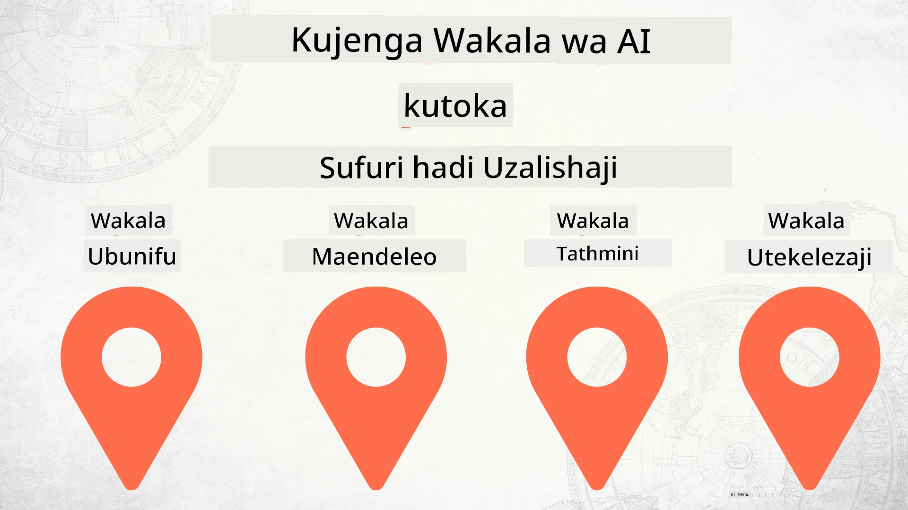

# Kujenga Maajenti wa AI Kuanzia Sifuri hadi Uzalishaji



### 🌐 Usaidizi wa Lugha Nyingi

#### Umeungwa mkono kupitia GitHub Action (Otomasia & Daima Imeboreshwa)

<!-- CO-OP TRANSLATOR LANGUAGES TABLE START -->
[Arabic](../ar/README.md) | [Bengali](../bn/README.md) | [Bulgarian](../bg/README.md) | [Burmese (Myanmar)](../my/README.md) | [Chinese (Simplified)](../zh-CN/README.md) | [Chinese (Traditional, Hong Kong)](../zh-HK/README.md) | [Chinese (Traditional, Macau)](../zh-MO/README.md) | [Chinese (Traditional, Taiwan)](../zh-TW/README.md) | [Croatian](../hr/README.md) | [Czech](../cs/README.md) | [Danish](../da/README.md) | [Dutch](../nl/README.md) | [Estonian](../et/README.md) | [Finnish](../fi/README.md) | [French](../fr/README.md) | [German](../de/README.md) | [Greek](../el/README.md) | [Hebrew](../he/README.md) | [Hindi](../hi/README.md) | [Hungarian](../hu/README.md) | [Indonesian](../id/README.md) | [Italian](../it/README.md) | [Japanese](../ja/README.md) | [Kannada](../kn/README.md) | [Korean](../ko/README.md) | [Lithuanian](../lt/README.md) | [Malay](../ms/README.md) | [Malayalam](../ml/README.md) | [Marathi](../mr/README.md) | [Nepali](../ne/README.md) | [Nigerian Pidgin](../pcm/README.md) | [Norwegian](../no/README.md) | [Persian (Farsi)](../fa/README.md) | [Polish](../pl/README.md) | [Portuguese (Brazil)](../pt-BR/README.md) | [Portuguese (Portugal)](../pt-PT/README.md) | [Punjabi (Gurmukhi)](../pa/README.md) | [Romanian](../ro/README.md) | [Russian](../ru/README.md) | [Serbian (Cyrillic)](../sr/README.md) | [Slovak](../sk/README.md) | [Slovenian](../sl/README.md) | [Spanish](../es/README.md) | [Swahili](./README.md) | [Swedish](../sv/README.md) | [Tagalog (Filipino)](../tl/README.md) | [Tamil](../ta/README.md) | [Telugu](../te/README.md) | [Thai](../th/README.md) | [Turkish](../tr/README.md) | [Ukrainian](../uk/README.md) | [Urdu](../ur/README.md) | [Vietnamese](../vi/README.md)

> **Unapendelea Kukopa Kwenye Kompyuta Moi?**

> Hifadhidata hii ina tafsiri za lugha zaidi ya 50 ambazo huongeza kwa kiasi kikubwa ukubwa wa kupakua. Ili kukopa bila tafsiri, tumia sparse checkout:
> ```bash
> git clone --filter=blob:none --sparse https://github.com/microsoft/Building-AI-Agents-From-Zero-To-Production.git
> cd Building-AI-Agents-From-Zero-To-Production
> git sparse-checkout set --no-cone '/*' '!translations' '!translated_images'
> ```
> Hii inakupatia kila kitu unachohitaji kumaliza kozi kwa upakuaji wa kasi zaidi.
<!-- CO-OP TRANSLATOR LANGUAGES TABLE END -->

## Kozi inayokufundisha misingi ya Mzunguko wa Maendeleo ya Maajenti wa AI

[](https://github.com/microsoft/Building-AI-Agents-From-Zero-To-Production/blob/master/LICENSE?WT.mc_id=academic-105485-koreyst)
[](https://GitHub.com/microsoft/Building-AI-Agents-From-Zero-To-Production/graphs/contributors/?WT.mc_id=academic-105485-koreyst)
[](https://GitHub.com/microsoft/Building-AI-Agents-From-Zero-To-Production/issues/?WT.mc_id=academic-105485-koreyst)
[](https://GitHub.com/microsoft/Building-AI-Agents-From-Zero-To-Production/pulls/?WT.mc_id=academic-105485-koreyst)
[](http://makeapullrequest.com?WT.mc_id=academic-105485-koreyst)

[](https://discord.gg/Kuaw3ktsu6)

## 🌱 Kuanzia

Kozi hii ina somo zinazohusu misingi ya kujenga na kupeleka Maajenti wa AI.

Somo kila moja linajengwa juu ya lile la awali, kwa hivyo tunapendekeza kuanza kutoka mwanzo na kufuata hadi mwisho.

Kama unataka kuchunguza zaidi kuhusu mada za Maajenti wa AI, unaweza angalia [Kozi ya Maajenti wa AI kwa Waanzilishi](https://aka.ms/ai-agents-beginners).

### Kutana na Wanafunzi Wengine, Pata Majibu ya Maswali Yako

Ikiwa utakwama au una maswali kuhusu kujenga Maajenti wa AI, jiunge na Kituo chetu maalumu cha Discord katika [Microsoft Foundry Discord](https://discord.gg/Kuaw3ktsu6).

### Unachohitaji

Somo kila moja lina sampuli yake ya msimbo ambayo unaweza kuendesha ndani ya kompyuta yako. Unaweza [kuchukua kopia hii repo](https://github.com/microsoft/Building-AI-Agents-From-Zero-To-Production/fork) ili kutengeneza nakala yako mwenyewe.

Kozi hii kwa sasa inatumia zifuatazo:

- [Microsoft Agent Framework (MAF)](https://aka.ms/ai-agents-beginners/agent-framework)
- [Microsoft Foundry](https://azure.microsoft.com/products/ai-foundry)
- [Huduma ya Azure OpenAI](https://azure.microsoft.com/products/ai-foundry/models/openai)
- [Azure CLI](https://learn.microsoft.com/cli/azure/authenticate-azure-cli?view=azure-cli-latest)

Tafadhali hakikisha una upatikanaji wa huduma hizi kabla ya kuanza.

Chaguzi zaidi kuhusu mwenyeji wa modeli na huduma zinakuja hivi karibuni. 

## 🗃️ Masomo

| **Somo**               | **Maelezo**                                                                                         |
|------------------------|-----------------------------------------------------------------------------------------------------|
| [Ubunifu wa Maajenti](./lesson-1-agent-design/README.md)       | Utangulizi kuhusu "Kuanzisha Waendelezaji" Kesi ya Matumizi ya Maajenti na jinsi ya kubuni maajenti bora  |
| [Maendeleo ya Maajenti](./lesson-2-agent-development/README.md)  | Ukitumia Microsoft Agent Framework (MAF), tengeneza maajenti 3 kusaidia waendelezaji wapya kuanza.       |
| [Tathmini za Maajenti](./lesson-3-agent-evals/README.md)  | Ukitumia Microsoft Foundry, gundua jinsi Maajenti wetu wa AI wanavyofanya kazi na jinsi ya kuyaboresha. |
| [Utoaji wa Maajenti](./lesson-4-agent-deployment/README.md)   | Ukitumia Maajenti Waliohifadhiwa na OpenAI Chatkit, ona jinsi ya kupeleka Maajenti wa AI kwenye uzalishaji.       |


## 🎒 Kozi Nyingine

Timu yetu hutengeneza kozi zingine! Angalia:

<!-- CO-OP TRANSLATOR OTHER COURSES START -->
### LangChain
[](https://aka.ms/langchain4j-for-beginners)
[](https://aka.ms/langchainjs-for-beginners?WT.mc_id=m365-94501-dwahlin)

---

### Azure / Edge / MCP / Maajenti
[](https://github.com/microsoft/AZD-for-beginners?WT.mc_id=academic-105485-koreyst)
[](https://github.com/microsoft/edgeai-for-beginners?WT.mc_id=academic-105485-koreyst)
[](https://github.com/microsoft/mcp-for-beginners?WT.mc_id=academic-105485-koreyst)
[](https://github.com/microsoft/ai-agents-for-beginners?WT.mc_id=academic-105485-koreyst)

---
 
### Mfululizo wa AI Inayotengeneza
[](https://github.com/microsoft/generative-ai-for-beginners?WT.mc_id=academic-105485-koreyst)
[-9333EA?style=for-the-badge&labelColor=E5E7EB&color=9333EA)](https://github.com/microsoft/Generative-AI-for-beginners-dotnet?WT.mc_id=academic-105485-koreyst)
[-C084FC?style=for-the-badge&labelColor=E5E7EB&color=C084FC)](https://github.com/microsoft/generative-ai-for-beginners-java?WT.mc_id=academic-105485-koreyst)
[-E879F9?style=for-the-badge&labelColor=E5E7EB&color=E879F9)](https://github.com/microsoft/generative-ai-with-javascript?WT.mc_id=academic-105485-koreyst)

---
 
### Kujifunza Msingi
[](https://aka.ms/ml-beginners?WT.mc_id=academic-105485-koreyst)
[](https://aka.ms/datascience-beginners?WT.mc_id=academic-105485-koreyst)
[](https://aka.ms/ai-beginners?WT.mc_id=academic-105485-koreyst)
[](https://github.com/microsoft/Security-101?WT.mc_id=academic-96948-sayoung)
[](https://aka.ms/webdev-beginners?WT.mc_id=academic-105485-koreyst)
[](https://aka.ms/iot-beginners?WT.mc_id=academic-105485-koreyst)
[](https://github.com/microsoft/xr-development-for-beginners?WT.mc_id=academic-105485-koreyst)

---
 
### Mfululizo wa Copilot
[](https://aka.ms/GitHubCopilotAI?WT.mc_id=academic-105485-koreyst)
[](https://github.com/microsoft/mastering-github-copilot-for-dotnet-csharp-developers?WT.mc_id=academic-105485-koreyst)
[](https://github.com/microsoft/CopilotAdventures?WT.mc_id=academic-105485-koreyst)
<!-- CO-OP TRANSLATOR OTHER COURSES END -->

## Kuchangia

Mradi huu unakaribisha michango na mapendekezo. Michango mingi inahitaji kufuata Makubaliano ya Leseni ya Mchango (CLA) inayothibitisha kuwa una haki, na kweli unatoa, haki za kutumia mchango wako. Kwa maelezo zaidi, tembelea <https://cla.opensource.microsoft.com>.

Unapowasilisha ombi la kuvuta, bot wa CLA atabaini moja kwa moja kama unahitaji kutoa CLA na kupamba PR ipasavyo (mfano, ukaguzi wa hali, maoni). Fuata tu maelekezo yanayotolewa na bot. Utahitaji kufanya hivi mara moja tu katika repos zote zinazotumia CLA yetu.

Mradi huu umechukua [Kanuni za Maadili za Chanzo Huria za Microsoft](https://opensource.microsoft.com/codeofconduct/).
Kwa habari zaidi tazama [Maswali Yanayoulizwa Mara kwa Mara juu ya Kanuni za Maadili](https://opensource.microsoft.com/codeofconduct/faq/) au wasiliana na [opencode@microsoft.com](mailto:opencode@microsoft.com) kwa maswali au maoni zaidi.

## Alama za Biashara

Mradi huu unaweza kuwa na alama za biashara au nembo za miradi, bidhaa, au huduma. Matumizi yaliyothibitishwa ya alama za biashara au nembo za Microsoft yanatakiwa kufuata na kuzingatia
[Mwongozo wa Alama za Biashara & Brand wa Microsoft](https://www.microsoft.com/legal/intellectualproperty/trademarks/usage/general).
Matumizi ya alama za biashara au nembo za Microsoft katika toleo lililobadilishwa la mradi huu hayapaswi kusababisha mkanganyiko au kuashiria ufadhili wa Microsoft.
Matumizi yoyote ya alama za biashara au nembo za watu wengine yanatakiwa kufuata sera za watu hao wa tatu.

## Kupata Msaada

Kama utakataa au una maswali yoyote kuhusu ujenzi wa programu za AI, jiunge:

[](https://discord.gg/Kuaw3ktsu6)

Kama una maoni kuhusu bidhaa au makosa wakati wa kujenga tembelea:

[](https://aka.ms/foundry/forum)

---

<!-- CO-OP TRANSLATOR DISCLAIMER START -->
**Kitangazo cha Kukataa**:
Hati hii imetafsiriwa kwa kutumia huduma ya tafsiri ya AI [Co-op Translator](https://github.com/Azure/co-op-translator). Ingawa tunajitahidi kwa usahihi, tafadhali fahamu kuwa tafsiri za kiotomatiki zinaweza kuwa na makosa au kasoro. Hati ya asili katika lugha yake ya asili inapaswa kuchukuliwa kama chanzo cha uhakika. Kwa taarifa muhimu, tafsiri ya mtaalamu wa kibinadamu inapendekezwa. Hatubebei dhima kwa kutoelewana au tafsiri potofu zinazosababishwa na matumizi ya tafsiri hii.
<!-- CO-OP TRANSLATOR DISCLAIMER END -->