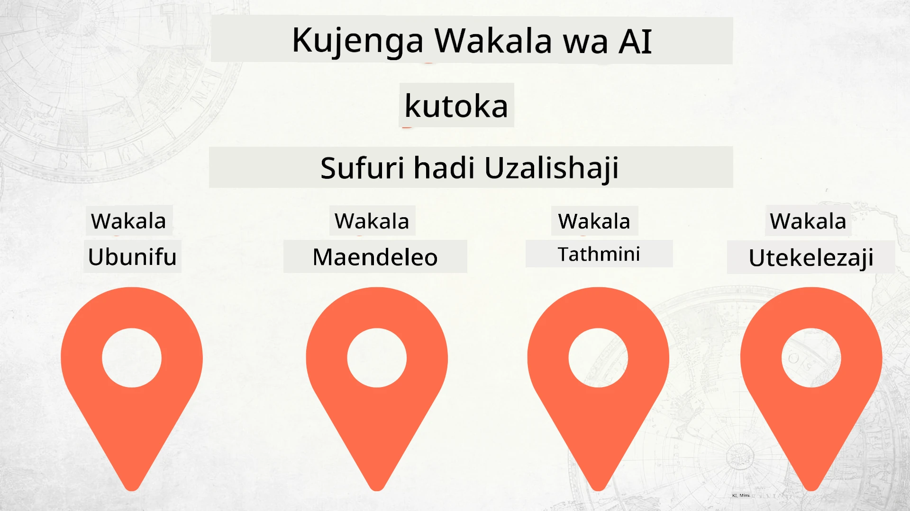

# Kujenga Wakala za AI Kutoka Mwanzo Hadi Uzalishaji



### 🌐 Msaada wa Lugha Nyingi

#### Unaungwa Mkono kupitia Kitendo cha GitHub (Kisababishi & Kila Mara Kipya)

<!-- CO-OP TRANSLATOR LANGUAGES TABLE START -->
[Arabic](../ar/README.md) | [Bengali](../bn/README.md) | [Bulgarian](../bg/README.md) | [Burmese (Myanmar)](../my/README.md) | [Chinese (Simplified)](../zh-CN/README.md) | [Chinese (Traditional, Hong Kong)](../zh-HK/README.md) | [Chinese (Traditional, Macau)](../zh-MO/README.md) | [Chinese (Traditional, Taiwan)](../zh-TW/README.md) | [Croatian](../hr/README.md) | [Czech](../cs/README.md) | [Danish](../da/README.md) | [Dutch](../nl/README.md) | [Estonian](../et/README.md) | [Finnish](../fi/README.md) | [French](../fr/README.md) | [German](../de/README.md) | [Greek](../el/README.md) | [Hebrew](../he/README.md) | [Hindi](../hi/README.md) | [Hungarian](../hu/README.md) | [Indonesian](../id/README.md) | [Italian](../it/README.md) | [Japanese](../ja/README.md) | [Kannada](../kn/README.md) | [Khmer](../km/README.md) | [Korean](../ko/README.md) | [Lithuanian](../lt/README.md) | [Malay](../ms/README.md) | [Malayalam](../ml/README.md) | [Marathi](../mr/README.md) | [Nepali](../ne/README.md) | [Nigerian Pidgin](../pcm/README.md) | [Norwegian](../no/README.md) | [Persian (Farsi)](../fa/README.md) | [Polish](../pl/README.md) | [Portuguese (Brazil)](../pt-BR/README.md) | [Portuguese (Portugal)](../pt-PT/README.md) | [Punjabi (Gurmukhi)](../pa/README.md) | [Romanian](../ro/README.md) | [Russian](../ru/README.md) | [Serbian (Cyrillic)](../sr/README.md) | [Slovak](../sk/README.md) | [Slovenian](../sl/README.md) | [Spanish](../es/README.md) | [Swahili](./README.md) | [Swedish](../sv/README.md) | [Tagalog (Filipino)](../tl/README.md) | [Tamil](../ta/README.md) | [Telugu](../te/README.md) | [Thai](../th/README.md) | [Turkish](../tr/README.md) | [Ukrainian](../uk/README.md) | [Urdu](../ur/README.md) | [Vietnamese](../vi/README.md)

> **Unapendelea Kutengeneza Nakala Moja kwa Moja?**
>
> Hifadhi hii ina tafsiri za lugha zaidi ya 50 ambazo zinaongeza kwa kiasi kikubwa ukubwa wa kupakua. Ili kutengeneza nakala bila tafsiri, tumia sparse checkout:
>
> **Bash / macOS / Linux:**
> ```bash
> git clone --filter=blob:none --sparse https://github.com/microsoft/Building-AI-Agents-From-Zero-To-Production.git
> cd Building-AI-Agents-From-Zero-To-Production
> git sparse-checkout set --no-cone '/*' '!translations' '!translated_images'
> ```
>
> **CMD (Windows):**
> ```cmd
> git clone --filter=blob:none --sparse https://github.com/microsoft/Building-AI-Agents-From-Zero-To-Production.git
> cd Building-AI-Agents-From-Zero-To-Production
> git sparse-checkout set --no-cone "/*" "!translations" "!translated_images"
> ```
>
> Hii inakupa kila kitu unachohitaji kukamilisha kozi kwa upakuaji mkubwa zaidi.
<!-- CO-OP TRANSLATOR LANGUAGES TABLE END -->

## Kozi inayokufundisha misingi ya Mzunguko wa Maendeleo wa Wakala wa AI

[](https://github.com/microsoft/Building-AI-Agents-From-Zero-To-Production/blob/master/LICENSE?WT.mc_id=academic-105485-koreyst)
[](https://GitHub.com/microsoft/Building-AI-Agents-From-Zero-To-Production/graphs/contributors/?WT.mc_id=academic-105485-koreyst)
[](https://GitHub.com/microsoft/Building-AI-Agents-From-Zero-To-Production/issues/?WT.mc_id=academic-105485-koreyst)
[](https://GitHub.com/microsoft/Building-AI-Agents-From-Zero-To-Production/pulls/?WT.mc_id=academic-105485-koreyst)
[](http://makeapullrequest.com?WT.mc_id=academic-105485-koreyst)

[](https://discord.gg/Kuaw3ktsu6)

## 🌱 Kuanzia

Kozi hii ina masomo yanayohusu misingi ya kujenga na kupeleka Wakala wa AI.

Kila somo linaongeza maarifa kutoka la awali, hivyo tunapendekeza kuanza kutoka mwanzo na kufanya kazi hadi mwisho.

Ikiwa ungependa kuchunguza zaidi kuhusu mada za Wakala wa AI, unaweza kuangalia [Kozi ya Wakala wa AI kwa Waanzilishi](https://aka.ms/ai-agents-beginners).

### Kukutana na Wajifunzaji Wengine, Pata Majibu ya Maswali Yako

Ikiwa unakwama au una maswali yoyote kuhusu kujenga Wakala wa AI, jiunge na Kituo chetu maalum cha Discord katika [Microsoft Foundry Discord](https://discord.gg/Kuaw3ktsu6).

### Unachohitaji


Kila Somo lina sampuli yake ya msimbo ambayo unaweza kuendesha kwa ndani. Unaweza [kuteka hifadhi hii](https://github.com/microsoft/Building-AI-Agents-From-Zero-To-Production/fork) kuunda nakala yako mwenyewe.

Kozi hii kwa sasa inatumia yafuatayo:

- [Microsoft Agent Framework (MAF)](https://aka.ms/ai-agents-beginners/agent-framework)
- [Microsoft Foundry](https://azure.microsoft.com/products/ai-foundry) — mradi wenye mfano wa **mfululizo wa GPT-5** ulioanzishwa (kwa mfano `gpt-5.1`). Usitumie mifano iliyostaafu ya GPT-4o / GPT-4.1.
- [Azure OpenAI Service](https://azure.microsoft.com/products/ai-foundry/models/openai)
- [Azure CLI](https://learn.microsoft.com/cli/azure/authenticate-azure-cli?view=azure-cli-latest) — ingia kwa kutumia `az login` kabla ya kuendesha sampuli yoyote
- **Python 3.12 au zaidi**

Tafadhali hakikisha una ufikiaji wa huduma hizi kabla ya kuanza.

> **💰 Gharama & usafishaji.** Masomo ya vitendo huunda rasilimali halisi za Azure — mradi wa Microsoft Foundry,
> uwekaji mfano, duka la vekta, na (katika Masomo 4–6) maajenti waliowezeshwa na masanduku ya zana.
> Hizi zinaweza kusababisha gharama wakati zipo. Unapomaliza somo — au kozi — futa
> rasilimali unazozihitaji. Njia rahisi ni kuweka kila kitu katika kikundi cha rasilimali kilichotengwa
> na kufuta kikundi kizima unapomaliza:
>
> ```bash
> az group delete --name <your-resource-group> --yes --no-wait
> ```
>
> Pia unaweza kufuta maajenti binafsi, maduka ya vekta, na masanduku ya zana kutoka kwa lango la Foundry.

> **Kumbuka kuhusu mifano.** Kozi hii hutoa mifano yote kupitia **Microsoft Foundry**. Hai
> tumii *GitHub Models*, ambayo itastaafu tarehe **30 Julai, 2026** — Microsoft Foundry ni njia rasmi ya uhamisho.
> Kama una msimbo wa zamani unaoitumia GitHub Models, lekezwa kwa uwekaji mfano wa Foundry badala yake.


## 🗃️ Masomo

| **Somo**         | **Maelezo**                                                                                  |
|--------------------|--------------------------------------------------------------------------------------------------|
| [Muundo wa Wakala](./lesson-1-agent-design/README.md)       | Utangulizi wa "Utumiaji wa Wakala wa Kuanzisha Watengenezaji" na jinsi ya kuunda maajenti wenye ufanisi  |
| [Maendeleo ya Wakala](./lesson-2-agent-development/README.md)  | Kutumia Microsoft Agent Framework (MAF), tengeneza kundi la maajenti maalum kusaidia watengenezaji wapya kuanza kazi.       |
| [Tathmini za Wakala](./lesson-3-agent-evals/README.md)  | Kutumia Microsoft Foundry, pata jinsi maajenti wetu wa AI wanavyofanya kazi na jinsi ya kuuboresha. |
| [Uwekaji Wakala](./lesson-4-agentdeployment/README.md)   | Kutumia maajenti waliowezeshwa wa Microsoft Foundry na OpenAI ChatKit, angalia jinsi ya kuweka Wakala wa AI katika uzalishaji.       |
| [Maajenti Waliowezeshwa wa Uzalishaji](./lesson-5-hosted-agents-production/README.md)   | Peleka wakala aliyeandaliwa kwa uzalishaji wa shirika: Maajenti Waliowezeshwa dhidi ya Wakaguzi wa Uwezo, leta uhifadhi, kumbukumbu, na utawala wako mwenyewe.       |

| [Microsoft Toolbox](./lesson-6-toolbox/README.md)   | Tafsiri zana mara moja na zidhibiti kawaida: tengeneza sanduku la zana, litumie kutoka kwa wakala kupitia kiungo kimoja cha MCP, na toa toleo la zana kwa usalama.       |
| [Multi-Agent & A2A](./lesson-7-multi-agent-a2a/README.md)   | Tengeneza mawakala kama huduma za mtandao: onyesha wakala moja kwa moja kwa itifaki ya Wakala kwa Wakala (A2A) na tumia wakala wa mbali kama mwenzake.       |


## 🎒 Kozi Nyingine

Timu yetu hutoa kozi nyingine! Angalia:

<!-- CO-OP TRANSLATOR OTHER COURSES START -->
### LangChain
[](https://aka.ms/langchain4j-for-beginners)
[](https://aka.ms/langchainjs-for-beginners?WT.mc_id=m365-94501-dwahlin)
[](https://github.com/microsoft/langchain-for-beginners?WT.mc_id=m365-94501-dwahlin)
---

### Azure / Edge / MCP / Wakala
[](https://github.com/microsoft/AZD-for-beginners?WT.mc_id=academic-105485-koreyst)
[](https://github.com/microsoft/edgeai-for-beginners?WT.mc_id=academic-105485-koreyst)
[](https://github.com/microsoft/mcp-for-beginners?WT.mc_id=academic-105485-koreyst)
[](https://github.com/microsoft/ai-agents-for-beginners?WT.mc_id=academic-105485-koreyst)

---
 
### Mfululizo wa AI Inayotengenezwa

[](https://github.com/microsoft/generative-ai-for-beginners?WT.mc_id=academic-105485-koreyst)
[-9333EA?style=for-the-badge&labelColor=E5E7EB&color=9333EA)](https://github.com/microsoft/Generative-AI-for-beginners-dotnet?WT.mc_id=academic-105485-koreyst)
[-C084FC?style=for-the-badge&labelColor=E5E7EB&color=C084FC)](https://github.com/microsoft/generative-ai-for-beginners-java?WT.mc_id=academic-105485-koreyst)
[-E879F9?style=for-the-badge&labelColor=E5E7EB&color=E879F9)](https://github.com/microsoft/generative-ai-with-javascript?WT.mc_id=academic-105485-koreyst)

---
 
### Mafunzo Msingi
[](https://aka.ms/ml-beginners?WT.mc_id=academic-105485-koreyst)
[](https://aka.ms/datascience-beginners?WT.mc_id=academic-105485-koreyst)
[](https://aka.ms/ai-beginners?WT.mc_id=academic-105485-koreyst)
[](https://github.com/microsoft/Security-101?WT.mc_id=academic-96948-sayoung)
[](https://aka.ms/webdev-beginners?WT.mc_id=academic-105485-koreyst)
[](https://aka.ms/iot-beginners?WT.mc_id=academic-105485-koreyst)
[](https://github.com/microsoft/xr-development-for-beginners?WT.mc_id=academic-105485-koreyst)

---
 
### Mfululizo wa Copilot
[](https://aka.ms/GitHubCopilotAI?WT.mc_id=academic-105485-koreyst)
[](https://github.com/microsoft/mastering-github-copilot-for-dotnet-csharp-developers?WT.mc_id=academic-105485-koreyst)
[](https://github.com/microsoft/CopilotAdventures?WT.mc_id=academic-105485-koreyst)
<!-- CO-OP TRANSLATOR OTHER COURSES END -->

## Kuchangia

Mradi huu unakaribisha michango na mapendekezo. Michango mingi huhitaji ukoe makubaliano ya
Mkataba wa Leseni ya Mchangiaji (CLA) unaosema kuwa una haki, na kwa kweli unatoa,
haki za kutumia mchango wako. Kwa maelezo zaidi, tembelea <https://cla.opensource.microsoft.com>.

Unapoleta ombi la mabadiliko, bot wa CLA utaamua moja kwa moja kama unahitaji kutoa
CLA na kupamba PR ipasavyo (mfano, ukaguzi wa hali, maoni). Fuata tu maelekezo
yanayotolewa na bot. Utahitaji kufanya huu mara moja tu kwa mahesabu yote yanayotumia CLA yetu.

Mradi huu umechukua [Sheria ya Maadili ya Chanzo Huria ya Microsoft](https://opensource.microsoft.com/codeofconduct/).
Kwa maelezo zaidi tazama [Maswali yanayoulizwa mara kwa mara kuhusu Sheria ya Maadili](https://opensource.microsoft.com/codeofconduct/faq/) au
wasiliana na [opencode@microsoft.com](mailto:opencode@microsoft.com) kwa maswali au maoni zaidi.

## Alama za Biashara

Mradi huu unaweza kuwa na alama za biashara au nembo za miradi, bidhaa, au huduma. Matumizi ya idhini ya alama za biashara au nembo za Microsoft
yanatazwa na lazima zifuate
[Miongozo ya Alama za Biashara na Brand za Microsoft](https://www.microsoft.com/legal/intellectualproperty/trademarks/usage/general).
Matumizi ya alama za biashara au nembo za Microsoft katika matoleo yaliyobadilishwa ya mradi huu hayapaswi kusababisha mkanganyiko au kuashiria udhamini wa Microsoft.
Matumizi yoyote ya alama za biashara au nembo za watu wa tatu yanatazwa na sera za watu hao wa tatu.

## Kupata Msaada

Ukikumbwa na shida au una maswali kuhusu ujenzi wa programu za AI, jiunge:

[](https://discord.gg/Kuaw3ktsu6)

Ikiwa una maoni kuhusu bidhaa au makosa wakati wa ujenzi tembelea:

[](https://aka.ms/foundry/forum)

---

<!-- CO-OP TRANSLATOR DISCLAIMER START -->
**Kionyozo**:
Hati hii imetafsiriwa kwa kutumia huduma ya tafsiri ya AI [Co-op Translator](https://github.com/Azure/co-op-translator). Ingawa tunajitahidi kupata usahihi, tafadhali fahamu kwamba tafsiri za kiotomatiki zinaweza kuwa na makosa au upungufu wa usahihi. Hati ya asili katika lugha yake halisi inapaswa kuchukuliwa kama chanzo cha mamlaka. Kwa taarifa muhimu, tafsiri ya kitaalamu inayofanywa na binadamu inapendekezwa. Hatutojibu kwa kuelewa vibaya au tafsiri potofu zinazotokea kutokana na matumizi ya tafsiri hii.
<!-- CO-OP TRANSLATOR DISCLAIMER END -->