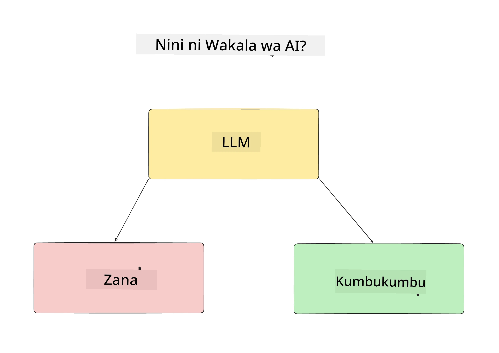
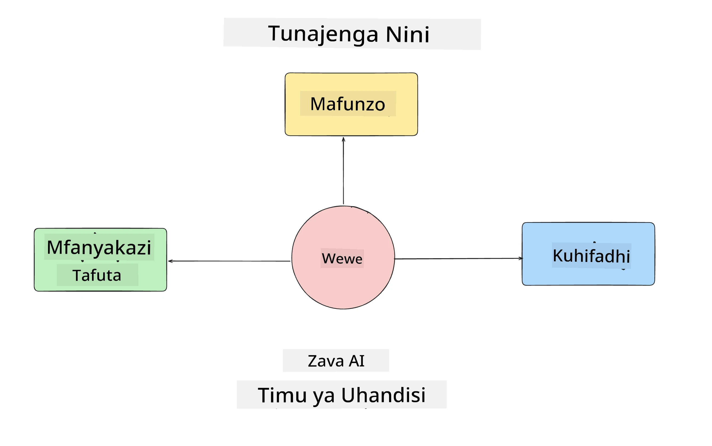
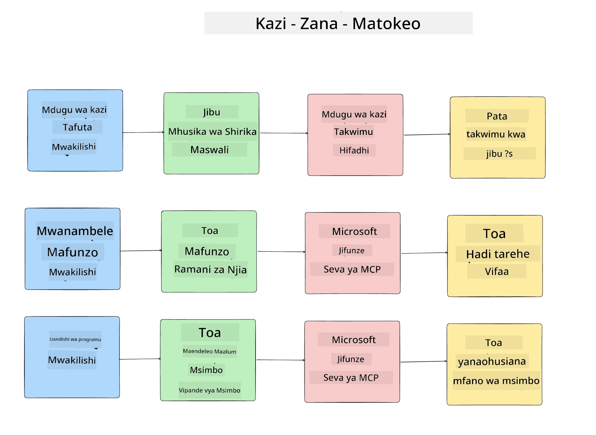
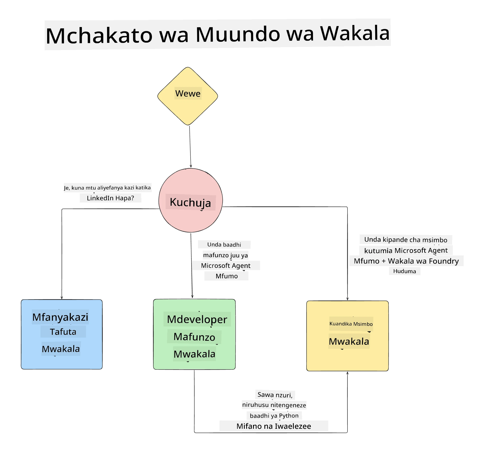

# Somo la 1: Muundo wa Wakala wa AI

Karibu kwenye somo la kwanza la "Kozi ya Kujenga Wakala wa AI Kuanzia Sifuri hadi Uzalishaji"!

Katika somo hili tutazungumzia:

- Kufafanua ni nini Wakala wa AI
  
- Kujadili Programu ya Wakala wa AI tunayoijenga  

- Kutambua zana na huduma zinazohitajika kwa kila wakala
  
- Kupanua Programu ya Wakala wetu
  
Hebu tuanze kwa kufafanua wakala ni nini na kwa nini tungetumia ndani ya programu.

> **Kabla ya kuanza kozi.** Somo hili la kwanza ni la dhana — hakuna msimbo wowote wa kuendesha.
> Kuanzia [Somo la 2](../lesson-2-agent-development/README.md) utahitaji: **usajili wa Azure** na ufikiaji wa **Microsoft Foundry**, mfano wa **mfululizo wa GPT-5 uliozinduliwa** (kwa mfano `gpt-5.1` — epuka GPT-4o / GPT-4.1 zilizotangazwa), **Python 3.12+**, na **Azure CLI** (`az login`). Angalia [Unachohitaji](../README.md#what-you-need) kwenye README ya kozi kwa orodha kamili na viungo.

## Wakala wa AI ni Nini?

Ikiwa huu ni wakati wako wa kwanza kuchunguza jinsi ya kujenga Wakala wa AI, unaweza kuwa na maswali juu ya jinsi ya kufafanua hasa ni nini Wakala wa AI.

Kwa njia rahisi ya kufafanua Wakala wa AI ni kwa sehemu zinazounda:

**Mfano Mkubwa wa Lugha (LLM)** - LLM itatoa nguvu kwa uwezo wa kuchakata lugha ya asili kutoka kwa mtumiaji kuelewa kazi wanayotaka kufanya pamoja na kuelewa maelezo ya zana zinazopatikana kusaidia kukamilisha kazi hizo.

**Zana** - Hizi zitakuwa ni kazi, API, hifadhidata na huduma nyingine ambazo LLM inaweza kuchagua kutumia kukamilisha kazi zilizohitajiwa na mtumiaji.

**Kumbukumbu** - Hii ni jinsi tunavyohifadhi mwingiliano wa muda mfupi na mrefu kati ya Wakala wa AI na mtumiaji. Kuhifadhi na kutoa taarifa hii ni muhimu kwa kufanya maboresho na kuhifadhi mapendeleo ya mtumiaji kwa muda.

## Kesi Yetu ya Matumizi ya Wakala wa AI

Kwa kozi hii, tutajenga programu ya Wakala wa AI inayosaidia watengenezaji wapya kujiunga na Timu yetu ya Maendeleo ya Wakala wa AI!

Kabla ya kufanya kazi yoyote ya maendeleo, hatua ya kwanza ya kuunda programu ya Wakala wa AI yenye mafanikio ni kufafanua kwa uwazi matukio tunayotarajia watumiaji wetu kufanya kazi nao.

Kwa programu hii, tutatumia matukio haya:

**Kesi ya Matukio 1**: Mfanyakazi mpya ana jiunga na shirika letu na anataka kujua zaidi kuhusu timu aliyoiandikishwa na jinsi ya kuungana nao.

**Kesi ya Matukio 2:** Mfanyakazi mpya anataka kujua ni kazi gani bora ya kwanza kwa ajili yao kuanza kufanya.

**Kesi ya Matukio 3:** Mfanyakazi mpya anataka kukusanya rasilimali za kujifunza na mifano ya msimbo kusaidia kuanza kukamilisha kazi hii.

## Kutambua Zana na Huduma

Sasa baada ya kuunda matukio haya, hatua inayofuata ni kuyalinganisha na zana na huduma ambazo wakala wetu wa AI atahitaji kukamilisha majukumu haya.

Mchakato huu unashuka katika aina ya Uhandisi wa Muktadha ambapo tutazingatia kuhakikisha Wakala wetu wa AI wana muktadha sahihi kwa wakati unaofaa kukamilisha majukumu.

Tufanye hili kesi kwa kesi na tufanye muundo mzuri wa wakala kwa kuorodhesha kila kazi ya wakala, zana na matokeo yanayotakiwa.

### Kesi ya Matukio 1 - Wakala wa Utafutaji wa Mfanyakazi

**Kazi** -  Kujibu maswali kuhusu wafanyakazi katika shirika kama tarehe ya kujiunga, timu ya sasa, eneo na nafasi ya mwisho.

**Zana** - Hifadhidata ya orodha ya wafanyakazi wa sasa na chati ya shirika

**Matokeo** - Kuwa na uwezo wa kupata taarifa kutoka kwenye hifadhidata kujibu maswali ya jumla ya shirika na maswali ya wafanyakazi mahususi.

### Kesi ya Matukio 2 - Wakala wa Mapendekezo ya Kazi

**Kazi** - Kulingana na uzoefu wa mtengenezaji wa mfanyakazi mpya, kutoa masuala 1-3 ambayo mfanyakazi huyo anaweza kufanya kazi nayo.

**Zana** - GitHub MCP Server kupata masuala yaliyo wazi na kujenga wasifu wa mtengenezaji

**Matokeo** - Kuwa na uwezo wa kusoma marekebisho ya mwisho 5 ya Wasifu wa GitHub na masuala yaliyo wazi kwenye mradi wa GitHub na kutoa mapendekezo kulingana na mlingano

### Kesi ya Matukio 3 - Wakala Msaidizi wa Msimbo

**Kazi** - Kulingana na Masuala ya wazi yaliyo pendekezwa na Wakala wa "Mapendekezo ya Kazi", fanya utafiti na toa rasilimali pamoja na tengeneza vipande vya msimbo kusaidia mfanyakazi.

**Zana** - Microsoft Learn MCP kupata rasilimali na Code Interpreter kuunda vipande vya msimbo vya kibinafsi.

**Matokeo** - Ikiwa mtumiaji ataomba msaada zaidi, mchakato unapaswa kutumia Learn MCP Server kutoa viungo na vipande vya rasilimali kisha kuhamisha kwa wakala wa Code Interpreter kuunda vipande vidogo vya msimbo pamoja na maelezo.

## Kupanua Programu Yetu ya Wakala

Sasa baada ya kufafanua kila Wakala wetu, hebu tengeneze mchoro wa muundo utakaotuwezesha kuelewa jinsi wakala kila mmoja atakavyoshirikiana au kufanya kazi peke yake kulingana na kazi:

## Hatua Zijazo

Sasa baada ya kubuni kila wakala na mfumo wetu wa wakala, hebu tuendelee kwenye somo lijalo ambapo tutatengeneza kila wakala huyu!

---

<!-- CO-OP TRANSLATOR DISCLAIMER START -->
**Kionyozo**:
Hati hii imetafsiriwa kwa kutumia huduma ya tafsiri ya AI [Co-op Translator](https://github.com/Azure/co-op-translator). Ingawa tunajitahidi kupata usahihi, tafadhali fahamu kwamba tafsiri za kiotomatiki zinaweza kuwa na makosa au upungufu wa usahihi. Hati ya asili katika lugha yake halisi inapaswa kuchukuliwa kama chanzo cha mamlaka. Kwa taarifa muhimu, tafsiri ya kitaalamu inayofanywa na binadamu inapendekezwa. Hatutojibu kwa kuelewa vibaya au tafsiri potofu zinazotokea kutokana na matumizi ya tafsiri hii.
<!-- CO-OP TRANSLATOR DISCLAIMER END -->