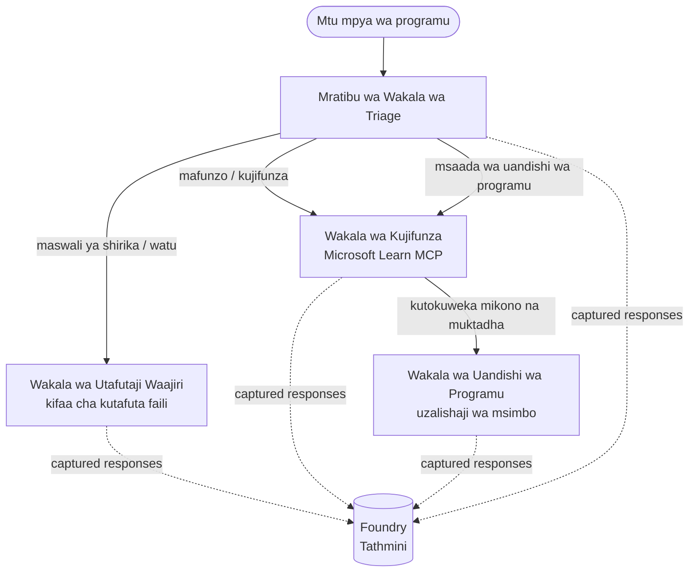

# Somo la 3: Tathmini za Wakala kwa Microsoft Foundry

Karibu kwenye somo la tatu la kozi ya **"Kujenga Wakala wa AI Kuanzia Sifuri hadi Uzalishaji"**!

Katika [Somo la 2](../lesson-2-agent-development/README.md) ulijenga mawakala. Katika somo hili
utajifunza jinsi ya kujibu swali gumu zaidi: **je, ni wazuri?** Kusafirisha wakala anayeendesha ni rahisi; kujua kama
anapanga vyema, anabaki kwa msingi wa data yako, na anatumia zana zake ipasavyo ndiko kunakotofautisha onyesho na mfumo wa uzalishaji.


Katika somo hili tutashughulikia:

- Kwa nini tathmini za wakala ni muhimu na jinsi zinavyotofautiana na upimaji wa kawaida
- Tofauti kati ya **uonekano**, **vipimo vya moshi**, na **tathmini**
- Mtiririko wa kazi wa wakala wengi tunaoutathmini
- Wakaguzi wa **Microsoft Foundry waliotengenezwa ndani** (ufaa, uhalisia, usahihi wa simu ya zana, matumizi ya matokeo ya zana)
- Mwongozo wa hatua kwa hatua wa mtiririko wa tathmini katika [`agent-evals.py`](../../../lesson-3-agent-evals/agent-evals.py)
- Jinsi ya kuendesha na kusoma matokeo

---

## Kwa nini kutathmini mawakala?

Kipimo cha kitengo cha jadi kinathibitisha kuwa `add(2, 2) == 4`. Mawakala hawaendeshwi kwa njia hiyo — kura ileile
inaweza kutoa maneno tofauti kila mara, zana zinaweza kuitwa kwa mpangilio tofauti, na
"sahihi" mara nyingi ni suala la kiwango badala ya mantiki ya kweli/kwa uongo. Huwezi kuthibitisha mistari kamili.

Badala yake, unathamini wakala kwa vipimo vya **ubora** ukitumia wakaguzi wa mfano (*evaluators*) wa mfano (pia
huitwa "LLM-kama-mahakimu") pamoja na ukaguzi wa uhakika wa matumizi ya zana. Hii inakuambia mambo kama:

- Je, jibu lilijibu swali kweli? (**ufaa**)
- Je, jibu linaungwa mkono na data iliyopatikana, au wakala alitumia mawazo yake binafsi? (**uhalisia**)
- Je, wakala alitumia zana sahihi kwa hoja sahihi? (**usahihi wa simu ya zana**)
- Je, wakala alitumia kweli kile zana ilichorudisha? (**matumizi ya matokeo ya zana**)

### Tabaka tatu zinazokamilishana za ubora

Hizi si mbinu zinazoshindana — wakala wa uzalishaji hutumia zote tatu:

| Tabaka | Swali linalojibiwa | Gharama | Inapoendesha | Imeelezwa katika |
|-------|--------------------|--------|--------------|------------------|
| **Uonekano / ufuatiliaji** | *Nini wakala alifanya, hatua kwa hatua?* | Bila malipo (daima iko hai) | Mfululizo katika uzalishaji | Somo hili |
| **Vipimo vya moshi** | *Je, wakala anapatikana na anafuata amri zake za msingi?* | Nafuu, sekunde | Kila mara kupelekwa | [Somo la 4](../lesson-4-agentdeployment/README.md#smoke-testing-the-hosted-agent-ci-gate) |
| **Tathmini** | *Majibu ni **mazuri** kiasi gani?* | Polepole, inalingana na mfano | Kwa ombi / kila usiku / kabla ya toleo | Somo hili |

Vipimo vya moshi hutoa jibu "je, ilivunjika?"; tathmini hutoa jibu "je, ni nzuri?". Unahitaji zote mbili.

---

## Mahitaji ya awali

1. Kumaliza [Somo la 2](../lesson-2-agent-development/README.md) (mawakala + hifadhi ya vekta).
2. Mradi wa **Microsoft Foundry**.
3. Uthibitishaji wa **Azure CLI**: `az login`.
4. **Python 3.12+** na utegemezi wa kozi umewekwa:

   ```bash
   pip install -r ../requirements.txt
   ```

5. Mabadiliko ya mazingira (tengeneza faili `.env` katika folda hii au uzipe kwenye mazingira):

   | Kigezo | Kusudi |
   |--------|--------|
   | `FOUNDRY_PROJECT_ENDPOINT` | Mwisho wa mradi wako wa Foundry (`https://<account>.services.ai.azure.com/api/projects/<project>`). Baswa na wakala `FoundryChatClient` **na** msaidizi wa tathmini. |
   | `FOUNDRY_MODEL` | Utoaji wa mfano unaoendesha **mawakala** (mfano `gpt-5.1`). |
   | `VECTOR_STORE_ID` | Hifadhi ya vekta ya orodha ya wafanyakazi iliyoundwa katika Somo la 2 |
   | `AZURE_AI_MODEL_DEPLOYMENT_NAME` | Utoaji wa mfano unaotumiwa **na wakaguzi** (kwa kawaida `FOUNDRY_MODEL`, kisha `gpt-5.1`) |

> Mawakala hutumia `FoundryChatClient`, ambayo husoma usanidi kutoka kwa vigezo vilivyoanza na `FOUNDRY_`
> (`FOUNDRY_PROJECT_ENDPOINT`, `FOUNDRY_MODEL`). Msaidizi wa tathmini wa wingu
> hutumia SDK ya `azure-ai-projects` na atarudi kwa `FOUNDRY_PROJECT_ENDPOINT` ikiwa
> `AZURE_AI_PROJECT_ENDPOINT` haijabebwa — hivyo vigezo viwili vya `FOUNDRY_` vinatosha
> kuendesha somo lote.
>
> Wakaguzi wenyewe wanaendeshwa na mfano, hivyo `AZURE_AI_MODEL_DEPLOYMENT_NAME`
> hudhibiti utoaji unaofanya uamuzi — haipaswi kuwa mfano huo huo wanayotumia mawakala wako.


---

## Mtiririko wa kazi tunaoutathmini

Ili kutathmini kitu, lazima kwanza kuendesha. Somo hili linatumia tena mtiririko wa kazi wa **Kuanza kwa Mwaendelezaji**
wa wakala wengi: kocha wa **triage** anamkabidhi kwa wataalamu watatu.



Mtiririko huu umetengenezwa kwa kutumia usanidi wa **handoff** wa Microsoft Agent Framework. Wazo kuu
la tathmini ni kwamba **kila zamu ya wakala inahifadhiwa upande wa seva** na kutambulika kwa
`response_id`. Nambari hizo ndizo tunazowasilisha kwa huduma ya tathmini.

---

## Mtiririko wa tathmini, hatua kwa hatua

[`agent-evals.py`](../../../lesson-3-agent-evals/agent-evals.py) inatekeleza mtiririko wa hatua sita. Hapa ni kile kila hatua inachofanya
na kwa nini.

### Hatua 1 — Endesha mtiririko wa kazi na fuatilia nambari za majibu

Mtiririko unatekelezwa kwa kutumia `run_stream(...)`, na matukio yanaporudi msururu msimbo huandika
`response_id` na `conversation_id` iliyotolewa na kila wakala. Majibu yaliyohifadhiwa ni nyenzo za asili
kwa ajili ya tathmini — unahesabu majibu halisi yaliyotengenezwa kwa uzalishaji, si yale yaliyotengenezwa upya.


### Hatua 2 — Fupisha kile kilichopatikana

Muhtasari wa haraka unaonyesha ni majibu mangapi kila wakala alizalisha, ili uthibitishe mtiririko wa kazi
umeweza kuwachukua mawakala unaotaka kupima.

### Hatua 3 — Pata majibu ya mwisho

Kwa kila wakala, `response_id` ya mwisho inapatikana kupitia mteja wa mradi unaoendana na OpenAI
(`project_client.get_openai_client().responses.retrieve(...)`) ili uweze kuona maandishi ambayo yatahukumiwa.


### Hatua 4 — Tengeneza tathmini

Tathmini hutengenezwa kwa kutumia wakaguzi **wanaojengwa ndani ya Foundry** wanne:

| Mhakiki | `evaluator_name` | Kinachopimwa |
|---------|------------------|--------------|
| Ufaa | `builtin.relevance` | Je, jibu linahakikisha ombi la mtumiaji? |

| Uthibitisho wa Kweli | `builtin.groundedness` | Je, jibu linaungwa mkono na data iliyo patikana/kifaa (sio kubuniwa)? |
| Usahihi wa simu ya chombo | `builtin.tool_call_accuracy` | Je, zilioitwa vyombo sahihi kwa hoja sahihi? |
| Matumizi ya matokeo ya chombo | `builtin.tool_output_utilization` | Je, wakala alikuwa anatumia matokeo ya chombo katika jibu lake? |

Kila mtathmini huanzishwa na usambazaji unaoitwa kwa jina `AZURE_AI_MODEL_DEPLOYMENT_NAME`.

> **Kwa nini hizi nne?** Urelevancy na groundedness hupima *ubora wa jibu*; wakaguzi wawili wa chombo
> hupima *tabia ya wakala* — sehemu ambazo metiriki za kawaida za NLP hazishughulikii kabisa. Kwa
> mfumo unaotumia zana nyingi, metiriki za zana mara nyingi ndizo huficha kushuka kwa kweli.

### Hatua ya 5 — Endesha tathmini

`response_id` zilizochukuliwa hupitishwa kwa `evals.runs.create(...)` kama chanzo cha data. Huduma
hurusha tena kila jibu lililohifadhiwa kupitia kila mtathmini.

### Hatua ya 6 — Tazama na soma matokeo

Msimbo unasubiri mpaka kukimbia kufikie hali ya `completed` au `failed`, kisha unaonyesha hesabu
za matokeo na **`report_url`** — kiungo cha kina ndani ya lango la Foundry ambapo unaweza kuchunguza
alama za kila metiriki, hesabu za kupitisha/kushindwa, na majibu binafsi yaliyothibitishwa.

---

## Endesha

```bash
cd lesson-3-agent-evals
python agent-evals.py
```

Kawaida hutathmini swali la mfano la kwanza
(`"Nipo hapa kwa mara ya kwanza! Je, mtu yeyote amefanya kazi Microsoft hapa?"`). Maswali mawili zaidi yenye makusudi mengi
yamedhamilishwa katika `run_evaluation_workflow()` — badilisha thamani ya `query` kujaribu matukio ya upangaji
yaliyohusisha wakala zaidi katika kukimbia moja.

Mtiririko unaotarajiwa kwenye consola:

```
Step 1: Running Developer Onboarding Workflow
Step 2: Response Data Summary
Step 3: Fetching Agent Responses
Step 4: Creating Evaluation
Step 5: Running Evaluation
Step 6: Monitoring Evaluation
  Status: running ...
  Evaluation completed successfully
  Report URL: https://...   <-- open this in the Foundry portal
```

---

## Uwezo wa kuona na ufuatiliaji

Tathmini zinaeleza *jinsi majibu yalivyokuwa mazuri*; **uwezo wa kuona** unasema *nini kilitokea*
kuviunda — kila hatua ya wakala, simu ya chombo, hesabu ya tokeni, na ucheleweshaji. Katika Microsoft Foundry,
mizunguko ya wakala hutuma ufuatiliaji wa OpenTelemetry unaweza kutazamwa kwenye lango, na Mfumo wa Wakala unaweza
kuyaingiza kwenye Azure Monitor / Application Insights kwa simu moja:

```python
from agent_framework.foundry import FoundryChatClient

client = FoundryChatClient()
client.configure_azure_monitor()   # toa alama na vipimo kwa Application Insights
```

Tumia ufuatiliaji ili **kutatua** alama mbaya ya tathmini: wakati groundedness inashuka, ufuatiliaji unaonyesha
ikiwa chombo cha utafutaji faili hakurudisha chochote, au kilirudisha data ambacho wakala kisha kikatupilia mbali (ambacho ni
hasa kinachopimwa na matumizi ya matokeo ya chombo).

---

## Kutoka "kukimbia" hadi "nzuri": jinsi ya kutumia hii kikazi

- **Kizuizi kabla ya uzinduzi.** Endesha tathmini dhidi ya seti thabiti ya maswali wakilini kabla
  ya kuhimiza onyo au mfano mpya. Linganisha alama na toleo la awali — chukulia kushuka kama
  kushuka ubora.
- **Ishara ya ubora ya usiku.** Panga tathmini ili kugundua mabadiliko kutoka kwenye data au mabadiliko ya utegemezi.

- **Patanisha na majaribio ya moshi.** [Jaribio la moshi la Somo la 4](../lesson-4-agentdeployment/README.md#smoke-testing-the-hosted-agent-ci-gate)
  ni kizuizi chako cha haraka cha kila usambazaji; tathmini ni kizuizi cha ubora wa kina na polepole.
  Endesha jaribio la gharama nafuu kila mchanganyiko na la ghali kwa ratiba au kabla ya uzinduzi.

---

## Kumbusho la kisasa

Mfano huu unahamishwa hadi uso wa sasa wa Microsoft Agent Framework Foundry API
(`agent_framework.foundry`). Ikiwa unasasisha msimbo, angalia mzizi wa hiyo
[`MIGRATION-GUIDE.md`](../MIGRATION-GUIDE.md) kwa ramani zilizothibitishwa kabla/baada za kuingiza na mteja
(kwa mfano `AzureAIClient` -> `FoundryChatClient`, na uundaji wa chombo kilichoshikiliwa kupitia
`client.get_file_search_tool(...)` / `client.get_mcp_tool(...)`). Dhana za tathmini na
mchakato wa hatua sita hapo juu hazijabadilika kwa uhamisho huo.

---

## Rasilimali

- [Tathmini za mifano na programu za AI za kizazi (Microsoft Learn)](https://learn.microsoft.com/en-us/azure/ai-foundry/concepts/evaluation-approach-gen-ai)
- [Wakaguzi waliojengwa kwa AI ya kizazi](https://learn.microsoft.com/en-us/azure/ai-foundry/concepts/evaluation-evaluators/agent-evaluators)
- [Uwezo wa kuona katika Microsoft Foundry](https://learn.microsoft.com/en-us/azure/ai-foundry/concepts/observability)
- [Microsoft Agent Framework](https://github.com/microsoft/agent-framework)
- [Usanidi wa uhamisho wa wakala](https://learn.microsoft.com/en-us/agent-framework/workflows/orchestrations/handoff)

---

<!-- CO-OP TRANSLATOR DISCLAIMER START -->
**Kionyozo**:
Hati hii imetafsiriwa kwa kutumia huduma ya tafsiri ya AI [Co-op Translator](https://github.com/Azure/co-op-translator). Ingawa tunajitahidi kupata usahihi, tafadhali fahamu kwamba tafsiri za kiotomatiki zinaweza kuwa na makosa au upungufu wa usahihi. Hati ya asili katika lugha yake halisi inapaswa kuchukuliwa kama chanzo cha mamlaka. Kwa taarifa muhimu, tafsiri ya kitaalamu inayofanywa na binadamu inapendekezwa. Hatutojibu kwa kuelewa vibaya au tafsiri potofu zinazotokea kutokana na matumizi ya tafsiri hii.
<!-- CO-OP TRANSLATOR DISCLAIMER END -->