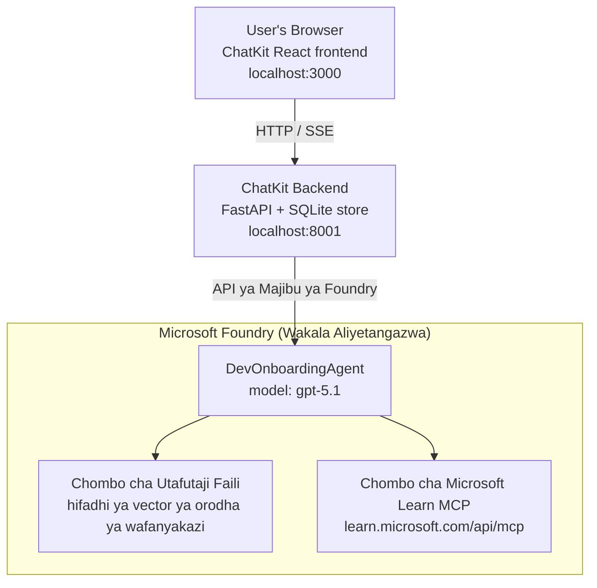

# Somo la 4: Utekelezaji wa Wakalishaji kwa Microsoft Foundry Hosted Agents + ChatKit

Somo hili linaonyesha jinsi ya kuweka wakala anayejumuisha zana kwa Microsoft Foundry kama wakala mwenyeji (hosted agent) na kuunda sehemu ya mbele ya ChatKit kuhusiana naye.

## Miundo

Wakala mwenyeji ni **wakala mmoja `DevOnboardingAgent`** (anakimbia kwenye `gpt-5.1`) anayejibu maswali ya kuanzisha watengenezaji kwa kutumia zana mbili zilizohifadhiwa: zana ya **Utafutaji Faili** juu ya hifadhi ya vector ya orodha ya wafanyakazi, na zana ya **Microsoft Learn MCP**. Sehemu ya mbele ya ChatKit React huzungumza na sehemu ya nyuma ya FastAPI, ambayo huipigia simu wakala kupitia **Responses API** ya Foundry.



## Mahitaji ya Awali

1. **Mradi wa Microsoft Foundry** katika eneo la North Central US
2. **Azure CLI** imethibitishwa (`az login`)
3. **Azure Developer CLI** (`azd`) imewekwa
4. **Python 3.12+** na **Node.js 18+**
5. **Hifadhi ya Vector** iliyotengenezwa na data ya wafanyakazi

## Kuanzia Haraka

### 1. Weka Mabadiliko ya Mazingira

```bash
cd lesson-4-agentdeployment
cp .env.example .env
# Hariri .env na maelezo ya mradi wako wa Microsoft Foundry
```

### 2. Weka Wakala Mwenyeji

**Chaguo A: Kutumia Azure Developer CLI (Inapendekezwa)**

```bash
cd hosted-agent
azd auth login
azd agent deploy
```

**Chaguo B: Kutumia Docker + Azure Container Registry**

```bash
cd hosted-agent

# Jenga kontena
docker build -t developer-onboarding-agent:latest .

# Lebo kwa ACR
docker tag developer-onboarding-agent:latest <your-acr>.azurecr.io/developer-onboarding-agent:latest

# Sukuma kwenda ACR
az acr login --name <your-acr>
docker push <your-acr>.azurecr.io/developer-onboarding-agent:latest

# Sambaza kupitia lango la Microsoft Foundry au SDK
```

### 3. Anzisha Sehemu ya Nyuma ya ChatKit

```bash
cd chatkit-server
python -m venv .venv
source .venv/bin/activate  # Kwenye Windows: .venv\Scripts\activate
pip install -r requirements.txt
python app.py
```

Seva itaanza kwenye `http://localhost:8001`

### 4. Anzisha Sehemu ya Mbele ya ChatKit

```bash
cd chatkit-server/frontend
npm install
npm run dev
```

Sehemu ya mbele itaanza kwenye `http://localhost:3000`

### 5. Jaribu Programu

Fungua `http://localhost:3000` kwenye kivinjari chako na jaribu maswali haya:

**Utafutaji Mfanyakazi:**
- "Mimi ni mpya hapa! Je, kuna mtu yule aliyewahi kufanya kazi Microsoft?"
- "Nani ana uzoefu na Azure Functions?"

**Rasilimali za Kujifunza:**
- "Tengeneza njia ya kujifunza kwa Kubernetes"
- "Nisifuate vyeti gani kwa ajili ya usanifu wa wingu?"

**Msaada wa Usanifu wa Msimbo:**
- "Nisaidie kuandika msimbo wa Python wa kuunganishwa na CosmosDB"
- "Nionyeshe jinsi ya kuunda Azure Function"

**Maswali ya Wakala Wengi:**
- "Naanza kama mhandisi wa wingu. Nafaa kuungana na nani na nifanye nini kujifunza?"

## Muundo wa Mradi

```
lesson-4-agentdeployment/
├── .env.example                 # Environment variables template
├── implementation-plan.md       # Detailed implementation guide
├── README.md                    # This file
├── hosted-agent/               # Microsoft Foundry hosted agent
│   ├── main.py                 # Multi-agent workflow implementation
│   ├── requirements.txt        # Python dependencies
│   ├── Dockerfile              # Container definition
│   └── agent.yaml              # Agent deployment configuration
└── chatkit-server/             # ChatKit server application
    ├── app.py                  # FastAPI backend
    ├── store.py                # SQLite persistence layer
    ├── requirements.txt        # Python dependencies
    └── frontend/               # React frontend
        ├── package.json
        ├── vite.config.ts
        ├── tsconfig.json
        ├── index.html
        └── src/
            ├── main.tsx
            ├── App.tsx
            ├── App.css
            └── index.css
```

## Wakala na Zana Zake

Wakala mwenyeji ni **wakala mmoja** (`DevOnboardingAgent`, umefafanuliwa katika `hosted-agent/main.py`) anayeshughulikia maeneo matatu ya kuanzisha. Badala ya kuratibu wakala wadogo tofauti, huonesha kila uwezo kama zana (au hutegemea moja kwa moja mfano):

| Uwezo | Jinsi unavyoshughulikiwa | Zana |
|-----------|------------------|------|
| **Utafutaji wafanyakazi & uhusiano** | Utafutaji faili uliohifadhiwa Foundry juu ya hifadhi ya vector ya orodha ya wafanyakazi | `client.get_file_search_tool(vector_store_ids=[...])` |
| **Kujifunza & mafunzo** | Seva ya Microsoft Learn MCP (zana ya MCP iliyohifadhiwa) | `client.get_mcp_tool(url="https://learn.microsoft.com/api/mcp")` |
| **Msaada wa Usanifu wa Msimbo** | Hutegemea moja kwa moja mfano wa `gpt-5.1` — hakuna zana ya nje | — |

Wakala anaundwa kwa `client.as_agent(name="DevOnboardingAgent", instructions=..., tools=[file_search_tool, learn_mcp_tool])` na hutumika kwa `from_agent_framework(agent).run()`.

> **Kumbukumbu ya muundo.** Rasimu za awali za somo hili zilitumia mtiririko wa kazi wa wakala wengi wa `HandoffBuilder` (Triage → wataalamu). Wakala aliyehamishwa ni wakala mmoja anayejumuisha zana, ambao ni rahisi kuutekeleza na kuelewa kwa maswali na majibu ya aina ya kuanzisha. Kwa mfano wa kuratibu na kuhamisha kwa wakala wengi, tazama Somo la 2 na Somo la 3.

## Kujaribu Haraka Wakala Mwenyeji (Mlango wa CI)

Kuweka wakala mwenyeji "kwa mafanikio" kunaonyesha tu kuwa usimamizi ulikubali
ufafanuzi — si kwamba wakala anajibu kweli. Ukosefu wa utegemezi,
mwelekeo mbaya wa mfano, au muunganisho uliokufa unaweza kuwaacha wakala kijani-ila kimya.

Somo hili linaleta **jaribio la moshi** nyepesi ambalo hufanya kama lango la haraka, la bei nafuu baada ya utoaji.
Linatumia [AI Smoke Test](https://github.com/marketplace/actions/ai-smoke-test)
Kitendo cha GitHub cha kutuma maagizo kwa kiungo cha **Responses** cha wakala kwenye Foundry
(`POST {project_endpoint}/agents/{agent_name}/endpoint/protocols/openai/responses`)
na kuthibitisha maandishi yanayorejeshwa. Hufuatilia utoaji mbovu, matatizo ya uthibitishaji,
mabadiliko ya maelekezo ya mfumo, na kuvunjika kwa mizunguko ndani ya sekunde.

> Jaribio la moshi si **mbadala** kwa tathmini kamili katika
> [Somo la 3](../lesson-3-agent-evals/README.md) — ni ziada. Jaribio la moshi
> linajibu *"Je, wakala anafikika, anajibu, na anafuata matarajio ya maelezo ya msingi?"*;
> tathmini zinajibu *"Je, jibu ni zuri kiasi gani?"*. Endesha lango hili la bei nafuu kila utoaji.

### Kinachojaribiwa

Katalogi iko katika [`hosted-agent/tests/smoke-tests.json`](../../../lesson-4-agentdeployment/hosted-agent/tests/smoke-tests.json)
na linaongeza maeneo matatu ya wakala pamoja na ufuatiliaji wa maelekezo na mizunguko ya mazungumzo:

| Jaribio | Kinachothibitishwa |
|------|------------------|
| `reachability` | Wakala anajibu kwa maandishi yasiyo tupu, yaliyo ndani ya eneo |
| `employee-search` | Eneo la utafutaji faili linarudisha `200` yenye afya (jibu linategemea data) |
| `learning-path` | Eneo la kujifunza linarudia mada na kutoa jibu la aina ya njia |
| `coding-assistance` | Eneo la usanifu linarudisha jibu la Python lenye umbo kama msimbo |
| `prompt-adherence-offtopic` | Ombi lisilo la mada linaelekezwa upya, halijibiwi kwa undani |
| `threading-turn-1/2` | Hali ya mazungumzo huhifadhiwa kati ya zamu kupitia `previous_response_id` |

### Endesha kwenye CI

Mtiririko wa kazi katika [`.github/workflows/smoke-test-hosted-agent.yml`](../../../.github/workflows/smoke-test-hosted-agent.yml)
una kazi mbili:

- **`static`** — lango la haraka, lisilo la Azure linalokimbia kila ombi la kuvuta na kusukuma:
  linakamata vyanzo vyote vya Python (`py_compile`) na kuangalia viungo vya Markdown. Hakuna siri
  zinazohitajika, hivyo hufanya kazi kwenye PR za matawi.
- **`smoke`** — jaribio la moshi linalounganishwa na Azure hapa chini. Linakimbia kwa ombi
  (Actions → **Agent CI (static + smoke)** → Endesha mtiririko) na linaweza kufuatwa baada ya
  mtiririko wako wa utoaji.

Sanidi **mabadiliko** ya chini na **siri** za hifadhi hii kwa kazi ya moshi:

| Aina | Jina | Thamani |
|------|------|-------|

| Kigezo | `FOUNDRY_PROJECT_ENDPOINT` | `https://<account>.services.ai.azure.com/api/projects/<project>` |
| Kigezo | `HOSTED_AGENT_NAME` | Jina la wakala aliyesambazwa (mfano `dev-onboarding` — lazima lingana na ugawaji wako) |
| Siri | `AZURE_CLIENT_ID` / `AZURE_TENANT_ID` / `AZURE_SUBSCRIPTION_ID` | Utambulisho uliofungamana wa OIDC kwa `azure/login` |

Utambulisho wa mchezaji unahitaji cheo cha **`Azure AI User`** katika **wigo wa mradi wa Foundry** ili iweze
kupiga simu kwenye Interfaces za data-plane za Majibu (na mazungumzo). Ipe kwa:

```bash
az role assignment create \
  --assignee <object-id-or-appId-of-runner-identity> \
  --role "Azure AI User" \
  --scope "/subscriptions/<sub>/resourceGroups/<rg>/providers/Microsoft.CognitiveServices/accounts/<account>/projects/<project>"
```

### Ikimbie kwa ndani ya eneo lako

Unaweza kuendesha katalogi hiyo hiyo kabla ya kusukuma. Pata tokeni ya data-plane iliyo na wigo
`https://ai.azure.com/` na elekeza mchezaji kwenye ugawaji wako:

```bash
# Hadhira LAZIMA iwe https://ai.azure.com/ (vitambulisho vya cognitiveservices.azure.com havikubaliwa)
export FOUNDRY_TOKEN=$(az account get-access-token --resource https://ai.azure.com/ --query accessToken -o tsv)

git clone https://github.com/JFolberth/ai-smoketest && cd ai-smoketest
python runner.py \
  --project-endpoint "https://<account>.services.ai.azure.com/api/projects/<project>" \
  --agent-name dev-onboarding \
  --tests-file ../lesson-4-agentdeployment/hosted-agent/tests/smoke-tests.json
```

Msimbo wa kutoka: `0` yote yamefaulu, `1` uthibitisho umefeli, `2` kosa la mchezaji (katalogi mbaya / tokeni).

## Utatuzi wa matatizo

### Wakala haajibu
- Hakikisha wakala aliyesambazwa ameanzishwa na anaendesha katika Microsoft Foundry
- Angalia `HOSTED_AGENT_NAME` na `HOSTED_AGENT_VERSION` zinalingana na ugawaji wako

### Makosa ya duka la vector
- Hakikisha `VECTOR_STORE_ID` imewekwa kwa usahihi
- Hakikisha duka la vector lina data ya mfanyakazi

### Makosa ya uthibitishaji
- Endesha `az login` ili kusasisha vyeti
- Hakikisha una upatikanaji wa mradi wa Microsoft Foundry

## Rasilimali

- [Nyaraka za Wakala Waliosambazwa wa Microsoft Foundry](https://learn.microsoft.com/en-us/azure/ai-foundry/agents/concepts/hosted-agents)
- [Mfumo wa Wakala wa Microsoft](https://github.com/microsoft/agent-framework)
- [Mfano wa Mchanganyiko wa ChatKit](https://github.com/microsoft/agent-framework/tree/main/python/samples/demos/chatkit-integration)
- [CLI ya Mendelezaji wa Azure](https://learn.microsoft.com/en-us/azure/developer/azure-developer-cli/overview)
- [AI Smoke Test GitHub Action](https://github.com/marketplace/actions/ai-smoke-test)
- [Mtihani wa Smoke Kwa Wakala wa Microsoft Foundry kwa GitHub Actions (blogu)](https://techcommunity.microsoft.com/blog/azuredevcommunityblog/smoke-test-microsoft-foundry-agents-with-github-actions/4531912)

---

## Hatua Zifuatayo

Wakala wako anaendesha kwenye miundombinu inayoendeshwa na Microsoft. Ili kuipeleka katika uzalishaji wa shirika —
kudhibiti mahali data zake zinakaa (uhuru wa data, mtandao wa kibinafsi, kuleta Azure yako mwenyewe
Cosmos DB / Hifadhi / AI Search) na kusimamia zana zake — endelea na
**[Somo la 5: Wakala Waliosambazwa Wazalishaji](../lesson-5-hosted-agents-production/README.md)**, ambalo
linaelezea tofauti muhimu kati ya **Wakala Waliosambazwa** na **Wenyeji wa Uwezo**.

---

<!-- CO-OP TRANSLATOR DISCLAIMER START -->
**Kionyozo**:
Hati hii imetafsiriwa kwa kutumia huduma ya tafsiri ya AI [Co-op Translator](https://github.com/Azure/co-op-translator). Ingawa tunajitahidi kupata usahihi, tafadhali fahamu kwamba tafsiri za kiotomatiki zinaweza kuwa na makosa au upungufu wa usahihi. Hati ya asili katika lugha yake halisi inapaswa kuchukuliwa kama chanzo cha mamlaka. Kwa taarifa muhimu, tafsiri ya kitaalamu inayofanywa na binadamu inapendekezwa. Hatutojibu kwa kuelewa vibaya au tafsiri potofu zinazotokea kutokana na matumizi ya tafsiri hii.
<!-- CO-OP TRANSLATOR DISCLAIMER END -->