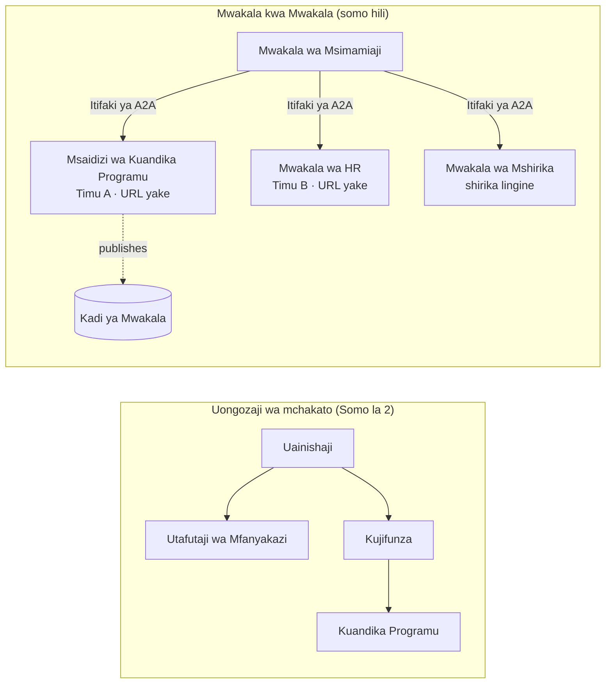

# Somo la 7: Uendeshaji wa Wakala Wengi & Wakala kwa Wakala (A2A)

Kupitia [Somo la 6](../lesson-6-toolbox/README.md) unaweza kujenga zana zilizo chini ya usimamizi na mawakala waliowekwa.
Lakini mifumo halisi mara chache hutumia wakala **mmoja** tu. Unapoongeza ukubwa, unachanganya mawakala **wengi** — baadhi ni zako,
baadhi zinamilikiwa na timu nyingine, baadhi zinaendeshwa katika mashirika mengine kabisa. Somo hili ni kuhusu
jinsi mawakala wanavyofanya kazi **pamoja**.

Tayari umekutana na aina moja ya usanifu wa wakala wengi katika
[Somo la 2 `agent-orchestration.py`](../lesson-2-agent-development/README.md): mfano wa **handoff**
ambapo wakala wa awali hupeleka kwa wataalamu **ndani ya mchakato mmoja**. Somo hili linaenda
kiwango kimoja juu — kwa **Wakala kwa Wakala (A2A)**, itifaki wazi kwa mawakala wanaoendesha kama
**huduma zinazoshirikiana mtandaoni** na kuitana wao kwa wao kuvuka mipaka ya mchakato, timu, na shirika.

## Malengo ya Kujifunza

Mwishoni mwa somo hili utaweza:

- Eleza tofauti kati ya **uendeshaji ndani ya mchakato** (handoff/mipangilio ya kazi) na
  mawasiliano ya **Wakala kwa Wakala (A2A)**, na uchague inayofaa.
- Eleza sehemu za msingi za A2A: **Kadi ya Wakala**, **ujuzi**, **kazi**, na **ugunduzi**.
- **Onyesha** wakala wa Microsoft Agent Framework kama huduma ya A2A kwa `A2AExecutor`.
- **Tumia** wakala wa mbali kama mshirika wa mtandao kwa `A2AAgent`.
- Tumia masuala ya biashara kwa A2A: **usalama, utambulisho, utawala, uwezo wa kufuatilia, na gharama**.

---

## Mahitaji ya Awali

1. Kumaliza [Somo la 2](../lesson-2-agent-development/README.md) (maendeleo ya wakala & uendeshaji).
2. Mradi wa **Microsoft Foundry** una uwekaji wa mfano wa sasa (kwa mfano `gpt-5.1`, na
   `gpt-5-codex` kwa mfano wa uandishi wa msimbo). Epuka GPT-4o / GPT-4.1 zilizostaafu.
3. **Azure CLI** imethibitishwa: `az login`.
4. **Python 3.12+** na utegemezi wa kozi umewekwa (`pip install -r ../requirements.txt`).
   Somo la 7 linaongeza vifurushi vya onyesho `agent-framework-a2a`, `a2a-sdk`, na `uvicorn`.
5. `FOUNDRY_PROJECT_ENDPOINT` na `FOUNDRY_MODEL` vinatakiwa kuwekwa katika `.env` yako (tazama README ya kozi).

---

## 1. Njia Mbili za Mawakala Kufanya Kazi Pamoja

Hakuna mfano mmoja wa "wakala wengi". Chagua ule unaolingana na **mipaka** yako:

| Mfano | Wapi mawakala hutoa huduma | Wanavyounganishwa | Tumia wakati |
|---------|------------------|------------------|----------|
| **Handoff / Mipangilio ya Kazi** (Somo 2) | Mchakato mmoja, misimbo moja | Mchoro wa kumbukumbu (`HandoffBuilder`, `WorkflowBuilder`) | Unamiliki mawakala yote na kuyaandaa pamoja. |
| **Wakala kwa Wakala (A2A)** (somo hili) | Huduma tofauti, maisha tofauti | Itifaki wazi ya **A2A** juu ya HTTP, hugunduliwa kupitia **Kadi za Wakala** | Mawakala zinamilikiwa na timu/shirika tofauti, zinaongezeka kwa uhuru, au zimeandikwa katika mfumo tofauti. |

Handoff ni kuhusu **kuelekeza ndani ya programu**. A2A ni kuhusu **kuunda mawakala kama
huduma huru** — sawa na kuhamia kutoka kwa simu za kazi kwenda kwa huduma ndogo ndogo.



> **Wanachanganya.** Muendeshaji unaoujenga kwa `HandoffBuilder` anaweza kuwa na **mawakala wa A2A wa mbali**
> kama washiriki — kuelekeza ndani ya mchakato kwa huduma ambazo zinapatikana popote pale.

---

## 2. Sehemu za Msingi za A2A

A2A ni **itifaki wazi** (si ya Microsoft pekee), hivyo wakala wa A2A anaweza kutumiwa na Microsoft
Agent Framework, LangGraph, msimbo maalum, au nguzo ya kampuni nyingine. Mambo manne ni muhimu:

- **Kadi ya Wakala** — hati ndogo ya JSON, inayochapishwa katika
  `/.well-known/agent-card.json`, inayotangaza **jina, maelezo, URL, toleo,
  ujuzi, na uwezo wa wakala**. Hii ni jinsi mteja anavyo **gundua** kile wakala wa mbali anaweza kufanya.
- **Ujuzi** — mambo yaliyotangazwa kwamba wakala anaweza kuyafanya (`id`, `jina`, `maelezo`, `lebo`,
  `mifano`). Wateja (na mifano) hutumia hii kuamua iwapo waite.
- **Kazi** — simu kwa wakala wa A2A ni **kazi** yenye mzunguko wa maisha (iliyoingizwa → inaendeshwa →
  imemalizika/imusimamishwa). Seva hufuata kazi katika **hifadhi ya kazi**; masasisho ya moja kwa moja yanasaidiwa.
- **Ugunduzi** — mteja anayepewa URL tu hupakua Kadi ya Wakala na anajua jinsi ya kumuita wakala.

---

## 3. Onyesha wakala kama huduma ya A2A — `a2a_server.py`

Sehemu ya **Jenga/huuaji** huwaunganisha wakala yeyote wa Microsoft Agent Framework na `A2AExecutor` na kuuweka
kwenye programu ya A2A HTTP. Angalia [`a2a_server.py`](../../../lesson-7-multi-agent-a2a/a2a_server.py). Uunganisho muhimu:

```python
from agent_framework.a2a import A2AExecutor
from a2a.server.apps import A2AStarletteApplication
from a2a.server.request_handlers import DefaultRequestHandler
from a2a.server.tasks import InMemoryTaskStore
from a2a.types import AgentCapabilities, AgentCard, AgentSkill

agent = client.as_agent(name="coding-assistant", instructions="...")

agent_card = AgentCard(
    name="Coding Assistant",
    description="Generates runnable code samples...",
    url="http://localhost:9000/",
    version="1.0.0",
    capabilities=AgentCapabilities(streaming=True),
    default_input_modes=["text"],
    default_output_modes=["text"],
    skills=[AgentSkill(id="generate-code", name="Generate code",
                       description="Write a runnable code snippet.", tags=["code"])],
)

request_handler = DefaultRequestHandler(
    agent_executor=A2AExecutor(agent),
    task_store=InMemoryTaskStore(),
)
app = A2AStarletteApplication(agent_card=agent_card, http_handler=request_handler).build()
# imetolewa na uvicorn kwenye lango la 9000
```

Angalia msimbo wa wakala haubadiliki — `A2AExecutor` hubadilisha wakala uliopo kwa itifaki hii.
Kadi ya Wakala ndiyo inayofanya iwe rahisi kugunduliwa kwa mteja yeyote wa A2A.

---

## 4. Tumia wakala wa mbali — `a2a_client.py`

Sehemu ya **Tumia** inaunganisha na wakala wa mbali kwa **URL**, hupakua Kadi yake ya Wakala, na kuuita
kama wakala wa ndani halisi. Angalia [`a2a_client.py`](../../../lesson-7-multi-agent-a2a/a2a_client.py):

```python
from agent_framework.a2a import A2AAgent

remote_agent = A2AAgent(name="remote-coding-assistant", url="http://localhost:9000")
result = await remote_agent.run("Write a Python function that reverses a string.")
print(result.text)
```

Hilo ndilo lengo la A2A: upande wa mpelezi wakala wa mbali hufanya kazi kama wakala mwingine yeyote wa
`agent_framework`, hivyo unaweza kuutumia katika mchakato wa kazi au kuutumia — ingawa unaendeshwa
katika mchakato tofauti, kwenye mashine tofauti, inayomilikiwa na timu tofauti.

### Uendeshaji wake kutoka mwanzo hadi mwisho

```bash
# Terminali 1 — anza huduma ya A2A
python a2a_server.py

# Terminali 2 — liite
python a2a_client.py "Write a Python function that reverses a string."
```

Utaona jibu la mshauri wa uandishi wa msimbo likifika kupitia itifaki ya A2A. Fungua
`http://localhost:9000/.well-known/agent-card.json` kwenye kivinjari kuona Kadi ya Wakala iliyochapishwa.

---

## 5. Masuala ya Biashara

Kubadilisha mawakala kuwa huduma zinazoshirikiana mtandaoni kunaingiza masuala yanayofanana na mfumo wowote uliosambazwa —
pamoja na baadhi maalum za AI:


- **Utambulisho & uthibitisho.** Kamwe usifunue wakala wa A2A asiyehifadhiwa. Kadi ya Wakala ina
  `usalama` / `mifumo_ya_usalama`, na `A2AAgent` inakubali `auth_interceptor` ili waitumaji waite
  vyeti (tokeni za kubeba za OAuth, funguo za API). Tumia Entra ID / vitambulisho vinavyosimamiwa kwa
  uthibitishaji wa huduma kwa huduma katika uzalishaji; weka huduma nyuma ya lango.
- **Utawala.** Changanya A2A na [Sanduku la Zana la Somo la 6](../lesson-6-toolbox/README.md): wakala wa mbali
  unaweza kuchapishwa kama **zana ya A2A** ndani ya sanduku la zana linaloendeshwa hivyo RBAC, usimbaji wa vyeti,
  na sera za miwongo za ulinzi zinaendelea kutekelezwa kati.
- **Uangalizi.** Omba sasa linavuka mipaka ya mchakato, hivyo peana ufuatiliaji kwenye wito.
  Washa [Uangalizi wa Foundry / OpenTelemetry](../lesson-3-agent-evals/README.md) katika **pande zote mbili** za
  mpangaji na kila wakala wa mbali ili upate ufuatiliaji mmoja wa mwisho hadi mwisho.
- **Toleo.** Kadi ya Wakala ina `toleo`. Iitike kama API: mabadiliko ya kuongeza ni salama;
  kuvunja mkataba wa ujuzi huhitaji toleo jipya na dirisha la uhamaji kwa watumiaji.
- **Uaminifu.** Wakala wa mbali hushindwa kwa uhuru. Weka muda wa kumalizika (`A2AAgent(timeout=...)`), shughulikia
  kushindwa kwa sehemu, na usiruhusu mshirika mmoja polepole kuziba mpangilio mzima.
- **Gharama.** Kila wito wa wakala wa mbali ni mwito wake wa mfano mwenyewe. Kuenea huongeza matumizi ya tokeni —
  panga bajeti yake, na pendelea kupitisha kwa wakala **mmoja** bora badala ya kueneza kwa wengi.

---

## Mazoezi ya vitendo

1. **Ongeza huduma ya pili.** Nakili `a2a_server.py` kufunua wakala wa **kutafuta-mfanyakazi** kwenye bandari
   9001 na Kadi yake ya Wakala na ujuzi wake. Endesha zote mbili, na mteja aite kila moja.
2. **Panga washiriki wa mbali.** Jenga `HandoffBuilder` ndogo (au ratiba rahisi) ambayo washiriki wake
   ni `A2AAgent` wawili wanaoelekeza kwa huduma zako mbili. Pitisha swali kwa ile sahihi.
3. **Linda hiyo.** Ongeza `auth_interceptor` kwa mteja na hitaji tokeni ya kubeba kwenye seva.
   Nini kinavunjika ikiwa tokeni haipo? Utaweka tokeni wapi katika uzalishaji?
4. **Handoff vs A2A.** Andika aya mbili fupi: lini utaendeleza handoff ya Somo la 2 ndani ya mchakato,
   na lini ugumu wa ziada wa A2A unabainika? Toa mfano halisi wa kila mmoja.

---

## Rasilimali

- [Agent-to-Agent (A2A) — Mfumo wa Wakala wa Microsoft](https://learn.microsoft.com/agent-framework/user-guide/agent-orchestration/a2a)
- [Mpangilio wa wakala wengi — Mfumo wa Wakala wa Microsoft](https://learn.microsoft.com/agent-framework/user-guide/agent-orchestration/)
- [Maelezo ya itifaki ya A2A](https://a2a-protocol.org/)
- [A2A Python SDK (`a2a-sdk`)](https://github.com/a2aproject/a2a-python)
- [Huduma ya Wakala ya Foundry — mifumo ya wakala wengi](https://learn.microsoft.com/azure/ai-foundry/agents/concepts/connected-agents)

---

**Iliyotangulia:** [Somo la 6 — Sanduku la Zana la Microsoft](../lesson-6-toolbox/README.md)

---

<!-- CO-OP TRANSLATOR DISCLAIMER START -->
**Kionyozo**:
Hati hii imetafsiriwa kwa kutumia huduma ya tafsiri ya AI [Co-op Translator](https://github.com/Azure/co-op-translator). Ingawa tunajitahidi kupata usahihi, tafadhali fahamu kwamba tafsiri za kiotomatiki zinaweza kuwa na makosa au upungufu wa usahihi. Hati ya asili katika lugha yake halisi inapaswa kuchukuliwa kama chanzo cha mamlaka. Kwa taarifa muhimu, tafsiri ya kitaalamu inayofanywa na binadamu inapendekezwa. Hatutojibu kwa kuelewa vibaya au tafsiri potofu zinazotokea kutokana na matumizi ya tafsiri hii.
<!-- CO-OP TRANSLATOR DISCLAIMER END -->