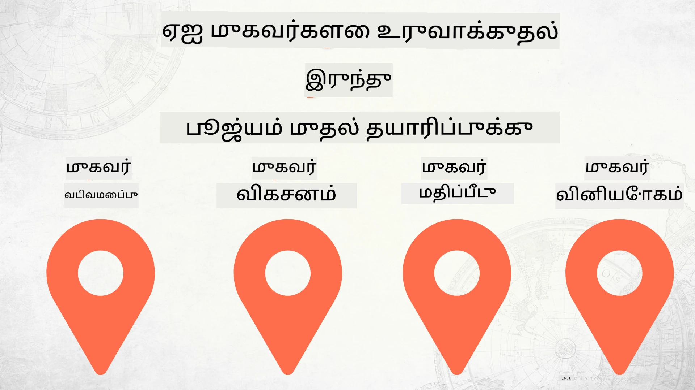

# பூஜ்யத்திலிருந்து உற்பத்திக்கு AI முகவர்கள் கட்டமைப்பு



### 🌐 பன்மொழி ஆதரவு

#### GitHub நடவடிக்கையால் ஆதரிக்கப்படுகிறது (செயற்கைத்தன்மையுடன் & எப்போதும் புதுப்பிக்கப்படும்)

<!-- CO-OP TRANSLATOR LANGUAGES TABLE START -->
[Arabic](../ar/README.md) | [Bengali](../bn/README.md) | [Bulgarian](../bg/README.md) | [Burmese (Myanmar)](../my/README.md) | [Chinese (Simplified)](../zh-CN/README.md) | [Chinese (Traditional, Hong Kong)](../zh-HK/README.md) | [Chinese (Traditional, Macau)](../zh-MO/README.md) | [Chinese (Traditional, Taiwan)](../zh-TW/README.md) | [Croatian](../hr/README.md) | [Czech](../cs/README.md) | [Danish](../da/README.md) | [Dutch](../nl/README.md) | [Estonian](../et/README.md) | [Finnish](../fi/README.md) | [French](../fr/README.md) | [German](../de/README.md) | [Greek](../el/README.md) | [Hebrew](../he/README.md) | [Hindi](../hi/README.md) | [Hungarian](../hu/README.md) | [Indonesian](../id/README.md) | [Italian](../it/README.md) | [Japanese](../ja/README.md) | [Kannada](../kn/README.md) | [Khmer](../km/README.md) | [Korean](../ko/README.md) | [Lithuanian](../lt/README.md) | [Malay](../ms/README.md) | [Malayalam](../ml/README.md) | [Marathi](../mr/README.md) | [Nepali](../ne/README.md) | [Nigerian Pidgin](../pcm/README.md) | [Norwegian](../no/README.md) | [Persian (Farsi)](../fa/README.md) | [Polish](../pl/README.md) | [Portuguese (Brazil)](../pt-BR/README.md) | [Portuguese (Portugal)](../pt-PT/README.md) | [Punjabi (Gurmukhi)](../pa/README.md) | [Romanian](../ro/README.md) | [Russian](../ru/README.md) | [Serbian (Cyrillic)](../sr/README.md) | [Slovak](../sk/README.md) | [Slovenian](../sl/README.md) | [Spanish](../es/README.md) | [Swahili](../sw/README.md) | [Swedish](../sv/README.md) | [Tagalog (Filipino)](../tl/README.md) | [Tamil](./README.md) | [Telugu](../te/README.md) | [Thai](../th/README.md) | [Turkish](../tr/README.md) | [Ukrainian](../uk/README.md) | [Urdu](../ur/README.md) | [Vietnamese](../vi/README.md)

> **உள்ளூரிலே கிளோன் செய்ய விரும்புகிறீர்களா?**
>
> இந்த ரெபோசிட்டரி 50+ மொழி തПерுவ યોજപ്പொருள்களை உள்ளடக்கியுள்ளது, இது பதிவிறக்கும் அளவை மிகவும் அதிகரிக்கிறது. மொழிபெயர்ப்புகள் இல்லாமல் கிளோன் செய்ய sparse checkout ஐ பயன்படுத்தவும்:
>
> **Bash / macOS / Linux:**
> ```bash
> git clone --filter=blob:none --sparse https://github.com/microsoft/Building-AI-Agents-From-Zero-To-Production.git
> cd Building-AI-Agents-From-Zero-To-Production
> git sparse-checkout set --no-cone '/*' '!translations' '!translated_images'
> ```
>
> **CMD (Windows):**
> ```cmd
> git clone --filter=blob:none --sparse https://github.com/microsoft/Building-AI-Agents-From-Zero-To-Production.git
> cd Building-AI-Agents-From-Zero-To-Production
> git sparse-checkout set --no-cone "/*" "!translations" "!translated_images"
> ```
>
> இது மிக வேகமான பதிவிறக்கும் செயலியுடன் பாடநெறியை முடிக்க தேவையான அனைத்தையும் தருகிறது.
<!-- CO-OP TRANSLATOR LANGUAGES TABLE END -->

## AI முகவர் அபிவிருத்தி வாழ்வுருவமைப்பின் அடிப்படைகளை கற்பிக்கும் பாடநெறி

[](https://github.com/microsoft/Building-AI-Agents-From-Zero-To-Production/blob/master/LICENSE?WT.mc_id=academic-105485-koreyst)
[](https://GitHub.com/microsoft/Building-AI-Agents-From-Zero-To-Production/graphs/contributors/?WT.mc_id=academic-105485-koreyst)
[](https://GitHub.com/microsoft/Building-AI-Agents-From-Zero-To-Production/issues/?WT.mc_id=academic-105485-koreyst)
[](https://GitHub.com/microsoft/Building-AI-Agents-From-Zero-To-Production/pulls/?WT.mc_id=academic-105485-koreyst)
[](http://makeapullrequest.com?WT.mc_id=academic-105485-koreyst)

[](https://discord.gg/Kuaw3ktsu6)

## 🌱 ஆரம்பித்தல்

இந்த பாடநெறி AI முகவர்களை கட்டமைத்து பராமரிப்பதற்கான அடிப்படைகளைப் பற்றிய பாடங்கள் கொண்டுள்ளது.

ஒவ்வொரு பாடமும் முந்தையதைத் தொடர்ந்து கட்டமைக்கப்பட்டுள்ளன, எனவே நாங்கள் தொடக்கம் இருந்து துவக்கம் செய்து கடைசிவரை தொடர பரிந்துரைக்கிறோம்.

AI முகவர் தொடர்பான கூடுதல் விஷயங்களை ஆராய விரும்பினால், [AI முகவர்கள் ஆரம்பநிலை பாடநெறி](https://aka.ms/ai-agents-beginners)யை பார்க்கலாம்.

### பிற கற்றுணர்வாளர்களை சந்தித்து, உங்கள் கேள்விகளுக்கு பதில் பெறுங்கள்

AI முகவர்கள் கட்டமைப்பில் ஏதேனும் சிக்கலோ கேள்வியோ இருந்தால், [Microsoft Foundry Discord](https://discord.gg/Kuaw3ktsu6)இல் உள்ள நமது நிச்சயமான Discord சேனலில் இணையுங்கள்.

### உங்கள் தேவைகள்

ஒவ்வொரு பாடத்திலும் உங்களுக்கு அங்கு உள்ள குறியீட்டு உதாரணத்தை உள்ளூரில் இயக்கலாம். நீங்கள் [இந்த ரெபோவை ஃபோர்க் செய்யலாம்](https://github.com/microsoft/Building-AI-Agents-From-Zero-To-Production/fork) உங்கள் சொந்த நகலை உருவாக்க.

இதுவரை இந்த பாடநெறி பின்வரும் சேவைகளைப் பயன்படுத்துகிறது:

- [Microsoft Agent Framework (MAF)](https://aka.ms/ai-agents-beginners/agent-framework)
- [Microsoft Foundry](https://azure.microsoft.com/products/ai-foundry)
- [Azure OpenAI Service](https://azure.microsoft.com/products/ai-foundry/models/openai)
- [Azure CLI](https://learn.microsoft.com/cli/azure/authenticate-azure-cli?view=azure-cli-latest)

தொடங்குவதற்கு முன் இந்த சேவைகளுக்கு அணுகல் இருப்பதை உறுதிசெய்க.

மாதிரிகள் ஹோஸ்டிங் மற்றும் சேவைகள் பற்றிய கூடுதல் விருப்பங்கள் விரைவில் வர உள்ளன.

## 🗃️ பாடங்கள்

| **பாடம்**                | **விளக்கம்**                                                                                     |
|-------------------------|-------------------------------------------------------------------------------------------------|
| [Agent Design](./lesson-1-agent-design/README.md)       | நமது "Developer Onboarding" முகவரின் பயனர் வழக்கை அறிமுகப்படுத்துவது மற்றும் விளைவை உருவாக்குவது  |
| [Agent Development](./lesson-2-agent-development/README.md)  | Microsoft Agent Framework (MAF) பயன்படுத்தி, புதிய அபிவிருத்திகளுக்கு உதவும் 3 முகவர்களை உருவாக்குதல்.   |
| [Agent Evaluations](./lesson-3-agent-evals/README.md)  | Microsoft Foundry көмையில் எங்கள் AI முகவர்கள் எவ்வாறு செயல்படுகின்றன மற்றும் அவற்றை எவ்வாறு மேம்படுத்தலாம் என்பதை கண்டறிதல். |
| [Agent Deployment](./lesson-4-agent-deployment/README.md)   | Hosted Agents மற்றும் OpenAI Chatkit பயன்படுத்தி AI முகவர்களை உற்பத்தியில் விடுதல்.                         |


## 🎒 பிற பாடநெறிகள்

எங்கள் குழு வேறு பாடநெறிகளையும் உருவாக்குகிறது! பார்க்கவும்:

<!-- CO-OP TRANSLATOR OTHER COURSES START -->
### LangChain
[](https://aka.ms/langchain4j-for-beginners)
[](https://aka.ms/langchainjs-for-beginners?WT.mc_id=m365-94501-dwahlin)
[](https://github.com/microsoft/langchain-for-beginners?WT.mc_id=m365-94501-dwahlin)
---

### Azure / Edge / MCP / முகவர்கள்
[](https://github.com/microsoft/AZD-for-beginners?WT.mc_id=academic-105485-koreyst)
[](https://github.com/microsoft/edgeai-for-beginners?WT.mc_id=academic-105485-koreyst)
[](https://github.com/microsoft/mcp-for-beginners?WT.mc_id=academic-105485-koreyst)
[](https://github.com/microsoft/ai-agents-for-beginners?WT.mc_id=academic-105485-koreyst)

---
 
### Generative AI தொடர்
[](https://github.com/microsoft/generative-ai-for-beginners?WT.mc_id=academic-105485-koreyst)
[-9333EA?style=for-the-badge&labelColor=E5E7EB&color=9333EA)](https://github.com/microsoft/Generative-AI-for-beginners-dotnet?WT.mc_id=academic-105485-koreyst)
[-C084FC?style=for-the-badge&labelColor=E5E7EB&color=C084FC)](https://github.com/microsoft/generative-ai-for-beginners-java?WT.mc_id=academic-105485-koreyst)
[-E879F9?style=for-the-badge&labelColor=E5E7EB&color=E879F9)](https://github.com/microsoft/generative-ai-with-javascript?WT.mc_id=academic-105485-koreyst)

---
 
### கரு கற்றல்
[](https://aka.ms/ml-beginners?WT.mc_id=academic-105485-koreyst)
[](https://aka.ms/datascience-beginners?WT.mc_id=academic-105485-koreyst)
[](https://aka.ms/ai-beginners?WT.mc_id=academic-105485-koreyst)
[](https://github.com/microsoft/Security-101?WT.mc_id=academic-96948-sayoung)
[](https://aka.ms/webdev-beginners?WT.mc_id=academic-105485-koreyst)
[](https://aka.ms/iot-beginners?WT.mc_id=academic-105485-koreyst)
[](https://github.com/microsoft/xr-development-for-beginners?WT.mc_id=academic-105485-koreyst)

---
 
### கோபைலட் தொடர்கதை
[](https://aka.ms/GitHubCopilotAI?WT.mc_id=academic-105485-koreyst)
[](https://github.com/microsoft/mastering-github-copilot-for-dotnet-csharp-developers?WT.mc_id=academic-105485-koreyst)
[](https://github.com/microsoft/CopilotAdventures?WT.mc_id=academic-105485-koreyst)
<!-- CO-OP TRANSLATOR OTHER COURSES END -->

## பங்களிப்பு

இந்த திட்டம் பங்களிப்புகளையும் பரிந்துரைகளையும் வரவேற்கிறது. பெரும்பாலான பங்களிப்புகளில், நீங்கள் பங்களிப்பு உரிமையை நாங்கள் பயன்படுத்த விதிமுறைகளை (CLA) ஏற்க வேண்டும், அதாவது நீங்கள் பங்களிப்பை வழங்குவதற்கு உரிமை பெற்றுள்ளீர்கள் என்பதை ஒரு ஒப்பந்தத்தில் தெரிவிக்க வேண்டும். விவரங்களுக்கு, <https://cla.opensource.microsoft.com> ஐப் பார்வையிடவும்.

நீங்கள் ஒரு புல் கோரிக்கையை சமர்ப்பிக்கும் போது, CLA பாட்டு தானாகவே நீங்கள் CLA வழங்க வேண்டுமா என்பதை சரிபார்த்து, PR ஐ (உதாரணமாக, நிலை சரிபார்ப்பு, கருத்து) பொருத்தமாக அலங்கரிக்கும். பாட்டின் அறிவுறுத்தல்களைப் பின்பற்றவும். இந்த செயல்முறை அனைத்து ரெப்போக்களிலும் ஒருமுறை மட்டுமே தேவையானது.

இந்த திட்டம் [Microsoft Open Source Code of Conduct](https://opensource.microsoft.com/codeofconduct/) ஐ ஏற்றுக் கொண்டுள்ளது.
மேலதிக தகவலுக்கு [Code of Conduct FAQ](https://opensource.microsoft.com/codeofconduct/faq/) ஐப் பார்வையிடவும் அல்லது [opencode@microsoft.com](mailto:opencode@microsoft.com) என்ற முகவரியிலிருந்து தொடர்பு கொள்ளவும்.

## வர்த்தக அடையாளங்கள்

இந்த திட்டத்தில் திட்டங்கள், தயாரிப்புகள் அல்லது சேவைகளுக்கான வர்த்தக அடையாளங்கள் அல்லது லோகோக்கள் இருக்கலாம். Microsoft வர்த்தக அடையாளங்கள் மற்றும் லோகோக்களை பயன்படுத்தும் அதிகாரம், [Microsoft's Trademark & Brand Guidelines](https://www.microsoft.com/legal/intellectualproperty/trademarks/usage/general) ஐப் பின்பற்ற வேண்டும்.
இந்த திட்டத்தின் மாற்றப்பட்ட பதிப்புகளில் Microsoft வர்த்தக அடையாளங்கள் அல்லது லோகோக்களை பயன்படுத்துவது குழப்பத்தை ஏற்படுத்தக் கூடாது அல்லது Microsoft ஆதரவினை குறிக்கக் கூடாது.
மூன்றாம் தரப்பின் வர்த்தக அடையாளங்கள் அல்லது லோகோக்களை பயன்படுத்துவது அந்த மூன்றாம் தரப்பின் கொள்கைகளுக்கு உட்பட்டது.

## உதவி பெறுதல்

நீங்கள் சிக்கிக்கொண்டால் அல்லது AI செயலிகள் உருவாக்குவதில் ஏதேனும் கேள்விகள் இருந்தால், இணைக:

[](https://discord.gg/Kuaw3ktsu6)

தயாரிப்புக்கு கருத்துகள் அல்லது பிழைகள் இருந்தால் பார்வையிடவும்:

[](https://aka.ms/foundry/forum)

---

<!-- CO-OP TRANSLATOR DISCLAIMER START -->
**தவிர்க்கப்பட்டது**:  
இந்த ஆவணம் எய்டி மொழிபெயர்ப்பு சேவை [Co-op Translator](https://github.com/Azure/co-op-translator) பயன்படுத்தி மொழிபெயர்க்கப்பட்டுள்ளது. நாங்கள் துல்லியத்திற்காக முயலுகிறோமேனும், தானாக செய்யப்பட்ட மொழிபெயர்ப்புகளில் பிழைகள் அல்லது தவறுகள் இருக்கலாம் என்பதனை கவனத்தில் கொள்ளவும். வழக்கமான ஆவணத்தின் பிராமாணிக மொழியில் உள்ள முதன்மையான ஆவணம் தான் நம்பகத்தக்கது. முக்கியமான தகவல்களுக்கு, தொழில்முறை மனித மொழிபெயர்ப்பை பரிந்துரைக்கின்றோம். இந்த மொழிபெயர்ப்பின் பயன்பாட்டினால் ஏற்பட்ட எந்த தவறான புரிதலுக்கோ அல்லது தவறான விளக்கத்திற்கோ நாங்கள் பொறுப்பாக இருக்கமாட்டோம்.
<!-- CO-OP TRANSLATOR DISCLAIMER END -->