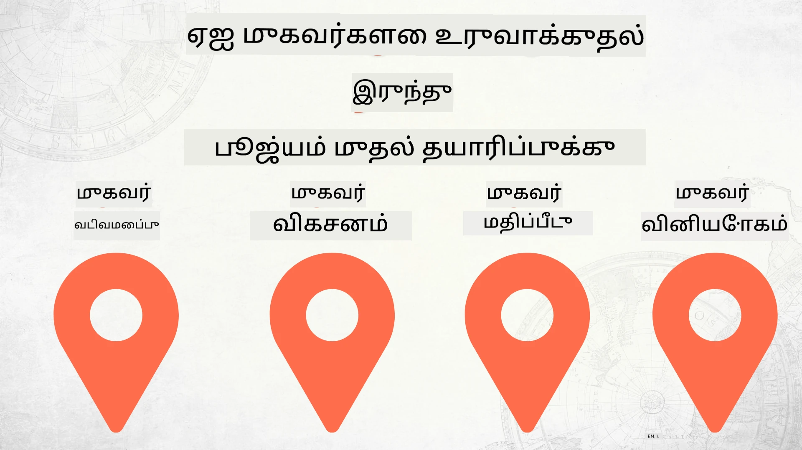

# பூஜ்யத்திலிருந்து உற்பத்திக்கு AI முகவர்களை கட்டமைத்தல்



### 🌐 பல மொழி ஆதரவு

#### GitHub செயல் மூலம் ஆதரிக்கப்படுகிறது (தானாகவும் எப்போதும் புதுப்பித்தலும்)

<!-- CO-OP TRANSLATOR LANGUAGES TABLE START -->
[Arabic](../ar/README.md) | [Bengali](../bn/README.md) | [Bulgarian](../bg/README.md) | [Burmese (Myanmar)](../my/README.md) | [Chinese (Simplified)](../zh-CN/README.md) | [Chinese (Traditional, Hong Kong)](../zh-HK/README.md) | [Chinese (Traditional, Macau)](../zh-MO/README.md) | [Chinese (Traditional, Taiwan)](../zh-TW/README.md) | [Croatian](../hr/README.md) | [Czech](../cs/README.md) | [Danish](../da/README.md) | [Dutch](../nl/README.md) | [Estonian](../et/README.md) | [Finnish](../fi/README.md) | [French](../fr/README.md) | [German](../de/README.md) | [Greek](../el/README.md) | [Hebrew](../he/README.md) | [Hindi](../hi/README.md) | [Hungarian](../hu/README.md) | [Indonesian](../id/README.md) | [Italian](../it/README.md) | [Japanese](../ja/README.md) | [Kannada](../kn/README.md) | [Khmer](../km/README.md) | [Korean](../ko/README.md) | [Lithuanian](../lt/README.md) | [Malay](../ms/README.md) | [Malayalam](../ml/README.md) | [Marathi](../mr/README.md) | [Nepali](../ne/README.md) | [Nigerian Pidgin](../pcm/README.md) | [Norwegian](../no/README.md) | [Persian (Farsi)](../fa/README.md) | [Polish](../pl/README.md) | [Portuguese (Brazil)](../pt-BR/README.md) | [Portuguese (Portugal)](../pt-PT/README.md) | [Punjabi (Gurmukhi)](../pa/README.md) | [Romanian](../ro/README.md) | [Russian](../ru/README.md) | [Serbian (Cyrillic)](../sr/README.md) | [Slovak](../sk/README.md) | [Slovenian](../sl/README.md) | [Spanish](../es/README.md) | [Swahili](../sw/README.md) | [Swedish](../sv/README.md) | [Tagalog (Filipino)](../tl/README.md) | [Tamil](./README.md) | [Telugu](../te/README.md) | [Thai](../th/README.md) | [Turkish](../tr/README.md) | [Ukrainian](../uk/README.md) | [Urdu](../ur/README.md) | [Vietnamese](../vi/README.md)

> **உள்ளூர் கிளோன் செய்ய விரும்புகிறீர்களா?**
>
> இந்த தொகுப்பில் 50+ மொழி மொழிபெயர்ப்புகள் உள்ளன, இது பதிவிறக்கும் அளவை பெரிதாக அதிகரிக்கிறது. மொழிபெயர்ப்புகள் இல்லாமல் கிளோன் செய்ய sparse checkout ஐப் பயன்படுத்தவும்:
>
> **Bash / macOS / Linux:**
> ```bash
> git clone --filter=blob:none --sparse https://github.com/microsoft/Building-AI-Agents-From-Zero-To-Production.git
> cd Building-AI-Agents-From-Zero-To-Production
> git sparse-checkout set --no-cone '/*' '!translations' '!translated_images'
> ```
>
> **CMD (Windows):**
> ```cmd
> git clone --filter=blob:none --sparse https://github.com/microsoft/Building-AI-Agents-From-Zero-To-Production.git
> cd Building-AI-Agents-From-Zero-To-Production
> git sparse-checkout set --no-cone "/*" "!translations" "!translated_images"
> ```
>
> இது இந்த பாடம் முழுவதும் முடிக்க தேவையான அனைத்தையும் அதிக வேகமான பதிவிறக்கத்துடன் தருகிறது.
<!-- CO-OP TRANSLATOR LANGUAGES TABLE END -->

## AI முகவர் மேம்பாட்டு வாழ்க்கைச்சுழற்சியின் அடிப்படைகளை கற்பிக்கும் ஒரு பாடம்

[](https://github.com/microsoft/Building-AI-Agents-From-Zero-To-Production/blob/master/LICENSE?WT.mc_id=academic-105485-koreyst)
[](https://GitHub.com/microsoft/Building-AI-Agents-From-Zero-To-Production/graphs/contributors/?WT.mc_id=academic-105485-koreyst)
[](https://GitHub.com/microsoft/Building-AI-Agents-From-Zero-To-Production/issues/?WT.mc_id=academic-105485-koreyst)
[](https://GitHub.com/microsoft/Building-AI-Agents-From-Zero-To-Production/pulls/?WT.mc_id=academic-105485-koreyst)
[](http://makeapullrequest.com?WT.mc_id=academic-105485-koreyst)

[](https://discord.gg/Kuaw3ktsu6)

## 🌱 தொடங்குதல்

இந்த பாடம் AI முகவர்களை கட்டமைக்கும் மற்றும் பிரசுரிப்பதன் அடிப்படைகளை உள்ளடக்கிய பாடங்களைக் கொண்டுள்ளது.

ஒவ்வொரு பாடமும் முந்தையவற்றின் அடிப்படையில் கட்டுப்படுத்தப்படுகிறது, எனவே ஆரம்பம் முதல் தொடங்கி முடிவிற்கு வருவது நாங்கள் பரிந்துரைக்கிறோம்.

AI முகவர் தொடர்பான விஷயங்களை மேலும் ஆராய விரும்பினால், [AI Agents For Beginners Course](https://aka.ms/ai-agents-beginners) ஐ பார்க்கலாம்.

### பிற கற்றல் பயனர்கள் சந்தித்து கேள்விகளுக்கு பதில் பெறுங்கள்

AI முகவர்களை கட்டமைப்பதில் சிக்கல் அல்லது கேள்விகள் இருந்தால், [Microsoft Foundry Discord](https://discord.gg/Kuaw3ktsu6) இல் உள்ள எங்கள் நியமிக்கப்படுத்தப்பட்ட Discord சேனலைச் சேர்ந்துகொள்ளவும்.

### உங்கள் தேவைகள்

ஒவ்வொரு பாடத்துக்கும் உள்ளூர் இயக்கக்கூடிய சொந்தகுறியீடு எடுத்துக்காட்டு உள்ளது. [இந்த தொகுப்பை Fork செய்ய](https://github.com/microsoft/Building-AI-Agents-From-Zero-To-Production/fork) உங்கள் சொந்த நகலை உருவாக்கலாம்.

இந்த பாடம் தற்போது பின்வரும்வற்றைப் பயன்படுத்துகிறது:

- [Microsoft Agent Framework (MAF)](https://aka.ms/ai-agents-beginners/agent-framework)
- [Microsoft Foundry](https://azure.microsoft.com/products/ai-foundry) — ஒன்று பிரசுரிக்கப்பட்ட **GPT-5 தொடர்** மாதிரியுடன் (எ.கா `gpt-5.1`). வழக்க கடந்த GPT-4o / GPT-4.1 மாதிரிகளை பயன்படுத்து கூடாது.
- [Azure OpenAI Service](https://azure.microsoft.com/products/ai-foundry/models/openai)
- [Azure CLI](https://learn.microsoft.com/cli/azure/authenticate-azure-cli?view=azure-cli-latest) — எந்தவொரு எடுத்துக்காட்டையும் இயக்கும் முன் `az login` மூலம் உள்நுழைக
- **Python 3.12 அல்லது அதற்கு மேல்**

தொடங்கும் முன் இந்த சேவைகளுக்கு அணுகல் உங்களிடம் இருக்கிறதா என உறுதி செய்யவும்.

> **💰 செலவு மற்றும் சுத்தம் செய்வது.** கைப்பயிற்சி பாடங்கள் உண்மையான Azure வளங்களை உருவாக்குகின்றன — Microsoft Foundry
> திட்டம், ஒரு மாதிரி பிரசுரிப்பு, ஒரு வெக்டர் கடை மற்றும் (பாடங்கள் 4–6 இல்) ஹோஸ்ட்டிற்க்கப்பட்ட முகவர்கள் மற்றும் கருவிப் பெட்டிகள்.
> இதன்மூலம் அவர்கள் இருப்பவரையில் செலவு ஏற்படலாம். ஒரு பாடம் அல்லது பாடநெறி முடிந்தவுடன்
> தேவையில்லாத வளங்களை நீக்கவும். எளிய முறையாக அனைத்தையும் ஒரு தனி வள குழுவில் வைக்கவும்
> முடிந்தபின் முழு குழுவையும் நீக்கவும்:
>
> ```bash
> az group delete --name <your-resource-group> --yes --no-wait
> ```
>
> தேவைப்படும் முகவர்கள், வெக்டர் கடைகள் மற்றும் கருவிப் பெட்டிகளையும் Foundry போர்டலிலிருந்து தனித்தனியாக நீக்கலாம்.

> **மாதிரிகள் குறித்த குறிப்பு.** இந்த பாடம் அனைத்து மாதிரிகளும் **Microsoft Foundry** மூலம் வழங்கப்படுகிறது. இது "*GitHub Models*" ஐப் பயன்படுத்தாது, இதன் சேவை **ஜூலை 30, 2026** அன்று நிறுத்தப்படவுள்ளது — Microsoft Foundry அதிகாரப்பூர்வ மைக்ரேஷன் பாதை ஆகும். பழைய குறியீடு GitHub Models ஐ அழைக்கிறதென்றால் அது Foundry மாதிரி பிரசுரிப்பை நோக்கி இருக்க வேண்டும்.


இன்னும் அதிக மாதிரி ஹோஸ்டிங் மற்றும் சேவை விருப்பங்கள் விரைவில் வந்தடையும்.

## 🗃️ பாடங்கள்

| **பாடம்**         | **விவரம்**                                                                                  |
|--------------------|--------------------------------------------------------------------------------------------------|
| [Agent Design](./lesson-1-agent-design/README.md)       | எங்கள் "Developer Onboarding" முகவர் பயன்பாட்டுக்கான அறிமுகம் மற்றும் செயல்திறனான முகவர்களை வடிவமைப்பது எப்படி என்பதை அறிமுகம் செய்கிறது  |
| [Agent Development](./lesson-2-agent-development/README.md)  | Microsoft Agent Framework (MAF) பயன்படுத்தி, புதிய டெவலப்பர்களுக்கான சிறப்பு முகவர்களின் தொகுப்பை கட்டமைக்கவும்.       |
| [Agent Evaluations](./lesson-3-agent-evals/README.md)  | Microsoft Foundry பயன்படுத்தி, எங்கள் AI முகவர்கள் எவ்வளவு நன்கு செயல்படுகிறார்கள் மற்றும் எப்படி மேம்படுத்துவது என்பதை தெரிந்து கொள்ளுங்கள். |
| [Agent Deployment](./lesson-4-agentdeployment/README.md)   | Microsoft Foundry ஹோஸ்ட்டிற்க்கப்பட்ட முகவர்களையும் OpenAI ChatKit ஐவிடவும் பயன்படுத்தி, AI முகவர்களை உற்பத்திக்கு வெளியிடுவது எப்படி என்பதைக் கற்றுக்கொள்ளுங்கள்.       |
| [Production Hosted Agents](./lesson-5-hosted-agents-production/README.md)   | ஒரு ஹோஸ்ட்டிற்க்கப்பட்ட முகவரை நிறுவன உற்பத்திக்கு கொண்டு செல்லுதல்: Hosted Agents vs Capability Hosts, உங்கள் சொந்த சேமிப்பு, நினைவகம் மற்றும் நிர்வாகம்.       |
| [Microsoft Toolbox](./lesson-6-toolbox/README.md)   | கருவிகளை ஒருமுறை வரையறுத்து மையமாக நிர்வகிக்க: ஒரு கருவிப் பெட்டியை கட்டமைக்கும், அதை ஒரே MCP இறுதியில் ஒன்றான முகவரால் பயன்படுத்தும், மற்றும் கருவிகளுக்கான பதிப்புகளை பாதுகாப்பாக உருவாக்குதல்.       |
| [Multi-Agent & A2A](./lesson-7-multi-agent-a2a/README.md)   | முகவர்களை வலைப்பின்னலாக அமைவு செய்தல்: திறந்த முகவர் தோழர் (A2A) நெறிமுறை மூலம் ஒரு முகவரைக் வெளிப்படுத்துதல் மற்றும் ஒரு தொலை முகவரைப் தோழராக பயன்படுத்துதல்.       |


## 🎒 மற்ற பாடங்கள்

எங்கள் குழு பிற பாடங்கள் தயாரிக்கிறது! கீழ்காண்க:

<!-- CO-OP TRANSLATOR OTHER COURSES START -->
### LangChain
[](https://aka.ms/langchain4j-for-beginners)
[](https://aka.ms/langchainjs-for-beginners?WT.mc_id=m365-94501-dwahlin)
[](https://github.com/microsoft/langchain-for-beginners?WT.mc_id=m365-94501-dwahlin)
---

### Azure / Edge / MCP / Agents
[](https://github.com/microsoft/AZD-for-beginners?WT.mc_id=academic-105485-koreyst)
[](https://github.com/microsoft/edgeai-for-beginners?WT.mc_id=academic-105485-koreyst)
[](https://github.com/microsoft/mcp-for-beginners?WT.mc_id=academic-105485-koreyst)
[](https://github.com/microsoft/ai-agents-for-beginners?WT.mc_id=academic-105485-koreyst)

---
 
### உருவாக்கும் AI தொடர்

[](https://github.com/microsoft/generative-ai-for-beginners?WT.mc_id=academic-105485-koreyst)
[-9333EA?style=for-the-badge&labelColor=E5E7EB&color=9333EA)](https://github.com/microsoft/Generative-AI-for-beginners-dotnet?WT.mc_id=academic-105485-koreyst)
[-C084FC?style=for-the-badge&labelColor=E5E7EB&color=C084FC)](https://github.com/microsoft/generative-ai-for-beginners-java?WT.mc_id=academic-105485-koreyst)
[-E879F9?style=for-the-badge&labelColor=E5E7EB&color=E879F9)](https://github.com/microsoft/generative-ai-with-javascript?WT.mc_id=academic-105485-koreyst)

---
 
### பிரதான கற்றல்
[](https://aka.ms/ml-beginners?WT.mc_id=academic-105485-koreyst)
[](https://aka.ms/datascience-beginners?WT.mc_id=academic-105485-koreyst)
[](https://aka.ms/ai-beginners?WT.mc_id=academic-105485-koreyst)
[](https://github.com/microsoft/Security-101?WT.mc_id=academic-96948-sayoung)
[](https://aka.ms/webdev-beginners?WT.mc_id=academic-105485-koreyst)
[](https://aka.ms/iot-beginners?WT.mc_id=academic-105485-koreyst)
[](https://github.com/microsoft/xr-development-for-beginners?WT.mc_id=academic-105485-koreyst)

---
 
### கூட்டாளி தொடர்
[](https://aka.ms/GitHubCopilotAI?WT.mc_id=academic-105485-koreyst)
[](https://github.com/microsoft/mastering-github-copilot-for-dotnet-csharp-developers?WT.mc_id=academic-105485-koreyst)
[](https://github.com/microsoft/CopilotAdventures?WT.mc_id=academic-105485-koreyst)
<!-- CO-OP TRANSLATOR OTHER COURSES END -->

## பங்களிப்பு

இந்த திட்டம் பங்களிப்புக்களையும் பரிந்துரைகளையும் வரவேற்கிறது. பெரும்பாலான பங்களிப்புகளுக்கு நீங்கள் ஒப்புக்கொள்ள வேண்டும்
பங்களிப்பாளர் உரிமம் உடன்படிக்கை (CLA) மற்றும் நீங்கள் அந்த உரிமத்தை உங்களுக்கு உள்ளது எனவும் வழங்குகிறீர்கள் எனவும் அறிவிக்கிறது.
விவரங்களுக்கு, <https://cla.opensource.microsoft.com> என்ற முகவரியை பார்வையிடவும்.

நீங்கள் ஒரு புல் கோரிக்கையை சமர்ப்பிக்கும் பொழுது, CLA பாட்டு தானாகவே நீங்கள் CLA வழங்க வேண்டுமா என்பதை தீர்மானித்து,
PR-க்கு (உதாரணமாக, நிலை பரிசோதனை, கருத்து) சம்மதத்தை வழங்கும். பாட்டின் வழிமுறைகளை பின்பற்றவும்.
நீங்கள் இதை ஒருமுறை மட்டுமே செய்ய வேண்டும், இது எங்கள் CLA-ஐ பயன்படுத்தும் அனைத்து ரெப்போசிடோரிகளிலும் பொருந்தும்.

இந்த திட்டம் [Microsoft திறந்த மூலக் குறியீட்டு நடத்தைகரம்](https://opensource.microsoft.com/codeofconduct/)ஐ ஏற்றுக்கொள்ளியுள்ளது.
மேலதிக தகவலுக்கு [நடவடிக்கை நடத்தைகரம் FAQ](https://opensource.microsoft.com/codeofconduct/faq/) ஐ பாருங்கள் அல்லது
[opencode@microsoft.com](mailto:opencode@microsoft.com) என்ற முகவரியில் எந்தவொரு கூடுதல் கேள்விகளுக்கும் அல்லது கருத்துகளுக்கும் தொடர்பு கொள்ளவும்.

## வர்த்தக சின்னங்கள்

இந்த திட்டம் திட்டங்கள், தயாரிப்புகள் அல்லது சேவைகளுக்கான வர்த்தக சின்னங்கள் அல்லது சின்னங்கள் கொண்டிருக்கலாம். Microsoft
வர்த்தக சின்னங்கள் அல்லது சின்னங்களின் அங்கீகாரம் மற்றும் பயன்பாடு
[Microsoft வர்த்தக சின்னம் மற்றும் பிராண்ட் கொள்கைகள்](https://www.microsoft.com/legal/intellectualproperty/trademarks/usage/general)ஐ பின்பற்ற வேண்டும்.
மாற்றியமைக்கப்பட்ட பதிப்புகள் Microsoft வர்த்தக சின்னங்கள் அல்லது சின்னங்களை பயன்படுத்துவது Microsoft நிதியுதவியைக் குறிப்பதாக இருக்கக் கூடாது.
மூன்றாம் தரப்பு வர்த்தக சின்னங்கள் அல்லது சின்னங்களை பயன்படுத்துவது அந்த மூன்றாம் தரப்பின் கொள்கைகளுக்கு உட்பட்டது.

## உதவி பெறுதல்

நீங்கள் முடக்கப்படுகிறீர்களா அல்லது AI பயன்பாடுகளை உருவாக்குவதில் எந்தவொரு கேள்விகளும் உள்ளனவா என்றால், சேரவும்:

[](https://discord.gg/Kuaw3ktsu6)

உங்கள் தயாரிப்பு பின்னூட்டம் அல்லது பிழைகள் இருந்தால், பார்க்கவும்:

[](https://aka.ms/foundry/forum)

---

<!-- CO-OP TRANSLATOR DISCLAIMER START -->
**மறுப்பு**:
இந்த ஆவணம் AI மொழிபெயர்ப்பு சேவை [Co-op Translator](https://github.com/Azure/co-op-translator) பயன்படுத்தி மொழிபெயர்க்கப்பட்டுள்ளது. நாங்கள் துல்லியத்திற்காக முயற்சி செய்துள்ளோம், ஆனால் தானாக செய்யப்படும் மொழிபெயர்ப்புகளில் பிழைகள் அல்லது தவறுகள் இருக்கலாம் என்பதை கவனத்தில் கொள்ளவும். அசல் ஆவணம் அதன் தாய்மொழியில் அதிகாரப்பூர்வ ஆதாரமாக கருதப்பட வேண்டும். முக்கியமான தகவல்களுக்கு, தொழில்நுட்பமான மனித மொழிபெயர்ப்பு பரிந்துரைக்கப்படுகிறது. இந்த மொழிபெயர்ப்பைப் பயன்படுத்துவதால் ஏற்படும் எந்த தவறான புரிதல்கள் அல்லது தவறான விளக்கத்திற்கும் நாங்கள் பொறுப்பில்வில்லை.
<!-- CO-OP TRANSLATOR DISCLAIMER END -->