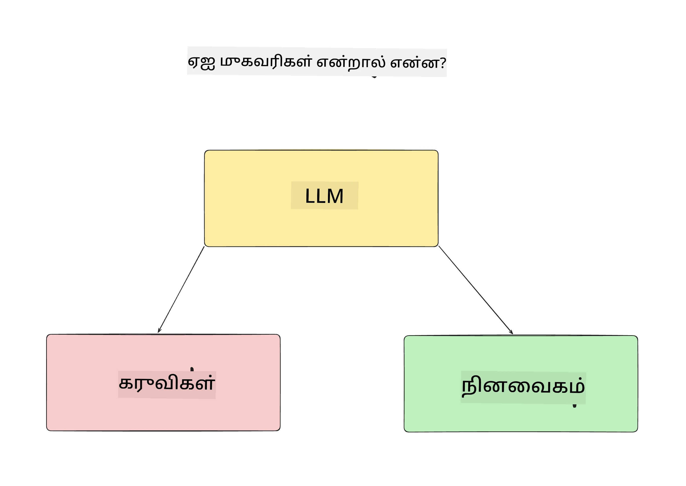
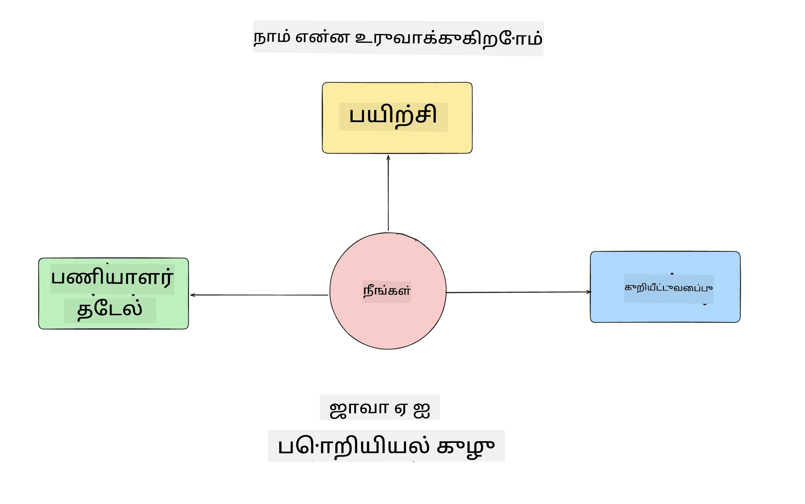
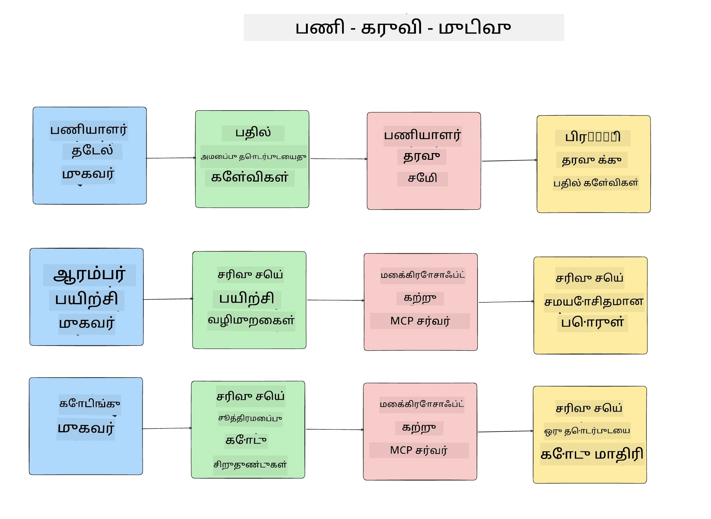
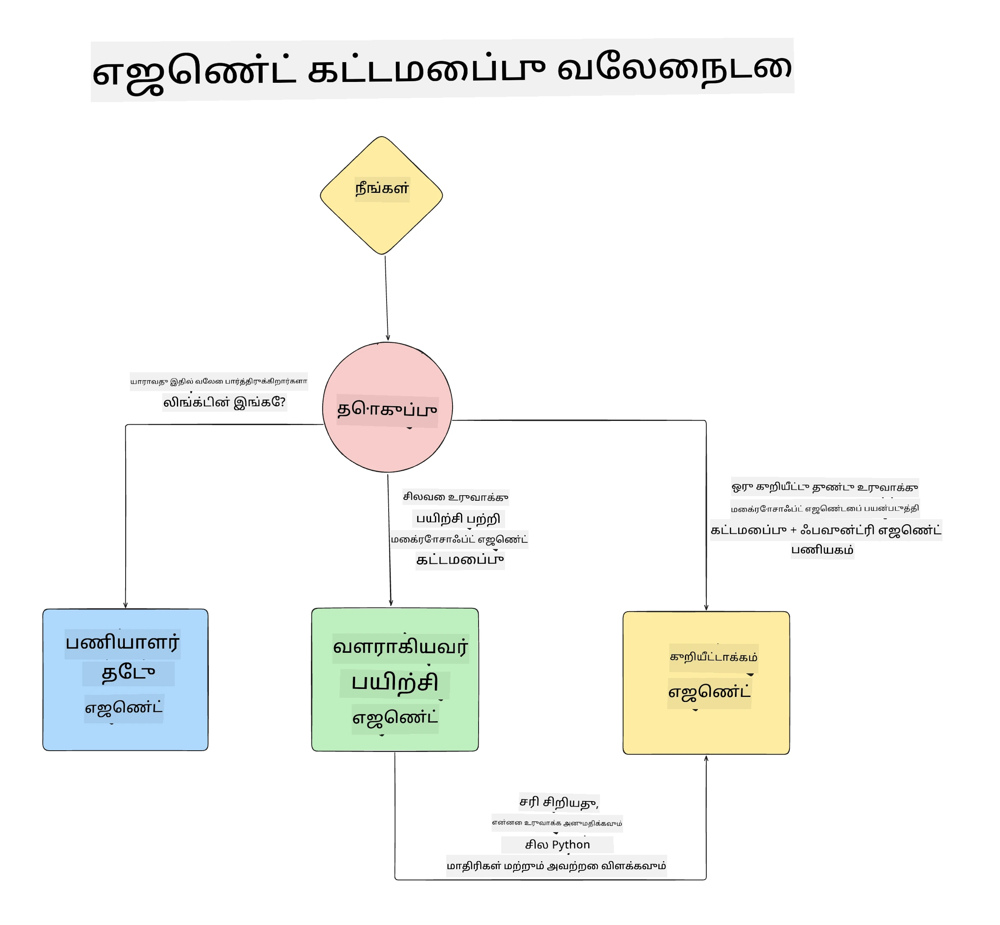

# பாடம் 1: AI முகவர் வடிவமைப்பு

"பூஜ்யத்தில் இருந்து உற்பத்திக்கு AI முகவரை உருவாக்குதல்" பாடத்தின் முதல் பகுதியிற்கு வரவேற்கின்றோம்!

இந்த பாடத்தில் நாம் கற்போம்:

- AI முகவர்களைக் குறிக்கும் விளக்கம்
  
- நாங்கள் உருவாக்கும் AI முகவர் பயன்பாட்டைப் பற்றி விவாதிப்பது  

- ஒவ்வொரு முகவருக்கும் தேவையான கருவிகள் மற்றும் சேவைகளை அடையாளம் காண்பது
  
- எங்கள் முகவர் பயன்பாட்டை வடிவமைப்பது
  
பயன்பாட்டில் முகவர்களை எப்படிப்பட்டவை என்றும், ஏன் நாம் அவற்றைப் பயன்படுத்த வேண்டும் என்பதைக் கூறுவதோடு தொடங்குவோம்.

> **பாடத்தைக் துவங்குவதற்கு முன்.** இந்த முதல் பாடம் கருத்தியல் — ஓடும் வகை குறியீடு எதுவும் இல்லை.
> [பாடம் 2](../lesson-2-agent-development/README.md) முதல், நீங்கள் தேவையாகும்: **Azure சந்தா** Microsoft Foundry-க்கு அணுகலுடன், **GPT-5 தொடர் மாதிரி** ஒன்றை நிறுவியிருக்கும் (உதாரணமாக `gpt-5.1` — நிறுவப்பட்ட GPT-4o / GPT-4.1 தவிர்க்கவும்), **Python 3.12+**, மற்றும் **Azure CLI** (`az login`). பாடத்தின் README இல் [நீங்கள் என்ன வேண்டும்](../README.md#what-you-need) முழு பட்டியல் மற்றும் இணைப்புக்கள் உள்ளன.

## AI முகவர்கள் என்ன?

AI முகவர்களை உருவாக்குவது எப்படி என்பது உங்கள் முதல் முறையாயினால், AI முகவர் என்றால் என்ன என்பது குறித்து கேள்விகள் எழுந்திருக்கலாம்.

AI முகவர்களின் கூறுகளுக்கேற்ப எளிய விளக்கம்:

**பெரிய மொழி மாதிரி** - LLM பயனர் நிலையிலிருந்து இயற்கை மொழியை செயலாக்குவதற்கும், செய்யவேண்டிய பணியை புரிந்துகொள்வதற்கும், கருவிகள் குறிப்பு விளக்கங்களைப் புரிந்துகொள்ளவும் பயன்படும்.

**கருவிகள்** - இவை செயற்கூறுகள், APIகள், தரவுத்தளங்கள் மற்றும் LLM பயனர் கோரிய பணிகளை நிறைவேற்ற தேர்ந்தெடுக்கும் பிற சேவைகள் ஆகும்.

**நினைவகம்** - AI முகவருக்கும் பயனருக்கும் இடையேயான குறுகிய காலம் மற்றும் நீண்ட கால ஜனரஞ்சனங்களை இங்கே சேமிக்கின்றோம். இந்த தகவலை சேமிப்பதும் மீட்டெடுப்பதும் முக்கியம், காலத்துக்கு பயனர் விருப்பங்களைச் சேமிப்பதற்கும் மேம்படுத்துவதற்கும்.

## எங்கள் AI முகவர் பயன்பாடு

இந்த பாடத்துக்காக, புதிய டெவலப்பர்களை எங்கள் AI முகவர் மேம்பாட்டு குழுவுடன் இணைக்க உதவும் AI முகவர் பயன்பாட்டை உருவாக்கப் போகிறோம்!

எந்த மேம்பாட்டையும் செய்யும் முன், வெற்றி பெறும் AI முகவர் பயன்பாட்டை உருவாக்கும் முதல் படி, பயனர்கள் எங்கள் AI முகவர்களுடன் எவ்வாறு பணியாற்றுவார்கள் என்பது வரைபடப்படுத்துதல் ஆகும்.

இந்த பயன்பாட்டுக்கான சூழலாக்கங்கள்:

**சூழல் 1**: புதிய பணியாளர் எங்கள் நிறுவனத்தில் சேர்ந்து, சேர்ந்த குழுவைப் பற்றி மேலும் அறிய விரும்பும் மற்றும் அவர்களை எவ்வாறு தொடர்புகொள்ள போகிறாரோ அறிய வேண்டும்.

**சூழல் 2:** புதிய பணியாளர் துவங்கும் சிறந்த முதன்மை பணியை அறிய விரும்புகிறார்.

**சூழல் 3:** புதிய பணியாளர் கற்றல் வளங்கள் மற்றும் குறியீடு மாதிரிகளை சேகரித்து, பணியை நிறைவேற்றத் தொடங்க உதவ விரும்புகிறார்.

## கருவிகள் மற்றும் சேவைகளை அடையாளம் காண்பது

இப்போது இவை உருவாக்கப்பட்டுள்ளன, அடுத்த படி - AI முகவர்கள் பணிகளை நிறைவேற்ற தேவையான கருவிகள் மற்றும் சேவைகளுடன் ஒப்பிடுவதே ஆகும்.

இந்த செயல்முறை "Context Engineering" உட்பட்டது, ஏனெனில் AI முகவர்களுக்கு சரியான சூழல், சரியான நேரத்தில் பணிகளை அளித்து முடிக்க வேண்டும் என்பதில் கவனம் செலுத்துகிறோம்.

சூழல் ஒன்றுக்கொன்று செய்து, ஒவ்வொரு முகவரின் பணிகள், கருவிகள் மற்றும் விரும்பிய முடிவுகளை பட்டியலிடுதல் மூலம் நல்ல முகவர் வடிவமைப்பை செய்வோம்.

### சூழல் 1 - பணியாளர் தேடல் முகவர்

**பணி** - நிறுவனத்தில் பணியாளர்கள் குறித்து, சேர்ந்த நாள், தற்போதைய குழு, சமூக இடம் மற்றும் கடைசி பதவி போன்ற கேள்விகளுக்கு பதில் அளித்தல்.

**கருவிகள்** - தற்போதைய பணியாளர் பட்டியல் மற்றும் நிறுவன வரையறை தரவுத்தளம்

**முடிவுகள்** - பொதுவான நிறுவன தொடர்புடைய கேள்விகளுக்கும் தனிப்பட்ட பணியாளர் கேள்விகளுக்கும் தரவுத்தளத்திலிருந்து தகவல் பெற முடியும்.

### சூழல் 2 - பணி பரிந்துரை முகவர்

**பணி** - புதிய பணியாளரின் மேம்பாட்டுக்கான அனுபவத்தை அடிப்படையில், அவர் செயல்படக் கூடிய 1-3 பிரச்சனைகளை சுட்டி காட்டுதல்.

**கருவிகள்** - திறந்த பிரச்சனைகளைப் பெற GitHub MCP சேவையகம் மற்றும் மேம்பாட்டுணி சுயவிவரம் உருவாக்குதல்

**முடிவுகள்** - GitHub சுயவிவரத்தின் கடைசியாக 5 கமிட்களைப் படித்து, GitHub திட்டத்தில் திறந்த பிரச்சனைகளை வாசித்து, பொருந்துகிறவைகளின் அடிப்படையில் பரிந்துரைகளை வழங்குதல்.

### சூழல் 3 - குறியீடு உதவி முகவர்

**பணி** - "பணி பரிந்துரை" முகவர் பரிந்துரைத்த திறந்த பிரச்சனைகளை அடிப்படையாகக் கொண்டு, ஆராய்ச்சி செய்து வளங்கள் வழங்குதல் மற்றும் குறியீடு துண்டுகளை உருவாக்குதல்.

**கருவிகள்** - Microsoft Learn MCP வளங்களை கண்டறிந்து Code Interpreter மூலம் தனிப்பயன் குறியீடு துண்டுகளை உருவாக்குதல்.

**முடிவுகள்** - பயனர் கூடுதலான உதவிக்கு கேட்டால், Learn MCP சேவையகம் மூலம் வளங்களுக்கான இணைப்புகள் மற்றும் துண்டுகளை வழங்கி பிறகு Code Interpreter முகவருக்கு அனுப்பி சிறிய குறியீடு துண்டுகளை விளக்கத்துடன் உருவாக்குதல்.

## எங்கள் முகவர் செயலியை வடிவமைத்தல்

இப்போது ஒவ்வொரு மேட்பும் அறிவிக்கப்பட்டு விட்டது, பணிப் படி ஒவ்வொரு முகவரும் ஒருங்கிணைந்து மற்றும் தனித்து எப்படி பணியாற்றுவார்கள் என்பதைக் குறிக்கும் கட்டமைப்புக் வரைபடத்தை உருவாக்குவோம்:

## அடுத்த படிகள்

இப்போது ஒவ்வொரு முகவரையும் வடிவமைத்து, எங்கள் முகவர் அமைப்பையும் வடிவமைத்துவிட்டோம், அடுத்து வரும் பாடத்தில் இவர்கள் ஒவ்வொருவரையும் மேம்படுத்த போகிறோம்!

---

<!-- CO-OP TRANSLATOR DISCLAIMER START -->
**மறுப்பு**:
இந்த ஆவணம் AI மொழிபெயர்ப்பு சேவை [Co-op Translator](https://github.com/Azure/co-op-translator) பயன்படுத்தி மொழிபெயர்க்கப்பட்டுள்ளது. நாங்கள் துல்லியத்திற்காக முயற்சி செய்துள்ளோம், ஆனால் தானாக செய்யப்படும் மொழிபெயர்ப்புகளில் பிழைகள் அல்லது தவறுகள் இருக்கலாம் என்பதை கவனத்தில் கொள்ளவும். அசல் ஆவணம் அதன் தாய்மொழியில் அதிகாரப்பூர்வ ஆதாரமாக கருதப்பட வேண்டும். முக்கியமான தகவல்களுக்கு, தொழில்நுட்பமான மனித மொழிபெயர்ப்பு பரிந்துரைக்கப்படுகிறது. இந்த மொழிபெயர்ப்பைப் பயன்படுத்துவதால் ஏற்படும் எந்த தவறான புரிதல்கள் அல்லது தவறான விளக்கத்திற்கும் நாங்கள் பொறுப்பில்வில்லை.
<!-- CO-OP TRANSLATOR DISCLAIMER END -->