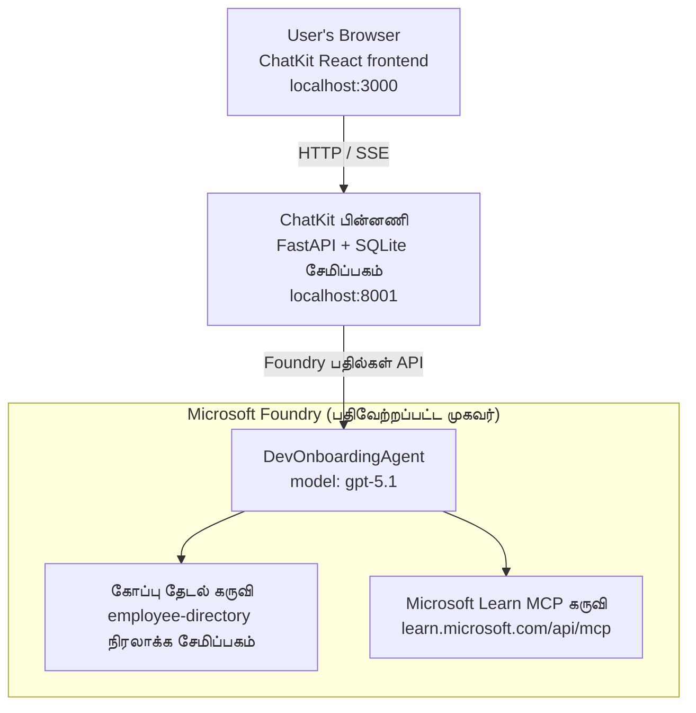

# பாடம் 4: மைக்ரோசாஃப்ட் ஃபவுண்ட்ரி ஹோஸ்டட் முகவர்களுடன் முகவர் பயன்பாடு + சாட்கிட்

இந்த பாடம் கருவி பயன்படுத்தும் முகவரை மைக்ரோசாஃப்ட் ஃபவுண்ட்ரியில் ஒரு ஹோஸ்டட் முகவராக இடம் பெற செய்வது மற்றும் அதனுடன் தொடர்பு கொள்ள சாட்கிட் அடிப்படையிலான முன் முனை உருவாக்குவது எப்படி என்பதைக் காட்டுகிறது.

## கட்டமைப்பு

இந்த ஹோஸ்டட் முகவர் ஒரு **ஏகை `DevOnboardingAgent`** (`gpt-5.1` இல் ஓடும்) ஆகும், இது இரண்டு ஹோஸ்டட் கருவிகள் மூலம் டெவலப்பர்-ஒன்போர்டிங் கேள்விகளுக்குப் பதிலளிக்கிறது: ஊழியர்-அடைகோல் வெக்டர் ஸ்டோரில் செயல்படும் **கோப்பு தேடல்** கருவியும், **Microsoft Learn MCP** கருவியும். ஒரு சாட்கிட் ரியாக்ட் முன் முனை ஒரு ஃபாஸ்ட்API பின்னணி பற்றிய உரையாடல் செய்து, முகவருடன் Foundry **Responses API** மூலமாக அழைக்கிறது.



## முன்னுரிமைகள்

1. வடக்கு மத்தி அமெரிக்கா பிராந்தியத்தில் **Microsoft Foundry Project**
2. அசூர் CLIவால் செயல்படுத்தல் (`az login`)
3. **Azure Developer CLI** (`azd`) நிறுவப்பட்டது
4. **Python 3.12+** மற்றும் **Node.js 18+**
5. ஊழியர் தரவுடன் **வேக்டர் ஸ்டோர்** உருவாக்கப்பட்டது

## விரைவான தொடக்கம்

### 1. சுற்றுச்சூழல் மாறிலிகள் அமைத்து கொள்

```bash
cd lesson-4-agentdeployment
cp .env.example .env
# உங்கள் Microsoft Foundry திட்ட விவரங்களுடன் .env ஐ தொகுக்கவும்
```

### 2. ஹோஸ்டட் முகவரை இடம் பெற்றுக்கொள்

**விருப்பம் A: Azure Developer CLI பயன்படுத்தி (பரிந்துரைக்கப்படுகிறது)**

```bash
cd hosted-agent
azd auth login
azd agent deploy
```

**விருப்பம் B: Docker + Azure Container Registry பயன்படுத்தி**

```bash
cd hosted-agent

# கொண்டெய்னரை உருவாக்கவும்
docker build -t developer-onboarding-agent:latest .

# ACR க்கான குறிச்சொல்
docker tag developer-onboarding-agent:latest <your-acr>.azurecr.io/developer-onboarding-agent:latest

# ACR க்கு அழுத்தவும்
az acr login --name <your-acr>
docker push <your-acr>.azurecr.io/developer-onboarding-agent:latest

# Microsoft Foundry பேர்டல் அல்லது SDK மூலம் பிரசாரம் செய்யவும்
```

### 3. சாட்கிட் பின்னணியை துவக்கு

```bash
cd chatkit-server
python -m venv .venv
source .venv/bin/activate  # விண்டோக்ஸில்: .venv\Scripts\activate
pip install -r requirements.txt
python app.py
```

சர்வர் `http://localhost:8001` இல் துவங்கும்

### 4. சாட்கிட் முன்முனையை துவக்கு

```bash
cd chatkit-server/frontend
npm install
npm run dev
```

முன்முனை `http://localhost:3000` இல் துவங்கும்

### 5. பயன்பாட்டை சோதனை செய்

உலாவியில் `http://localhost:3000` ஐ திறந்து கீழ்காணும் கேள்விகளை முயற்சிக்கவும்:

**ஊழியர் தேடல்:**
- "நான் இங்கு புதியவன்! மைக்ரோசாஃப்டில் பணிபுரிந்தவர்களுள்ளார்களா?"
- "ஆஸ்யூர் செயல்பாடுகளுடன் அனுபவமுள்ளவர்கள் யார்?"

**கற்றல் வளம்:**
- "குபேர்நேட்டீஸ் கற்கும் பாதையை உருவாக்கவும்"
- "மேಘ கட்டமைப்புக்கு எந்த சான்றிதழ்களை நான் மேற்கொள்ள வேண்டும்?"

**குறியீட்டு உதவி:**
- "காஸ்மாஸ்DB இணைக்க Python குறியீட்டை எழுத உதவி செய்"
- "ஆஸ்யூர் செயல்பாடு உருவாக்க எப்படி என்பதை காண்பி"

**பன்முகவர் கேள்விகள்:**
- "நான் மேக பொறியாளராக துவங்குகிறேன். யாரை தொடர்பு கொள்ளவேண்டும் மற்றும் என்ன கற்றுக்கொள்ளவேண்டும்?"

## திட்ட அமைப்பு

```
lesson-4-agentdeployment/
├── .env.example                 # Environment variables template
├── implementation-plan.md       # Detailed implementation guide
├── README.md                    # This file
├── hosted-agent/               # Microsoft Foundry hosted agent
│   ├── main.py                 # Multi-agent workflow implementation
│   ├── requirements.txt        # Python dependencies
│   ├── Dockerfile              # Container definition
│   └── agent.yaml              # Agent deployment configuration
└── chatkit-server/             # ChatKit server application
    ├── app.py                  # FastAPI backend
    ├── store.py                # SQLite persistence layer
    ├── requirements.txt        # Python dependencies
    └── frontend/               # React frontend
        ├── package.json
        ├── vite.config.ts
        ├── tsconfig.json
        ├── index.html
        └── src/
            ├── main.tsx
            ├── App.tsx
            ├── App.css
            └── index.css
```

## முகவரும் அதனுடைய கருவிகளும்

இந்த ஹோஸ்டட் முகவர் என்பது **ஏக முகவர்** (`DevOnboardingAgent`, `hosted-agent/main.py` இல் வரையறுக்கப்பட்டுள்ளது) ஆகும், இது மூன்று ஒன்போர்டிங் துறைகளை கையாள்கிறது. தனி துணை முகவர்களை ஒருங்கிணைப்பதற்குப் பதிலாக, அது ஒவ்வொரு திறமையையும் கருவியாக (அல்லது நேரடியாக மாடலை ஆதரித்து) வெளிப்படுத்துகிறது:

| திறமை | அது எவ்வாறு கையாளப்படுகிறது | கருவி |
|-----------|------------------|------|
| **ஊழியர் தேடல் & தொடர்புகள்** | ஊழியர் அடைகோல் வெக்டர் ஸ்டோரில் Foundry ஹோஸ்டட் கோப்பு தேடல் | `client.get_file_search_tool(vector_store_ids=[...])` |
| **கற்றல் & பயிற்சி** | Microsoft Learn MCP சர்வர் (ஹோஸ்டட் MCP கருவி) | `client.get_mcp_tool(url="https://learn.microsoft.com/api/mcp")` |
| **குறியீட்டு உதவி** | `gpt-5.1` மாடல் மூலம் நேரடியாக கையாளப்படுகிறது — வெளிப்புற கருவி இல்லை | — |


`client.as_agent(name="DevOnboardingAgent", instructions=..., tools=[file_search_tool, learn_mcp_tool])` கொண்டு முகவர் உருவாக்கப்படுகிறது மற்றும் `from_agent_framework(agent).run()` மூலம் சேவை வழங்கப்படுகிறது.

> **வடிவமைப்பு குறிப்பு.** இந்த பாடத்தின் முந்தைய ஒவ்வமைப்புகள் `HandoffBuilder` பன்முகவர் வேலைபாடை (Triage → நிபுணர்கள்) பயன்படுத்தின. பகிரப்பட்ட முகவர் ஒரு ஒற்றை கருவி பயன்படுத்தும் முகவர் ஆகும், இது ஆன்‌போர்டிங்-உடை Q&A க்கு எளிதில் விரிவாக்கம் மற்றும் காரணியலைக்கூடியது. பன்முகவர் ஒர்கெஸ்ட்ரேஷன் மற்றும் ஹேன்டாஃப்கள் குறித்த உதாரணத்துக்கு, பாடம் 2 மற்றும் பாடம் 3 பார்க்கவும்.

## ஹோஸ்ட் செய்யப்பட்ட முகவரின் ஸ்மோக் டெஸ்டிங் (CI கேட்)

ஹோஸ்ட் செய்யப்பட்ட முகவரை "வெற்றிகரமாக" விநியோகம் செய்வது கட்டுப்பாட்டு படலம் வரையறையை ஏற்றுக்கொண்டதைக் காட்டுகிறது — முகவர் உண்மையில் பதில் அளிக்கிறதா என்பதை இது **சான்றளிக்காது**. ஒரு காணாமல் போன நுணுக்கம், தவறான மாதிரி வழிசெலுத்தல், அல்லது காலாவதியான இணைப்பு ஒரு பச்சை ஆனால் மௌனமான முகவரை விடுவிக்கலாம்.


இந்த பாடம் ஒரு எளிய **ஸ்மோக் டெஸ்ட்** ஐ வழங்குகிறது, இது வேகமாகவும் மலிவான வெளியீட்டுப் பின்வரிசை கேட் ஆக செயல்படுகிறது. இது [AI Smoke Test](https://github.com/marketplace/actions/ai-smoke-test)
GitHub செயலை பயன்படுத்தி முகவரின் Foundry **Responses** இறுதி புள்ளிக்குத்
(`POST {project_endpoint}/agents/{agent_name}/endpoint/protocols/openai/responses`)
POST கேள்விகளை அனுப்புகிறது மற்றும் திரும்பிய உரையில் சரிபார்க்கிறது. இது உடைந்த வெளியீடுகள், அங்கீகார மறு முறையீடு, 
அமைப்பு-கேள்வி தரிசனம், மற்றும் திரெடிங் முறைகேடுகளை சில நொடிகளில் கண்டறிகிறது.


> ஸ்மோக் டெஸ்ட்கள் [பாடம் 3](../lesson-3-agent-evals/README.md) இல் உள்ள முழுமையான மதிப்பீடுகளுக்கு
> மாற்றாக அல்ல — அவை பரிபூரணமாக இருக்கின்றன. ஸ்மோக் டெஸ்ட்கள்
> "*முகவர் அணுகக்கூடியதா, பதிலளிக்கிறதா, அடிப்படையான கேள்வி எதிர்பார்ப்புகளை பின்பற்றுகிறதா?*" என்பதை பார்த்து செல்கின்றன;
> மதிப்பீடுகள் "*பதில் எவ்வளவு நல்லது?*" என்பதைக் கேட்கின்றன. ஒவ்வொரு வெளியீட்டிலும் இந்த மலிவு கேட் இயக்கவும்.

### என்ன சோதிக்கப்படுகிறது

பட்டியல் [`hosted-agent/tests/smoke-tests.json`](../../../lesson-4-agentdeployment/hosted-agent/tests/smoke-tests.json) இடத்தில் உள்ளது
மற்றும் முகவரின் மூன்று துறைகள் மற்றும் கேள்வி கடைப்பிடிப்பு மற்றும் பன்முறை உரையாடலைச் சோதிக்கிறது:

| சோதனை | இது சரிபார்க்கிறது |
|------|------------------|
| `reachability` | முகவர் காலியாக இல்லாத, பொருத்தமான உரையில் பதில் அளிக்கிறதா |
| `employee-search` | கோப்பு-தேடல் துறை ஆரோக்கியமான `200` நிலையை (பதில் தரவுக்கு சார்ந்தது) அளிக்கிறதா |
| `learning-path` | கற்றல் துறை தலைப்பைப் பிரதிபலித்து பாதை பாணியில் பதில் வழங்குகிறதா |
| `coding-assistance` | குறியீட்டு துறை Python வடிவிலான பதிலை தருகிறதா |
| `prompt-adherence-offtopic` | தொடர்பற்ற கோரிக்கைகள் மறுப்புக்குக் கொண்டு செல்லப்படுகிறதா, விரிவான பதில் இல்லை |
| `threading-turn-1/2` | உரையாடல் நிலை `previous_response_id` மூலம் துக்கி பாதுகாக்கப்பட்டிருப்பதா |

### அதை CI இல் இயக்கவும்

[`.github/workflows/smoke-test-hosted-agent.yml`](../../../.github/workflows/smoke-test-hosted-agent.yml) இல் உள்ள வேலைப்பாடு இரண்டு பணி உள்ளது:


- **`static`** — ஒவ்வொரு pull கோரிக்கையிலும் மற்றும் push இலும் இயங்கும் வேகமான, Azure இல்லாத கேட்:
  இது அனைத்து Python மூலங்களையும் (`py_compile`) தொகுத்து, மார்க்‌டவுன் இணைப்புகளைக் சரிபார்க்கின்றது. எந்த ரகசிய தகவலும் தேவை இல்லை,
  ஆகவே fork PR களில் இது செயல்படும்.
- **`smoke`** — கீழே உள்ள Azure இணைக்கப்பெற்ற ஸ்மோக் டெஸ்ட். இதை தேவைக்கேற்ப
  (செயல்கள் → **Agent CI (static + smoke)** → workflow இயக்கவும்) இயக்கலாம் மற்றும் உங்கள் வெளியீட்டு வேலைப்பாடுக்குப் பிறகு தொடர்ச்சியாக இயங்கலாம்.


இச்சோக் பணிக்கான இந்த Репозитோரி **மாறிலிகள்** மற்றும் **ரகசியங்கள்** ஆகியவற்றை அமைக்கவும்:


| வகை | பெயர் | மதிப்பு |
|------|------|-------|

| மாறிலி | `FOUNDRY_PROJECT_ENDPOINT` | `https://<account>.services.ai.azure.com/api/projects/<project>` |
| மாறிலி | `HOSTED_AGENT_NAME` | தளவமைக்கப்பட்ட एजेंट் பெயர் (உதா. `dev-onboarding` — உங்கள் தளவமைப்புடன் பொருந்த வேண்டும்) |
| ரகசியம் | `AZURE_CLIENT_ID` / `AZURE_TENANT_ID` / `AZURE_SUBSCRIPTION_ID` | `azure/login`க்கான OIDC கூட்டிணைக்கப்பட்ட அடையாளம் |

ஓட்டுநர் அடையாளத்திற்கு **`Azure AI User`** காரணி **Foundry திட்ட வரம்பில்** தேவைப்படுகிறது அதன் மூலம்
பதில்கள் (மற்றும் உரையாடல்கள்) தரவுத்தள முடிவுறைகளைக் கூப்பிட முடியும். அதை பின்வருமாறு அனுமதி அளிக்கவும்:

```bash
az role assignment create \
  --assignee <object-id-or-appId-of-runner-identity> \
  --role "Azure AI User" \
  --scope "/subscriptions/<sub>/resourceGroups/<rg>/providers/Microsoft.CognitiveServices/accounts/<account>/projects/<project>"
```

### இதை உள்ளூரடியாக இயக்கவும்

அதே குறியீட்டுத்தொகுப்பை தூக்குவதற்கு முன் இயக்கலாம். `https://ai.azure.com/`க்கு பரமார்த்தமாக்கப்பட்ட
தரவுத்தள டோக்கனை பெற்று ஓட்டுநரை உங்கள் தளவமைப்பிடம் நோக்கிச் சரிசெய்யவும்:

```bash
# பார்வையாளர்கள் https://ai.azure.com/ ஆக இருக்க வேண்டும் (cognitiveservices.azure.com டோக்கன்கள் நிராகரிக்கப்படுகின்றன)
export FOUNDRY_TOKEN=$(az account get-access-token --resource https://ai.azure.com/ --query accessToken -o tsv)

git clone https://github.com/JFolberth/ai-smoketest && cd ai-smoketest
python runner.py \
  --project-endpoint "https://<account>.services.ai.azure.com/api/projects/<project>" \
  --agent-name dev-onboarding \
  --tests-file ../lesson-4-agentdeployment/hosted-agent/tests/smoke-tests.json
```

வெளியேறும் குறியீடுகள்: `0` எல்லாம் வெற்றி, `1` ஒரு கருத்துவெளிப் பிழை, `2` ஓட்டுநர் பிழை (தவறான குறியீட்டு தொகுப்பு / டோக்கன்).

## பிரச்சனைகளுக்கான தீர்வுகள்

### ஏஜென்ட் பதிலைத் தரவில்லை
- Microsoft Foundry-வில் தளவமைக்கப்பட்ட ஏஜென்ட் இயக்கத்தில் உள்ளது என்பதை உறுதிப்படுத்துக
- `HOSTED_AGENT_NAME` மற்றும் `HOSTED_AGENT_VERSION` உங்கள் தளவமைப்புடன் பொருந்துகிறதா என சரிபார்க்கவும்

### வெக்டர் கடை பிழைகள்
- `VECTOR_STORE_ID` சரியாக அமைக்கப்பட்டுள்ளதா என உறுதிப்படுத்துக
- வெக்டர் கடையில் ஊழியர் தரவுகள் உள்ளனவா என சரிபார்க்கவும்

### அடையாளவியல் பிழைகள்
- அங்கீகாரம் புதுப்பிக்க `az login` ஐ இயக்கவும்
- Microsoft Foundry திட்டத்திற்கு நீங்கள் அணுகல் உள்ளது என்பதைக் உறுதிப்படுத்துக

## வளங்கள்

- [Microsoft Foundry தளவமைக்கப்பட்ட ஏஜென்ட் ஆவணங்கள்](https://learn.microsoft.com/en-us/azure/ai-foundry/agents/concepts/hosted-agents)
- [Microsoft ஏஜென்ட் கட்டமைப்பு](https://github.com/microsoft/agent-framework)
- [ChatKit ஒருங்கிணைவு எடுத்துக்காட்டு](https://github.com/microsoft/agent-framework/tree/main/python/samples/demos/chatkit-integration)
- [Azure டெவலப்பர் CLI](https://learn.microsoft.com/en-us/azure/developer/azure-developer-cli/overview)
- [AI ஸ்மோக் டெஸ்ட் GitHub செயல்](https://github.com/marketplace/actions/ai-smoke-test)
- [GitHub செயல்களோடு Microsoft Foundry ஏஜென்ட்களை ஸ்மோக் டெஸ்ட் செய்வது (வலைப்பதிவு)](https://techcommunity.microsoft.com/blog/azuredevcommunityblog/smoke-test-microsoft-foundry-agents-with-github-actions/4531912)

---

## அடுத்த படிகள்

உங்கள் ஏஜென்ட் Microsoft நிர்வகிக்கும் அமைப்பில் இயங்குகிறது. அதை நிறுவன உற்பத்திக்கு எடுத்துச் செல்ல—
அதன் தரவுகள் எங்கு இருக்கும் என்பதைக் கட்டுப்படுத்த (தரவு ஆதிக்கம், தனிப்பட்ட நெட்வொர்க்கிங், Bring-your-own Azure
Cosmos DB / சேமிப்பு / AI தேடல்) மற்றும் அதன் கருவிகளை நிர்வகிக்க — தொடரவும்
**[பாடம் 5: உற்பத்தி தளவமைத்த ஏஜென்கள்](../lesson-5-hosted-agents-production/README.md)**, இது
**தளவமைத்த ஏஜென்கள்** மற்றும் **திறன் மடக்குகள்** இடையேயான முக்கிய வேறுபாட்டை விளக்குகிறது.

---

<!-- CO-OP TRANSLATOR DISCLAIMER START -->
**மறுப்பு**:
இந்த ஆவணம் AI மொழிபெயர்ப்பு சேவை [Co-op Translator](https://github.com/Azure/co-op-translator) பயன்படுத்தி மொழிபெயர்க்கப்பட்டுள்ளது. நாங்கள் துல்லியத்திற்காக முயற்சி செய்துள்ளோம், ஆனால் தானாக செய்யப்படும் மொழிபெயர்ப்புகளில் பிழைகள் அல்லது தவறுகள் இருக்கலாம் என்பதை கவனத்தில் கொள்ளவும். அசல் ஆவணம் அதன் தாய்மொழியில் அதிகாரப்பூர்வ ஆதாரமாக கருதப்பட வேண்டும். முக்கியமான தகவல்களுக்கு, தொழில்நுட்பமான மனித மொழிபெயர்ப்பு பரிந்துரைக்கப்படுகிறது. இந்த மொழிபெயர்ப்பைப் பயன்படுத்துவதால் ஏற்படும் எந்த தவறான புரிதல்கள் அல்லது தவறான விளக்கத்திற்கும் நாங்கள் பொறுப்பில்வில்லை.
<!-- CO-OP TRANSLATOR DISCLAIMER END -->