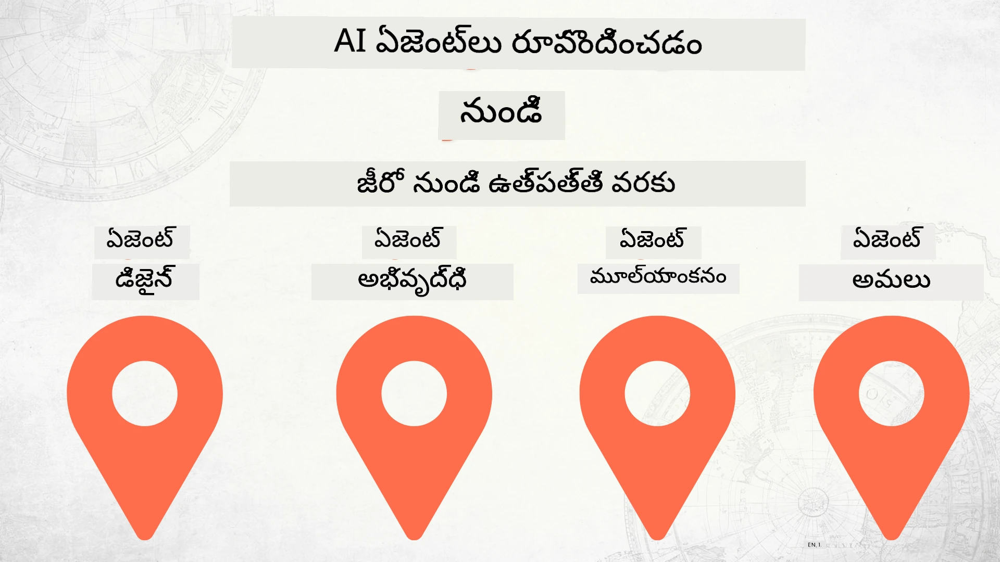

# జీరో నుండి ఉత్పత్తి వరకు AI ఏజెంట్ల నిర్మాణం



### 🌐 బహుభాషా మద్దతు

#### గిట్‌హబ్ యాక్షన్ ద్వారా మద్దతు (స్వయంచాలకంగా & ఎల్లప్పుడూ నవీకరించబడుతుంది)

<!-- CO-OP TRANSLATOR LANGUAGES TABLE START -->
[అరబిక్](../ar/README.md) | [బెంగాలీ](../bn/README.md) | [బల్గేరియన్](../bg/README.md) | [బర్మీజ్ (మయన్మార్)](../my/README.md) | [చైనీస్ (సింప్లిఫైడ్)](../zh-CN/README.md) | [చైనీస్ (ట్రెడిషనల్, హాంకాంగ్)](../zh-HK/README.md) | [చైనీస్ (ట్రెడిషనల్, మకావు)](../zh-MO/README.md) | [చైనీస్ (ట్రెడిషనల్, তাইवान)](../zh-TW/README.md) | [క్రొయేషియన్](../hr/README.md) | [చెక్](../cs/README.md) | [డానిష్](../da/README.md) | [డచ్](../nl/README.md) | [ఎస్టోనియన్](../et/README.md) | [ఫినిష్](../fi/README.md) | [ఫ్రెంచ్](../fr/README.md) | [జర్మన్](../de/README.md) | [గ్రీకు](../el/README.md) | [హీబ్రూ](../he/README.md) | [హిందీ](../hi/README.md) | [హంగేరియన్](../hu/README.md) | [ఇండోనేషియన్](../id/README.md) | [ఇటాలియన్](../it/README.md) | [జపనీస్](../ja/README.md) | [కన్నడ](../kn/README.md) | [కొరియన్](../ko/README.md) | [లిథువేనియన్](../lt/README.md) | [మలయ్](../ms/README.md) | [మలయాళం](../ml/README.md) | [మరాఠీ](../mr/README.md) | [నేపాలి](../ne/README.md) | [నైజీరియన్ పిడ్గిన్](../pcm/README.md) | [నార్వేజియన్](../no/README.md) | [ఫార్సీ (పర్షియన్)](../fa/README.md) | [పోలిష్](../pl/README.md) | [పోర్చుగీస్ (బ్రెజిల్)](../pt-BR/README.md) | [పోర్చుగీస్ (పోర్చగల్)](../pt-PT/README.md) | [పంజాబీ (గుర్ముఖీ)](../pa/README.md) | [రోమేనియన్](../ro/README.md) | [రష్యన్](../ru/README.md) | [సెర్బియన్ (సిరిలిక్)](../sr/README.md) | [స్లోవాక్](../sk/README.md) | [స్లోవేనియన్](../sl/README.md) | [స్పానిష్](../es/README.md) | [స్వాహిలి](../sw/README.md) | [స్వీడిష్](../sv/README.md) | [టాగలోగ్ (ఫిలిపినో)](../tl/README.md) | [తమిళ్](../ta/README.md) | [తెలుగు](./README.md) | [థాయ్](../th/README.md) | [టర్కిష్](../tr/README.md) | [ఉక్రెయిన్](../uk/README.md) | [ఉర్దూ](../ur/README.md) | [వియత్నामीజ్](../vi/README.md)

> **స్థానికంగా క్లోన్ చేయాలనుకుంటున్నారా?**
>
> ఈ రెపో 50+ భాషా అనువాదాలను కలిగి ఉంది, ఇది డౌన్లోడ్ పరిమాణాన్ని గణనీయంగా పెంచుతుంది. అనువాదాల లేకుండా క్లోన్ చేయడానికి, స్పార్స్ చెకౌట్ ఉపయోగించండి:
>
> **బాష్ / macOS / లినక్స్:**
> ```bash
> git clone --filter=blob:none --sparse https://github.com/microsoft/Building-AI-Agents-From-Zero-To-Production.git
> cd Building-AI-Agents-From-Zero-To-Production
> git sparse-checkout set --no-cone '/*' '!translations' '!translated_images'
> ```
>
> **CMD (విండోస్):**
> ```cmd
> git clone --filter=blob:none --sparse https://github.com/microsoft/Building-AI-Agents-From-Zero-To-Production.git
> cd Building-AI-Agents-From-Zero-To-Production
> git sparse-checkout set --no-cone "/*" "!translations" "!translated_images"
> ```
>
> ఇది కోర్సు పూర్తిచేయడానికి అవసరమైన అన్నింటినీ చాలా వేగంగా డౌన్లోడ్ చేసేలా ఇస్తుంది.
<!-- CO-OP TRANSLATOR LANGUAGES TABLE END -->

## AI ఏజెంట్ అభివృద్ధి జీవన చక్రం యొక్క ప్రాథమికాంశాలను నేర్పే కోర్స్

[](https://github.com/microsoft/Building-AI-Agents-From-Zero-To-Production/blob/master/LICENSE?WT.mc_id=academic-105485-koreyst)
[](https://GitHub.com/microsoft/Building-AI-Agents-From-Zero-To-Production/graphs/contributors/?WT.mc_id=academic-105485-koreyst)
[](https://GitHub.com/microsoft/Building-AI-Agents-From-Zero-To-Production/issues/?WT.mc_id=academic-105485-koreyst)
[](https://GitHub.com/microsoft/Building-AI-Agents-From-Zero-To-Production/pulls/?WT.mc_id=academic-105485-koreyst)
[](http://makeapullrequest.com?WT.mc_id=academic-105485-koreyst)

[](https://discord.gg/Kuaw3ktsu6)

## 🌱 ప్రారంభం

ఈ కోర్సు AI ఏజెంట్ల నిర్మాణం మరియు నిర్వహణ యొక్క ప్రాథమికాంశాలను కవర్ చేస్తుంది.

ప్రతి పాఠం గత కాలం పై ఆధారపడి ఉంటుంది, కాబట్టి ప్రారంభం నుండి మొదలు పెట్టి చివరికి వరకూ కొనసాగించడాన్ని మేము సిఫార్సు చేస్తున్నాము.

మీరు AI ఏజెంట్ విషయాల గురించి మరింత అన్వేషించాలనుకుంటే, మీరు [AI ఏజెంట్లకు ప్రారంభ కోర్స్](https://aka.ms/ai-agents-beginners) ను చూసుకోవచ్చు.

### ఇతర అభ్యాసకులను కలవండి, మీ ప్రశ్నలకు సమాధానాలు పొందండి

మీరు ఎక్కడైనా ఇబ్బంది పడితే లేదా AI ఏజెంట్లు నిర్మాణం గురించి ఏవైనా ప్రశ్నలు ఉంటే, మా ప్రత్యేక Discord ఛానెల్‌లో చేరండి [Microsoft Foundry Discord](https://discord.gg/Kuaw3ktsu6).

### మీరు ఏం అవసరం

ప్రతి పాఠానికి దాని స్వంత కోడ్ నమూనా ఉంటుంది, మీరు స్థానికంగా ఆన్ చేస్తారు. మీరు [ఈ రెపోను ఫోర్క్](https://github.com/microsoft/Building-AI-Agents-From-Zero-To-Production/fork) చేసి మీ స్వంత కాపీని సృష్టించవచ్చు.

ఈ కోర్సు ప్రస్తుతం క్రింద సూచించిన వాటిని ఉపయోగిస్తుంది:

- [Microsoft Agent Framework (MAF)](https://aka.ms/ai-agents-beginners/agent-framework)
- [Microsoft Foundry](https://azure.microsoft.com/products/ai-foundry)
- [Azure OpenAI Service](https://azure.microsoft.com/products/ai-foundry/models/openai)
- [Azure CLI](https://learn.microsoft.com/cli/azure/authenticate-azure-cli?view=azure-cli-latest)

ప్రారంభించడానికి ముందు మీరు ఈ సేవలకు యాక్సెస్ కలిగి ఉన్నారా అని నిర్ధారించుకోండి.

మోడల్ హోస్టింగ్ మరియు సేవల చుట్టూ మరిన్ని ఎంపికలు త్వరలో రానున్నాయి.

## 🗃️ పాఠాలు

| **పాఠం**            | **వివరణ**                                                                                  |
|--------------------|--------------------------------------------------------------------------------------------------|
| [ఏజెంట్ డిజైన్](./lesson-1-agent-design/README.md)          | మా "డెవలపర్ ఆన్‌బోర్డింగ్" ఏజెంట్ వాడుక కేస్ పరిచయం మరియు సమర్థవంతమైన ఏజెంట్ల డిజైన్ ఎలా చేయాలో   |
| [ఏజెంట్ అభివృద్ధి](./lesson-2-agent-development/README.md) | Microsoft Agent Framework (MAF) ఉపయోగించి, కొత్త డెవలపర్లకు సహాయం చేసే 3 ఏజెంట్లను సృష్టించడం.       |
| [ఏజెంట్ మూల్యాంకనలు](./lesson-3-agent-evals/README.md)    | Microsoft Foundryని ఉపయోగించి, AI ఏజెంట్లు ఎంతగా ప్రదర్శిస్తున్నాయో తెలుసుకుని, వాటిని మెరుగుపరుచడం.  |
| [ఏజెంట్ డిప్లాయ్‌మెంట్](./lesson-4-agent-deployment/README.md) | Hosted Agents మరియు OpenAI Chatkit ఉపయోగించి, AI ఏజెంటును ఉత్పత్తిలో ఎలా నిలపాలో తెలుసుకోండి.     |

## 🎒 ఇతర కోర్సులు

మా జట్టు ఇతర కోర్సులను కూడా తయారు చేస్తోంది! చూడండి:

<!-- CO-OP TRANSLATOR OTHER COURSES START -->
### LangChain
[](https://aka.ms/langchain4j-for-beginners)
[](https://aka.ms/langchainjs-for-beginners?WT.mc_id=m365-94501-dwahlin)
[](https://github.com/microsoft/langchain-for-beginners?WT.mc_id=m365-94501-dwahlin)
---

### Azure / Edge / MCP / Agents
[](https://github.com/microsoft/AZD-for-beginners?WT.mc_id=academic-105485-koreyst)
[](https://github.com/microsoft/edgeai-for-beginners?WT.mc_id=academic-105485-koreyst)
[](https://github.com/microsoft/mcp-for-beginners?WT.mc_id=academic-105485-koreyst)
[](https://github.com/microsoft/ai-agents-for-beginners?WT.mc_id=academic-105485-koreyst)

---
 
### జనరేటివ్ AI సిరీస్
[](https://github.com/microsoft/generative-ai-for-beginners?WT.mc_id=academic-105485-koreyst)
[-9333EA?style=for-the-badge&labelColor=E5E7EB&color=9333EA)](https://github.com/microsoft/Generative-AI-for-beginners-dotnet?WT.mc_id=academic-105485-koreyst)
[-C084FC?style=for-the-badge&labelColor=E5E7EB&color=C084FC)](https://github.com/microsoft/generative-ai-for-beginners-java?WT.mc_id=academic-105485-koreyst)
[-E879F9?style=for-the-badge&labelColor=E5E7EB&color=E879F9)](https://github.com/microsoft/generative-ai-with-javascript?WT.mc_id=academic-105485-koreyst)

---
 
### ప్రాథమిక అభ్యాసం
[](https://aka.ms/ml-beginners?WT.mc_id=academic-105485-koreyst)
[](https://aka.ms/datascience-beginners?WT.mc_id=academic-105485-koreyst)
[](https://aka.ms/ai-beginners?WT.mc_id=academic-105485-koreyst)
[](https://github.com/microsoft/Security-101?WT.mc_id=academic-96948-sayoung)
[](https://aka.ms/webdev-beginners?WT.mc_id=academic-105485-koreyst)
[](https://aka.ms/iot-beginners?WT.mc_id=academic-105485-koreyst)
[](https://github.com/microsoft/xr-development-for-beginners?WT.mc_id=academic-105485-koreyst)

---

### Copilot రకాలు
[](https://aka.ms/GitHubCopilotAI?WT.mc_id=academic-105485-koreyst)
[](https://github.com/microsoft/mastering-github-copilot-for-dotnet-csharp-developers?WT.mc_id=academic-105485-koreyst)
[](https://github.com/microsoft/CopilotAdventures?WT.mc_id=academic-105485-koreyst)
<!-- CO-OP TRANSLATOR OTHER COURSES END -->

## సహాయం చేయడం

ఈ ప్రాజెక్ట్ కృతజ్ఞతలు మరియు సూచనలను స్వాగతిస్తుంది. ఎక్కువ భాగం కృతజ్ఞతలకు మీరు Contributor License Agreement (CLA)ను అంగీకరించాలి, మీరు మీ సహకారాన్ని ఉపయోగించడానికి హక్కు కలిగి ఉన్నారని, నిజంగా ఇవ్వడాన్ని తెలియజేయాలి. వివరాలకు, సందర్శించండి <https://cla.opensource.microsoft.com>.

మీరు ఒక పుల్ రిక్వెస్ట్ సబ్మిట్ చేసినప్పుడు, CLA బాట్ ఆటోమేటిక్‌గా మీరు CLA ఇవ్వలసిన అవసరం ఉన్నదో లేదో నిర్ణయించి, PRకు తగిన అలంకరణ ఇస్తుంది (ఉదాహరణకు, స్థితి తనిఖీ, వ్యాఖ్య). బాట్ ఇచ్చిన సూచనలను అనుసరించండి. మా CLA ఉపయోగించే అన్ని రిపోజ్‌లలో మీరు ఇది ఒక్కసారి మాత్రమే చేయాలి.

ఈ ప్రాజెక్ట్ [Microsoft Open Source Code of Conduct](https://opensource.microsoft.com/codeofconduct/)ను అంగీకరించింది. మరింత సమాచారం కోసం [Code of Conduct FAQ](https://opensource.microsoft.com/codeofconduct/faq/) చూడండి లేదా మరిన్ని ప్రశ్నలు లేదా వ్యాఖ్యల కోసం [opencode@microsoft.com](mailto:opencode@microsoft.com)ను సంప్రదించండి.

## ట్రేడ్మార్కులు

ఈ ప్రాజెక్ట్ ప్రాజెక్టులు, ఉత్పత్తులు లేదా సేవల కోసం ట్రేడ్మార్కులు లేదా లోగోలను కలిగి ఉండవచ్చు. Microsoft ట్రేడ్మార్కులు లేదా లోగోల యొక్క అధికృతమైన ఉపయోగం [Microsoft's Trademark & Brand Guidelines](https://www.microsoft.com/legal/intellectualproperty/trademarks/usage/general)ను అనుసరించాలి. Microsoft ట్రేడ్మార్కులు లేదా లోగోల మార్పుచేర్పులు ఈ ప్రాజెక్ట్‌లో ఉపయోగించడం Microsoft స్పాన్సర్షిప్ కలిగినట్టు ఆశ్చర్యం కలిగించకుండా ఉండాలి. మూడవ పక్ష ట్రేడ్మార్కులు లేదా లోగోల వినియోగం ఆ మూడవ పత్తుల నిబంధనలు మరియు విధానాలపై ఆధారపడి ఉంటుంది.

## సహాయం పొందడం

మీరు ఇబ్బంది పడితే లేదా AI అప్లికేషన్లు నిర్మించడంలో ఎలాంటి ప్రశ్నలు ఉంటే, చేరండి:

[](https://discord.gg/Kuaw3ktsu6)

ఉత్పత్తి సూచనలు లేదా నిర్మాణ కాలంలో లోపాలు ఉంటే సందర్శించండి:

[](https://aka.ms/foundry/forum)

---

<!-- CO-OP TRANSLATOR DISCLAIMER START -->
**స్పష్టీకరణ**:  
ఈ డాక్యుమెంట్‌ను AI అనువాద సేవ [Co-op Translator](https://github.com/Azure/co-op-translator) ఉపయోగించి అనువదించబడింది. మేము శుద్ధత కోసం ప్రయత్నిస్తామని గమనించండి, అయితే ఆటోమేటెడ్ అనువాదాల్లో పొరపాట్లు లేదా అసత్యాలు ఉండవచ్చు. అసలు డాక్యుమెంట్ దాని మూల భాషలో అధికారిక మూలం గానూ తీసుకోవాలి. ముఖ్యమైన సమాచారం కోసం, ప్రొఫెషనల్ మానవ అనువాదం చేయించడం సూచించబడింది. ఈ అనువాదాన్ని ఉపయోగించడం వల్ల కలిగే ఏవైనా అపనివృత్తులు లేదా తప్పుప్రత్యేకతల కోసం మేము బాధ్యత వహించము.
<!-- CO-OP TRANSLATOR DISCLAIMER END -->