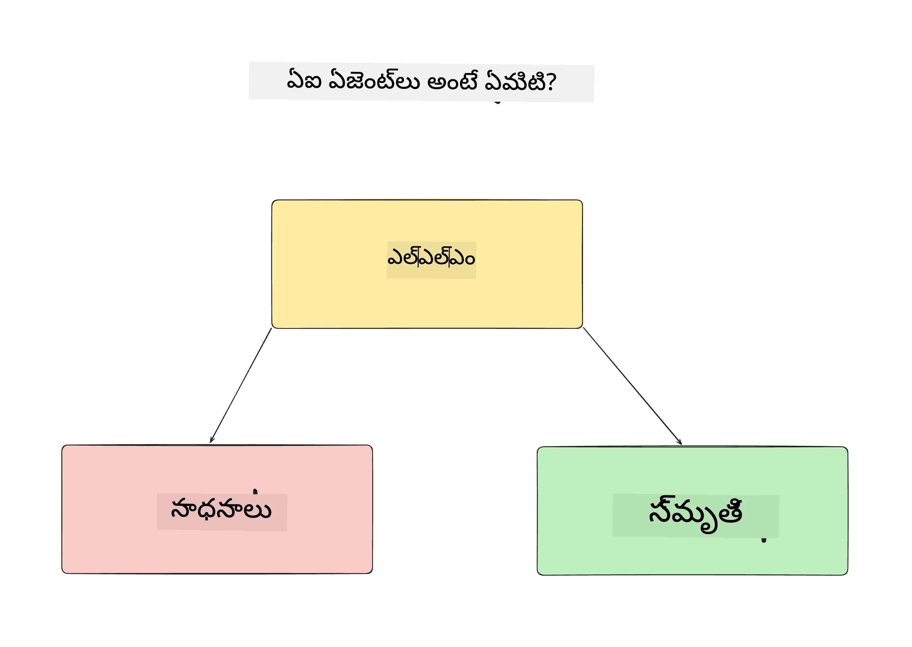
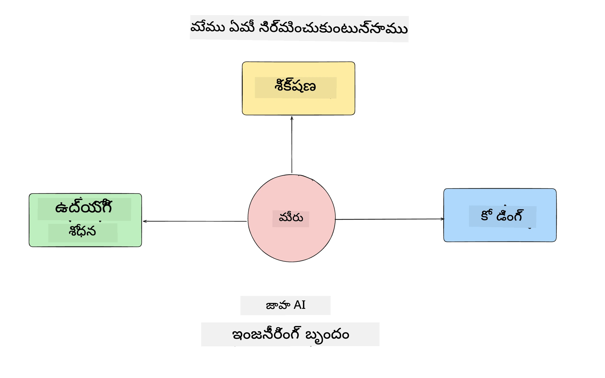
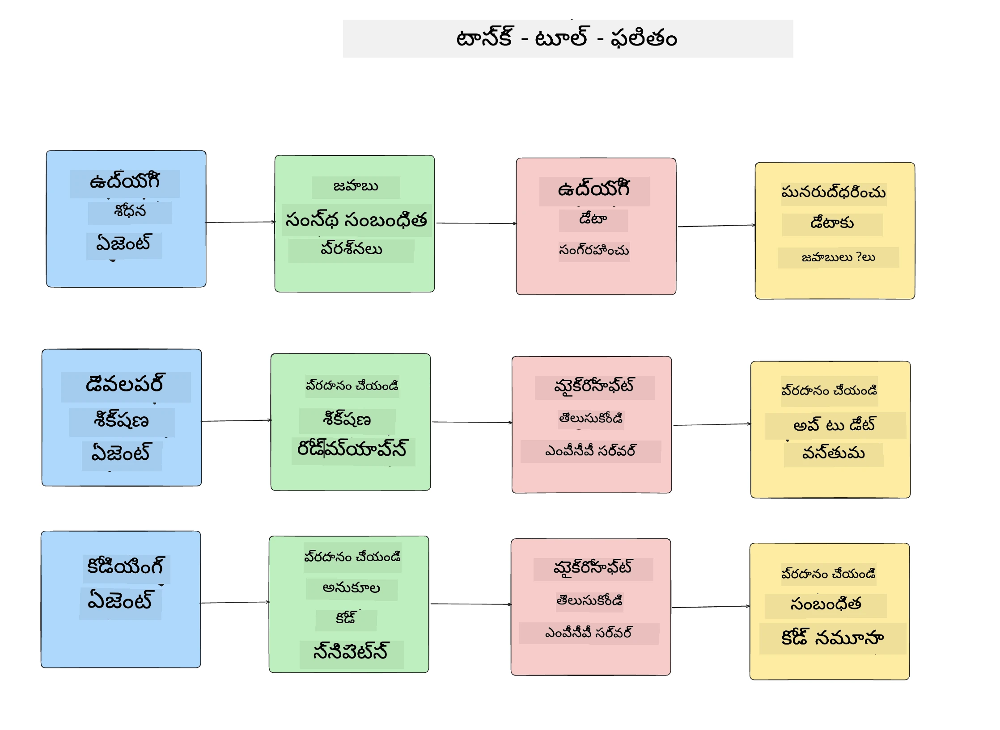
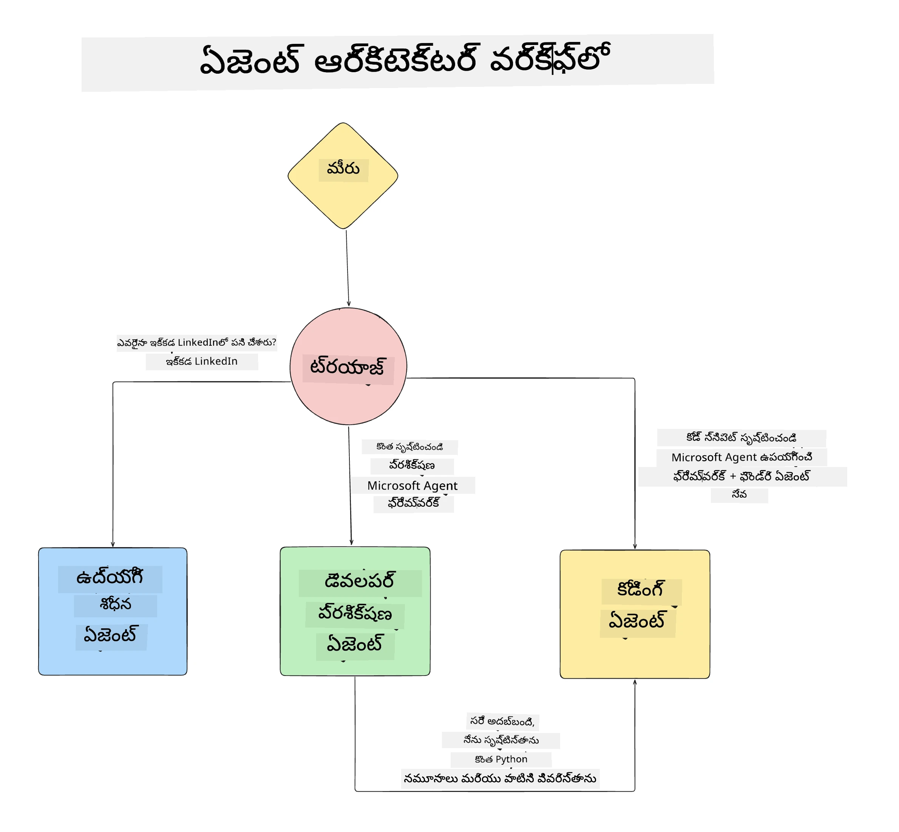

# పాఠం 1: AI ఏజెంట్ డిజైన్

"జీరో నుండి ప్రొడక్షన్ వరకు AI ఏజెంట్ నిర్మాణం కోర్సు" యొక్క మొదటి పాఠహస్తానికి స్వాగతం!

ఈ పాఠంలో మేము కవర్ చేయబోతున్న విషయాలు:

- AI ఏజెంట్లు ఏమిటో నిర్వచించడం
  
- మనం నిర్మిస్తున్న AI ఏజెంట్ అప్లికేషన్ గురించి చర్చించడం  

- ప్రతి ఏజెంట్ కోసం అవసరమైన సాధనాలు మరియు సేవలను గుర్తించడం
  
- మన ఏజెంట్ అప్లికేషన్ ఆర్కిటెక్చర్ చేయడం
  
ఒక అప్లికేషన్‌లో ఏజెంట్లు ఏమిటి మరియు మనం వాటిని ఎందుకు ఉపయోగిస్తామో నిర్వచించడం ద్వారా ప్రారంభిద్దాం.

> **కోర్సు మొదలుపెట్టేముందు.** ఈ మొదటి పాఠం ఆలోచనా పని — ఎటువంటి కోడ్ రన్ చేయాల్సిన అవసరం లేదు.
> [పాఠం 2](../lesson-2-agent-development/README.md) నుండి మీకు అవసరం: **Microsoft Foundry**కి యాక్సెస్ ఉన్న ఒక **Azure సబ్‌స్క్రిప్షన్**, ఒక నిఘా ప్రశాంత **GPT-5 సిరీస్ మోడల్** (ఉదాహరణకు `gpt-5.1` — ఆపివేతైన GPT-4o / GPT-4.1 లను తప్పించండి), **Python 3.12+**, మరియు **Azure CLI** (`az login`). పూర్తి జాబితా మరియు లింకుల కొరకు కోర్సు READMEలో [మీకు కావలసినవి](../README.md#what-you-need) చూడండి.

## AI ఏజెంట్లు ఏమిటి?

మీరు AI ఏజెంట్లను ఎలా నిర్మించాలో మొదటిసారి అన్వేషించాలనుకుంటుంటే, AI ఏజెంట్ ఏమిటో ఖచ్చితంగా నిర్వచించాలి అనే ప్రశ్నలు కలగవచ్చు.

ఒక సులభంగా AI ఏజెంట్లను దాని భాగాల ద్వారా నిర్వచించే విధానం:

**లార్జ్ లాంగ్వేజ్ మోడల్** - LLM వినియోగదారుని సహజ భాషను విశ్లేషించి వారు పూర్తి చేయదలచిన పని ను అర్థం చేసుకోవడం మరియు ఆ పనులను పూర్తి చేయడానికి అందుబాటులో ఉన్న సాధనాల వివరణలను అర్థం చేసుకోవడానికి శక్తిని ఇస్తుంది.

**సాధనాలు** - ఇవి ఫంక్షన్లు, APIs, డేటాస్తోర్లు, మరియు ఇతర సేవలుగా ఉండి, LLM వినియోగదారుని అభ్యర్థించిన పనులను పూర్తి చేయడానికి ఎంచుకోవచ్చు.

**మేం మొరి** - AI ఏజెంట్ మరియు వినియోగదారుల మధ్య ఉన్న తాత్కాలిక మరియు దీర్ఘకాల పరస్పరం ను నిల్వ చేయడం. ఈ సమాచారం నిల్వ మరియు పునఃప్రాప్తి సమయం క్రమేణా మెరుగుదలలు చేసేందుకు, మరియు వినియోగదారుల అభిరుచులను సేవ్ చేయడంలో ముఖ్యమై ఉంది.

## మన AI ఏజెంట్ వినియోగం కేసు

ఈ కోర్సు కోసం, మనం ఒక AI ఏజెంట్ అప్లికేషన్ ను నిర్మించబోతున్నాము, ఇది కొత్త డెవలపర్లను మన AI ఏజెంట్ డెవలప్‌మెంట్ టీమ్‌కు చేరడానికి సహాయపడుతుంది!

ఏవైనా డెవలప్‌మెంట్ పనులు మొదలు పెట్టేముందు, విజయవంతమైన AI ఏజెంట్ అప్లికేషన్ సృష్టించడానికి మొదటి దశ, మన వినియోగదారులు AI ఏజెంట్లతో ఎలా పనిచేస్తారో స్పష్టమైన దృశ్యాలు నిర్వచించడం.

ఈ అప్లికేషన్ కోసం, మనం ఈ దృశ్యాలతో పని చేస్తాము:

**దృశ్యం 1**: కొత్త ఉద్యోగి మన సంస్థలో చేరి, వారు చేరిన టీమ్ గురించి మరియు వారితో ఎలా కనెక్ట్ అవ్వాలో తెలుసుకోవాలనుకునే పరిస్థితి.

**దృశ్యం 2:** కొత్త ఉద్యోగి మొదటి పని ఏది చేయడం ఉత్తమమని తెలుసుకోవాలనుకుంటున్నారు.

**దృశ్యం 3:** కొత్త ఉద్యోగి మొదలు పెట్టేందుకు సహాయ పడే విద్యా వనరులు మరియు కోడ్ నమూనాలు సేకరించాలనుకుంటున్నారు.

## సాధనాలు మరియు సేవలను గుర్తించడం

ఇప్పుడు మాకు ఈ దృశ్యాలు ఉన్నట్లు, తదుపరి దశ వాటిని మన AI ఏజెంట్లు అవసరం అవుతు తున్న సాధనాలు మరియు సేవలకు మ్యాప్ చేయడం.

ఈ ప్రక్రియను Context Engineering విభాగంలోకి చేరుస్తాము, ఎందుకంటే మన AI ఏజెంట్లు సరైన సందర్భం వద్ద సరైన సమయంలో పనులు పూర్తిచేయడానికి కావలసిన సందర్భం కలిగి ఉండాలని మేము ఫోకస్ చేస్తాము.

దృశ్యం తీరుగా ఇది చేద్దాం మరియు మంచి ఏజెంటిక్ డిజైన్ చేస్తూ ప్రతి ఏజెంట్ పని, సాధనాలు మరియు ఆశించిన ఫలితాలను జాబితా చేద్దాం.

### దృశ్యం 1 - ఉద్యోగి శోధన ఏజెంట్

**పని** - సంస్థలో ఉద్యోగుల గురించి ప్రశ్నలకు సమాధానం ఇవ్వడం, ఉదాహరణకు చేరిన తేదీ, ప్రస్తుత టీమ్, ప్రదేశం మరియు చివరి పదవి.

**సాధనాలు** - ప్రస్తుత ఉద్యోగుల జాబితా మరియు సంస్థ చార్ట్ యొక్క డేటా స్టోర్

**ఫలితాలు** - సాధనాల డేటాస్టోర్ నుండి సమాచారం పొందగలగడం, సాధారణ సంస్థ సంబంధిత ప్రశ్నలు మరియు ఉద్యోగుల నిర్దిష్ట ప్రశ్నలకు సమాధానాలు ఇవ్వగలగడం.

### దృశ్యం 2 - పని సూచన ఏజెంట్

**పని** - కొత్త ఉద్యోగి యొక్క డెవలపర్ అనుభవం ఆధారంగా, కొత్త ఉద్యోగి చేయగల 1-3 సమస్యలను సూచించడం.

**సాధనాలు** - GitHub MCP సర్వర్ నుండి ఓపెన్ సమస్యలు పొందడం మరియు డెవలపర్ ప్రొఫైల్ నిర్మించడం

**ఫలితాలు** - GitHub ప్రొఫైల్ యొక్క చివరి 5 కమిట్‌లు మరియు GitHub ప్రాజెక్టులో ఓపెన్ ఇష్యూలను చదవగలగడం మరియు సరిపోలిక ఆధారంగా సూచనలు చేయగలగడం.

### దృశ్యం 3 - కోడ్ అసిస్టెంట్ ఏజెంట్

**పని** - "పని సూచన" ఏజెంట్ సూచించిన ఓపెన్ ఇష్యూల ఆధారంగా పరిశోధన చేసి వనరులు మరియు కోడ్ నమూనాలు అందించడం.

**సాధనాలు** - Microsoft Learn MCP వనరులు కనుగొనడానికి మరియు Code Interpreter కస్టమ్ కోడ్ నమూనాలు రూపొందించడానికి.

**ఫలితాలు** - వినియోగదారు అదనపు సహాయం అడిగితే, వర్క్‌ఫ్లో Learn MCP సర్వర్ ఉపయోగించి వనరులకి లింకులు మరియు నమూనాలను అందించడం మరియు తరువాత Code Interpreter ఏజెంట్ కి చిన్న కోడ్ నమూనాలు వివరణలతో రూపొందింప చేయించుట.

## మన ఏజెంట్ అప్లికేషన్ ఆర్కిటెక్చర్ చేయడం

మనం ప్రతి ఏజెంట్‌ను నిర్వచించాక, మనం ఒక ఆర్కిటెక్చర్ డయాగ్రామ్ రూపొందిద్దాం, ఇది ప్రతి ఏజెంట్ పని ఎలా కలిసి, మరియు వేరు వేరు పని చేస్తుందో అర్థం చేసుకోవడానికి సహాయం చేస్తుంది:

## తదుపరి దశలు

ఇప్పుడు మనం ప్రతీ ఏజెంట్ మరియు మన ఏజెంటిక్ సిస్టమ్ డిజైన్ చేశాం, తర్వాత పాఠంలో వీటి ప్రతీ ఏజెంట్ ని అభివృద్ధి చేద్దాం!

---

<!-- CO-OP TRANSLATOR DISCLAIMER START -->
**అస్వీకరణ**:
ఈ పత్రం AI అనువాద సేవ [Co-op Translator](https://github.com/Azure/co-op-translator) ఉపయోగించి అనువదించబడింది. మేము ఖచ్చితత్వానికి ప్రయత్నిస్తున్నప్పటికీ, ఆటోమేటెడ్ అనువాదాలు తప్పులు లేదా అసమగ్రతలను కలిగి ఉండవచ్చు. దాని స్వదేశ భాషలో ఉన్న అసలు పత్రాన్ని అధికారం కలిగిన మూలంగా పరిగణించాలి. కీలకమైన సమాచారం కోసం, ప్రొఫెషనల్ మానవ అనువాదాన్ని సిఫారసు చేస్తాము. ఈ అనువాదం ఉపయోగం వల్ల కలిగే ఏవైనా అపార్థాలు లేదా తప్పుదారులు కోసం మేము బాధ్యత వహించము.
<!-- CO-OP TRANSLATOR DISCLAIMER END -->